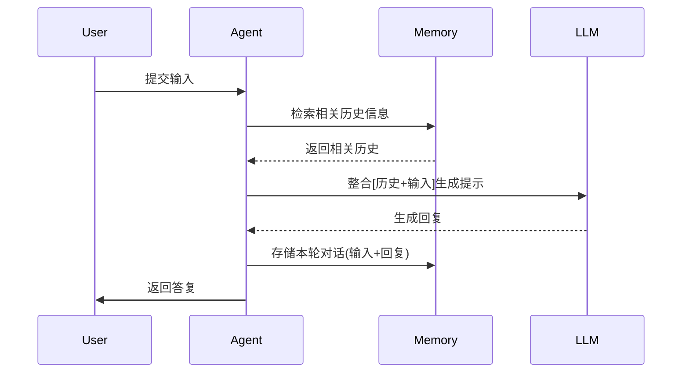
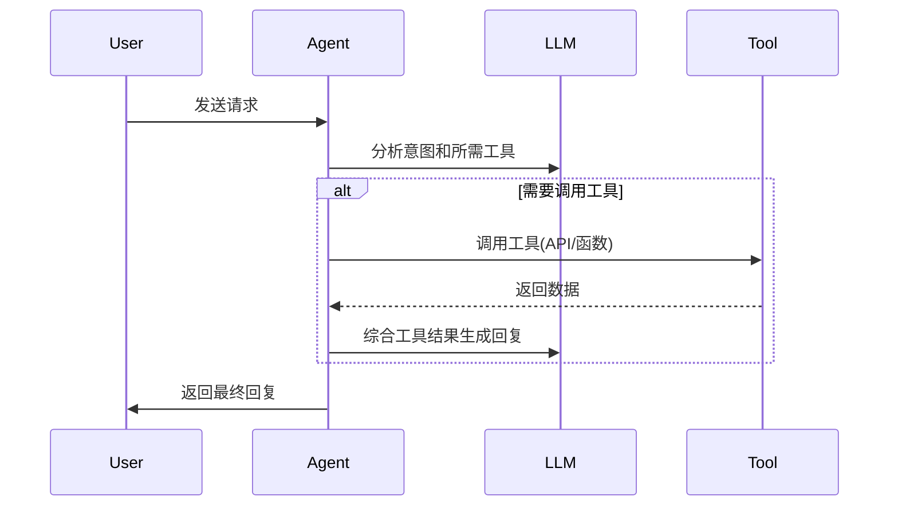
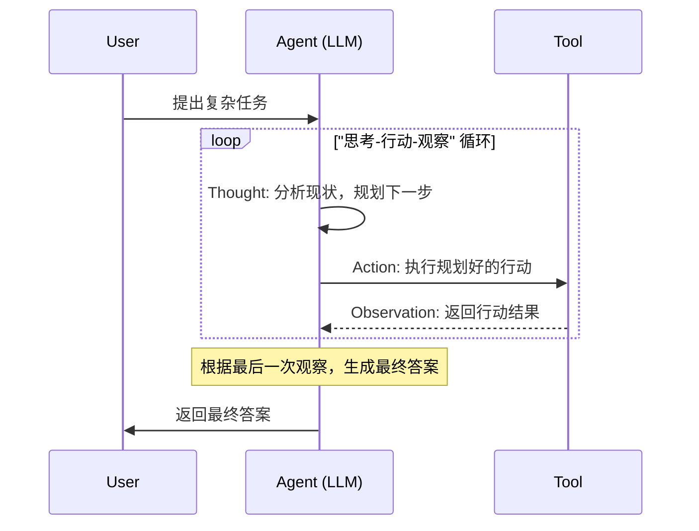
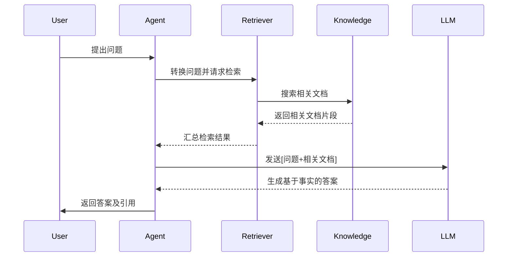
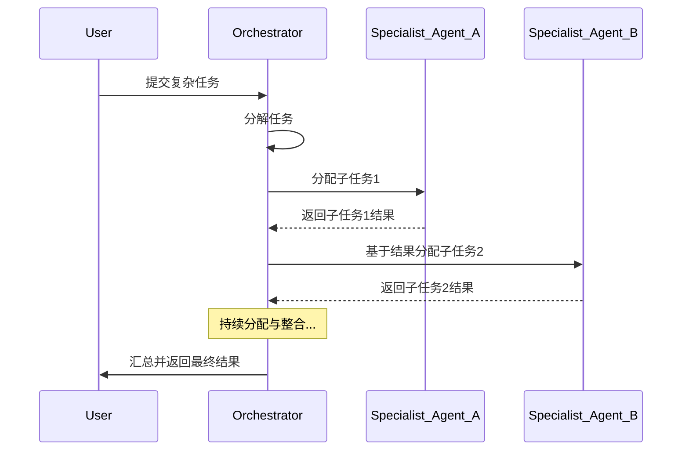
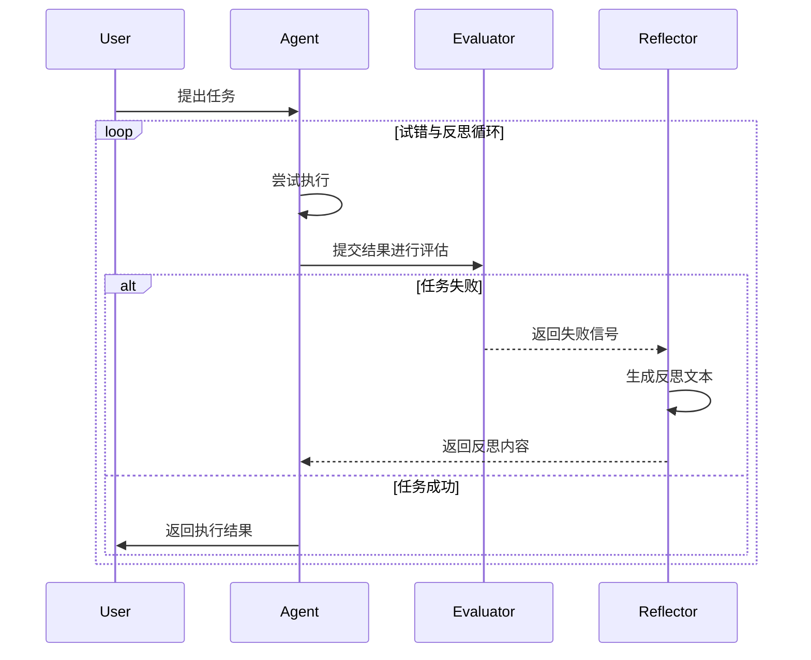
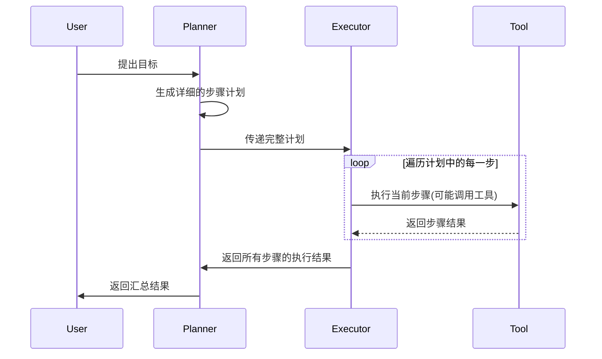
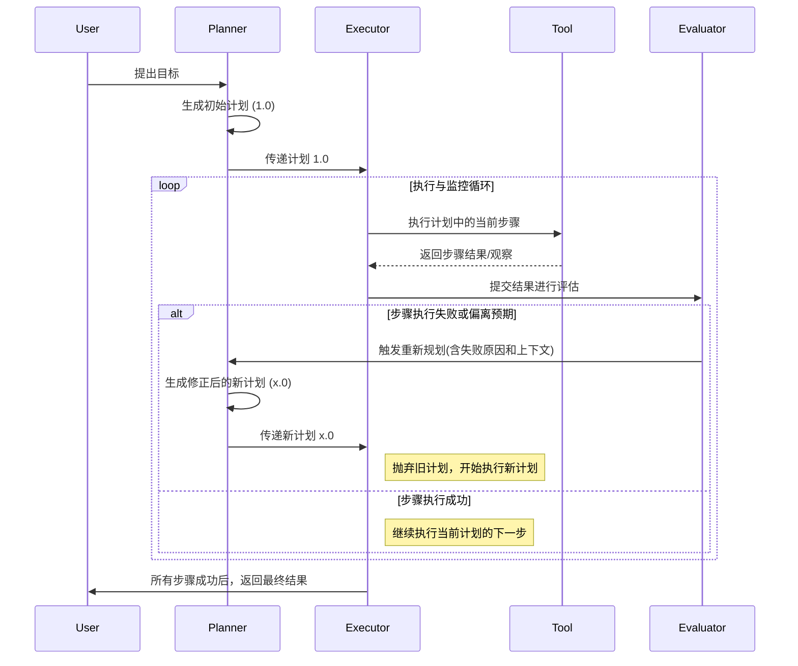

# Agent Arch

## Agent

网上有很多关于 Agent（特指 AI Agent）的介绍，包含编排架构、自主性、工具调用能力等内容，将其简要总结如下：

**Agent 是一个能够感知环境、进行自主推理和规划，并独立采取行动，通过调用一系列工具来执行复杂任务，并最终达成特定目标的智能软件系统。**

### Agentic Systems

从现有的实现来看，很多所谓的 Agent，自主性有限，绝大部分都是 Workflow 模式，即提及 Agent 时，更准确的说法，是 Agentic Systems，包括了 Workflow 与 Agent 两种实现方案。出于简化的角度考虑，在本文中，如果没有同时提及 workflow 与 Agent，一般会用 Agent 来泛指 Agentic Systems。

## 核心模块

大部分场景下，我们与 LLM 的交互都比较直接，我们给定一个输入，LLM 返回一个输出，而 Agent 相比于 LLM，则是在这个层面进行了拓展：

- 编排：决定了 Agent 的自主性，是区分 Workflow 与 Agent 的核心差异
  - 工作流 (Workflow)：路径预定义，LLM 和工具被编排好，更像自动化脚本
  - 智能体 (Agent)： 路径动态生成，由 LLM 自主决定流程和工具的使用，拥有更高的控制权和灵活性
- 模型：即 LLM，可以根据任务特性，灵活更换
- 工具：规范化定义工具所能解决的问题和所需参数，拓展 Agent 的能力

## 基础架构

### Summary

架构决定了 Agent 的编排模块，从个人视角来看，可以简化为三个核心内容：

- Memory：拓展了 LLM 的 input，其来源有很多，比如用户对话历史、知识库（RAG）、其他 LLM 的输出（Plan/Reflexion）等等
- Tools：拓展了 LLM 的 output，Tools 的实现除了常规意义上的 Function，还可以是另一个 Agent（Plan/Multi-Agent），此外，为了适应 Agent 的浪潮，很多服务还提供了 MCP，节省了封装成本
  - 补充说明一点，核心模块中的 Tools，更强调模块化配置，Tools、Model 是可灵活配置、拓展的，Orchestration 聚焦内部实现逻辑，这里的 Tools 更多指的是如何在编排流程中使用各种 Tool
- Cooperation：规范化 LLM 间的协作关系，如 ReAct 中由单一 LLM 多次迭代，Multi-Agent 中将不同任务拆分至不同的 LLM 中，Reflexion 中不同 LLM 具备不同的职责

以下仅给出一些架构的基本设计与核心思想，在实际的 Agent 开发中，需要根据项目特性，思考 Memory、Tool、Cooperation 三块内容，灵活调整编排方式。

### Memory-Augmented Agent

- 核心思想：
  - 为 Agent 提供短期记忆（对话历史）和长期记忆（知识库），提供更多上下文信息
- 优点：
  - 短期记忆能够处理多轮对话
  - 长期记忆可以实现个性化、差异化
- 缺点：
  - 需要判断哪些信息需要被记忆
  - 长期记忆需要着重考虑其结构与内容

 

### Tool-Calling

- 核心思想：
  - 拓展了 Agent 的能力边界，允许 LLM 调用外部工具
- 优点：
  - 获取自身不具备的、实时性的或特定领域的信息
  - 可以执行某些实际操作
- 缺点：
  - 工具数量多时，可能出现误判场景
  - 工具的稳定性会影响整个 Agent 的表现

 

### ReAct (Reason and Act)

- 核心思想：
  - 模仿人类思维，将推理（Reason）和行动（Act）紧密结合，通过“思考 -> 行动 -> 观察”的循环来解决复杂问题
- 优点：
  - 推理过程透明，易于调试和理解决策路径
  - 可以根据中间结果动态调整策略，具备一定的自主性，可以自我纠错
- 缺点：
  - 需要多次调用 LLM，耗时较长
  - 可能存在冗余步骤或陷入循环

 

### RAG (Retrieval-Augmented Generation)

- 核心思想：
  - 得到用户输入后，从知识库中召回一些可信的相关片段，一起发送给 LLM
- 优点：
  - 减少幻觉问题，为答案提供信息来源
  - 相比于微调，知识库的更新成本较低
  - 可以减少 prompt 中非必要的信息
- 缺点：
  - 需要保证关键词与召回效果
  - 需要维护数据库

 

### Multi-Agent

- 核心思想：
  - 将复杂任务拆解为多个子任务，分配给具有不同专长的子 Agent 由 Orchestrator 以类似 ReAct 的方式，统一管理整个工作流
- 优点：
  - 具备自主解决复杂问题的能力
  - 每个 Agent 做的事情更聚焦，效果更好
  - 子 Agent 可以模块化管理，易于维护、拓展
- 缺点：
  - 系统整体的设计较为复杂
  - 需要考虑 Agent 间的数据交互问题

 

### Reflexion

- 核心思想：
  - 引入“反思”机制，针对 Agent 生成的结果进行评判，如果失败会针对性的反思失败原因
- 优点：
  - 支持了自我纠偏，提高结果的准确性
  - 能够解决复杂问题
  - 实现了试错学习，反思内容可以用于长期记忆，或优化 prompt
- 缺点：
  - 依赖评估器的准确性
  - 系统复杂度高，可能多次运行
  - 需要有策略避免无限循环

 

### Plan-and-Execute

- 核心思想：
  - 将任务处理，明确的划分为两个阶段，先规划，再执行
- 优点：
  - 对于目标明确，路径清晰的任务，可以逐步执行
  - 结构清晰，易于开发调试
- 缺点：
  - 灵活性较差，中间过程出现异常，无法动态调整
  - 对 Planner 对要求较高

 

### Plan-and-Execute with Replan

- 核心思想：
  - 在 Plan-and-Execute 的基础上，引入了“反思”机制，当某些步骤执行异常时，根据实时情况，重新规划并执行
  - 是 Plan-and-Execute 与 Reflexion 两种基础架构的结合
- 优点：
  - 兼具两种架构的优点，结构清晰，能够自我纠错
- 缺点：
  - 系统复杂度显著提升
  - 依赖 planner 和 evaluator 的实际表现

 

## Native vs Workflow vs Agent

在实现需求时，具体的业务逻辑可以分成流程控制与功能实现两部分，将大需求拆分为多个小功能点，然后将多个功能点以特定的顺序串联起来，最终达成需求目标。
这里以一个“分析实验”的需求为例，尝试列举下 Native、Workflow、Agent 三种方案的差异：

- Natvie：传统的实现方案，所有流程控制以代码实现，具体的功能点，如分析指标、生成结论，同样由代码实现
- Workflow：引入 LLM 后的方案，流程控制以代码实现，部分功能点，如分析指标等，由 LLM 实现
  - 借助 LLM 的自然语言理解能力与推理、思考能力，显著减少部分功能点的实现成本
- Agent：内部逻辑完全依赖 LLM，流程控制和核心功能点均由 LLM 负责
  - 功能整体由 LLM 负责，具备较大的自主性和灵活性

需要注意的是，Workflow 与 Agent 也是存在嵌套关系的，例如 Workflow 中，某个具体功能点可能由 Agent 来实现，内部具备一定的自主性。

 

## Ref

- <https://www.kaggle.com/whitepaper-agents>
- <https://www.anthropic.com/engineering/building-effective-agents>
