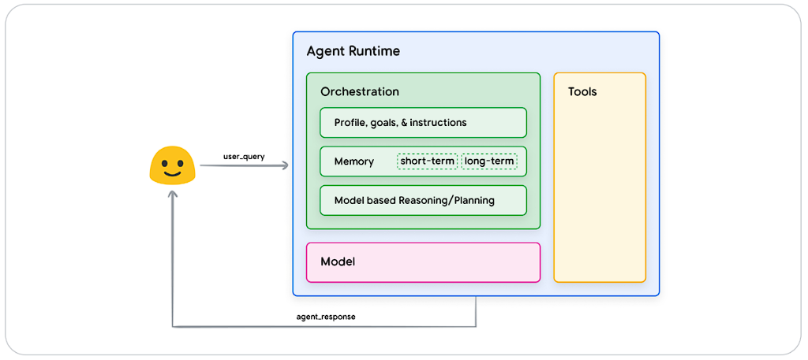
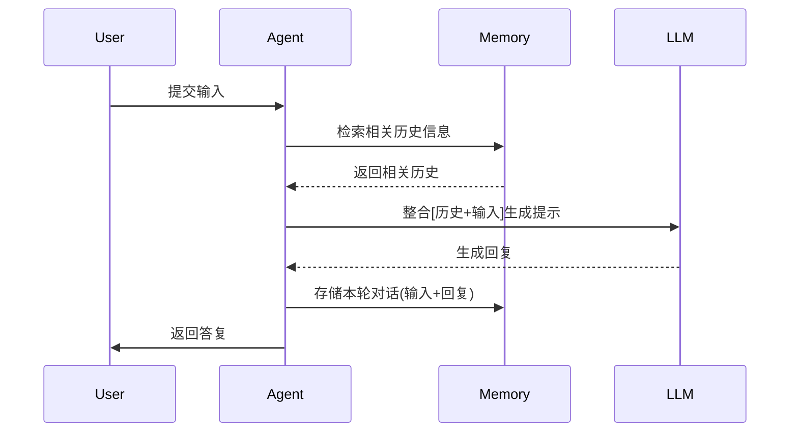
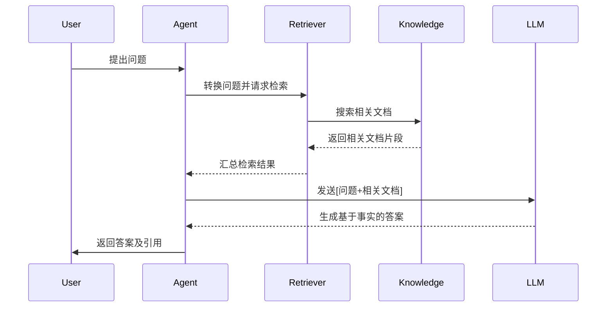
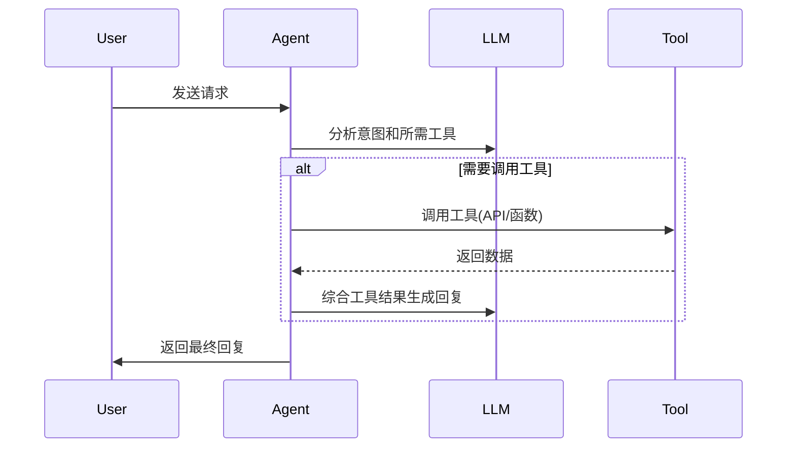
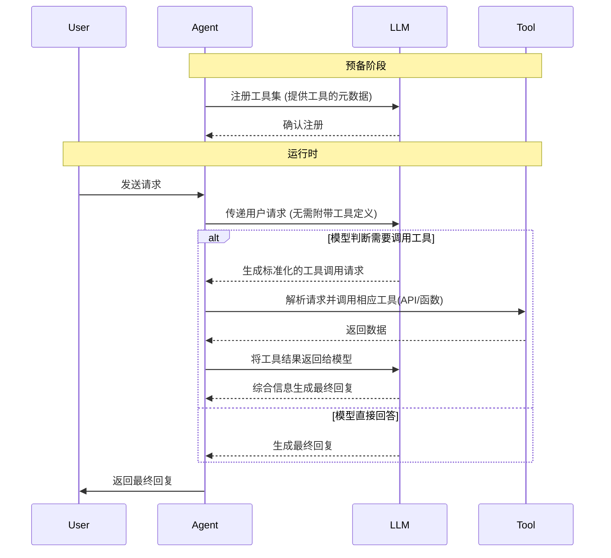
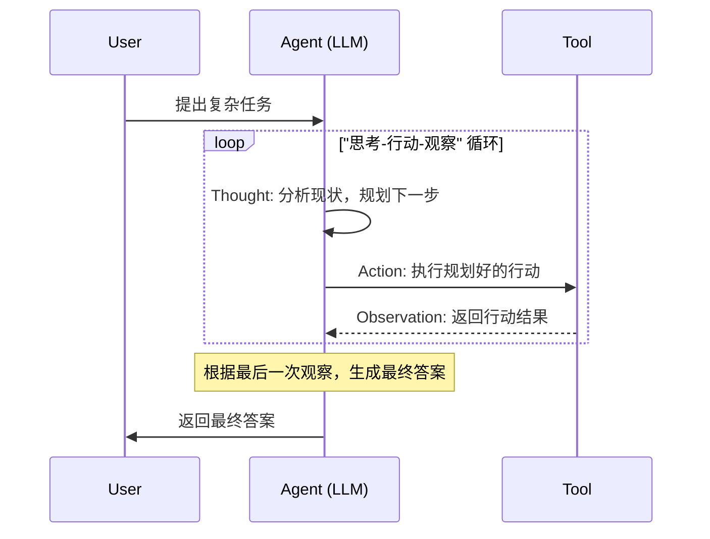
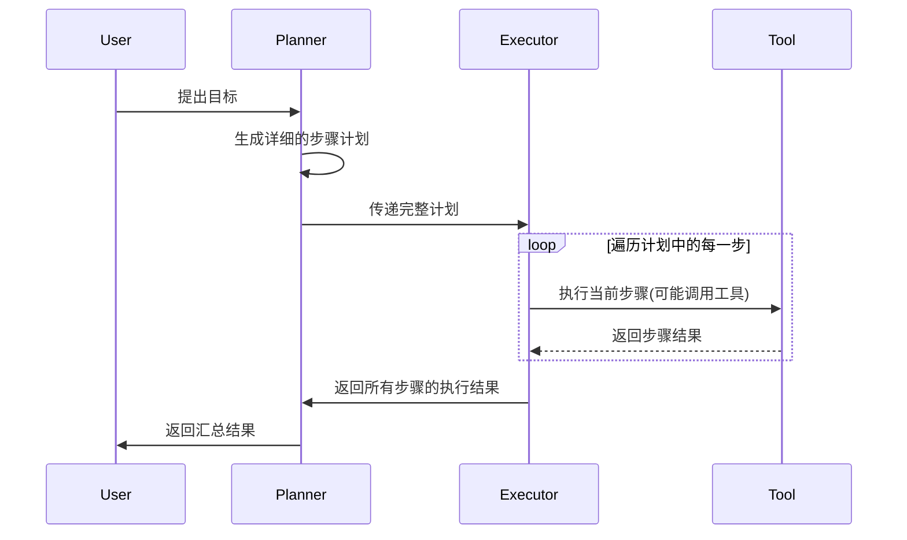
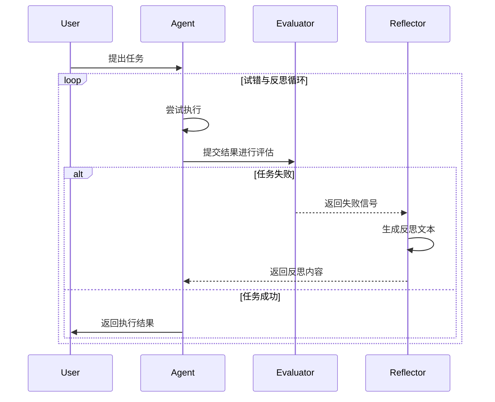
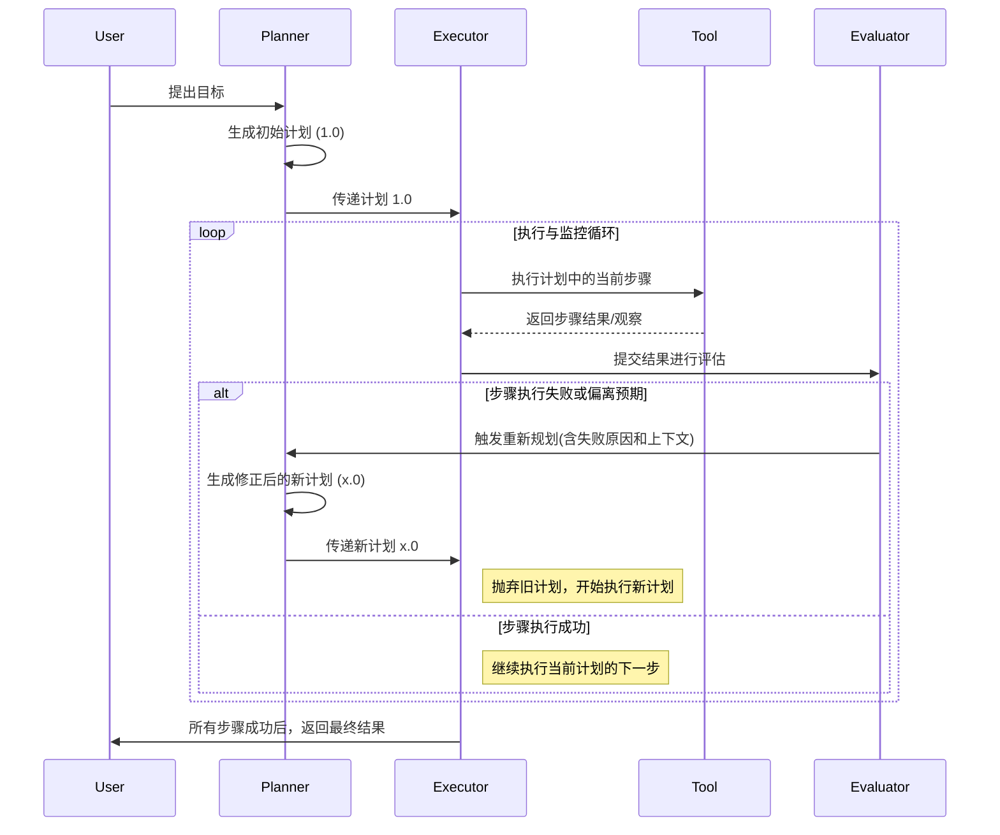
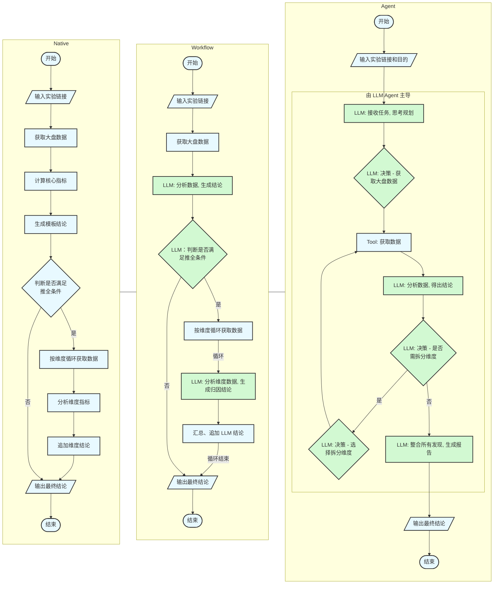

# Agent Arch

## Agent

网上有很多关于 Agent（特指 AI Agent）的介绍，包含编排架构、自主性、工具调用能力等内容，将其简要总结如下：

**Agent 是一个能够感知环境、进行自主推理和规划，并能独立采取行动的智能软件系统。它通过调用一系列工具来执行复杂任务，最终达成特定目标。**

### Agentic Systems

从现有的实现来看，许多所谓的 Agent，其自主性是有限的。当我们提及 Agent 时，一个更准确的术语是 Agentic Systems（智能体系统），它包含了 Workflow (工作流) 与 Agent (代理) 两种核心实现方案。
两者的核心区别在于**路径的确定性**和**能力边界**：

- 工作流 (Workflow)：LLM和工具遵循预定义的代码路径编排来生成最终内容。
  - 这种模式更加可控和稳定，类似于一个由 LLM 增强的自动化脚本。
  - 其流程终点是生成一个具体内容并返回给用户。

- 智能体 (Agent)：LLM 动态地决定自身的处理流程和工具使用，它拥有更高的控制权和灵活性，且具备与环境交互的能力。
  - 这种模式更依赖模型能力，模型越强，表现效果越好。
  - 在生成具体内容后，会自主与环境（文件系统、IDE、服务器等）交互以达成最终目标。

为简化起见，在本文中，如果没有同时提及两者，将使用 Agent 来泛指整个智能体系统。

### 核心模块

大部分场景下，我们与 LLM 的交互都比较直接，我们给定一个输入，LLM 返回一个输出，而 Agent 相比于 LLM，则是在这个层面进行了拓展：

- 编排：决定了 Agent 的自主性
  - Workflow：路径预定义，LLM 和工具被编排好，更像自动化脚本
  - Agent： 路径动态生成，由 LLM 自主决定流程，具备灵活性
- 模型：即 LLM，可灵活更换
- 工具：拓展 Agent 能力边界的函数或服务
  - Workflow：一定程度上，拓展能力
  - Agent： 拓展与环境交互的能力，能够独立完成任务

### 产品示例

#### Chat-Gemini

Gemini 提供的前端对话页面，类似于 ChatGPT，用户提供输入，系统经过单一处理环节后返回一个输出。

- 模式：输入 -> 处理 -> 输出
- 特点：只负责根据输出，完成一次性的文本生成任务，由用户自行决定如何使用。

#### DeepResearch-Gemini

以 Deep Research 的方式，响应用户输出，其核心是增加自主规划能力，可以看作是 workflow 向 Agent 过渡。

- 模式：目标 -> 自主规划 -> 多步执行 -> 聚合产物
- 特点：能够为复杂任务，动态的生成一个工作流，并调用工具来执行，但是最终交付的，仍然是静态产物。

#### Trae

Trae 体现了智能体的核心目标：以目标为导向，自主规划，独立采取行动。

- 模式：高阶目标 -> 持续规划与行动 -> 环境交互 -> 达成目标
- 特点：突破了数字世界，能够与真实环境进行交互，如：
  - 文件管理：直接在项目中创建、修改代码
  - 命令执行：安装依赖、运行服务

## 编排范式

### Summary

Agent 的编排（Orchestration）模块是其智能系统的核心中枢，其设计贯穿两大层面，共同决定了 Agent 的能力上限和可处理任务的复杂度：

- 微观层面：Agent 核心能力扩展，它定义了 LLM 如何与外部世界高效交互，从而突破其原生能力的限制，主要通过两大组件实现：
  - 记忆（Memory）：作为 LLM 的输入扩展，融合多源信息，构建出完整的决策上下文，如：
    - 短期记忆：如用户当前的对话历史。
    - 长期记忆：如通过检索增强生成（RAG）技术访问的外部知识库。
    - 过程记忆：如来自其他 Agent 或自身（例如 Plan、Reflexion 模式）的中间结论与规划。
  - 工具（Tools）：作为 LLM 的输出扩展，将模型的文本输出转化为实际行动。编排系统聚焦于如何在执行逻辑中高效、动态地调用这些工具，而非工具本身。该模块支持灵活配置与扩展，其实现形式丰富多样：
    - 标准函数（Functions）：封装好的 API 或代码，用于执行特定任务（如查询天气、发送邮件）。
    - MCP（Model Context Protocol）：为适应 Agent 架构，许多云服务或应用以微服务形式提供能力，简化了工具的封装与调用成本。
    - 其他 Agent：在更复杂的系统中，一个 Agent 可以调用另一个 Agent 作为其工具，实现能力的嵌套与组合。

- 宏观层面：复杂任务执行范式，它建立了 LLM 或 Agent 之间的协作与流转机制，将它们有机地组织成一个能够应对复杂任务的智能系统：
  - 协作（Cooperation）：规范化 LLM 间的协作关系，常见的协作模式如下：
    - 迭代：例如 ReAct，通过“思考-行动-观察”的循环，逐步完成复杂任务。
    - 协作：例如 Panning，由一个 LLM 负责思考，由其他 LLM 负责行动。
    - 流水线：例如 Workflow ，多 LLM 顺序处理。

### 微观层面

#### Memory-Augmented

- 核心思想：
  - 为 Agent 提供短期记忆（对话历史）和长期记忆（Prompt、知识库），提供更多上下文信息
- 优势：
  - 短期记忆能够处理多轮对话
  - 长期记忆可以实现个性化、差异化
- 限制：
  - 需要判断哪些信息需要被记忆
  - 长期记忆需要着重考虑其结构与内容

 

#### RAG (Retrieval-Augmented Generation)

- 核心思想：
  - 长期记忆的实现方式之一，会从知识库中召回一些可信的相关片段，添加至 prompt 中
- 优势：
  - 减少幻觉问题，为答案提供信息来源
  - 相比于微调，知识库的更新成本更低、速度更快
- 限制：
  - 需要持续维护数据库，并保障召回效果

 

#### Tool-Calling

- 核心思想：
  - 拓展了 Agent 的能力边界，允许其调用外部函数与 Api
- 优势：
  - 获取自身不具备的、实时性的或特定领域的信息
  - 可以执行某些实际操作，与环境进行交互
- 限制：
  - 工具数量多时，可能出现误判场景
  - 工具的稳定性会影响整个 Agent 的表现

 

#### MCP（Model Context Protocol）

- 核心思想：
  - Tool-Calling 的延伸，将模型上下文标准化，让 LLM 以统一的方式调用工具或访问资源
- 优势：
  - 通信效率更高，相关信息前置在模型端注册，无需每次交互时携带
  - 迭代成本低，所有内容全部在预备阶段注入，新增工具时无需修改 Agent 内部编排逻辑
  - 接入成本低，MCP Server 以标准化的方式直接提供服务，无需二次封装
- 限制：
  - 需要额外维护相关逻辑，增加了系统初始复杂度
  - 需要模型支持 MCP 和依赖方提供 MCP 服务

 

### 宏观层面

#### ReAct (Reason and Act)

- 核心思想：
  - 模仿人类思维，将推理 (Reason) 和行动 (Act) 紧密结合，通过“思考 -> 行动 -> 观察”的循环，来迭代式地解决复杂问题
- 优势：
  - 推理过程透明，易于调试和理解决策路径
  - 具备高自主性，可以根据中间结果动态调整策略，具备自我纠错能力
- 限制：
  - 需要多次调用 LLM，延迟较高，整体耗时长
  - 可能陷入无效的循环或执行冗余步骤

 

#### Multi-Agent

- 核心思想：
  - 将复杂任务进行拆解，分配具有不同专长的子 Agent，以类似 ReAct 的方式进行管理
- 优势：
  - 具备自主解决复杂问题的潜力
  - 每个 Agent 做的事情更聚焦，效果更好
  - 子 Agent 可以模块化管理，易于维护、拓展
- 限制：
  - 系统整体的设计较为复杂
  - 需要考虑 Agent 间的数据交互问题

 

#### Plan-and-Execute

- 核心思想：
  - 将复杂任务，划分为规划 (Planning) 和 执行 (Execution) 两阶段分别进行处理
- 优势：
  - 对于目标明确，路径清晰的任务，可以逐步执行
  - 结构清晰，易于开发调试
- 限制：
  - 灵活性较差，中间过程出现异常，无法动态调整
  - 对 Planner 的表现，要求较高

 

#### Reflexion

- 核心思想：
  - 引入“反思”机制，针对 Agent 生成的结果进行评判，如果失败，会分析原因并生成指导性建议，用于下一轮迭代
- 优势：
  - 支持自我纠偏，提高解决复杂问题的成功率
  - 实现了试错学习，反思内容可以额外进行存储，用于后续迭代优化（prompt 或知识库）
- 限制：
  - 高度依赖评估器的准确性
  - 系统流程长，调用 LLM 次数多，复杂度高
  - 需要有策略避免无限循环

 

#### Plan-and-Execute with Replan

- 核心思想：
  - 在 Plan-and-Execute 的基础上，引入了“反思”机制，当某些步骤执行异常时，可根据实时情况，重新规划并执行
- 优势：
  - 兼具两种架构的优点，结构清晰，能够自我纠错
- 限制：
  - 系统复杂度显著提升
  - 依赖 planner 和 evaluator 的实际表现
- VS ReAct：
  - ReAct 更强调实时推理，每一步都重新推理
  - 该架构重点在于预规划，仅在异常时才重新规划

 

## Native vs Workflow vs Agent

在实现需求时，具体的业务逻辑可以分成流程控制与功能实现两部分，将大需求拆分为多个小功能点，然后将多个功能点以特定的顺序串联起来，最终达成需求目标。
这里以一个“分析实验”的需求为例，尝试列举下 Native、Workflow、Agent 三种方案的差异：

- Natvie：
  - 流程控制：由硬编码（if/else, for loops）实现。
  - 功能实现：所有功能点，如获取数据、计算指标、生成结论，全部由传统代码逻辑实现。
  - 特点：完全可控，但开发成本高，灵活性差。
- Workflow：
  - 流程控制：主要利用框架提供的封装能力，并由代码进行自定义补充，定义了清晰的执行步骤。
  - 功能实现：部分功能点（如“分析数据生成结论”、“判断是否满足推全条件”）被抽象出来，交由 LLM 完成。
  - 特点：借助 LLM 的自然语言理解和推理能力，显著降低了特定功能的实现成本，是当前最常见的模式。
- Agent：
  - 流程控制：完全由 LLM 主导，Agent 接收一个高阶目标（如“分析这个实验并给出报告”），然后自主决策、规划并执行。
  - 功能实现：LLM 决定何时以及如何调用外部工具（如获取数据）来完成任务，并可以与外部环境进行交互。
  - 特点：以用户最终目标为导向，具备极高的自主性和灵活性，适用于开放性、探索性的复杂任务，但稳定性和可控性面临挑战。

需要注意的是，Workflow 与 Agent 也是存在嵌套关系的，例如 Workflow 中，某个具体功能点可能由 Agent 来实现，内部具备一定的自主性。

## Ref

- <https://www.kaggle.com/whitepaper-agents>
- <https://www.anthropic.com/engineering/building-effective-agents>
- <https://zhuanlan.zhihu.com/p/1900218541384374021>
