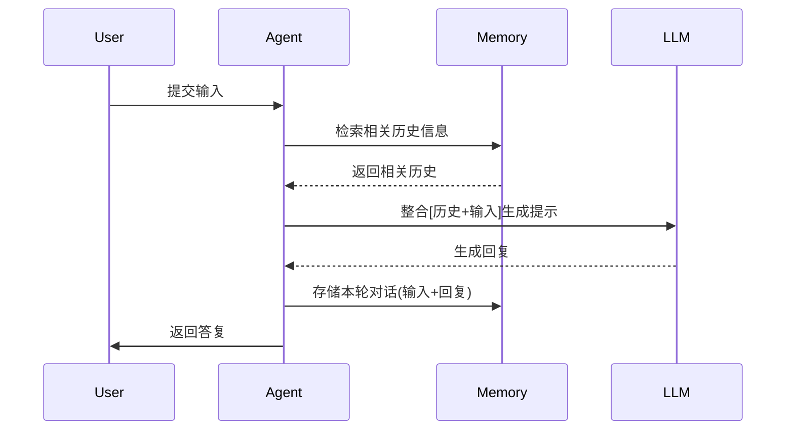
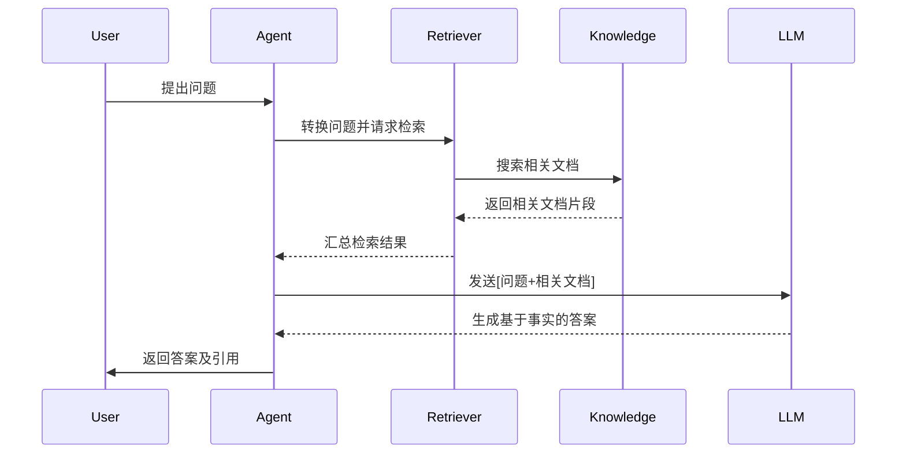
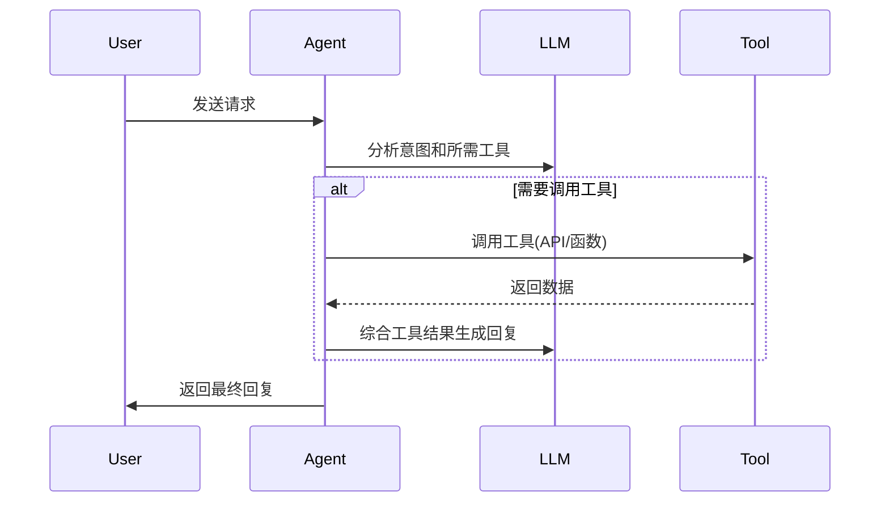
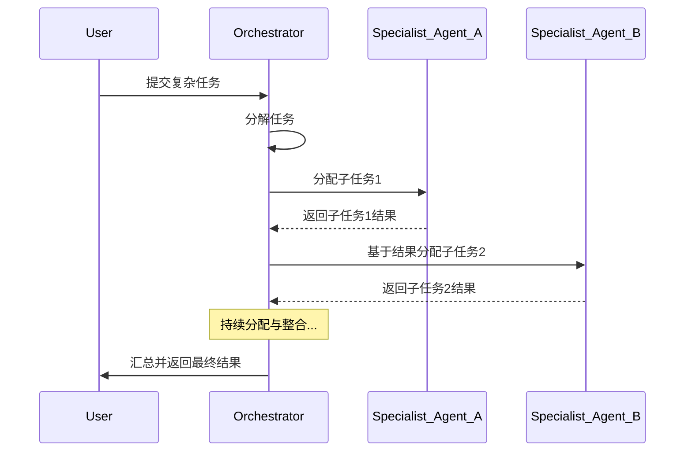
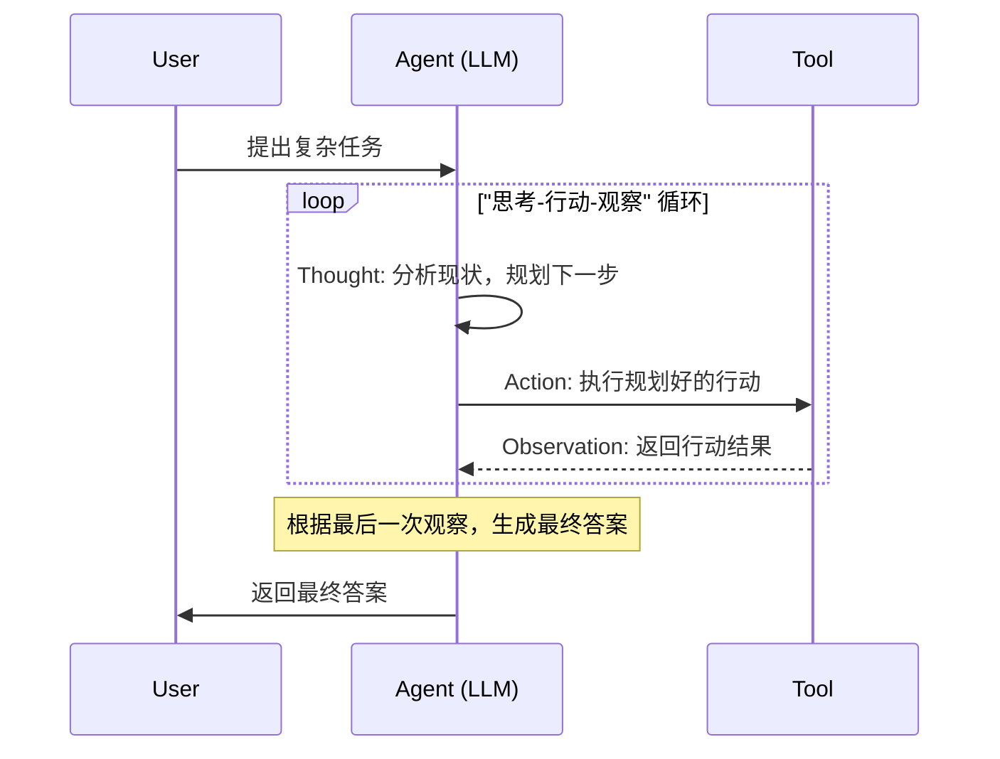
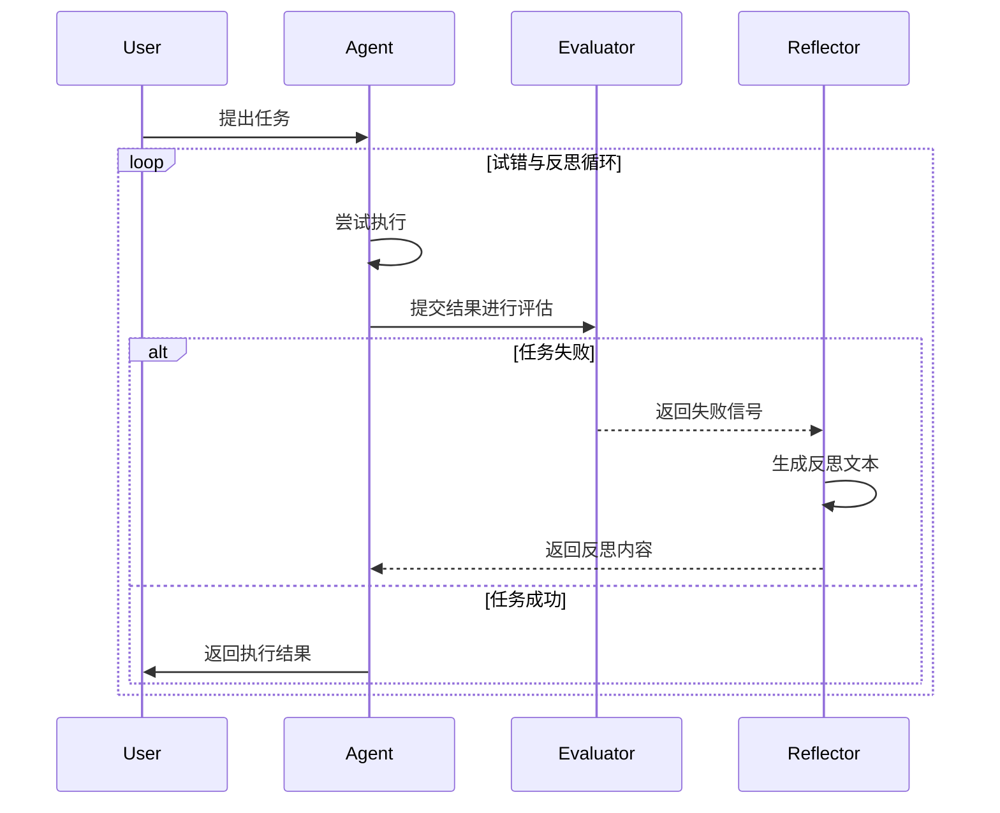
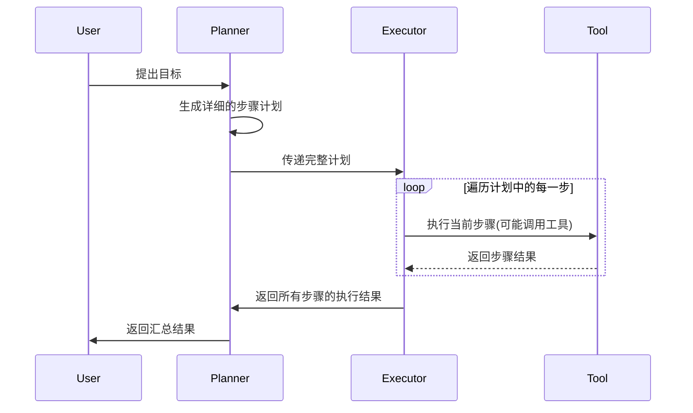
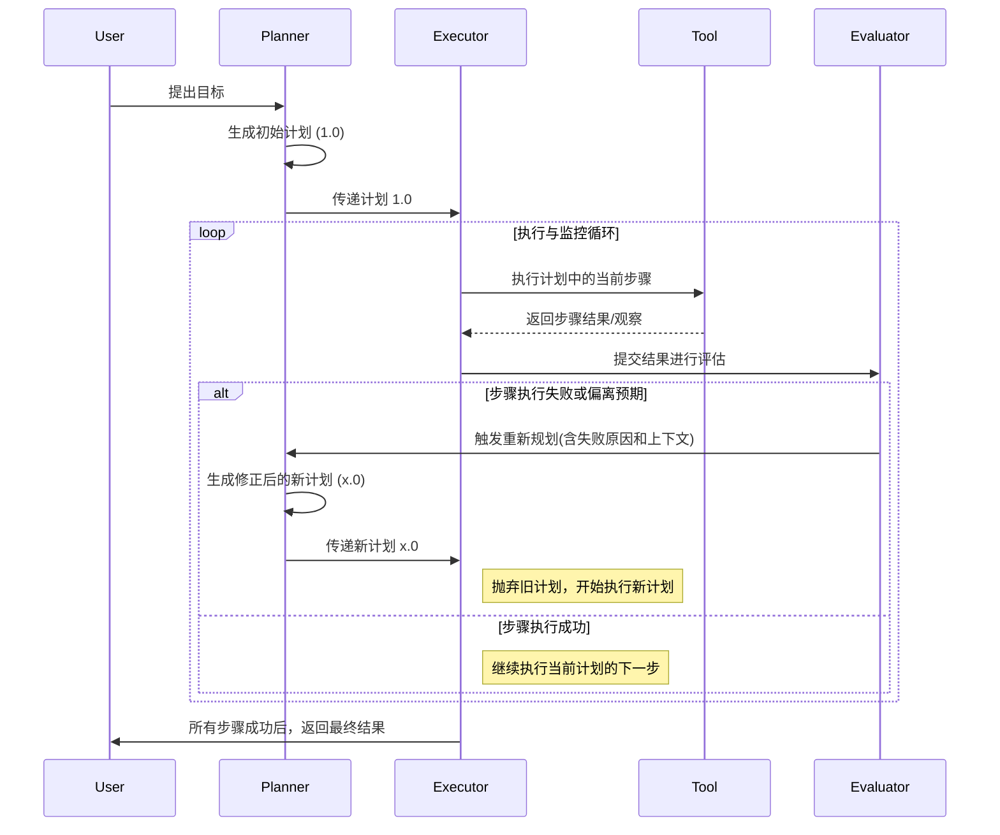

# Agent Arch

## Agent

网上有很多关于 Agent（特指 AI Agent）的介绍，包含编排架构、自主性、工具调用能力等内容，将其简要总结如下：

**Agent 是一个能够感知环境、进行自主推理和规划，并能独立采取行动的智能软件系统。它通过调用一系列工具来执行复杂任务，最终达成特定目标。**

### Agentic Systems

从现有的实现来看，许多所谓的 Agent，其自主性是有限的。当我们提及 Agent 时，一个更准确的术语是 Agentic Systems（智能体系统），它包含了 Workflow (工作流) 与 Agent (代理) 两种核心实现方案。

两者的核心区别在于路径的确定性：

- 工作流 (Workflow)：系统中的大语言模型（LLM）和工具由预定义的代码路径编排。这种模式更加可控和稳定，类似于一个由 LLM 增强的自动化脚本。
- 智能体 (Agent)：系统中的 LLM 动态地决定自身的处理流程和工具使用，它拥有更高的控制权和灵活性，能够自主应对开放或不可预测的任务。

为简化起见，在本文中，如果没有同时提及两者，将使用 Agent 来泛指整个智能体系统。

## 核心模块

大部分场景下，我们与 LLM 的交互都比较直接，我们给定一个输入，LLM 返回一个输出，而 Agent 相比于 LLM，则是在这个层面进行了拓展：

- 编排：决定了 Agent 的自主性，是区分 Workflow 与 Agent 的核心差异
  - 工作流 (Workflow)：路径预定义，LLM 和工具被编排好，更像自动化脚本
  - 智能体 (Agent)： 路径动态生成，由 LLM 自主决定流程和工具的使用，拥有更高的控制权和灵活性
- 模型：即 LLM，可以根据任务的成本、速度和性能要求，灵活更换不同的模型
- 工具：拓展 Agent 能力边界的外部函数或 API

## 基础架构

### Summary

架构决定了 Agent 的编排模块，从个人视角来看，可以简化为三个核心内容：

- Memory：拓展了 LLM 的 input，其来源有很多，比如用户对话历史、知识库（RAG）、其他 LLM 的输出（Plan/Reflexion）等等
- Tools：拓展了 LLM 的 output，Tools 的实现除了常规意义上的 Function，还可以是另一个 Agent（Plan/Multi-Agent），此外，为了适应 Agent 的浪潮，很多服务还提供了 MCP，节省了封装成本
  - 补充说明一点，核心模块中的 Tools，更强调模块化配置，Tools、Model 是可灵活配置、拓展的，Orchestration 聚焦内部实现逻辑，这里的 Tools 更多指的是如何在编排流程中使用各种 Tool
- Cooperation：规范化 LLM 间的协作关系，如 ReAct 中由单一 LLM 多次迭代，Multi-Agent 中将不同任务拆分至不同的 LLM 中，Reflexion 中不同 LLM 具备不同的职责

以下仅给出一些架构的基本设计与核心思想，在实际的 Agent 开发中，需要根据项目特性，思考 Memory、Tool、Cooperation 三块内容，灵活调整编排方式。

### Memory-Augmented Agent

- 核心思想：
  - 为 Agent 提供短期记忆（对话历史）和长期记忆（知识库），提供更多上下文信息
- 优点：
  - 短期记忆能够处理多轮对话
  - 长期记忆可以实现个性化、差异化
- 缺点：
  - 需要判断哪些信息需要被记忆
  - 长期记忆需要着重考虑其结构与内容

 

### RAG (Retrieval-Augmented Generation)

- 核心思想：
  - 得到用户输入后，从知识库中召回一些可信的相关片段，一起发送给 LLM
- 优点：
  - 减少幻觉问题，为答案提供信息来源
  - 相比于微调，知识库的更新成本较低
  - 可以减少 prompt 中非必要的信息
- 缺点：
  - 需要保证关键词与召回效果
  - 需要维护数据库

 

### Tool-Calling

- 核心思想：
  - 拓展了 Agent 的能力边界，允许 LLM 调用外部工具
- 优点：
  - 获取自身不具备的、实时性的或特定领域的信息
  - 可以执行某些实际操作
- 缺点：
  - 工具数量多时，可能出现误判场景
  - 工具的稳定性会影响整个 Agent 的表现

 

### Multi-Agent

- 核心思想：
  - 将复杂任务拆解为多个子任务，分配给具有不同专长的子 Agent 由 Orchestrator 以类似 ReAct 的方式，统一管理整个工作流
- 优点：
  - 具备自主解决复杂问题的能力
  - 每个 Agent 做的事情更聚焦，效果更好
  - 子 Agent 可以模块化管理，易于维护、拓展
- 缺点：
  - 系统整体的设计较为复杂
  - 需要考虑 Agent 间的数据交互问题

 

### ReAct (Reason and Act)

- 核心思想：
  - 模仿人类思维，将推理（Reason）和行动（Act）紧密结合，通过“思考 -> 行动 -> 观察”的循环来解决复杂问题
- 优点：
  - 推理过程透明，易于调试和理解决策路径
  - 可以根据中间结果动态调整策略，具备一定的自主性，可以自我纠错
- 缺点：
  - 需要多次调用 LLM，耗时较长
  - 可能存在冗余步骤或陷入循环

 

### Reflexion

- 核心思想：
  - 引入“反思”机制，针对 Agent 生成的结果进行评判，如果失败会针对性的反思失败原因
- 优点：
  - 支持了自我纠偏，提高结果的准确性
  - 能够解决复杂问题
  - 实现了试错学习，反思内容可以用于长期记忆，或优化 prompt
- 缺点：
  - 依赖评估器的准确性
  - 系统复杂度高，可能多次运行
  - 需要有策略避免无限循环

 

### Plan-and-Execute

- 核心思想：
  - 将任务处理，明确的划分为两个阶段，先规划，再执行
- 优点：
  - 对于目标明确，路径清晰的任务，可以逐步执行
  - 结构清晰，易于开发调试
- 缺点：
  - 灵活性较差，中间过程出现异常，无法动态调整
  - 对 Planner 对要求较高

 

### Plan-and-Execute with Replan

- 核心思想：
  - 在 Plan-and-Execute 的基础上，引入了“反思”机制，当某些步骤执行异常时，根据实时情况，重新规划并执行
  - 是 Plan-and-Execute 与 Reflexion 两种基础架构的结合
- 优点：
  - 兼具两种架构的优点，结构清晰，能够自我纠错
- 缺点：
  - 系统复杂度显著提升
  - 依赖 planner 和 evaluator 的实际表现

 

## Native vs Workflow vs Agent

在实现需求时，具体的业务逻辑可以分成流程控制与功能实现两部分，将大需求拆分为多个小功能点，然后将多个功能点以特定的顺序串联起来，最终达成需求目标。
这里以一个“分析实验”的需求为例，尝试列举下 Native、Workflow、Agent 三种方案的差异：

- Natvie：
  - 流程控制：由硬编码（if/else, for loops）实现。
  - 功能实现：所有功能点，如获取数据、计算指标、生成结论，全部由传统代码逻辑实现。
  - 特点：完全可控，但开发成本高，灵活性差。
- Workflow：
  - 流程控制：主要由硬编码实现，定义了清晰的执行步骤。
  - 功能实现：部分功能点（如“分析数据生成结论”、“判断是否满足推全条件”）被抽象出来，交由 LLM 完成。
  - 特点：借助 LLM 的自然语言理解和推理能力，显著降低了特定功能点的实现成本，是当前最实用和常见的模式。
- Agent：
  - 流程控制：完全由 LLM 主导，Agent 接收一个高阶目标（如“分析这个实验并给出报告”），然后自主决策、规划并执行。
  - 功能实现：LLM 决定何时以及如何调用外部工具（如获取数据）来完成任务。
  - 特点：具备极高的自主性和灵活性，适用于开放性、探索性的复杂任务，但稳定性和可控性面临挑战。

需要注意的是，Workflow 与 Agent 也是存在嵌套关系的，例如 Workflow 中，某个具体功能点可能由 Agent 来实现，内部具备一定的自主性。

 

## 构建指南

> 核心理念：选择适合的构建路径

在实际开发中，选择正确的构建策略至关重要。我们不应盲目追求最前沿的架构，强行将项目塞入某种范式，而应根据项目特性、团队经验和需求明确度，选择最合适的实现路径。

### 演进式构建

> 此方法的核心在于“稳步迭代、逐步替换”，确保系统在演进的每个阶段都可用、可控。

适合初次探索 Agent 的团队，或需求复杂、边界尚不明确的项目。它主张从一个稳定、传统（Native）的系统出发，逐步引入大语言模型（LLM）和 Agent 能力，在迭代中完成智能化升级。

**构建模块化的“原生”系统**

- 目标：使用传统编程方法搭建一个功能完整的应用。
- 关键实践：将系统的各个功能点实现为高度解耦、职责单一的模块或服务

**升级为“工作流”架构**

- 目标：识别并用 LLM 节点替换系统中适合的“原子功能”模块。
- 关键实践：
  - 识别替换点：找出那些依赖复杂规则、自然语言处理或模糊判断的传统模块，例如用户意图理解、实验数据分析、实验指标归因等。
  - 增强 LLM 节点：考虑「Memory」与 「Tool」模块为独立的 LLM 节点赋予更强的能力，如「Tool-Calling」、「Memory-Augmented」、「RAG」等

**演进为“智能体”系统**

- 目标：当多个 LLM 节点需要协同完成一个复杂任务时，引入 Agent 来自动化和优化整个工作流程。
- 关键实践：
  - 优化协同机制 (Cooperation)：优化多个 LLM 间的协同工作
    - ReAct：将 Workflow 下的多个顺序执行的 LLM 节点，合并为单个 ReAct 节点，让 Agent 在“思考”和“行动”之间循环，可以动态调整计划。
    - Planning：赋予 Agent 制定复杂任务计划和分解步骤的能力，可以用一个更高层次的 Agent 替代原先固定的工作流链路。这个 Agent 负责理解总体目标，并自主规划、调用和协调下层节点。
  - 引入反思与修正 (Reflexion)：增加一个“反思”节点，让 Agent 能够评估自己的执行结果，从错误中学习并自我修正，提升长期表现。

### 目标式设计

> 此方法的核心在于“围绕智能、一次到位”，直接构建以 LLM 为核心的系统架构。

适合经验丰富的开发者，或需求清晰、目标明确的项目。它主张直接围绕 LLM 的核心能力进行顶层设计，构建以智能体为核心的解决方案。

**聚焦需求，识别 LLM 核心角色**

- 目标：明确整个需求中最核心、最需要“智能”来解决的问题是什么。
- 关键实践： 分析并确定哪些功能天然适合由 LLM 承担，例如需要自主决策、多轮对话、动态任务处理等。
  
**从 LLM 的输入和输出拓展架构**

- 目标： 以 LLM 为中心，向外设计为其提供信息（输入）和执行任务（输出）的配套模块。
- 关键实践：
  - 设计输入端：重点关注如何为 LLM 提供高质量、精确的决策信息
    - Memory-Augmented：设计长短期记忆机制，确保对话的连贯性。
    - RAG: 构建高效的知识检索系统，为 LLM 提供事实依据。
  - 设计输出端：重点关注 LLM 作出决策后，如何将决策转化为实际行动
    - Tool-Calling：定义一套稳定、丰富的工具（API），供 LLM 调用。
    - Multi-Agent：如果任务需要多个专业角色，设计一个由多个专业 Agent 组成的协作网络，由一个总控 Agent 进行任务分发和协调。

**整合与完善最终架构**

- 目标：将输入、输出和核心 LLM 模块整合成一个高效、稳定的系统。
- 关键实践：
  - 设计协同机制 （Cooperation）：考虑「ReAct」与「Planning」
  - 引入反思模块（Reflexion）：通过「Reflexion」，提升系统最终效果

## Ref

- <https://www.kaggle.com/whitepaper-agents>
- <https://www.anthropic.com/engineering/building-effective-agents>
