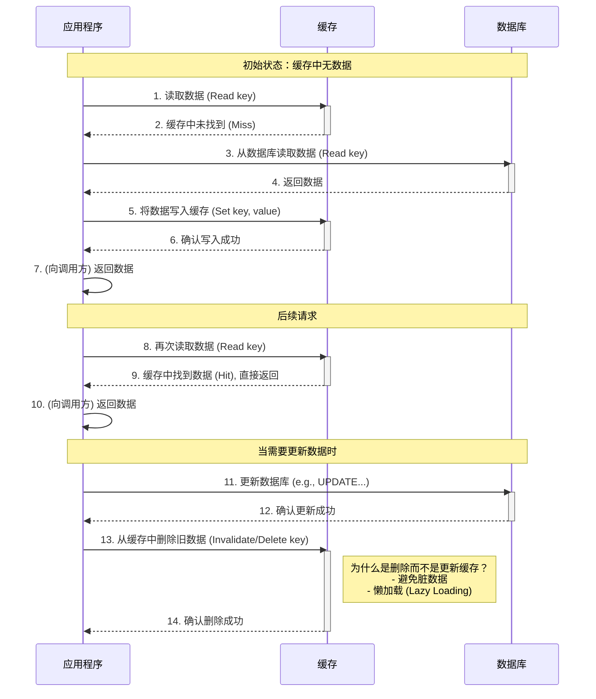
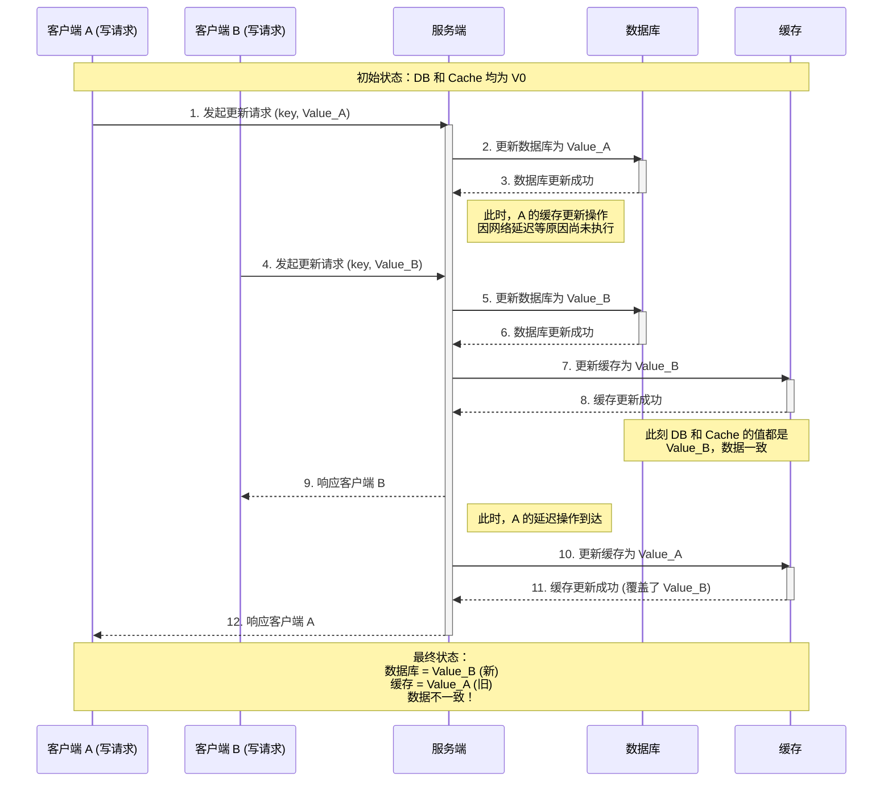
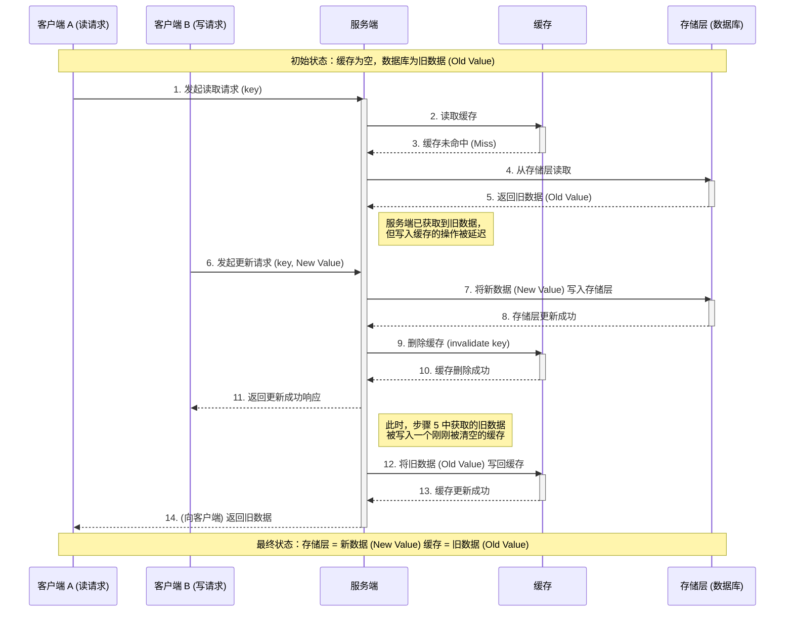
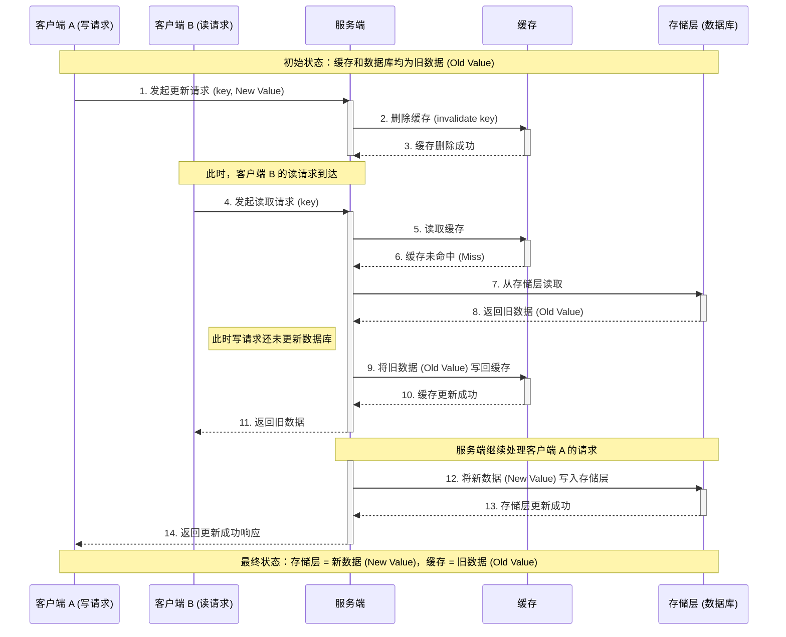
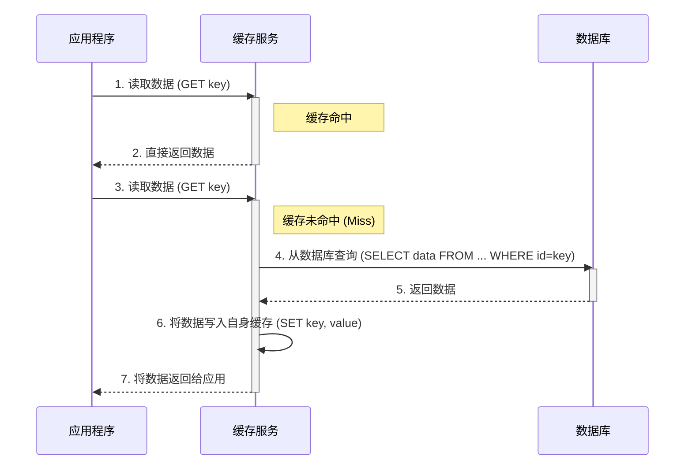
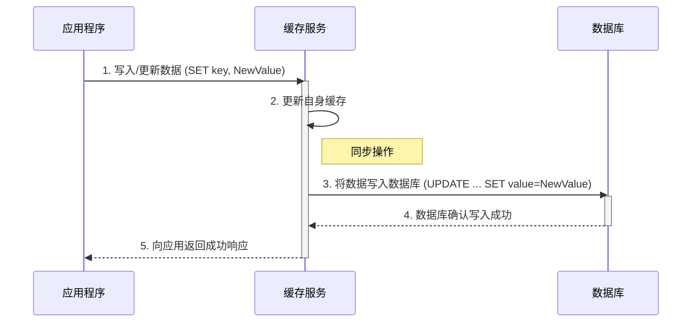
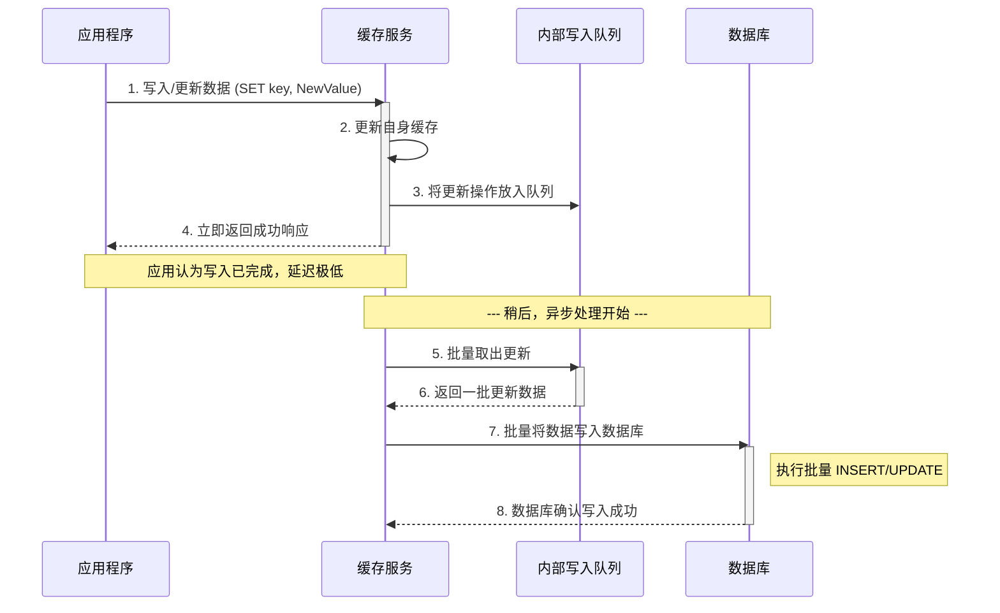
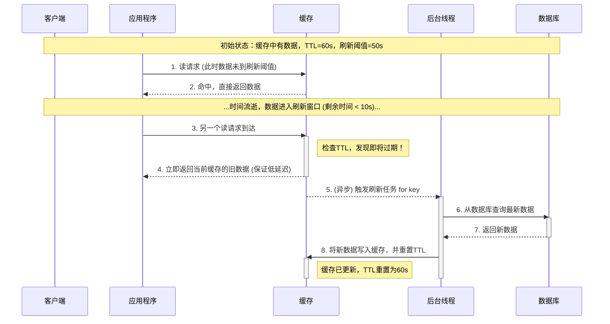

# Cache

## 缓存架构设计

缓存一般使用内存来进行存储，性能会远优于从硬盘进行读写，所以天然具备高性能和高并发两大优势，一般常用于加速读写和降低存储层负载。

在设计缓存方案时，同样需要从高性能、高并发、高可用三个角度进行衡量，结合业务特性进行设计，并在此基础上额外考虑成本问题。

针对于各项衡量指标，其主要影响因素如下所示：

<table style="width:100%; text-align:center;">
    <tr>
        <th></th>
        <th>衡量指标</th>
        <th>影响因素</th>
    </tr>
    <tr>
        <th rowspan="3">高性能</th>
        <td>读写性能</td>
        <td>读取速率、数据结构、序列化</td>
    </tr>
    <tr>
        <td>命中率</td>
        <td>缓存大小、淘汰策略</td>
    </tr>
    <tr>
        <td>网络延迟</td>
        <td>集群分布</td>
    </tr>
    <tr>
        <th rowspan="3">高并发</th>
        <td>一致性</td>
        <td>缓存策略、分布式一致性</td>
    </tr>
    <tr>
        <td>负载均衡</td>
        <td>负载均衡算法、分布式架构</td>
    </tr>
    <tr>
        <td>并发控制</td>
        <td>事务</td>
    </tr>
    <tr>
        <th rowspan="3">高可用</th>
        <td>容错机制</td>
        <td>持久化、防雪崩、防击穿、防穿透</td>
    </tr>
    <tr>
        <td>故障转移</td>
        <td>主从架构、哨兵机制</td>
    </tr>
    <tr>
        <td>监控</td>
        <td>实时监控与报警</td>
    </tr>
</table>

## 缓存策略

缓存策略，也被称作缓存模式，即 Cache Pattern，定义了应用层、缓存层、存储层之间的交互方式，包括读写顺序与更新策略。

### Cache Aside

Cache Aside 是最常用的一种缓存策略，其核心思想是应用层来维护存储层与缓存层的数据，缓存层本身不参与任何业务逻辑，其要点如下：

1. 数据的读写全部由应用层处理，缓存层与存储层完全解耦
2. 数据流的主要路径是**应用层 <-> 存储层**
3. 当缓存命中时，走缓存，当未命中时，回归主要路径，读存储层

主要流程如下

其中较为重点的是更新策略，先更新存储层数据，再删除缓存层数据，其优势如下：

- **懒加载**：在下次真正需要读取这个数据时，才会从数据库加载并写入缓存，避免资源浪费
- **避免脏数据**：降低数据不一致的风险
- **逻辑简单**：删除操作代码逻辑更加简单

#### 更新存储层，再更新缓存层

在“更新存储层，再更新缓存层”的策略下，对于如下场景，会存在数据不一致的情况：

1. `[写A]`：更新数据库。
2. `[写B]`：更新数据库。
3. `[写B]`：更新缓存。
4. `[写A]`：更新缓存 (A 的旧值覆盖了 B 的新值)。

其时间窗口要求为：

- **请求 B 的完整流程（写DB + 写Cache）**，必须精确地发生在请求 A 的**步骤1（写DB**）和**步骤4（写Cache）**之间。

- $T_{写A(更新DB)} < T_{写B(完整流程)} < T_{写A(更新Cache)}$

通常情况下，有两种优化策略：

**1. 将“更新缓存层”的操作替换为“删除缓存层”**

- 对于“删除”操作来说，无论是 `[删A]` 还是 `[删B]` 的执行顺序如何，最终结果一定是缓存中的数据被删除了，不会存在时序问题
- 当下个读请求触发时，会以懒加载的方式，自动构建新的缓存

**2. 引入“分布式锁”**

- 特定场景下，希望写操作后一定要更新缓存，则可以使用分布式锁，来保障写操作的原子性，避免并发冲突
- 在“写多读少”的场景，此方案可以更好的保障缓存的命中率，但是对写操作的性能影响较大
- 保障缓存数据最新，还可以解决数据层“主从延迟”导致的脏数据问题，使得在“主从同步”间，所有读请求仅会访问缓存层

典型场景的时序图如下所示：

#### 先更新存储层，再删除缓存层

在“先更新存储层，再删除缓存层”的策略下，对于如下场景，会存在数据不一致的情况：

1. `[读]` 发现缓存未命中 (Miss)。
2. `[读]` 从数据库读取**旧数据 (Old Value)**。
3. `[写]` 更新数据库为**新数据 (New Value)**。
4. `[写]` 删除缓存。
5. `[读]` 将 `步骤2` 中读到的**旧数据**写入缓存。

其**时间窗口**要求为：

- **一个完整的写请求**，必须精确地发生在**一个读请求**的 `步骤2（读DB）` 和 `步骤5（写Cache）` 之间。

- $T_{读(读DB)} < T_{写(完整流程)} < T_{读(写Cache)}$

典型场景的时序图如下所示：

#### 先删除缓存层，再更新存储层

在“先删除缓存层，再更新存储层”的策略下，对于如下场景，会存在数据不一致的情况：

1. `[写]` 删除缓存。
2. `[读]` 发现缓存未命中 (Miss)。
3. `[读]` 从数据库读取**旧数据 (Old Value)**。
4. `[读]` 将**旧数据**写入缓存。
5. `[写]` 将**新数据 (New Value)*- 写入数据库。

其**时间窗口**要求为：

- **读请求**的执行必须精确地发生在**写请求**的**步骤1（删除Cache）**和**步骤5（写DB）**之间。

- $T_{写(删Cache)} < T_{读(完整流程)} < T_{写(写DB)}$

典型场景的时序图如下所示：

#### 如何处理“删除缓存”失败？

在“先更新数据库，再删除缓存”的模式中，如果删除缓存失败，会导致数据库与缓存数据长期不一致。以下是两种主流的解决方案：

**方案一：分布式事务(不推荐)**

- **思路**：将数据库和缓存操作捆绑在同一个事务中。
- **问题**：这种方案会引入两阶段提交等复杂机制，严重影响系统性能和可用性（例如缓存故障会导致数据库操作失败），成本极高。

**方案二：异步重试，保障最终一致(主流方案)**

核心思路是为缓存删除操作增加一个可靠的、最终会成功的重试机制。

- **延迟双删**
  - **流程**：更新数据库后，先尝试同步删除一次缓存；然后通过消息队列（MQ）发送一个延迟消息，在几秒后再次异步删除缓存，作为可靠性兜底。
  - **优点**：实现简单，通过 MQ 保证了删除操作最终会被执行。

- **订阅数据库变更日志 (推荐)**
  - **流程**：业务代码只管更新数据库。一个独立的同步服务通过监听数据库的 binlog，来发现数据变更，然后自动去删除对应的缓存。
  - **优点**：
    - **业务解耦**：业务代码无需关心缓存，逻辑更纯粹。
    - **高可靠**：依赖数据库的 binlog，只要数据库更新成功，缓存删除就不会丢失。
    - **缓解主从延迟问题**：binlog 的消费本身就存在一定延迟，这恰好给了数据库主从同步的缓冲时间，能有效避免因从库延迟而导致缓存被脏数据污染的问题。

- **延迟时间**
  - 对于“延迟双删”，延迟时间需要权衡，通常设置为主从同步的平均延迟（如1-5秒）即可。对于“订阅binlog”方案，则无需手动设置，其天然的链路延迟已能满足大部分需求。

### Read/Write Through

Read/Write Through 模式的核心思想是**将缓存作为主要的数据访问入口**，把数据同步的责任从应用层转移到缓存服务本身，其优缺点如下所示：

**优点**

- **数据一致性高**：数据会被同步写入缓存和数据库，几乎不存在不一致的时间窗口，保证了数据的高度一致性。
- **应用逻辑简单**：应用程序只需与缓存层交互，无需额外考虑存储层，逻辑被大幅简化。

**缺点**

- **实现复杂度高**：将复杂性从应用层转移到了缓存层，需要以统一的逻辑对接不同的存储层，异常情况多。
- **写入延迟**：写入时，需要同步写入缓存层与存储层，耗时较大。
- **通用性受限**：对于复杂逻辑，如多表事务，在缓存层进行通用化封装的难度很高。

#### Read Through

读操作时，如果缓存层未命中，由缓存层负责查询存储层，然后先将数据更新至缓存层后再返回。

典型场景的时序图如下所示：

#### Write Through

写操作时，直接更新缓存层，由缓存层同步更新存储层。

典型场景的时序图如下所示：

### Write Back

Write Back 是一种追求极致写入性能的方案，在应用层更新数据时，只更新缓存，并立即返回成功响应，稍后异步批量更新存储层。其优缺点如下所示：

**优点**

- **极致的写入性能**：写操作仅涉及对于缓存层的处理，一般为内存操作，延迟极低。
- **降低存储层负载**：通过异步批处理的方式更新存储层，能够减少存储层的连接数与事务开销，并实现削峰的效果。

**缺点**

- **数据丢失风险高**：在操作完成后，数据还未持久化完成，有丢失风险。
- **数据不一致**：数据在写入存储层前，缓存层与存储层之间的数据一定是不一致的。
- **实现复杂度高**：需要处理异步队列、批量写入、失败重试、并发控制等复杂逻辑，来降低数据丢失风险。

典型场景的时序图如下所示：

### Refresh Ahead

Refresh Ahead 是一种前瞻性的缓存刷新策略，其核心思想是在缓存数据即将过期前，由后台线程触发刷新操作，从而延长其生命周期，在更新流程上，与 Cache Aside 保持一致。其优缺点如下所示：

**优点**

- **提供缓存命中率**：对于热点数据，该模式可以保证缓存接近永不过期，显著提高命中率，避免因缓存失效导致的性能抖动
- **避免惊群效应**：保证缓存的高命中率的同时，仅使用一个后台线程进行更新，避免大量请求同时穿透至存储层。

**缺点**

- **复杂度高**：需要额外支持 TTL 检测与异步刷新逻辑。
- **数据不一致**：触发刷新的请求以及在后台任务完成前的其他请求，读取到的都是旧数据，存在短暂的不一致。
- **增加系统开销**：需要关注后台刷新任务的资源消耗、执行耗时与执行频率。

典型场景的时序图如下所示：

### 总结对比

#### 评分体系说明

采用更直观的评分体系，其中 **A 代表“优秀”，D 代表“较差”**。

- 对于**性能、一致性、命中率**：**A*- 代表最好。

- 对于**复杂度**：**A*- 代表最简单（复杂度最低）。

| 缓存策略 | 性能 | 一致性 | 命中率 | 缓存层复杂度 | 应用层复杂度 |
| :--- | :---: | :---: | :---: | :---: | :---: |
| **Cache Aside*- | B (良好) | B (良好) | C (一般) | A (极简) | C (较高) |
| **Read/Write Through*- | C (一般) | A (优秀) | A (优秀) | D (复杂) | A (极简) |
| **Write Back*- | A (优秀) | D (较差) | A (优秀) | C (较复杂) | C (较高) |
| **Refresh Ahead*- | B (良好) | B (良好) | B (良好) | B (简单) | C (较高) |

#### 各维度详细分析

**写入性能**

- **(A) Write Back**：只写内存，异步刷盘，写入延迟最低，性能最佳。
- **(B) Cache Aside / Refresh Ahead**：只更新数据库并删除缓存，属于常规性能。
- **(C) Read/Write Through**：需要同步写缓存和数据库，延迟最高，性能相对最差。

**数据一致性**

- **(A) Read/Write Through**：同步更新缓存和数据库，几乎等同于一个事务，一致性最强。
- **(B) Cache Aside / Refresh Ahead**：存在极小概率的并发读写不一致，但整体可靠，保障最终一致性。
- **(D) Write Back**：异步写入数据库，在宕机时存在**数据丢失**的风险，一致性最弱。

**缓存命中率**

- **(A) Read/Write Through / Write Back**：数据写入时会直接更新缓存，确保缓存数据常新，命中率高。
- **(B) Refresh Ahead**：通过提前刷新热点数据，有效避免了因过期导致的缓存未命中，命中率良好。
- **(C) Cache Aside**：每次数据更新都伴随着缓存删除，会导致下一次读取必然发生缓存未命中，命中率相对最低。

**缓存层复杂度**

- **(A) Cache Aside**：逻辑最简单，应用层自由控制，缓存侧无需特殊实现。
- **(B) Refresh Ahead**：需要在缓存侧或客户端增加“判断即将过期”并触发异步加载的逻辑。
- **(C) Write Back**：缓存侧需要实现异步队列、任务调度、批量刷盘和失败重试等复杂机制。
- **(D) Read/Write Through**：缓存服务需要作为“数据源代理”，封装所有与数据库的交互逻辑，实现最为复杂。

**应用层复杂度**

- **(A) Read/Write Through**：应用层完全“透明”，只需与缓存交互，代码最简洁。
- **(C) Cache Aside / Refresh Ahead / Write Back**：应用层需要自行实现数据读取（Cache Miss后读DB）和数据写入/失效的逻辑，代码复杂度较高。其中 Write Back 还需额外处理数据可能丢失的场景。

### 选型总结

- **首选 Cache Aside**：它是通用性最强、实现最简单的策略，能满足绝大多数业务场景的需求，是事实上的行业标准。
- **追求代码简洁，选择 Read/Write Through**：如果使用了支持该模式的商业缓存产品或中间件，可以极大简化应用层代码，但需接受其性能损耗。
- **追求极致写入性能，选择 Write Back**：适用于写入极其频繁、对延迟极度敏感且能容忍少量数据丢失的场景（如日志、统计计数等）。
- **优化热点数据，选择 Refresh Ahead**：作为 Cache Aside 的一种优化，适用于热点数据明显、不希望因缓存过期引发性能抖动的场景。

## 常见问题

### 缓存雪崩

**核心定义**

在短时间内，因**大规模缓存数据同时失效**（例如，缓存项设置了相同的过期时间），或缓**存服务自身出现故障**（例如，Redis 宕机），导致海量请求无法命中缓存，瞬间全部涌向后端的存储层（如数据库）。

这会造成存储层压力剧增，响应变慢甚至崩溃，从而引发整个服务链路的连锁反应，最终导致系统整体不可用。

**解决方案**

- **过期时间打散**：通过在缓存过期时间上增加一个随机值，避免大量数据在同一时刻集中失效。

- **逻辑过期**：缓存数据永不设置物理过期，仅在值内标记过期状态，由异步线程进行更新，从而根除缓存未命中的问题。

- **高可用部署**：将缓存服务部署为集群模式，避免因单个缓存节点宕机而导致整个缓存服务不可用。

- **分布式锁**：当缓存失效时，通过加锁确保只有一个请求去访问数据库并重建缓存，防止其他请求重复操作。

- **缓存降级**：在流量高峰期或后端服务异常时，若缓存未命中则直接返回预设的默认值，以此保护后端服务。

- **限流与熔断**：通过限制访问后端的请求速率或在后端异常时快速失败，防止存储层被彻底压垮。

### 缓存击穿

**核心定义**

缓存击穿特指**单个热点数据（Hot Key）**的缓存失效，导致海量并发请求在这一瞬间，直接穿透缓存层，全部访问后端的存储层（如数据库），造成其巨大压力。

**与缓存雪崩的区别**

- **缓存雪崩**是“**面**”的问题：由大规模的 key 同时失效或整个缓存服务故障导致。
- **缓存击穿**是“**点**”的问题：仅由单个、但访问量极高的热点 key 失效导致。

因此，缓存击穿可以看作是缓存雪崩的一种特殊情况，但其应对策略更具针对性。

**解决方案**

- **分布式锁**、**逻辑过期**、**缓存降级**：仍可以使用**缓存雪崩**的部分解决方案，来解决**缓存击穿**问题。
- **数据预热**：对于可预知的**热点数据**（如秒杀、新闻头条等），提前将其加载至缓存中，并设置合理的过期策略。

### 缓存穿透

**核心定义**

缓存穿透指大量请求查询一个**确定不存在**的数据（缓存和数据库中均无），导致请求绕过缓存层，直接访问后端存储，造成不必要的负载甚至压垮存储服务。

通常源于恶意攻击或上游业务逻辑错误，或是存储层由于意外情况导致数据丢失。

**与缓存击穿/雪崩的区别**

其核心区别在于：

- **穿透**：查询的数据在**数据库中根本不存在**。
- **击穿**：查询的数据在**数据库中存在**，但缓存恰好失效。
- **雪崩**：**大量不同数据**的缓存同时失效或缓存服务宕机。

**解决方案**

- **缓存空对象**：当存储层确认数据不存在时，将一个代表“空”的占位符缓存起来并设置较短的过期时间，以防后续相同请求再次穿透。

- **布隆过滤器**：在所有合法 key 的基础上构建一个布隆过滤器，并在请求入口处用它快速拦截掉绝大多数对不存在 key 的访问。

## Web 系统缓存层级

### 网络与客户端

**DNS 缓存**

- **位置**: 用户的操作系统、路由器、以及网络运营商（ISP）的各级 DNS 服务器中。
- **缓存内容**: 域名与 IP 地址的映射关系。（示例: `www.google.com` -> `142.250.196.68`）
- **核心价值**: 避免了每次请求都进行耗时的 DNS 递归查询，加速了网络连接的初始建立过程。

**浏览器缓存**

- **位置**: 用户的浏览器应用中，存储于内存或本地硬盘。
- **缓存内容**: 网站的静态资源和部分 API 响应。（示例: CSS 样式表、JS 脚本、Logo 图片、字体文件）
- **核心价值**: 提供最快的加载体验。缓存命中时，页面资源无需通过网络即可加载，极大提升了前端性能并节省了用户带宽。

### 边缘与服务入口

**CDN 缓存**

- **位置**: 全球各地、地理上靠近用户的边缘网络节点服务器上。
- **缓存内容**: 网站的静态资源，也可配置缓存动态页面或 API 响应。（示例: 网站图片、视频流、可被公共访问的文章 API）
- **核心价值**: 通过就近访问原则，显著降低了用户的网络访问延迟（latency），同时作为流量的第一道屏障，为源站服务器分担巨大压力。

**反向代理缓存**

- **位置**: 应用服务器集群的前端入口，通常在 Nginx 等服务器软件中。
- **缓存内容**: 高频访问的动态或静态内容。（示例: 网站首页的渲染结果、热门资讯列表接口）
- **核心价值**: 直接在流量入口处拦截大量重复请求，避免其进入后端应用逻辑，有效降低应用服务器的 CPU 负载。

**API 网关缓存**

- **位置**: 微服务架构的统一 API 入口，位于客户端与具体微服务之间。
- **缓存内容**: 针对特定 API 端点的响应数据。（示例: `GET /api/users/123` 返回的用户基本信息）
- **核心价值**: 专为 API 设计的缓存层，能对下游微服务进行精细化的请求限流与缓存保护，降低了内部服务间的调用开销。

### 应用服务层

**应用本地缓存**

- **位置**: 单个应用服务的进程内存（Heap）之中。
- **缓存内容**: 小体积、低变化、高频访问的数据。（示例: 系统配置项、国家地区代码、数据字典、权限列表）
- **核心价值**: 无任何网络开销的纯内存访问，为应用逻辑提供了极致的读取性能。

**ORM 缓存**

- **位置**: 应用内部的数据访问框架层（如 Hibernate, MyBatis）。
- **缓存内容**: 将数据库行记录映射成的程序对象。（示例: 一个从数据库查询出的 `User` 对象实例）
- **核心价值**: 在代码层面减少对数据库的重复查询，避免了反复创建对象的开销，提升了数据操作效率。

**分布式缓存**

- **位置**: 由多台服务器组成的独立缓存集群（如 Redis, Memcached）。
- **缓存内容**: 需要在多个服务实例间共享的热点业务数据。（示例: 用户登录会话 Session、购物车信息、实时排行榜）
- **核心价值**: 为整个分布式后端系统提供了一个可水平扩展的、高性能的共享数据层，是现代可扩展架构的核心组件。

### 数据与底层系统

**数据库缓存**

- **位置**: 数据库管理系统（DBMS）内部的内存区域。
- **缓存内容**: 查询计划、索引数据、以及从磁盘读取的数据块。（示例: MySQL InnoDB 的 Buffer Pool 中的数据页）
- **核心价值**: 加速 SQL 的解析与执行，通过将磁盘 I/O 转换为内存访问来保障数据库的整体性能。

**操作系统缓存**

- **位置**: 操作系统内核（Kernel）的内存空间中，也称 Page Cache。
- **缓存内容**: 最近被访问过的磁盘文件的数据块。
- **核心价值**: 对上层所有应用（包括数据库）透明地加速文件读写操作，是避免昂贵物理磁盘 I/O 的重要底层机制。

**CPU 缓存**

- **位置**: CPU 物理芯片内部，分为 L1, L2, L3 等多级。
- **缓存内容**: 即将被 CPU 执行的机器指令和需要处理的数据。
- **核心价值**: 速度的终极层级，弥补了 CPU 超高速计算能力与相对较慢的主内存（RAM）之间的巨大速度鸿沟，是所有现代计算机高性能的根本。

## Ref

- <https://zhuanlan.zhihu.com/p/591436083>
- <https://en.wikipedia.org/wiki/Cache_replacement_policies>
