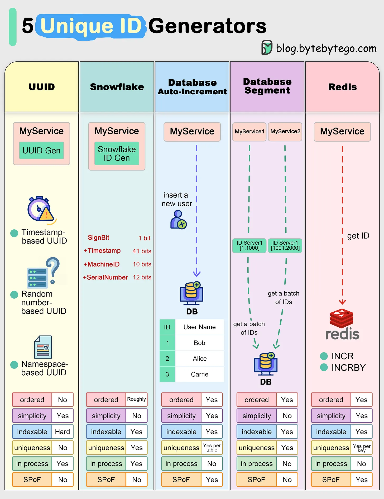
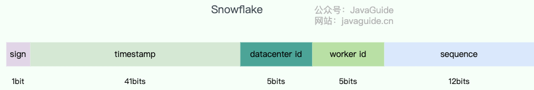

# ID

分布式 ID 是分布式系统中用于唯一标识数据、请求或实体的全局唯一标识符（Globally Unique Identifier）。

在传统单机系统中，数据库自增主键即可满足需求，但在分布式环境下，多个节点并行生成 ID 时，必须解决全局唯一性、高可用性、高性能和有序性等问题。

## 设计需求

- **全局唯一**：不同节点生成的 ID 不能重复
- **高性能**：生成速度需支撑高并发场景（如每秒数万次）
- **高可用**：ID 生成服务需具备容灾能力，可用性接近 100%
- **趋势递增**：有利于数据库索引优化（如 InnoDB 的 B + 树索引）
- **安全可控**：防止 ID 被猜测或遍历（如订单号）
- **透明性**：ID 中可嵌入元数据（如时间戳、机器 ID、业务 ID），方便调试和链路追踪

## 解决方案

分布式 ID 有以下五种常见的解决方案：数据库自增、数据库号段、Redis、UUID、雪花 ID。



### 数据库自增

仍利用关系型数据库（如 MySQL）的自增主键来产生唯一的 ID，实现简单，ID 有序递增，但是需要所有业务访问同一个数据库，性能较差，难以支持高并发。

或是以集群方式部署，各数据库指定不同的初始值，并以相同的步长递增。

- 例如初始值分别为 1，2，3，步长为 3，则三个数据库中的主键值则分别为 $3n+1, 3n+2, 3(n+1)$，不会出现冲突

### 数据库号段

每次访问数据库时，以号段的方式申请，例如 $[1, 1000], [1001, 2000]$，业务方在此基础上，进行自增处理。

```sql
CREATE TABLE `sequence_id_generator` (
  `id` int(10) NOT NULL,
  `current_max_id` bigint(20) NOT NULL COMMENT '当前最大id',
  `step` int(10) NOT NULL COMMENT '号段的长度',
  `version` int(20) NOT NULL COMMENT '版本号',
  `biz_type`    int(20) NOT NULL COMMENT '业务类型',
   PRIMARY KEY (`id`)
) ENGINE=InnoDB DEFAULT CHARSET=utf8mb4;
```

### Redis

使用 Redis 的 `incr` 命令实现 ID 的顺序递增，利用 Redis 本身的能力，保障分布式 ID 的高可用、高并发、高性能。

### UUID

UUID 是用于计算机体系中以识别信息的一个 128 位标识符（32 个 16 进制数字），由字符 '-' 分割为五组表示，即 "8-4-4-4-12"，其布局规则如下：

- **time_low**：8 位，表示 32 bits 时间
- **time_mid**：4 位，表示 16 bits 时间
- **time_hi_and_version**：4 位，高 4 bits 表示版本，低 12 bits 表示时间
- **clock_seq_hi_and_res clock_seq_low**：4 位，高 1~3 bits 表示变体，后 13~15 位表示时钟序列
- **node**：12 位，表示 48 bits 节点 ID（MAC 地址）

对于不同版本，其差异如下：

**版本 1**

- **生成方式**：时间戳 + MAC地址 + 计数器
- **唯一性保障**：时间唯一 + 空间唯一
- **特点**：
  - 基于硬件和时钟，可能暴露 MAC 地址和生成时间
  - 适用于分布式系统需时间排序场景。

**版本 2**

- **生成方式**：DCE安全扩展
- **唯一性保障**：类似版本 1，权限增强
- **特点**
  - 为 DCE 安全设计，用 POSIX UID/GID 替代部分字段，极少使用

**版本 3**

- **生成方式**：MD5哈希（命名空间+名称）
- **唯一性保障**：命名空间 + 名称唯一
- **特点**
  - 确定性生成，相同输入生成相同 UUID
  - 适用于需要固定标识的映射场景（如文件路径）

**版本 4**

- **生成方式**：随机数生成
- **唯一性保障**：随机性保证（122 位随机）
- **特点**
  - 无逻辑关联，隐私性好
  - 最通用版本，适用于无需时间或哈希约束的场景（如会话ID）

**版本 5**

- **生成方式**：SHA-1哈希（命名空间+名称）
- **唯一性保障**：命名空间 + 名称唯一
- **特点**
  - 类似版本 3，但哈希强度更高
  - 适合需要更高安全性的确定性生成（如资源标识）

**版本 6**

- **生成方式**：改进的时间戳排序
- **唯一性保障**：时间唯一 + 空间唯一
- **特点**
  - 类似版本 1，但时间戳字段顺序优化，放在最高有效位
  - 支持更高效的时间排序

**版本 7**

- **生成方式**：时间戳 + 随机数
- **唯一性保障**：时间有序 + 随机性
- **特点**
  - 时间戳前缀 + 随机后缀
  - 适合数据库索引优化

**版本 8**

- **生成方式**：自定义自由格式
- **唯一性保障**：用户定义
- **特点**
  - 保留字段供实验或私有实现，灵活性高，无固定规则

UUID 的生成速度较快，简单易用，但是对于存储空间占用较大，且存在冲突问题（机器时间异常或其他原因导致碰撞）。

### Snowflake

nowflake 是 Twitter 开源的分布式 ID 生成算法，由 64 bit 的二进制数字组成：



- **sign(1bit)**：符号位，固定为 0，保证 ID 为正数
- **timestamp (41 bits)**：记录当前时间与起始时间的差值（毫秒级），可以支撑 2^41 毫秒（约 69 年）
- **datacenter id + worker id (10 bits)**：标识分布式系统中的不同节点，最多支持 1024 个节点（2^10=1024）
- **sequence (12 bits)**：同一毫秒内的自增序号，每毫秒最多生成 4096 个 ID（2^12=4096）

**生成流程**

- **获取当前时间戳**
  - 计算当前时间与预设起始时间的毫秒差值

- **处理时钟回拨**
  - 如果当前时间戳小于上次生成 ID 的时间戳，说明发生时钟回拨
  - 短时间回拨（如几毫秒）：等待时钟追上最后记录时间。
  - 长时间回拨：抛出异常并报警，人工介入修复。

- **生成序列号**
  - 同一毫秒内，序列号从 0 开始递增，直到 4095
  - 若同一毫秒内序列号用尽，则阻塞到下一毫秒再继续生成
  
- **组合 ID**
  - 将时间戳、节点 ID、序列号按位拼接为 64 位长整型，最终转换为十进制数值

## Ref

- <https://javaguide.cn/distributed-system/distributed-id.html>
- <https://blog.bytebytego.com/p/ep82-open-sourcing-over-100-byte>
- <https://datatracker.ietf.org/doc/html/rfc4122>
- [wiki/通用唯一识别码](https://zh.wikipedia.org/wiki/%E9%80%9A%E7%94%A8%E5%94%AF%E4%B8%80%E8%AF%86%E5%88%AB%E7%A0%81)
