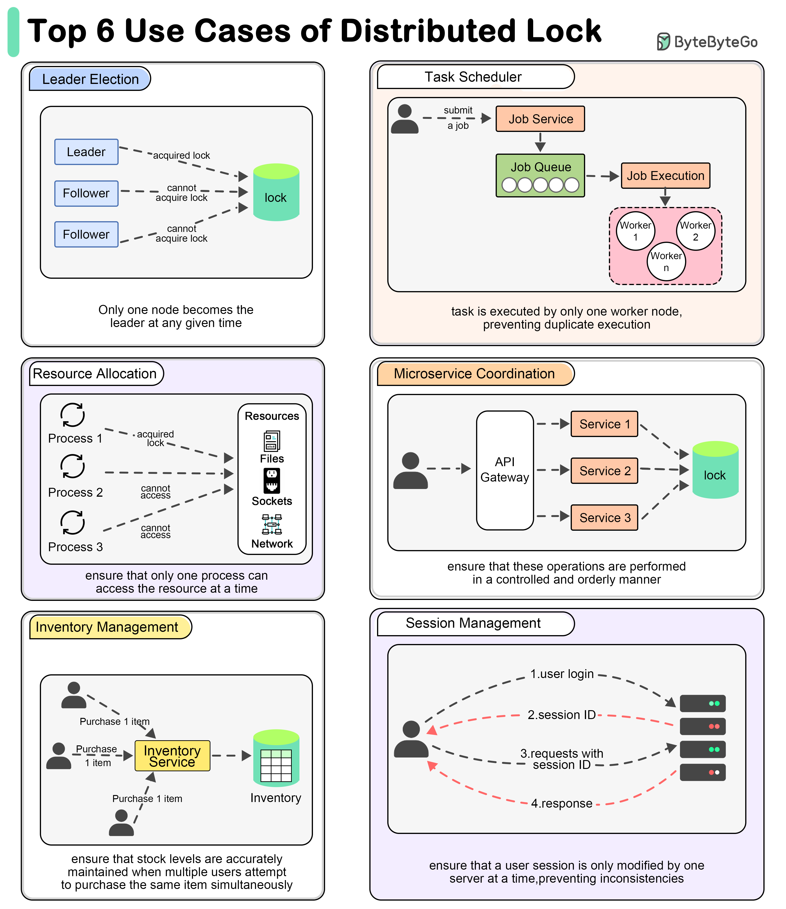

# Lock

分布式锁是一种用于分布式系统中控制对共享资源访问的机制，确保在同一时刻只有一个进程或线程能够访问某个资源，从而避免数据不一致或竞争条件。

## 核心特性

- **互斥性**：保证同一时刻只有一个客户端能获得锁，对共享资源进行操作，防止并发冲突和数据不一致
- **高可用性**：分布式锁服务本身需要具备高可用能力，避免因锁服务单点故障导致业务不可用
- **可重入性**：支持同一个客户端在持有锁的情况下再次获取锁（可重入锁），避免死锁和重复加锁问题
- **高性能**：能够支撑高并发场景下的锁请求，响应速度快，延迟低，不成为系统瓶颈
- **失败重试**：支持不重试、固定间隔重试、指数退避重试、自定义重试等策略，支持配置重试次数和超时时间
- **非阻塞**：客户端在无法获得锁时能够快速返回，避免长时间阻塞等待，提高系统吞吐量
- **锁超时与自动释放**：支持锁的超时机制，防止因客户端崩溃或网络异常导致锁无法释放，保证系统健壮性
- **可见性与公平性**：锁的状态对所有客户端可见，部分实现支持公平锁，保证锁的获取顺序
- **容错性**：能够应对节点宕机、网络分区等异常情况，保证锁机制的正确性和一致性
- **唯一标识**：支持设置锁的唯一标识，防止误释放他人锁

## 使用场景

- **订单系统防止超卖**：在电商场景下，多个用户同时抢购同一商品时，为防止库存被超卖，需要对库存扣减操作加分布式锁，确保同一时刻只有一个请求能修改库存

- **分布式任务调度**：在分布式定时任务系统中，为避免同一个任务被多个节点重复执行，通常会在任务执行前加分布式锁，只有获得锁的节点才可以执行任务

- **全局唯一序列号生成**：多个节点需要生成全局唯一的订单号、流水号等时，通过分布式锁保证同一时刻只有一个节点能生成，避免重复

- **共享资源互斥访问**：比如多个服务实例需要对同一份配置文件、缓存、文件等资源进行写操作时，需要分布式锁保证互斥，防止数据冲突

- **分布式事务协调**：在分布式事务场景下，分布式锁可用于协调各参与方的操作顺序，保证数据一致性

- **限流与幂等控制**：某些接口需要限流或保证幂等性时，可以通过分布式锁控制请求的并发度或防止重复处理

## 实现方式

单机环境下，通过可以使用 `synchronized` 、 `Lock` 等机制实现互斥访问。但在分布式系统中，多个节点之间没有共享内存，必须借助外部系统（如数据库、缓存、Zookeeper 等）来实现锁的功能。分布式锁的核心目标是：**保证在分布式环境下对共享资源的互斥访问**。

**基于数据库**

利用数据库的唯一约束（如唯一索引）或悲观锁机制（如 `select for update`）来实现锁。

- 实现方式
  - 插入一条唯一记录作为锁，插入成功即获得锁，失败则表示锁已被占用
  - 删除记录即释放锁

- 优点
  - 实现简单，易于理解

- 缺点
  - 性能较低，数据库压力大，不适合高并发场景
  - 存在死锁和锁超时问题

**基于 Redis**

利用 Redis 的原子操作（如 `SETNX`、 `EXPIRE`）实现分布式锁。

- 实现方式
  - 使用 `SET key value NX PX timeout` 命令设置带有过期时间的锁
  - 释放锁时需判断 `value` 是否为自己持有，防止误删他人锁

- 优点
  - 性能高，支持高并发，易于横向扩展
  - 支持锁的自动过期

- 缺点
  - 需要处理锁的失效和续期问题
  - 主从切换时可能出现锁丢失

**基于 Zookeeper 实现**

利用 Zookeeper 的临时顺序节点和 Watcher 机制实现分布式锁。

- 实现方式
  - 每个客户端在指定节点下创建临时顺序节点，节点序号最小者获得锁
  - 释放锁即删除节点，其他客户端收到通知后重新竞争锁

- 优点
  - 可靠性高，具备自动失效机制
  - 适合强一致性场景

- 缺点
  - 实现复杂
  - 性能受限于 Zookeeper 的吞吐量

## Ref

- [wiki/Distributed_lock_manager](https://en.wikipedia.org/wiki/Distributed_lock_manager)
- <https://javaguide.cn/distributed-system/distributed-lock.html>
- <https://bytebytego.com/guides/why-do-we-need-to-use-a-distributed-lock/>
- <https://javaguide.cn/distributed-system/distributed-lock-implementations.html>
