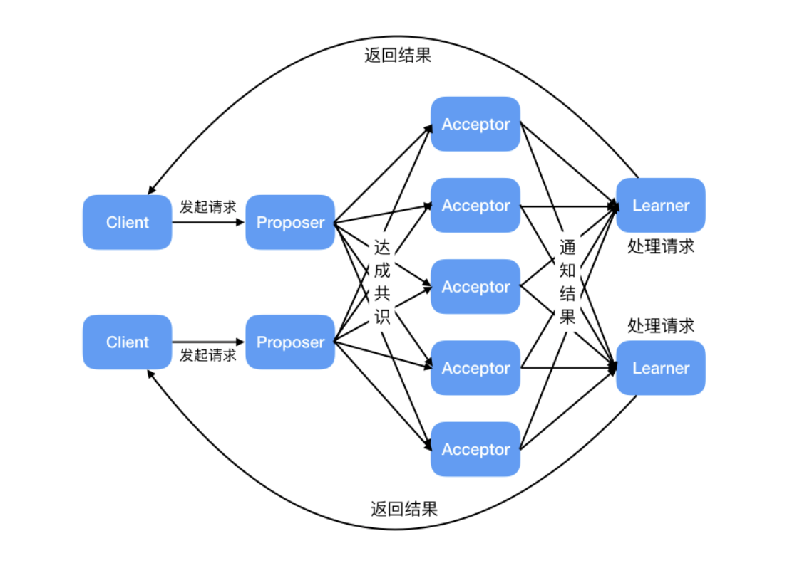
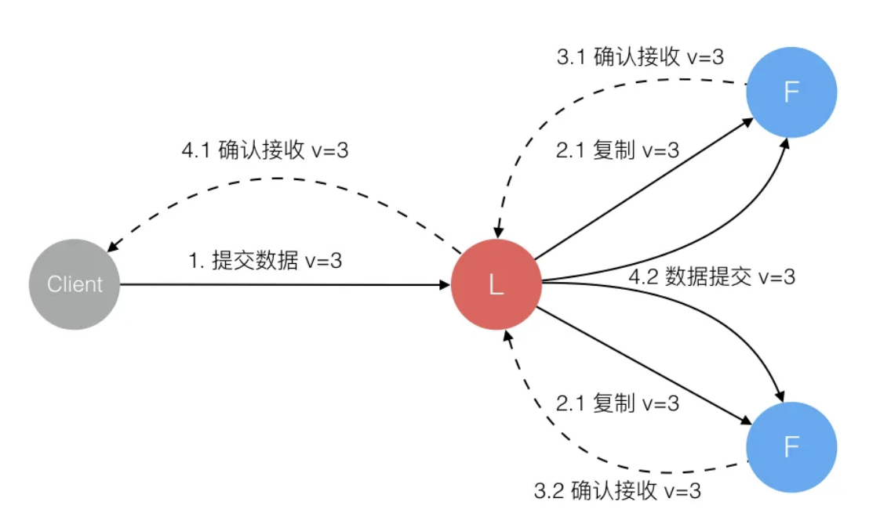
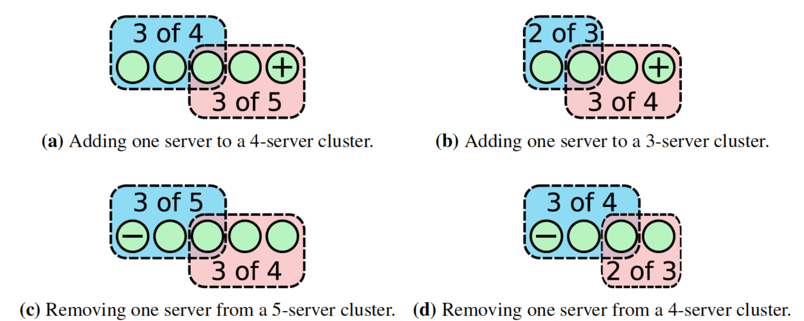
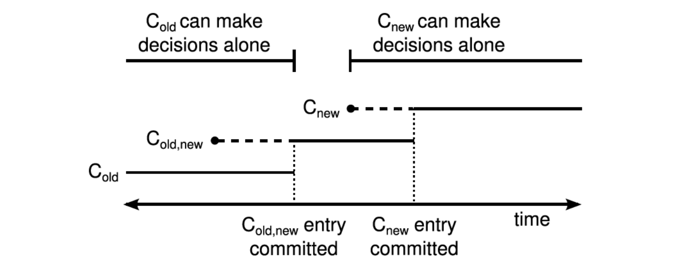

# 分布式协议

分布式系统中常见的协议主要用于解决一致性问题，其中包括数据一致性与事务一致性，前者侧重于多节点间的数据保持一致，后者侧重于跨节点的事务满足 ACID 特性，其中常见的协议有：

- 数据一致性协议

  - 共识协议
    - Paxos：通过 proposal、promise 和 accept 三个阶段，使各节点达成共识
    - Raft：更易理解的共识算法，通过 Leader 选举和日志复制保证一致性
    - ZAB (ZooKeeper Atomic Broadcast)：用于 ZooKeeper 的原子广播协议，保证顺序一致性

  - 最终一致性协议
    - Gossip：通过节点间随机通信传播数据，最终所有节点达成一致
    - CRDTs（Conflict-Free Replicated Data Types）：数据结构设计，支持无冲突合并（适用于协同编辑等场景）

  - 拜占庭错误
    - PoW（Proof of Wokr）：工作量证明
    - PoS（Proof of Stake）：权益证明

- 事务一致性协议

  - 原子提交协议
    - 2PC（两阶段提交）：分 “准备” 和 “提交” 两阶段确保事务的原子性，缺点是容易出现阻塞问题和单点故障
    - 3PC（三阶段提交）：引入超时机制和预提交阶段，降低阻塞风险，但复杂度更高

  - 补偿型协议
    - TCC（Try-Confirm-Cancel）：通过业务逻辑的 “尝试”、“确认”、“取消” 三个阶段实现最终一致性
    - Saga：通过本地事务和补偿操作（如订单服务逆向操作）实现长事务。

## 数据一致性

### Paxos

Paxos 是分布式系统中用于解决一致性问题的经典算法，由 Leslie Lamport 在 1990 年提出。它的核心目标是让分布式系统中的**多个节点（可能发生故障或存在网络延迟）对一个值（或操作序列）达成一致**，即使在部分节点故障或消息丢失的情况下也能保证正确性。

Paxos 的核心是通过多数派（Quorum）投票机制和两阶段提交来保证一致性：

- **多数派原则**：任何决策必须获得超过半数的节点同意
- **两阶段提交**：
  - 准备阶段（Prepare Phase）：提议者（Proposer）向接受者（Acceptors）请求承诺
  - 接受阶段（Accept Phase）：提议者向接受者提交具体提案

在整个流程中，共存在三种角色，且每个节点可以身兼数职：

- **Proposer（提议者）**：提出提案（Proposal），包括编号和对应的 value，推动系统达成一致
- **Acceptor（接受者）**：接收提案并投票，存储已接受的提案，若提案获得多数派接受，则称该提案被批准
- **Learner（学习者）**：学习最终达成一致的值，即被批准的提案（不参与投票）

算法的核心流程，分为准备、接受与学习三阶段：

- **准备阶段（Prepare Phase）**

  - Proposer 生成一个全局唯一的**提案编号（Proposal ID）**，向所有 Acceptors 发送 `Prepare(n)` 请求

  - Acceptor 收到 `Prepare(n)` 后：
    - 如果 `n` 大于自己已接受的所有提案编号，则返回承诺（Promise），不再通过小于 `n` 的提案，并附带自己已接受的**最高编号的提案值（如果有）**
    - 否则拒绝请求

  - **目的**：Proposer 通过准备阶段获取多数派 Acceptors 的承诺，确保旧的提案无法覆盖新提案

 

- **接受阶段（Accept Phase）**

  - 如果 Proposer 收到多数派 Acceptors 的 Promise，则选择一个值 `v`：
    - 如果所有 Promise 中未包含已接受的提案值，则 `v` 可以是任意值
    - 如果有 Acceptors 返回了已接受的提案值，则 `v` 必须是这些值中**最高编号对应的值**（保证一致性）

  - Proposer 向 Acceptors 发送 `Accept(n, v)` 请求。

  - Acceptor 收到 `Accept(n, v)` 后：
    - 如果未承诺过编号大于 `n` 的提案，则接受该提案
    - 否则拒绝

  - **目的**：确保多数派 Acceptors 接受同一个值，达成一致。

- **学习阶段（Learn Phase）**

  - 一旦提案被多数派 Acceptors 接受，Learner 会学习到这个值，并将其作为最终结果

以上流程，能够使得多节点间就单个提案达成共识，也被称作 **Basic Paxos** 算法，针对于多值共识，则需要 **Multi-Paxos** 思想，即多次执行 **Basic Paxos** 算法达成最终共识。

此外，针对于 Paxos 算法，还需要注意以下几点问题：

- **提案编号（Proposal ID）**：
  - 全局唯一且递增，用于区分提案的新旧
  - 通常由时间戳或节点ID生成
- **多数派（Quorum）**：
  - 任何阶段都需要多数派（超过半数）的响应，避免“脑裂”问题
- **活锁（Livelock）问题**：
  - 可能因多个 Proposer 竞争导致无限循环（例如两个 Proposer 交替生成更大的提案编号）
  - 解决方案包括随机退避或选举一个主 Proposer（如 Multi-Paxos）

### Raft

**Raft** 是 **Multi-Paxos** 的一种具体实现，相较于 Paxos，更强调**可理解性**和**工程易用性**，通过模块化设计（领导选举、日志复制、安全性），简化了实现难度，其核心目标为：

- **强一致性**：所有节点最终达成相同状态
- **高可用性**：允许少数节点故障（如 5 节点容忍 2 节点故障）
- **可理解性**：通过分解为清晰模块（领导选举、日志复制、安全性），降低学习成本

在 Raft 中的核心概念如下所示：

- **Role（节点角色）**
  - **Leader（领导者）**：唯一处理客户端请求的节点，负责发起心跳、日志的创建和同步
  - **Follower（跟随者）**：被动接收 Leader 的指令（心跳、日志条目），不主动发起请求
  - **Candidate（候选人）**：在选举过程中，竞争成为 Leader 的临时角色

- **Term（任期）**
  - 将时间划分为任意长度的任期，并用全局递增的整数（如 Term 1, Term 2）表示
  - 每个 Term 开始时，会重新进行选举，由多个 Candidate 参与竞选，并至多选出一个 Leader
  - 节点间通过 Term 来检测过期信息，并实时更新，过期的 Leader 会退化为 Follower

- **Log（日志）**
  - 每个节点维护一个日志序列（Log），每个条目（Entry）包含：
    - **Index**：序列索引
    - **Term**：创建该条目的 Leader 的任期
    - **Command**：客户端请求的操作（如写入数据）
  - 日志需要**顺序一致**：日志仅能由 Leader 修改，一旦某个位置的日志被提交，所有节点该位置的日志必须相同

Raft 的核心模块设计，如下所示：

- **Leader Election（领导选举）**

  - **触发条件**：
    - Follower 在**选举超时**（通常 150-300ms）内未收到 Leader 心跳，转为 Candidate

  - **选举过程**：
    - Candidate 递增自身 Term，向所有节点发送 **RequestVote RPC**
    - 节点投票规则：
      - 仅投票给 Term 更大或日志更全的 Candidate
      - 每个 Term 每个节点最多投一票（避免多个 Leader）
    - Candidate 收到**多数派**（N/2+1）投票后成为 Leader
    - 当 Candidate 收到 Leader 心跳时：
      - 如果对方 term 更大，则自己回退为 Follower
      - 如果自己 term 更大，则拒绝请求并让对面进行更新（更新 term 并回退为 Follower）

  - **异常处理**：
    - 若选举超时未获多数票，重新发起选举，随机化超时时间，减少冲突
    - 当出现网络分区时，只有健康节点数大于一半的分区会正常选出 Leader，保障不会出现“脑裂”问题

- **Log Replication（日志同步）**

  - **客户端请求处理**：
    - 客户端向 Leader 发送命令
    - Leader 将命令构造为 entries 并追加到本地日志（未提交）
    - Leader 通过 **AppendEntries RPC** 将日志复制给 Followers

  - **提交与响应**：
    - 当**多数节点**确认接收该日志条目后，Leader 提交（应用到状态机）并响应客户端
    - Leader 在后续心跳中通知 Followers 提交日志

  - **日志一致性保证**：
    - Leader 对每个 Follower 维护 **nextIndex**（下一个要发送的日志索引）
    - 若 Follower 日志不一致，Leader 回溯并发送缺失的条目，直到日志匹配

- **Safety（安全性）**
  - **选举限制**
    - 日志最新的节点才能成为 Leader（防止数据丢失）
    - 如果两个日志的 term 不同，term 大的更新；如果 term 相同，更长的 index 更新
  - **提交规则**
    - Leader 只能提交当前 Term 的日志
    - Leader 只能把新指令添加至日志末尾，不能修改或删除已有指令
  - **节点崩溃**
    - 选举期间，集群对外不可用
  - **时间与可用性**
    - 保持心跳间隔远小于选举超时（如 50ms vs 500ms）

在以上核心流程以外，还有部分拓展内容，用于工程优化：

- **日志压缩与快照**
  - 解决日志无限增长问题：定期生成快照（Snapshot），删除已提交的旧日志
  - Follower 落后时，Leader 直接发送快照恢复状态

- **集群成员变更**
  - 通过**单节点变更**或**多节点共识**安全调整集群节点列表，避免网络分裂
  - **单节点变更**：每次仅修改一个节点，此时当新老配置同时进行选举时，满足两个配置选举条件的子集，必然存在交集，即不会同时选出两个 Leader
  
  - **多节点共识**：修改节点时，添加一个新旧配置共存（$C_{old,new}$）的过渡期
    - 在 $C_{old,new}$ 提交前，新节点无法参与选举，只会从 $C_{old}$ 中选出 Leader
    - 在 $C_{old,new}$ 提交后、$C_{new}$ 提交前的过渡阶段，大多数节点已经应用 $C_{old,new}$ 配置，Leader 可能从新、旧节点中选出，但是只会选择一个
    - 在 $C_{new}$ 提交后，大多数节点已经应用 $C_{new}$ 配置，只会从新节点中选出 Leader
  

### ZAB

### Gossip

Gossip 协议（又称**流行病协议**）是一种去中心化的信息传播协议，其核心思想模拟了人类社会中的“八卦”行为：节点之间随机选择对等节点交换信息，通过多次迭代逐步将信息扩散至整个网络，即

- 每个节点维护一个**邻居列表**，定期随机选择一个或多个节点通信
- 节点交换信息后，接收方可能合并新数据（如版本合并、冲突解决）
- 信息通过多轮传播最终覆盖全网，即使部分节点失效也不影响整体传播

Gossip 设计了两种消息传播的模式：

- **反熵（Anti-Entropy）**

  - 反熵是指消除节点间差异，降低系统熵值，即节点间周期性地比较并消除数据差异，实现数据的最终一致性
  - 在实现上，有三种数据交互方式：
    - **Push（推送）**：节点将信息主动发送给随机选择的邻居
    - **Pull（拉取）**：节点向邻居请求最新信息
    - **Push-Pull**：结合推送和拉取，高效同步双方状态
  - 需要注意的是，节点的选择不能是纯随机，必要保障可以覆盖整个集群，避免出现类似网络分区等情况

- **传谣（Rumor-Mongering）**

  - 传谣是指某一节点收到新数据后，会变为活跃节点，周期性的发送新数据，直至所有节点都存储了新数据

基于去中心化设计和消息的传播模式，Gossip 具有以下特性

- **高容错性**：任何节点宕机，都不会影响协议运行
- **可扩展性**：传播轮次与节点数量成对数关系（O(log N)），适合动态扩容
- **最终一致性**：信息传播存在延迟，但保证最终一致

### CRDTs

## 事务一致性

### 2PC

### 3PC

### TCC

### Saga

## Ref

- <https://zhuanlan.zhihu.com/p/557305743?utm_psn=1873521926229610496>
- <https://www.processon.com/view/6380715b0e3e74074c760450>
- [wiki/Paxos算法](https://zh.wikipedia.org/wiki/Paxos%E7%AE%97%E6%B3%95)
- [Paxos made simple](https://lamport.azurewebsites.net/pubs/paxos-simple.pdf)
- <https://javaguide.cn/distributed-system/protocol/paxos-algorithm.html>
- [wiki/Raft](https://zh.wikipedia.org/wiki/Raft)
- <https://javaguide.cn/distributed-system/protocol/raft-algorithm.html>
- <https://juejin.cn/post/7218915344130359351>
- <https://javaguide.cn/distributed-system/protocol/gossip-protocl.html>
