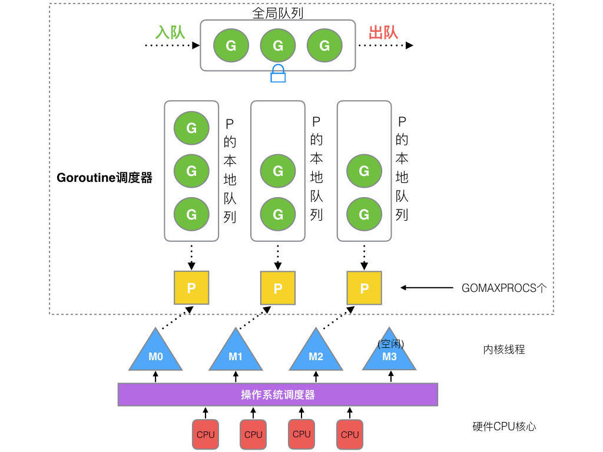
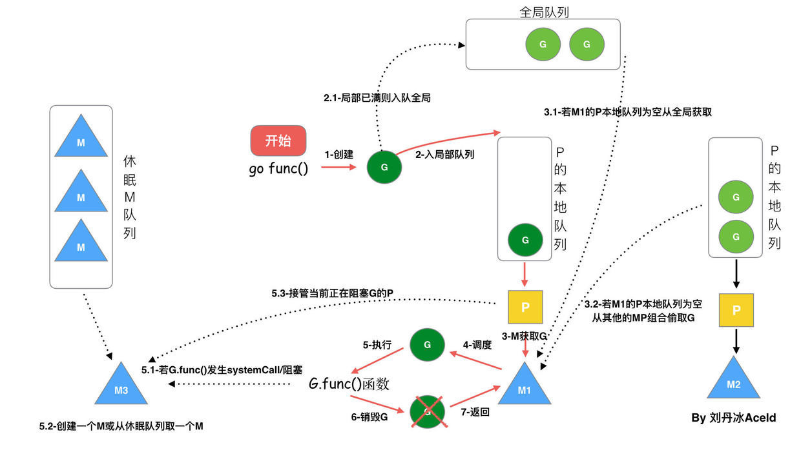

# GMP 调度模型

## 进程 & 线程 & 协程

### 进程 与 线程

进程可以理解为计算机在内存中执行的程序，是资源分配的基本单位，线程可以理解为进程中具体的执行流程，是 CPU 调度的基本单位。

在多线程的场景下，各线程会共享部分进程中的资源，单个线程仅有少部分独有的数据，包括栈、寄存器等。

在做调度时，线程仅保存独有数据，对于虚拟内存等共享数据，可以不做切换，所以其上下文切换的开销远小于进程。

### 线程实现方式

线程一般根据其实现方式，分为用户线程、内核线程和轻量级进程三种。

用户线程是基于用户态的线程管理库实现的，可以看作用户线程与内核线程是 `N:1` 的关系。线程控制块也在线程库中实现，与内核是隔离的，线程的创建、调度、终止等，均是由线程库来完成，不依赖操作系统。但是另一方面，对于内核来说，仅能感知到进程本身，所以无法对线程进行调度与管理，所以其本质上还是进程，并不能完美符合线程的定义。

内核线程存在于内核空间，可以看作用户线程与内核线程是 `1:1` 的关系。线程控制块也存在放内核空间，由操作系统直接负责，实现了“线程是 CPU 调度的基本单位”，可以充分发挥多核 CPU 的能力。但是线程的创建、调度、终止等管理操作以及上下文信息的维护，均需要在内核进行处理，系统开销大。

轻量级进程（[Light-weight proces](https://en.wikipedia.org/wiki/Light-weight_process)）是一种特殊的进程，其在单个内核线程之上的用户空间中运行，并与进程中的其他轻量级进程共享地址空间与系统资源。对于不支持线程的操作系统来说，可以通过这种方案，对现有的进程做修改，最终实现内核线程的效果。

轻量级进程与内核线程是一比一的关系，在轻量级进程之上，仍然可以使用用户线程，所以可以实现用户线程与内核线程，`N:1`、`1:1`、`M:N` 三种比例模型。在 `M:N` 的场景下，CPU 直接调度轻量级进程，而大部分用户线程的切换也均发生在用户空间，综合了 `N:1`、`1:1` 两种比例模型的优点。

此外，轻量级进程也揭露了线程与进程的本质，我们要关注的，并非是严格区分进程与线程这两种结构。而是要区分资源占用，从实质上讲，他们均是程序执行所需的信息的集合，对于线程来说，他仅有执行调度的最小信息，例如寄存器状态，而其他必要信息，例如虚拟内存地址空间，全部来源于进程本身，在线程间共享。

### 协程

操作系统中的任务处理，可以分为协作式与抢占式。

- 协作式多任务处理
  - 要求每一个任务在恰当的时间，定期放弃执行，并由系统将资源交给其他任务执行
  - 任务在执行时不受调度影响，不会被中断，完全交由任务自己控制
  - 但是同样，如果任务的设计存在缺陷，在阻塞时也不释放资源，或是本身出现问题导致无法释放资源，操作系统也没有办法进行干预，会影响整个系统

- 抢占式多任务处理
  - 指任务完全交由操作系统进行调度，按照任务的优先级、任务的状态等因素，分配或收回资源
  - 这种情况下，即使任务执行存在问题，系统会按照调度算法，将资源交由其他任务，确保其他任务正常执行
  - 但是相对应的，抢占式的调度方案，调度的时机较为频繁，没有办法完美满足各个任务的资源需求。
  - 为了准确地进行上下文切换，需要额外的维护成本与调度时的资源消耗，在各任务间，也需要通过其他方式，例如锁、信号量等，保障并发安全

协程是以协作式进行多任务处理的一种实现方案，可以在执行时，通过 `yield` 调用其他协程，使自己被挂起，当下次被调用时，从上次 `yield` 执行的地方恢复，继续执行。普通的函数也可以看作是没有执行 `yield` 逻辑的协程。根据具体的实现方式，可分为有栈协程与无栈协程两种。

有栈协程是协程需要额外保存当前的上下文信息，包括函数调用栈及寄存器等信息，在协程间调度时，通过存储的上下文信息进行恢复。这种情况其实也就是所谓的用户线程。Golang 中的 Goroutine 实现的就是有栈协程。

无栈协程在调度时，不保存调用栈等相关信息，完全通过一些状态位来控制函数流程，完全避免了上下文切换，拥有更高的性能。例如使用 `switch-case` 实现，通过静态变量，控制每次所执行的代码块。JS 中的 async/await 实现的就是无栈协程。

```c
int function(void) {
    static int i, state = 0;
    switch (state) {
        case 0: // 函数开始执行
            print("First");
            state = 1;
            return state; // yield
        case 1:
            print("Second");
            state = 0;
            return state; // yield
    }
}
```

## 调度器

Golang 最初版本实现的调度器由 GM 模型组成（协程+线程），并在不同版本支持了单线程调度、多线程调度，后续引入了处理器 P，构成了目前的 GMP 模型，并逐渐迭代，支持了工作窃取、基于协作的抢占式调度和基于信号的抢占式调度等能力。

### G & M & P

- G：Goroutine，有栈协程，也可看作是用户态线程，拥有自己的上下文空间，较为轻量（一般在 KB 级别），每个 G 可以看作是一个较为独立的任务
- M：Machine，具体执行任务的机器，是对于内核线程的封装，是 CPU 调度的基本单位，M 的数量一般略大于或等于 CPU 核心数，以便于当某个 M 被阻塞时，P 可以切换至另外一个空闲的 M
- P：Processor，实现调度逻辑的处理器，负责将 G 调度至 M 来执行，P 的数量一般与 CPU 核心数一致。P 内部维护了一个本地 G 队列，队列内相当于单线程多任务，减小锁的开销，同时系统内还维护了一个全局队列，用于全局的调度，提高整体性能。P 的数量通过 `GOMAXPROCS` 限制

整体模型如下图所示：
  
  

除了用户通过 `go` 关键字创建的 G 以外，系统内还存在一些特殊的 G：

- G0：每个 M 在创建时，会额外绑定一个 G0，不受 P 的调度。G0 拥有自己独立的栈空间，会用作系统调用以及执行运行时调度逻辑，与用户的逻辑隔离开。与 P 相比，P 提供了调度能力，但是具体的调度任务，由 G0 负责执行
- sysmon Goroutine：sysmon G 直接运行在一个特定的 M 上，不需要 P 的调度，主要是执行一些检查工作，例如检查死锁、检查其他 G 的运行时间是否过长，等待

同样，系统内部也存在一些特殊的 M，不会参与整体的调度：

- M0：Go 程序在启动时，会优先创建一个 M0 用作进程的主线程，通过与其绑定的 G0 来执行 runtime 相关逻辑，加载代码，启动 main 程序
- sysmon 线程：运行 sysmon（监控）逻辑的线程

### GMP 模型

早期的调度器，仅包含 G、M 两个数据结构，G 的队列只有全局队列，最初仅有单线程（0.x 版本），后续支持了多线程（1.0 版本）。

在调度时，主要通过锁来进行控制 G 的全局队列的读写以及 G 与 M 的调度，但是全局锁以及线程的切换会导致严重的性能浪费。

后续版本中先引入了处理器 P，P 与 M 相绑定，并由 P 来负责 G 的调度，避免 M 重复的创建与销毁。P 的内部持有一个 G 的本地队列，调度时，仅会选取本地队列中的 G 分配给 M，缓解了全局锁的问题。

### 调度策略

#### 全局队列与任务窃取（work stealing）

P 会优先将本地队列中的 G 调度至 M 执行，如果本地队列为空，M 会尝试从全局队列中获取，如果全局队列仍为空，会随机挑选另外一个 P，从它的队列中拿走一半到自己的队列中去执行。

因为 P 都会优先调度自己本地队列中的元素，所以全局队列的锁竞争问题会大大缓解。在从其他 P 的本地队列中获取 G 时，也会优先获取后一半的 G，降低锁竞争的风险。

#### 任务交接（hand off）

当 P 绑定的 M 被阻塞时，P 会与 M 解绑，并寻找其他空闲的 M 继续执行任务。

#### 基于协作的抢占式调度

GMP 模型本身仍然是基于协作式的多任务处理方式，必须依赖 G 主动让出资源才能进行下次调度。

初版的抢占式调度的工作原理，仍然是基于协作式进行，首先是在 G 中新增一个标记位，用来表示发出抢占请求，当系统监控到 G 允许时间较长（超过 10ms）或在 GC 暂停时，更新这个标记位，同时编译器在函数执行前，插入一段监控程序，用来检查这个标记位的结果，来判断是否要发生抢占。

#### 基于信号的抢占式调度

对于某些极端场景，耗时严重且不会触发函数调用的 for 循环，没有办法触发编辑器插入的检测函数，也就无法发生抢占行为。在 1.14 版本中，引入了基于信号的抢占式调度，实现了真正的抢占式多任务处理功能。

其工作原理，与操作系统的信号较为类似，在 M 初始化时，会注册一个 SIGURG 信号处理函数，在特殊时机，例如监控到某个 G 耗时超过 10ms，会给 M 发送对应的抢占信号，触发抢占操作，之后修改 G 的状态，并将 G 与 M 解绑，G 会被重新放入全局队列，M 会进行下次调度，与下一个 G 绑定并允许。

### 调度流程

通过 `go` 关键字创建一个 G 时，调度流程如下图所示：



- 当 G 创建新的 G' 时，会优先加入至 G 对应的 P 的本地队列中，如果 P 中的队列已经满了，会将队列中随机一半的 G 以及新创建的 G' 一起转移至全局队列
- 当 P 中队列为空时，为了确保新增 G 时可以立即被执行，M 会处于自旋状态，不停寻找可执行的 G，提高了任务处理效率，自旋线程的数量最多为 `GOMAXPROCS`个（即 P 的最大数量）
- 当 P 的本地队列为空时，M 会优先从全局队列获取新的 G 转移至 P 的本地队列中，一次转移的数量为 `min(len(GQ)/GOMAXPROCS + 1, len(GQ/2))`，每次转移的数量较少，保障全局的负载均衡
- 当 P 的本地队列与全局队列均为空时，M 会执行 work stealing 策略，从其他 P 的本地队列中转移尾部的一半 G 至自己对应的 P 的本地队列中

## 参考

- <https://xiaolincoding.com/os/4_process/process_base.html#%E8%BF%9B%E7%A8%8B>
- <https://en.wikipedia.org/wiki/Light-weight_process>
- <https://naoffer.com/article/detail/2837>
- <https://mthli.xyz/stackful-stackless/>
- <https://www.chiark.greenend.org.uk/~sgtatham/coroutines.html>
- <https://draveness.me/golang/docs/part3-runtime/ch06-concurrency/golang-goroutine/>
- <https://learnku.com/articles/41728>
- <https://haobin.work/2023/06/05/go/%E4%BB%8E%E8%BF%9B%E7%A8%8B%E5%BC%80%E5%A7%8B%E4%BA%86%E8%A7%A3GMP%E6%A8%A1%E5%9E%8B/>
