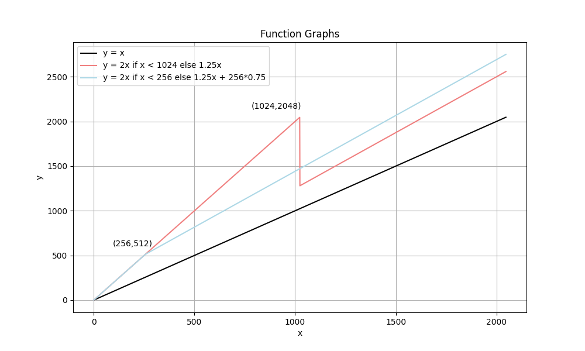
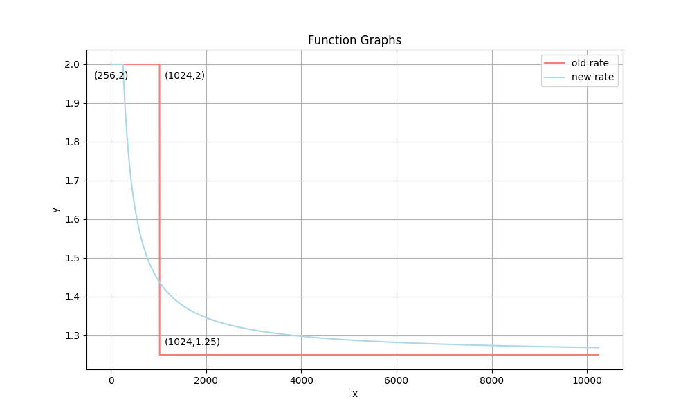

# 数组和切片

## 数组(Array)

数组是一种常见的容器类型，由一组相同类型的元素，有序排列构成。系统会为数组分配一块连续的内存，可直接通过索引访问特定元素。

数组类型由元素类型加容器大小共同确定，所以在编译期，就必须确定具体的元素类型和容器大小，前者仍然支持 `any` 等接口，后者则必须使用常量来进行声明。编译期数据结构 [Array](https://github.com/golang/go/blob/go1.22.0/src/cmd/compile/internal/types/type.go#L418) 如下所示：

```go
type Array struct {
    Elem  *Type // element type
    Bound int64 // number of elements; <0 if unknown yet
}
```

当数组的元素类型不同或是长度不同，均被认为是不同类型：

```go
var a1 [1]int
var a2 [2]int
fmt.Println(reflect.TypeOf(a1)) // "[1]int"
fmt.Println(reflect.TypeOf(a2)) // "[2]int"
fmt.Println(reflect.TypeOf(a1) == reflect.TypeOf(a2)) // "false"
```

当需要使用二维或多维数组时，例如矩阵，可通过数组嵌套的方式来进行实现：

```go
var a [2][2]int = [2][2]int{{0, 1}, {2, 3}}
fmt.Println("a[0][1]: ", a[0][1]) // "a[0][1]: 1"
fmt.Println("a[1][0]: ", a[1][0]) // "a[1][0]: 2"
```

### 初始化

默认情况下，数组中的每个元素会被初始化为对应的零值，整数类型为 0，指针类型为 nil，等等。同时，我们也可以使用字面量来初始化数组：

```go
a := [3]int{1, 2}
fmt.Println(a) // "[1 2 0]"
```

在初始化时，也可以使用省略号 `...` 让编译器来推导数组长度：

```go
a := [...]int{1, 2}
fmt.Println(a) // "[1 2]"
```

数组默认会按照字面量中的元素顺序进行赋值，必要的情况下，我们也可以手动指定元素及其索引：

```go
a1 := [5]int{1, 2: 3, 4}
fmt.Println(a1) // "[1 0 3 4 0]"
a2 := [...]int{2: 3, 4}
fmt.Println(a2) // "[0 0 3 4]"
```

所有未指定索引的元素，会默认排列在前一个元素后面，例如元素 `3` 的索引手动指定为 `2`，此时紧跟着的元素 `4` 的索引默认为 `3`。当然，第一个元素若没有指定索引，则默认为索引 `0`。而 `...` 在这种场景下，也同样适用，会自动推导数组长度，对未指定的元素赋值为零值。

### 访问

数组中的元素可以通过下标进行访问，内置的 `len()` 函数将返回数组中的元素个数，通过下标 `n` 访问数组 `a` 时，必须注意索引范围，即 `a[n]` 必须满足 $0 \leq n < len(array)$：

```go
a := [3]int{1, 2, 3}
fmt.Println(len(a))         // "3"
fmt.Println(a[0])           // "1"
fmt.Println(a[len(a)-1])    // "3"
fmt.Println(a[-1])          // compile error
fmt.Println(a[len(a)])      // compile error
```

还支持通过 `for range` 进行遍历处理：

```go
a := [3]int{1, 2: 3}
// "0 1"
// "1 0"
// "2 3"
for index, value := range a {
    fmt.Println(index, value)
}
```

### 运算

当数组类型相同（数组长度一致且元素类型相同）且数组中的元素支持比较时，数组也可以通过 `==` 和 `!=` 进行比较，当且仅当数组中的所有元素均相等时，两个数组相等：

```go
a := [2]int{1, 2}
b := [...]int{1, 2}
c := [2]int{1, 3}
fmt.Println(a == b, a == c, b == c) // "true false false"

d := [2]int64{1,2}
fmt.Println(a == d) // compile error
```

## 切片(Slice)

切片同样是由一组相同类型的元素有序构成，与数组类似，但是支持变长，我们可以自由的向切片中添加元素。

切片在语法上与数组类似，但是其长度不是固定的，因此在编译期，和数组相比，仅指定其元素类型即可。编译期数据结构 [Slice](https://github.com/golang/go/blob/go1.22.0/src/cmd/compile/internal/types/type.go#L424) 如下所示：

```go
type Slice struct {
    Elem *Type // element type
}
```

在运行时，切片底层会持有一个数组指针，来进行真正的数据存储。因此，切片可以看作是对于数组的封装，支持同样的访问操作。运行时数据结构 [slice](https://github.com/golang/go/blob/go1.22.0/src/runtime/slice.go#L15) 如下所示：

```go
type slice struct {
    array unsafe.Pointer
    len   int
    cap   int
}
```

结构体中的另外两个字段，`len` 和 `cap`，分别代表当前切片中的元素数量以及当前切片的最大容量，可以通过内置的 `len()` 函数和 `cap()` 函数获取相关数据。如下所示：将数组 `a` 的子序列 `a[2:4]` 转为子序列

```go
s := make([]int, 3, 5)
s[1] = 1
fmt.Println(s, len(s), cap(s)) // "[0 1 0] 3 5"
```

### 初始化

#### 通过数组/切片下标进行初始化

通过这种方式进行初始化，会创建一个指向对应数组，或切片底层数组的新的切片，是最符合切片定义的一种方式（从指定序列中切出一个子序列），也是创建切片的最底层的方式。此时切片中各属性的赋值逻辑如下：

- 元素类型：与指定数组/切片保持一致

- 数组指针：切片底层数组的首地址
  - 可以认为是创建切片时，所选择的子序列的首地址
  - 即代码中 `a[2]`、`a[3]` 的地址
  - 从同一个底层数组上创建多个切片时，底层数组是共享的，不会触发额外的内存分配

- 切片长度：切片实际包含的元素数量
  - 可以认为是创建切片时，所选择的元素数量
  - 即代码 `a[2:5]`、`s1[1:2]` 中的元素数量，遵循左闭右开规则

- 切片容量：切片最大可以存放的元素数量，即引用的数组的长度
  - 可以认为创建切片时，所引用的数组的首位，直至该数组的最后一位的长度
  - 对于 `a` 而言，长度一共是 10 位，对于 `s1` 而言，底层数组从 `a[2]` 开始，目前切片内的元素数量仅有 `a[2]`、`a[3]`、`a[4]` 三位，但是从 `a[5]` 至 `a[9]`，仍是该数组的一部分，`s1` 在添加元素时，仍然可以安全的修改其中的数据，而不需要重新分配一片数组内存。

```go
a := [...]int{1, 2, 3, 4, 5, 6, 7, 8, 9, 0}

s1 := a[2:5]
fmt.Println(&a[2])                // "0xc0000122e0"
fmt.Println(unsafe.SliceData(s1)) // "0xc0000122e0"
fmt.Println(s1, len(s1), cap(s1)) // "[3 4 5] 3 8"

s2 := s1[1:2]
fmt.Println(&a[3])                // "0xc0000122e8"
fmt.Println(unsafe.SliceData(s2)) // "0xc0000122e8"
fmt.Println(s2, len(s2), cap(s2)) // "[4] 1 7"
```

通过下标进行初始化时，也可以手动指定切片容量，在如下代码中，切片从 `a[2]` 开始，元素截止到 `a[5]`(不包含 `a[5]`)，容量截止到 `a[6]`(不包含 `a[6]`)，当未特殊指定容量时，默认为目标数组/切片的长度：

```go
a := [...]int{1, 2, 3, 4, 5, 6, 7, 8, 9, 0}
s1 := a[2:5:6]
fmt.Println(s1, len(s1), cap(s1)) // "[3 4 5] 3 4"
```

#### 字面量初始化

因为切片底层依赖于数组来真正存放数据，所以通过字面量这种方式进行初始化时，在底层仍然会先创建一个包含指定元素的数组，再通过下标进行初始化：

```go
s := []int{1, 2, 3}

// 底层逻辑等价于
a := [...]int{1, 2, 3}
s := a[:]
```

编译期详细处理方式可参考 [slicelit()](https://github.com/golang/go/blob/go1.22.0/src/cmd/compile/internal/walk/complit.go#L288) 函数。

#### `make()` 函数初始化

对于 `make()` 函数同理，底层会构建一个符合容量条件的数组，再通过下标的方式创建切片，并指定切片的真实长度：

```go
s := make([]int, 3, 5)

// 底层逻辑等价于
var a [5]int
s := a[:3]
```

### 零值

切片的零值是 `nil`，但是某些场景下，我们可能会得到一个空切片。对于两者的大部分操作，结果是相同的，例如默认的打印结果，获取切片的长度和容量，向切片中添加新的元素，等等。

```go
var nilSlice []string
fmt.Println(nilSlice)                         // "[]"
fmt.Println(len(nilSlice), cap(nilSlice))     // "0 0"
nilSlice = append(nilSlice, "nil")
fmt.Println(nilSlice)                         // "[nil]"

emptySlice := make([]string, 0)
fmt.Println(emptySlice)                       // "[]"
fmt.Println(len(emptySlice), cap(emptySlice)) // "0 0"
emptySlice = append(emptySlice, "empty")
fmt.Println(emptySlice)                       // "[empty]"
```

但是仍然需要注意的是，`nil` 是真正的零值，空切片并非零值，而是一个没有元素，但是已经被初始化的切片，当两者进行判等时，结果是不同的。上述的操作结果，仅仅是系统做了兼容处理。此外，当打印底层数组时，也可以发现空切片其实是正常持有数组的，完成了初始化操作。

```go
var nilSlice []string
fmt.Println(nilSlice == nil)                  // "true"
fmt.Println(unsafe.SliceData(nilSlice))       // "<nil>"

emptySlice := make([]string, 0)
fmt.Println(emptySlice == nil)                // "false"
fmt.Println(unsafe.SliceData(emptySlice))     // "0xcc32e0"
```

在绝大部分情况下，我们只是关注切片内是否含有元素，并不需要严格对 `nil` 和空切片进行区分，使用 `len()` 函数足够满足日常使用，也不需要使用 `s == nil` 刻意进行判断。但是在 JSON Encode 处理和 `reflect` 包中的 [DeepEqual()](https://github.com/golang/go/blob/go1.22.0/src/reflect/deepequal.go#L229) 判断中，两者仍会因为是否被初始化而结果不同：

```go
var nilSlice []string
emptySlice := make([]string, 0)

res1, _ := json.Marshal(nilSlice)
res2, _ := json.Marshal(emptySlice)

fmt.Println(string(res1)) // "null"
fmt.Println(string(res2)) // "[]"

// Slice values are deeply equal when all of the following are true:
// they are both nil or both non-nil, they have the same length,
// and either they point to the same initial entry of the same underlying array
// (that is, &x[0] == &y[0]) or their corresponding elements (up to length) are deeply equal.
// Note that a non-nil empty slice and a nil slice (for example, []byte{} and []byte(nil))
// are not deeply equal.
fmt.Println(reflect.DeepEqual(nilSlice, emptySlice)) // "false"
```

### 添加元素

通过 [append()](https://github.com/golang/go/blob/go1.22.0/src/builtin/builtin.go#L149) 函数，可以向切片内新增新的元素。`append()` 函数内部逻辑也比较符合直觉，综合判断当前切片的元素数量 `len` 与最大容量 `cap`，如果仍有足够的容量，则修改底层数组中的值，并重新进行切片。如果容量不够，则触发扩容逻辑，构造一个足够大的新的数组，来容纳原有元素以及新添加的元素。

```go
// The append built-in function appends elements to the end of a slice. If
// it has sufficient capacity, the destination is resliced to accommodate the
// new elements. If it does not, a new underlying array will be allocated.
// Append returns the updated slice. It is therefore necessary to store the
// result of append, often in the variable holding the slice itself:
//
//  slice = append(slice, elem1, elem2)
//  slice = append(slice, anotherSlice...)
//
// As a special case, it is legal to append a string to a byte slice, like this:
//
//  slice = append([]byte("hello "), "world"...)
func append(slice []Type, elems ...Type) []Type
```

值得注意的是，`append()` 是否触发了扩容操作，用户是不感知的，不能确认扩容后的切片与原切片是否一致，同样，也无法确认修改新的切片，是否会对老的切片产生影响。因此通常的做法是将 `append()` 的返回值直接赋值给原本的切片变量，直接丢弃旧的切片。

### 扩容

当切片容量不足，需要进行扩容时，最终会调用 [growslice()](https://github.com/golang/go/blob/go1.22.0/src/runtime/slice.go#L155) 函数来执行扩容操作，为切片分配一个新创建的、足以容纳所要新增所有元素的数组，并在此基础上做一些内存对齐的优化处理，然后将原本的元素以及要新增的元素添加至数组中，最终得到一个符合要求的新切片。

#### 容量计算

对于切片新的容量，从内存成本开销最小来说，肯定需要多少，就分配多少。但是这种情况下，下次新增元素就必然还会触发扩容操作，故需要综合考虑当前所需长度大小以及未来可能新增元素数量来设计容量增长模型，计算出较为合适的容量。

在 `go1.18` 以及之后得到版本中，容量计算函数 [nextslicecap()](https://github.com/golang/go/blob/go1.22.0/src/runtime/slice.go#L267) 逻辑如下所示：

- 如果所需长度超过当前容量两倍，必然超过容量增长模型的最大值，直接返回所需长度
- 如果当前容量小于阈值 256，返回当前容量的两倍
- 如果当前容量大于阈值 256，则会循环进行扩容计算，新容量每次增加 $\frac{1}{4}$ 以及阈值的 $\frac{3}{4}$，直至满足所需长度，最终返回新容量
- 如果当前容量大于阈值 256，且多次扩容后，新容量发生了溢出，则返回所需长度

```go
func growslice(oldPtr unsafe.Pointer, newLen, oldCap, num int, et *_type) slice {
    ...
    oldLen := newLen - num
    newcap := nextslicecap(newLen, oldCap)
    ...
}

// nextslicecap computes the next appropriate slice length.
func nextslicecap(newLen, oldCap int) int {
    newcap := oldCap
    doublecap := newcap + newcap
    if newLen > doublecap {
        return newLen
    }

    const threshold = 256
    if oldCap < threshold {
        return doublecap
    }
    for {
        newcap += (newcap + 3*threshold) >> 2
        // We need to check `newcap >= newLen` and whether `newcap` overflowed.
        // newLen is guaranteed to be larger than zero, hence
        // when newcap overflows then `uint(newcap) > uint(newLen)`.
        // This allows to check for both with the same comparison.
        if uint(newcap) >= uint(newLen) {
            break
        }
    }

    if newcap <= 0 {
        return newLen
    }
    return newcap
}
```

在旧版本中，容量增长模型存在一定差异，容量计算逻辑在函数 [growslice()](https://github.com/golang/go/blob/go1.17/src/runtime/slice.go#L162) 中，具体差异如下所示：

- 旧容量翻倍触发的阈值为 1024，而非 256
- 旧容量超过阈值进行扩容时，每次均增长 $\frac{1}{4}$

```go
func growslice(et *_type, old slice, cap int) slice {
    ...
    newcap := old.cap
    doublecap := newcap + newcap
    if cap > doublecap {
        newcap = cap
    } else {
        if old.cap < 1024 {
            newcap = doublecap
        } else {
            for 0 < newcap && newcap < cap {
                newcap += newcap / 4
            }
            // Set newcap to the requested cap when
            // the newcap calculation overflowed.
            if newcap <= 0 {
                newcap = cap
            }
        }
    }
    ...
}
```

关于容量增长模型的具体改动，也可参考 [commit](https://github.com/golang/go/commit/2dda92ff6f9f07eeb110ecbf0fc2d7a0ddd27f9d) 的注释，总的来说是让切片容量增长的更加平滑：

- 旧版本的增长曲线，会有突变的点存在，如下图中当 `x=1024` 时，旧版本即红色的曲线会突变至低点，而新版本曲线则始终在增长



- 旧版本的容量的增长倍率，同样也在 `x=1024` 处发生突变，而新版本则在 `x=256` 处缓慢开始减少，直至最终逼近于 1.25 倍



#### 内存对齐

CPU 从内存中读取数据时，每次都会按照固定大小读取，每次读取 2 字节、4字节、8 字节，等等。在 Golang 中，默认是按照 8 字节来进行对齐。例如，如果一个元素占用了 9 字节，那么在内存分配时，会向上取值，直接分配 16 字节来进行内存对齐。[roundupsize()](https://github.com/golang/go/blob/go1.22.0/src/runtime/msize_allocheaders.go#L16) 函数逻辑如下所示：

- 对于小对象，最终按照预先定义的内存表([sizeclasses.go](https://github.com/golang/go/blob/go1.22.0/src/runtime/sizeclasses.go))返回对齐后的数据
- 对于大对象，则按照页面大小向上对齐

```go
// Returns size of the memory block that mallocgc will allocate if you ask for the size,
// minus any inline space for metadata.
func roundupsize(size uintptr, noscan bool) (reqSize uintptr) {
    reqSize = size
    if reqSize <= maxSmallSize-mallocHeaderSize {
        // Small object.
        if !noscan && reqSize > minSizeForMallocHeader { // !noscan && !heapBitsInSpan(reqSize)
            reqSize += mallocHeaderSize
        }
        // (reqSize - size) is either mallocHeaderSize or 0. We need to subtract mallocHeaderSize
        // from the result if we have one, since mallocgc will add it back in.
        if reqSize <= smallSizeMax-8 {
            return uintptr(class_to_size[size_to_class8[divRoundUp(reqSize, smallSizeDiv)]]) - (reqSize - size)
        }
        return uintptr(class_to_size[size_to_class128[divRoundUp(reqSize-smallSizeMax, largeSizeDiv)]]) - (reqSize - size)
    }
    // Large object. Align reqSize up to the next page. Check for overflow.
    reqSize += pageSize - 1
    if reqSize < size {
        return size
    }
    return reqSize &^ (pageSize - 1)
}
```

在确认新切片所需容量后，会按照此刻的容量，计算所需内存，并进行内存对齐，最终所分配的大小可能会超过所确认的容量大小，此时会重新按照新的内存计算出最终容量。

对于特殊的元素类型所需要的字节数，还会做一些优化处理：

- 单字节元素会忽略对于元素所需内存的操作
- 与指针大小相同的元素，编译器会自动将乘法、除法优化为位运算，例如将 `x := y * goarch.PtrSize` 优化为 `x := y << 3`
- 大小为 2 的幂次的情况下，手动计算所需位移的大小，并通过位移来优化乘法、除法

```go
func growslice(oldPtr unsafe.Pointer, newLen, oldCap, num int, et *_type) slice {
    ...
    var overflow bool
    var lenmem, newlenmem, capmem uintptr
    // Specialize for common values of et.Size.
    // For 1 we don't need any division/multiplication.
    // For goarch.PtrSize, compiler will optimize division/multiplication into a shift by a constant.
    // For powers of 2, use a variable shift.
    noscan := !et.Pointers()
    switch {
    case et.Size_ == 1:
        lenmem = uintptr(oldLen)
        newlenmem = uintptr(newLen)
        capmem = roundupsize(uintptr(newcap), noscan)
        overflow = uintptr(newcap) > maxAlloc
        newcap = int(capmem)
    case et.Size_ == goarch.PtrSize:
        lenmem = uintptr(oldLen) * goarch.PtrSize
        newlenmem = uintptr(newLen) * goarch.PtrSize
        capmem = roundupsize(uintptr(newcap)*goarch.PtrSize, noscan)
        overflow = uintptr(newcap) > maxAlloc/goarch.PtrSize
        newcap = int(capmem / goarch.PtrSize)
    case isPowerOfTwo(et.Size_):
        var shift uintptr
        if goarch.PtrSize == 8 {
            // Mask shift for better code generation.
            shift = uintptr(sys.TrailingZeros64(uint64(et.Size_))) & 63
        } else {
            shift = uintptr(sys.TrailingZeros32(uint32(et.Size_))) & 31
        }
        lenmem = uintptr(oldLen) << shift
        newlenmem = uintptr(newLen) << shift
        capmem = roundupsize(uintptr(newcap)<<shift, noscan)
        overflow = uintptr(newcap) > (maxAlloc >> shift)
        newcap = int(capmem >> shift)
        capmem = uintptr(newcap) << shift
    default:
        lenmem = uintptr(oldLen) * et.Size_
        newlenmem = uintptr(newLen) * et.Size_
        capmem, overflow = math.MulUintptr(et.Size_, uintptr(newcap))
        capmem = roundupsize(capmem, noscan)
        newcap = int(capmem / et.Size_)
        capmem = uintptr(newcap) * et.Size_
    }
    ...
}
```

#### 初始化

在经过容量计算与内存对齐后，最终确认了切片容量，此时初始化一个满足容量条件的新的数组：

- 如果元素类型不包含指针，则在分配内存时，不做类型特殊处理，并仅将数组中剩余容量的元素清零，其他部分元素会被正常覆盖
- 如果元素类型包含指针，则在分配内存时，需要指定元素类型，并预先清零处理，在开启 `writeBarrier` 时，还会设置下 GC 的标记位，确保旧指针数据不会受到 GC 影响。
- 最终将旧的切片数据复制到新的数据中

```go
func growslice(oldPtr unsafe.Pointer, newLen, oldCap, num int, et *_type) slice {
    ...
    var p unsafe.Pointer
    if !et.Pointers() {
        p = mallocgc(capmem, nil, false)
        memclrNoHeapPointers(add(p, newlenmem), capmem-newlenmem)
    } else {
        p = mallocgc(capmem, et, true)
        if lenmem > 0 && writeBarrier.enabled {
            bulkBarrierPreWriteSrcOnly(uintptr(p), uintptr(oldPtr), lenmem-et.Size_+et.PtrBytes, et)
        }
    }
    memmove(p, oldPtr, lenmem)

    return slice{p, newLen, newcap}
}
```

在上述所有流程执行完毕后，会返回一个扩容后的、包含了旧切片所有元素的新的切片，原 `append()` 函数正常执行赋值逻辑即可。

### 拷贝

在使用内置函数进行切片拷贝时，会调用到 [skucecopy()](https://github.com/golang/go/blob/go1.22.0/src/runtime/slice.go#L325) 函数进行处理，函数内部对切片长度做了安全判断，将一个长度较大的切片，拷贝至长度较小的切片时，最终进行拷贝时，会以较小的值为基准进行操作，即使小切片的容量足够大，也仅会按照实际元素含量进行处理，自然也不会触发扩容相关操作。

```go
// slicecopy is used to copy from a string or slice of pointerless elements into a slice.
func slicecopy(toPtr unsafe.Pointer, toLen int, fromPtr unsafe.Pointer, fromLen int, width uintptr) int {
    if fromLen == 0 || toLen == 0 {
        return 0
    }

    n := fromLen
    if toLen < n {
        n = toLen
    }

    size := uintptr(n) * width

    if size == 1 { // common case worth about 2x to do here
        // TODO: is this still worth it with new memmove impl?
        *(*byte)(toPtr) = *(*byte)(fromPtr) // known to be a byte pointer
    } else {
        memmove(toPtr, fromPtr, size)
    }
    return n
}
```

例如，将含有 5 个元素的切片 `s1` 拷贝至长度为 3、容量为 5 的切片 `s2` 时，最终拷贝后的切片 `s2` 也仅包含 `s1` 前三个元素：

```go
s1 := []int{1, 2, 3, 4, 5}
s2 := make([]int, 3, 5)
copy(s2, s1)
fmt.Println(s2) // "[1 2 3]"
```

## Ref

- <https://draveness.me/golang/docs/part2-foundation/ch03-datastructure/golang-array-and-slice/>
- <https://godeamon.com/post/go-slice-growth/>
