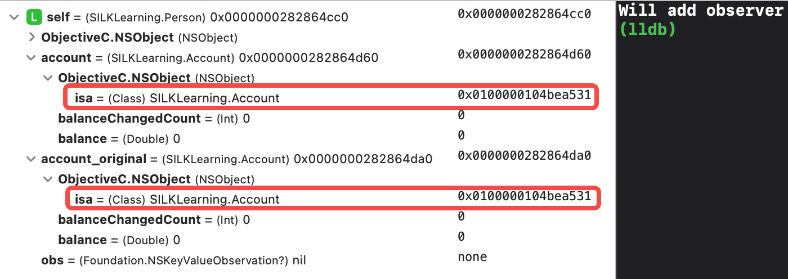
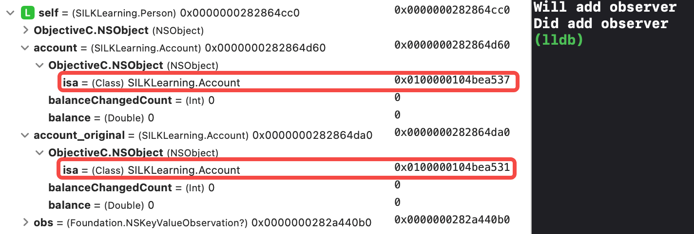
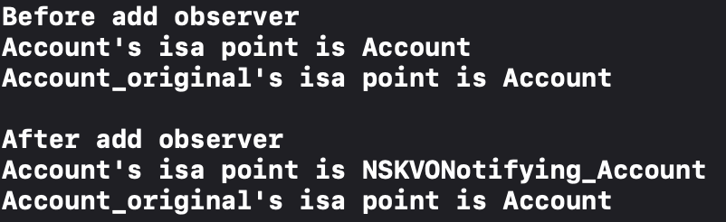
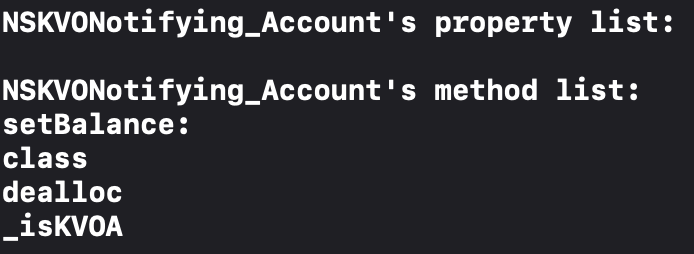
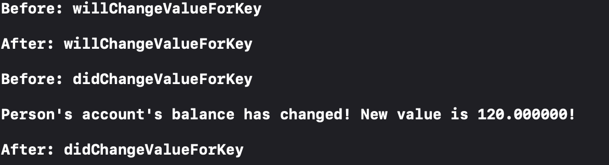
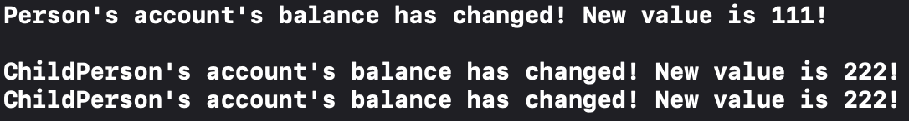
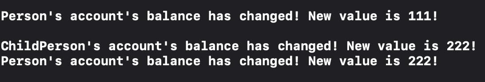
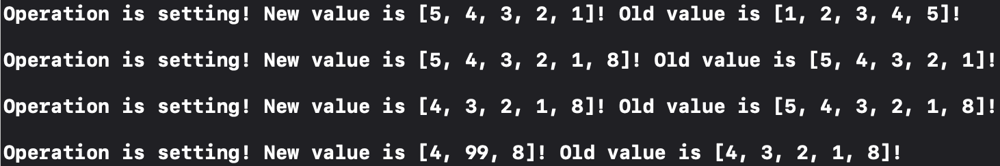
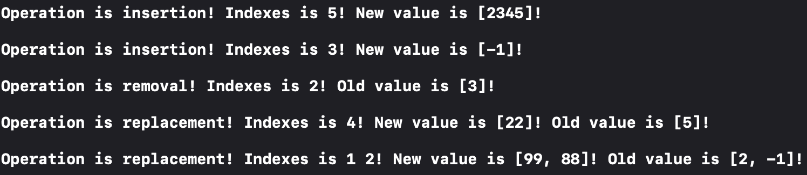
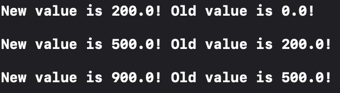

# Key Value Observing

## 初窥门径（简单介绍）

### 观察者模式

> [Introduction to Key-Value Observing Programming Guide](<https://developer.apple.com/library/archive/documentation/Cocoa/Conceptual/KeyValueObserving/KeyValueObserving.html>)

`KVO` (Key Value Observing) 是一种观察者模式，当被观察者的特定的属性改变时，会通知到观察者。

例如现在有两个实例，`person` 和 `account`，`person` 想要知道自己账户的余额是否发生改变:

- 一种简单的方案就是去轮询 `account` 的 `balance` 属性的目前值，观察是否和之前的结果仍然一致。就类似于别人给我们的银行卡转账会延迟到账，我们时不时就去看余额有没有变化；
- 另一种方案则是使用 `KVO` ，我们给 `account` 实例添加一个观察者 `person`，并添加对于 `balance` 属性的监听，那么当该属性发生改变时，`account` 就会给所有的观察者发送通知。类似于银行提供的短信通知功能，当我们订阅了这项服务时，每当银行卡余额发生改变，就会收到对应的短信通知。

### 使用方式

1. 首先要确保想要观察的属性，遵循 `KVO Compliance`，一般情况下，我们在 OC 中创建的对象，都是遵循这个要求的；
2. 然后需要针对想要观察的实例及属性，注册观察者；
3. 其次需要在观察者中，实现属性改变通知的接收方法；
4. 当不再需要监听属性改变时，需要手动注销观察者。

- OC 代码实现
  
    ```Objective-c
    @implementation Person

    - (instancetype)init {
        if (self = [super init]) {
            self.account = [Account new];
            [self.account addObserver:self 
                           forKeyPath:@"balance"
                              options:NSKeyValueObservingOptionNew
                              context:nil];
        }
        return self;
    }

    - (void)observeValueForKeyPath:(NSString *)keyPath
                          ofObject:(id)object
                            change:(NSDictionary<NSString *,id> *)change
                           context:(void *)context {
        if ([keyPath isEqualToString:@"balance"]) {
            NSNumber *newValue = [change valueForKey:NSKeyValueChangeNewKey];
            NSLog(@"Person's account's balance has changed! New value is %@!", newValue);
        } else {
            [super observeValueForKeyPath:keyPath ofObject:object change:change context:context];
        }
    }

    - (void)dealloc {
        [self.account removeObserver:self 
                          forKeyPath:@"balance" 
                             context:nil];
    }

    @end
    ```

- Swift 代码实现一
  
    ```Swift
    class Person: NSObject {
        var account: Account
        
        override init() {
            self.account = Account()
            super.init()
            self.account.addObserver(self, 
                                     forKeyPath: #keyPath(Account.balance), 
                                     options: .new, 
                                     context: nil)
        }
        
        override func observeValue(forKeyPath keyPath: String?, 
                                   of object: Any?, 
                                   change: [NSKeyValueChangeKey : Any]?, 
                                   context: UnsafeMutableRawPointer?) {
            if keyPath == #keyPath(Account.balance) {
                guard let change = change,
                    let newValue = change[.newKey] else {
                    return
                }
                print("Person's account's balance has changed! New value is \(newValue)!")
            } else {
                super.observeValue(forKeyPath: keyPath, of: object, change: change, context: context)
            }
        }
        
        deinit {
            self.account.removeObserver(self, forKeyPath: #keyPath(Account.balance), context: nil)
        }
    }
    ```

- Swift 代码实现二
  
    ```Swift
    class Person: NSObject {
        var account: Account
        var obs: NSKeyValueObservation?

        override init() {
            account = Account()
            super.init()
            obs = account.observe(\.balance, options: .new) { account, change in
                guard let newValue = change.newValue else {
                    return
                }
                print("Person's account's balance has changed! New value is \(newValue)!")
            } else {
                super.observeValue(forKeyPath: keyPath, of: object, change: change, context: context)
            }
        }
        
        deinit {
            obs = nil
        }
    }
    ```

## 曲径通幽（详细分析）

### KVO Compliance

> [KVO Compliance](<https://developer.apple.com/library/archive/documentation/Cocoa/Conceptual/KeyValueObserving/Articles/KVOCompliance.html#//apple_ref/doc/uid/20002178-BAJEAIEE>)
> In order to be considered KVO-compliant for a specific property, a class must ensure the following:
>
> - The class must be key-value coding compliant for the property, as specified in Ensuring KVC Compliance.
>   KVO supports the same data types as KVC, including Objective-C objects and the scalars and structures listed in Scalar and Structure Support.
> - The class emits KVO change notifications for the property.
> - Dependent keys are registered appropriately (see Registering Dependent Keys).

从文档可以看出，想要使用 `KVO`，需要前置满足三个条件：

- 第一点，被观察的类的属性，必须满足 `KVC`。`KVC` 是由 `NSKeyValueCoding` 定义的一种机制，可以通过字符串来对类中特定属性的进行存取，`KVO` 的实现最终会通过 `KVC` 来实现：

    ```swift
    func value(forKey key: String) -> Any?
    func setValue(_ value: Any?, forKey key: String)

    func value(forKeyPath keyPath: String) -> Any?
    func setValue(_ value: Any?, forKeyPath keyPath: String)
    ```

- 第二点，被观察的类必须可以发出 `KVO` 通知，如果是继承的 `NSObject`，一般情况下这一点默认是支持的。
- 第三点，对于存在依赖关系的属性，例如计算属性，通常情况下都是其他存储属性通过一些运算得到的，此时如果按照以往的方法，只观察计算属性就会存在问题，因为实际被修改的是相关联的存储属性，计算属性本身不会被显示的修改，这种场景下必须恰当地注册依赖关系。

### 触发方式

#### 自动触发

对于 `KVO` 的自动触发， `NSObject` 的子类已经有了默认实现，一般场景下，不太需要我们额外关注，只需要正常修改即可：

```swift
account.balance = 100.0
account.setValue(100.0, forKey: "balance")
account.setValue(100.0, forKeyPath: #keyPath(Account.balance))
person.account[keyPath: \Account.balance] = 100.0
```

#### 手动触发

同时，我们也可以通过一些配置，来完全自定义 `KVO` 的通知逻辑：

- 通过 `willChangeValue(forKey:)` 与 `didChangeValue(forKey:)` 可以实现手动通知，例如我们需要对 `setter` 方法做一些处理，减少通知频率：

    ```Swift
    func setBalance(_ theBalance: Double) -> Bool {
        guard theBalance != balance else {
            return false
        }
        
        willChangeValue(forKey: #keyPath(Account.balance))
        balance = theBalance
        didChangeValue(forKey: #keyPath(Account.balance))
        return true
    }
    ```

- 自动触发与手动触发，并非是完全冲突的，不过我们也可以通过重写 `automaticallyNotifiesObservers(forKey:)` 来手动禁止通知：

    ```Swift
    override class func automaticallyNotifiesObservers(forKey key: String) -> Bool {
        if key == #keyPath(Account.balance) {
            return false
        }
        return super.automaticallyNotifiesObservers(forKey: key)
    }
    ```

- 针对于相关联的属性，可以通过手动触发多次 `KVO` 来一起进行通知：

    ```Swift
    func setBalance(_ theBalance: Double) -> Bool {
        guard theBalance != balance else {
            return false
        }
        
        willChangeValue(forKey: #keyPath(Account.balance))
        willChangeValue(forKey: #keyPath(Account.balanceChangedCount))
        balance = theBalance
        balanceChangedCount += 1
        didChangeValue(forKey: #keyPath(Account.balance))
        didChangeValue(forKey: #keyPath(Account.balanceChangedCount))
        return true
    }
    ```

### 原理分析

> [Key-Value Observing Implementation Details](<https://developer.apple.com/library/archive/documentation/Cocoa/Conceptual/KeyValueObserving/Articles/KVOImplementation.html#//apple_ref/doc/uid/20002307-BAJEAIEE>)

关于实现细节这里，苹果的文档有指出是通过 `isa-swizzling` 这种技术实现的，当有观察关系被注册了之后，被观察者的 `isa` 指针会被修改指向一个中间类。

同时，结合我们上面手动触发 `KVO` 通知的实现，可以得到一个猜想假设：

- 当 A 类注册了对于 B 类的一个属性的观察行为后，系统会将 B 类的 `isa` 指针修改为一个中间类 C；
- 在 C 中，系统会通过调用 `willChangeValue(forKey:)` 与 `didChangeValue(forKey:)` 方法，类似于我们上述手动触发的方式来触发 `KVO` 通知。
  
#### ISA 指针验证

出于验证考虑，我们创建两个 `account` 属性，并只对其中一个使用 `KVO` 机制，另外一个 `account_original` 属性保持不变：

```Swift
account = Account()
account_original = Account()
super.init()
obs = account.observe(\.balance, options: .new, changeHandler: { account, change in
    guard let newValue = change.newValue else {
        return
    }
    print("Person's account's balance has changed! New value is \(newValue)!")
})
```

在 Swift 中，添加 `KVO` 前两个属性的 `isa` 指针均正常指向 `Account` 类，地址均为`0x0100000104bea531`：
    <div align=center></div>

在添加了 `KVO` 之后，两个属性的 `isa` 指针均指向`Account`，但是添加了 `KVO` 的 `account` 属性，指针已经被修改为 `0x0100000104bea537`，而没有添加 `KVO` 的 `account_original` 属性，指针保持不变。
    <div align=center></div>

在 OC 中，我们同样按照上面的方案来测试：

```Objective-C
self.account = [Account new];
self.account_original = [Account new];

printf("\nBefore add observer\n");
printf("Account's isa point is %s \n", 
       NSStringFromClass(object_getClass(self.account)).UTF8String);
printf("Account_original's isa point is %s \n",  
       NSStringFromClass(object_getClass(self.account_original)).UTF8String);

[self.account addObserver:self 
               forKeyPath:@"balance"
                  options:NSKeyValueObservingOptionNew
                  context:nil];

printf("\nAfter add observer\n");
printf("Account's isa point is %s \n",  
       NSStringFromClass(object_getClass(self.account)).UTF8String);
printf("Account_original's isa point is %s \n",  
       NSStringFromClass(object_getClass(self.account_original)).UTF8String);
```

可以更直观的看到添加 `KVO` 之后，`isa` 指针会被修改为一个全新的类 `NSKVONotifying_Account`：
    <div align=center></div>

#### Setter 方法验证

在 OC 代码中，我们看到了比较多的实现细节，比如系统会为被观察的对象创建一个名为 `NSKVONotifying_xxx` 的中间类，此时我们打印下这个类的内部信息：

```Objective-C
printf("\n%s's property list: \n",  NSStringFromClass(object_getClass(self.account)).UTF8String);
unsigned int propertyCount;
objc_property_t *properties = class_copyPropertyList(object_getClass(self.account), &propertyCount);
for (int i = 0; i < propertyCount; i++) {
    printf("%s\n", property_getName(properties[i]));
}

printf("\n%s's method list: \n",  NSStringFromClass(object_getClass(self.account)).UTF8String);
unsigned int methodCount;
Method *methods = class_copyMethodList(object_getClass(self.account), &methodCount);
for (int i = 0 ; i < methodCount; i++) {
    printf("%s\n", NSStringFromSelector(method_getName(methods[i])).UTF8String);
}
```

结果如下：
    <div align=center></div>

可以看到，这个类的重点内容在于方法列表，结合方法命名，能够得到对方法实现的一些简单猜想：

- setBalance：针对于添加观察的属性的 setter 方法，具体实现和上述手动触发 `KVO` 的逻辑基本一致；
- class：重写 class 方法，最终返回被观察的类，对使用方隐藏中间类；
- dealloc: 在使用方移除 `KVO` 相关逻辑时，还原 `isa` 指针等修改内容；
- _isKVOA: `KVO` 中间类的标识符。

更近一步，通过 hook 被观测类的 `willChangeValue(forKey:)` 与 `didChangeValue(forKey:)` 方法，继续验证下此时 `setter` 方法的实现，是否和推测结果相同：

```Objective-C
@implementation Account

- (void)willChangeValueForKey:(NSString *)key {
    printf("\nBefore: willChangeValueForKey\n");
    [super willChangeValueForKey:key];
    printf("\nAfter: willChangeValueForKey\n");
}

- (void)didChangeValueForKey:(NSString *)key {
    printf("\nBefore: didChangeValueForKey\n");
    [super didChangeValueForKey:key];
    printf("\nAfter: didChangeValueForKey\n");
}

@end
```

结果如下，系统内部自动触发 `KVO` 通知的逻辑，其实是系统帮助我们实现了一套手动通知的流程；同时也可以确认，通知最终的触发，是在 `didChangeValue(forKey:)` 中调用的：
    <div align=center></div>

## 渐入佳境（进阶使用）

### Context 参数

在我们上述使用过程中，通过 `keyPath` 来指定观察的属性，在回调中，同样通过 `KeyPath` 来判断是否是我们预期所要观察的对象，并进而做一些操作处理，对于 `context` 没有特别关心，直接传了空指针 `NULL`（需要注意的是，在 OC 代码中，`context` 的类型是 `void *`，所以应该传入空指针 `NULL`，而不是空对象 `nil`）。

但是对于父类与子类，出于不同的目的，同时观察一个属性时，就会产生混乱。我们创建一个 `Person` 的子类 `ChildPerson`，并同样添加 `KVO` 观察：

```Swift
class ChildPerson: Person {
    override init() {
        super.init()
        self.account.addObserver(self,
                                 forKeyPath: #keyPath(Account.balance),
                                 options: .new,
                                 context: nil)
    }
    
    override func observeValue(forKeyPath keyPath: String?,
                               of object: Any?,
                               change: [NSKeyValueChangeKey : Any]?,
                               context: UnsafeMutableRawPointer?) {
        if keyPath == #keyPath(Account.balance) {
            guard let change = change,
                  let newValue = change[.newKey] else {
                return
            }
            print("ChildPerson's account's balance has changed! New value is \(newValue)!")
        }
    }

    deinit {
        self.account.removeObserver(self, forKeyPath: #keyPath(Account.balance), context: nil)
    }
}
```

然后我们同时修改 `Person` 与 `ChildPerson` 中 `account` 的 `balance` 属性：

```Swift
person.account.balance = 111
childPerson.account.balance = 222
```

最终结果如下所示：
    <div align=center></div>

当修改父类中的 `balance` 时，父类中 `KVO` 会触发 1 次。当修改子类中的 `balance` 时，父类中 `KVO` 不会触发，但是子类会触发两次。

这里的原因也比较好理解，子类、父类一起观察 `balance` 时，`balance` 被修改一次，就会分别向子类、父类发一次通知，由于子类重写了该方法，最终实现也都会走到子类中，而且子类、父类都是对 `keyPath` 进行判断，也就是过滤条件是完全一致的，进而导致子类被错误地触发两次。

`Context` 参数就是为解决这个问题服务的，苹果官方推荐使用类中的静态变量作为 `context` 使用，代码如下所示：

- Swift:

    ```Swift
    static let accountContext = UnsafeMutableRawPointer(mutating:
                                ("PersonAccountBalanceContext" as NSString).utf8String);
    ```

- OC:

    ```Objective-C
    static void *PersonAccountBalanceContext = &PersonAccountBalanceContext;
    ```

此时，上述 `KVO` 的使用代码可重新修改为（子类同理）：

```Swift

class Person: NSObject {
    static let accountContext = UnsafeMutableRawPointer(mutating: ("PersonAccountBalanceContext" as NSString).utf8String);
    var account: Account
    
    override init() {
        account = Account()
        super.init()
        self.account.addObserver(self,
                                 forKeyPath: #keyPath(Account.balance),
                                 options: .new,
                                 context: Person.accountContext)
    }
    
    override func observeValue(forKeyPath keyPath: String?,
                               of object: Any?,
                               change: [NSKeyValueChangeKey : Any]?,
                               context: UnsafeMutableRawPointer?) {
        if context == Person.accountContext {
            guard let change = change,
                  let newValue = change[.newKey] else {
                return
            }
            print("Person's account's balance has changed! New value is \(newValue)!")
        } else {
            super.observeValue(forKeyPath: keyPath, of: object, change: change, context: context)
        }
    }
    
    deinit {
        self.account.removeObserver(self, forKeyPath: #keyPath(Account.balance), context: Person.accountContext)
    }
}
```

这种情况下，子类、父类注册 `KVO` 时，虽然是同一个属性，但是 `context` 有了差异，子类会将不能识别的 `context` 继续向上传递，子类和父类都会分别触发自己的处理方法，最终执行结果为：
    <div align=center></div>

与预期相符。

另外，我们之前有提到，在 Swift 中，系统还提供了另外一种使用方式：

```Swift
obs = account.observe(\.balance, options: .new, changeHandler: { 
    account, change in
    guard let newValue = change.newValue else {
        return
    }
    print("Person's account's balance has changed! New value is \(newValue)!")
})
```

通知的处理方法直接作为入参，与注册通知相绑定，避免了对于 `keyPath` 或是 `context` 的判断，更推荐使用。

### NSKeyValueChange 枚举

一般情况下，我们使用 `KVO` 是为了观测到目标的改变，例如 `balance` 属性从 100 变为 200 等，这种情况下我们只需要使用 `newValue` 和 `oldValue` 属性即可。

但是对于容器对象，可能期望可以观察的更细致一些，能够进一步区分出增、删、改这些操作。此时，可以通过回调中的 `change` 参数中的 `kind` 属性，获取具体的操作的类型，枚举如下：

```Swift
public enum NSKeyValueChange : UInt, @unchecked Sendable {
    case setting = 1
    case insertion = 2
    case removal = 3
    case replacement = 4
}
```

我们在上述账户类中，新增一个表示用户当前全部订单编号的数组属性，并添加对应的 `KVO` 观察：

```Swift
class Account: NSObject {
    @objc
    dynamic var orderIDs: [Int] = [1,2,3,4,5]    
}

class Person: NSObject {
    var account: Account
    var obs: NSKeyValueObservation?
    
    override init() {
        account = Account()
        super.init()
        obs = account.observe(\.orderIDs, options: [.new, .old], changeHandler: {
            account, change in

            var printString: String = "\n"
        
            if let newValue = change.newValue {
                printString += "New value is \(newValue)! "
            }
             
            if let oldValue = change.oldValue {
                printString += "Old value is \(oldValue)! "
            }
            
            print(printString)
        })
    }
    
    deinit {
        obs = nil
    }
}
```

- 赋值操作：
  - 用于对象本身发生了改变，对应的操作类型为 `setting`，此时 `oldValue` 与 `newValue` 分别表示改变前后的值。
  - 对于非集合对象时，`KVO` 能够观察到的，一般都属于这种操作；而对于集合对象，只有当直接修改集合时，会触发这种操作。
  - 在 Swift 中，集合是用结构体实现的，当我们用 `@objc` 声明时，系统会桥接至 OC 中的 `NSArray`，所以仍然可以使用 `KVO` 来监听。但是由于结构体本身属于值类型，所以在增删改等操作时，所触发的都是 `setting` 操作：

    ```Swift
    person.account.orderIDs = [5,4,3,2,1]
    person.account.orderIDs.append(8)
    person.account.orderIDs.remove(at: 0)
    person.account.orderIDs[1...3] = [99]
    ```

  - 最终执行结果如下：
    <div align=center></div>

- 容器操作：
  - 用于容器对象（`Array`、`Set`、`OrderedSet`）的增、删、改操作，对应的操作类型分别为：
    - `insertion`：`newValue` 表示被插入的元素；
    - `removal`：`oldValue` 表示被删除的元素；
    - `replacement`，`oldValue` 与 `newValue` 表示替换前后的元素。

    ```Swift
    let operationArray = ["unknown", "setting", "insertion", "replacement", "removal"]
    if let kind = change.kind as? NSKeyValueChange,
        let operationString = operationArray[Int(kind.rawValue)] as? String {
        printString += "Operation is \(String(describing: operationString))! "
    }
    ```

  - 此外，针对于数组和有序集合，还可以通过 `index` 属性，更细致地观察到发生改变的元素在容器中的具体索引值：

    ```Swift
    if let indexes = change.indexes {
        printString += "Indexes is"
        for e in indexes {
            printString += " \(e)"
        }
        printString += "! "
    }
    ```

  - 在 Swift 中，想要观察到容器操作，与 OC 一样，必须在触发改动时，使用 `KVO` 的特定的可变容器，否则仅会触发 `setting` 操作：

    ```Swift
    let array = person.account.mutableArrayValue(forKeyPath: #keyPath(Account.orderIDs))
        array.add(2345)
        array.insert(-1, at: 3)
        array.removeObject(at: 2)
        array[4] = 22
        array.replaceObjects(at: IndexSet(integersIn: (1...2)), with: [99, 88])
    ```

  - 通过断点可以看到，此时 `array` 元素的真实的类为 `NSKeyValueNotifyingMutableArray`。基于上述 `KVO` 实现的猜想与验证，可以猜测下这个 `KVO` 特有的类中，对于容器对象增删改的操作，都做了额外封装，额外支持的 `kind`、`index` 等信息，也都是在这一步完成的：
    <div align=center></div>
  - 最终执行结果如下：
    <div align=center></div>

### 属性的依赖关系

在某些场景下，有些属性的最终取值，会依赖于其他元素，例如 UI 控件的 `center` 属性，完全由 `origin` 和 `size` 来决定，当我们去修改 `center` 时，最终发生改变的，也是控件的 `origin` 的值。
> 类似于 `center` 的这类特殊属性在 swift 被称作计算属性，不会直接存储具体的值，而是提供 `getter` 和 `setter` 方法，间接获取和设置其他属性或变量的值。

此时，属性的值发生改变时（指通过 `setter` 方法获取的结果），其本身的 `setter` 方法，不一定会被调用，我们仅按照之前的方式就行不通了，需要被观察者手动为被观察的属性添加依赖关系。

我们在上述 `Account` 类中，针对原有的单个 `balance` 属性区分下银行，改为多个银行余额的存储属性和一个总余额的计算属性，并为总余额添加上 `KVO` 的依赖属性：

```Swift
class Account: NSObject {
    
    @objc
    dynamic var balanceForICBC: Double = 0
    
    @objc
    dynamic var balanceForCMB: Double = 0
    
    @objc
    dynamic var balanceForCCB: Double = 0
    
    @objc
    dynamic var totalBalance: Double {
        balanceForICBC + balanceForCMB + balanceForCCB
    }
    
    override class func keyPathsForValuesAffectingValue(forKey key: String) -> Set<String> {
        var res = super.keyPathsForValuesAffectingValue(forKey: key)
        if key == #keyPath(Account.totalBalance) {
            let keyPaths = [#keyPath(Account.balanceForICBC), #keyPath(Account.balanceForCMB), #keyPath(Account.balanceForCCB)]
            for keyPath in keyPaths {
                res.insert(keyPath)
            }
        }
        return res
    }
}
```

此时，我们分别去修改对应不同银行的余额：

```Swift
person = Person()
person.account.balanceForCCB = 200
person.account.balanceForCMB = 300
person.account.balanceForICBC = 400
```

最终执行结果如下：
    <div align=center></div>

## 慎思明辨（优缺点）

### 缺点

- 创建与移除
  - 使用 `KVO` 本身并不会强持有对象，如果在被观察者销毁之后再触发 `KVO` 监听，低版本（iOS 11 以下）会产生 crash 问题。
  - `KVO` 的创建和移除，要成对使用，重复调用移除方法，低版本（iOS 11 以下）都会存在问题。
  - 在移除时，需要考虑父类、子类观察同一个属性，但是所需的生命周期不同的场景，此时如果没有使用 `context` 来区分，则会导致父类、子类的观察被错误的移除。

- 通知的处理方法：
  - 在 OC 中创建 `KVO` 时，不能直接指定一个 `Selector` 或者是一个 `Block`，而是必须要实现 `observeValue(forKeyPath:of:change:context:)` 这一特定的协议方法。导致在我们同时观察多个属性时，会存在多个不相关的处理逻辑耦合在一起。
  - 因为处理方法与创建方法是分离的，所以在某些场景下，我们可能会漏掉处理方法，编译器不会产生错误信息，但是会导致运行时 crash。
  - 同样因为处理方法采用了一个通用的协议定义的方法，所以必须考虑的一点是方法的调用链问题，遇到识别不了的 `keyPath` 时，必须向上传递给父类，否则同样会导致上述问题。
  - 在处理方法的实现中，同样要考虑 `context` 参数来区分父类与子类的观察。

- 通知的触发：
  - 在观察容器对象（Array、Set）时，被观察者必须通过特定的 API 去获取 `KVO` 的私有类之后再进行操作，才能正确触发通知。
  - 在观察存在依赖关系的属性时，需要被观察者注册依赖关系。
  - 在观察某个对象属性时，只能观察到对象指针的改变，不能观察到其属性的变化。
  - 在 Swift 中使用时，只有被声明为 `@objc` 和 `dynamic` 的属性，才能使用 `KVO` 通知。
  - 简言之，在某些特殊场景下，想要高效地使用 `KVO` 需要被观察者本身主动配合。

- `Context` 参数：
  - 在使用类对象作为 `context` 参数时，`KVO` 的初始化方法不会添加强引用，所以需要注意该对象的生命周期，在观察方法中访问可能会导致 crash。
  - 上述我们有介绍到，`context` 参数的引入是为了解决父类与子类观察同一个属性时导致调用混乱的问题，而这个问题本质还是之前介绍的处理方法采用了一个通用的协议方法导致的，所以 `context` 参数本身是为了解决设计问题而引入的补丁，其实是无用的。

- `keyPath` 参数：
  - 在 OC 中使用 `KVO` 时，`keyPath` 使用了字符串编码，所以当被观察者的属性名发生改变时，在编译期不会有错误产生，这会带来额外的维护成本和问题排查成本。

- 线程问题：
  - 之前有介绍到，通知最终的触发，是在 `didChangeValue(forKey:)` 中调用的，也就是说，通知的处理方法是在被观察者修改时所在线程调用的，所以在通知处理的内部，需要额外考虑多线程的问题，例如 UI 刷新、多线程读写等。

### 优点

- 使用范围广：所有 `NSObject` 子类都可以使用 `KVO`。
- 使用成本低：一般情况下，不需要改动被观察者的源代码，只需要在观察者中简单的创建、处理和移除 `KVO` 即可。
- 解耦合：使用时，只需要知道被观察者的特定属性即可，被观察者甚至完全感知不到这一观察关系。

### 选择

上述谈论的不足中，绝大部分都是 APIs 的糟糕设计导致的，所幸我们可以在此基础上做一些封装，或是使用 Swift 中提供的新 API，将观察者与处理方法直接绑定，能够解决大部分问题。

而在我们能够解决，或者可以忍受所有这些缺点时，`KVO` 还是特别强大的，特别是对于无法改动被观察者和需要解耦的场景，例如观察某些系列类的属性，或是 MVVM 中实现双向绑定时，`KVO` 可能是比较好的选择。

## 它山之玉（框架推荐）

### KVOController

> [Facebook - KVOController](<https://github.com/facebookarchive/KVOController>)

Facebook 的 KVOController 框架在系统 APIs 上提供了一套封装，对外提供了新的初始化方法，支持在创建时直接指定 `block` 或是 `selector`。而对于 `KVO` 的移除，以及子类与父类的传递等内容，全部在框架内部处理。换句话说，使用者只需要考虑想要观察的目标，以及目标发生变化时的处理方法即可：

```Objective-C
[self.KVOController observe:clock 
                    keyPath:@"date" 
                    options:NSKeyValueObservingOptionInitial |
                            NSKeyValueObservingOptionNew 
                      block:^(ClockView *clockView, Clock *clock, NSDictionary *change) {
    clockView.date = change[NSKeyValueChangeNewKey];
}];
```

从 API 设计上看，其实与 Swift 中的新接口是比较类似的，也进一步证明了老 APIs 设计是比较糟糕的。
