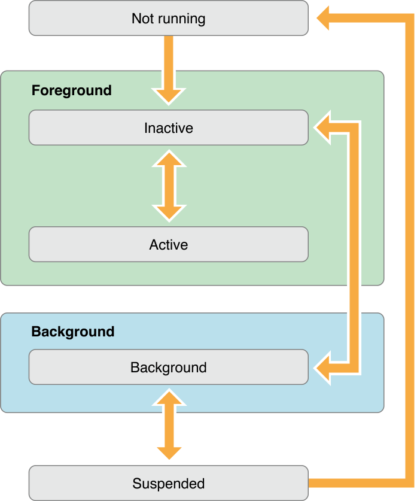
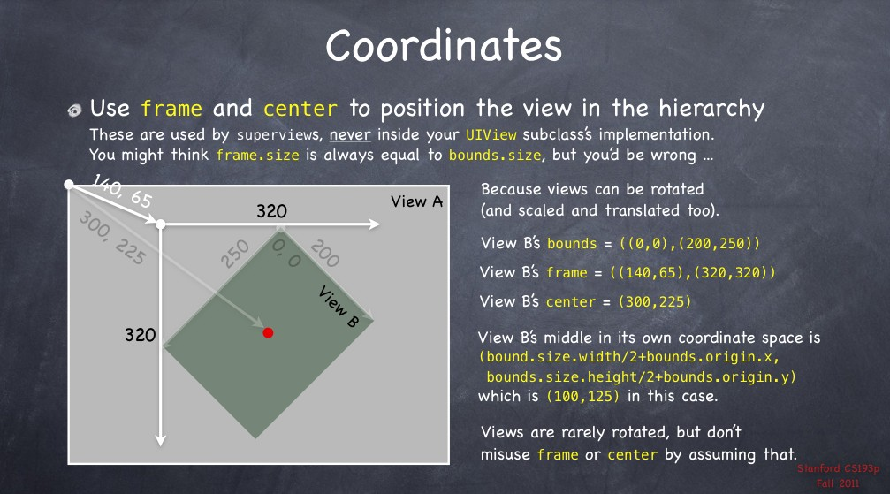
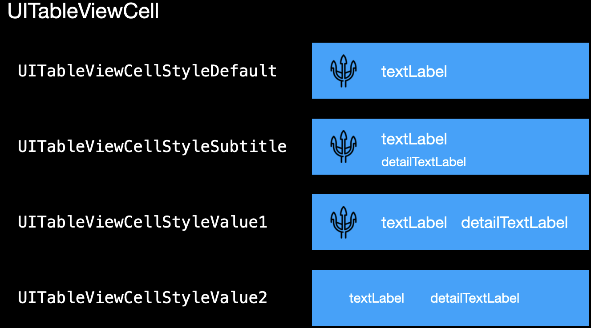

# iOS

## iOS-app生命周期

### 未运行（Not running）

程序没启动

### 未激活（Inactive）

程序在前台运行，不过没有接收到事件。在没有事件处理情况下程序通常停留在这个状态

### 激活（Active）

程序在前台运行而且接收到了事件。这也是前台的一个正常的模式

### 后台（Backgroud）

程序在后台而且能执行代码，大多数程序进入这个状态后会在在这个状态上停留一会。时间到之后会进入挂起状态(Suspended)。有的程序经过特殊的请求后可以长期处于Backgroud状态

### 挂起（Suspended）

 程序在后台不能执行代码。系统会自动把程序变成这个状态而且不会发出通知。当挂起时，程序还是停留在内存中的，当系统内存低时，系统就把挂起的程序清除掉，为前台程序提供更多的内存。



```objective-c
- (BOOL)application:(UIApplication *)application didFinishLaunchingWithOptions: (NSDictionary *)launchOptions { 
    NSLog(@"当程序载入后执行");
    return YES;
}

- (void) applicationWillResignActive:(UIApplication *)application {
    NSLog(@"程序即将变为非活动状态，即将进入后台");
}

- (void) applicationDidEnterBackground:(UIApplication *)application {
    NSLog(@"程序在后台执行");
}

- (void) applicationWillEnterForeground:(UIApplication *)application {
    NSLog(@"程序即将进入活动状态，即将进入前台");
}

- (void) applicationDidBecomeActive:(UIApplication *)application {
    NSLog(@"程序进入活动状态");
}

- (void) applicationWillTerminate:(UIApplication *)application {
    NSLog(@"程序即将退出");
}
```

## UIImage

图片相关操作

```objective-c
// 缩放图片，重点是图形上下文的相关操作
UIGraphicsBeginImageContext(newSize); //开启图形上下文
[curImage drawInRect:CGRectMake(0,0,newSize.width,newSize.height)]; //图片重新绘制
UIImage* newImage = UIGraphicsGetImageFromCurrentImageContext();//从图形上下文获取新的图片
UIGraphicsEndImageContext(); //关闭图形上下文

// 裁剪图片
UIImage* newImage = [UIImage imageWithCGImage:CGImageCreateWithImageInRect([curImage CGImage], standardRect)];

// UIimage转NSData （函数，不是方法），compressionQuality表示图片的压缩，[0,1]
NSData * UIImageJPEGRepresentation(UIImage *image, CGFloat compressionQuality);
NSData * UIImagePNGRepresentation(UIImage *image);
```

## UIView

### Frame, Bounds, Center

Frame：该view在父view坐标系统中的位置和大小（参照点是父坐标系

Bounds：该view在本地坐标系中的位置和大小（参照点是本地坐标系，以(0,0)为起点

Center：该view的中心点在父view坐标系统中的位置（参照点是福坐标系

```objective-c
-(CGRect)frame{
    return CGRectMake(self.frame.origin.x,self.frame.origin.y,
                      self.frame.size.width,self.frame.size.height);
}
-(CGRect)bounds{
    return CGRectMake(0,0,self.frame.size.width,self.frame.size.height);
}
```

一般情况下，有如下几个结论

$frame.origin = center - (bounds.size / 2.0)$

$center = frame.origin + (bounds.size / 2.0)$

$frame.size = bounds.size$

但是如果view发生了==旋转==，上述结论不再适用



### contentMode

决定当view的 `bounds`改变时，view的布局怎么自适应

```objective-c
typedef NS_ENUM(NSInteger, UIViewContentMode) {
    UIViewContentModeScaleToFill,    // 拉抻尺寸至完全填充（默认
    UIViewContentModeScaleAspectFit,    // 不超过bounds的范围，按比例伸缩至最大尺寸   
    UIViewContentModeScaleAspectFill,   // 超过bounds的范围，按比例伸缩至最大尺寸 
    UIViewContentModeRedraw,           
    UIViewContentModeCenter,            // 不改变尺寸，仅改变位置  
    UIViewContentModeTop,
    UIViewContentModeBottom,
    UIViewContentModeLeft,
    UIViewContentModeRight,
    UIViewContentModeTopLeft,
    UIViewContentModeTopRight,
    UIViewContentModeBottomLeft,
    UIViewContentModeBottomRight,
};
```

==需要剪裁时，必须把view的 `clipsToBounds`属性设置为 `YES`==

### UIControlEvents

触摸事件

```objective-c
typedef NS_OPTIONS(NSUInteger, UIControlEvents) {
    // 单点触摸按下事件：用户点触屏幕，或者又有新手指落下的时候
    UIControlEventTouchDown                                         = 1 <<  0,   
    // 多点触摸按下事件，点触计数大于1：用户按下第二、三、或第四根手指的时候
    UIControlEventTouchDownRepeat                                   = 1 <<  1,  
    // 当一次触摸在控件窗口内拖动时
    UIControlEventTouchDragInside                                   = 1 <<  2,
    // 当一次触摸在控件窗口外拖动时
    UIControlEventTouchDragOutside                                  = 1 <<  3,
    // 当一次触摸从控件窗口之外拖动到内部时
    UIControlEventTouchDragEnter                                    = 1 <<  4,
    // 当一次触摸从控件窗口内部拖动到外部时
    UIControlEventTouchDragExit                                     = 1 <<  5,
    // 所有在控件之内触摸抬起事件
    UIControlEventTouchUpInside                                     = 1 <<  6,
    // 所有在控件之外触摸抬起事件(点触必须开始与控件内部才会发送通知）
    UIControlEventTouchUpOutside                                    = 1 <<  7,
    // 所有触摸取消事件，即一次触摸因为放上了太多手指而被取消，或者被上锁或者电话呼叫打断
    UIControlEventTouchCancel                                       = 1 <<  8,

    // 当控件的值发生改变时，发送通知。用于滑块、分段控件、以及其他取值的控件
    UIControlEventValueChanged                                      = 1 << 12,  
    // primaryAction触发
    UIControlEventPrimaryActionTriggered API_AVAILABLE(ios(9.0))    = 1 << 13, 
    // menuAction触发
    UIControlEventMenuActionTriggered API_AVAILABLE(ios(14.0))      = 1 << 14, 

    // 当文本控件中开始编辑时发送通知
    UIControlEventEditingDidBegin                                   = 1 << 16, 
    // 当文本控件中的文本被改变时发送通知
    UIControlEventEditingChanged                                    = 1 << 17,
    // 当文本控件中编辑结束时发送通知
    UIControlEventEditingDidEnd                                     = 1 << 18,
    // 当文本控件内通过按下回车键（或等价行为）结束编辑时，发送通知
    UIControlEventEditingDidEndOnExit                               = 1 << 19, 

    // 通知所有触摸事件
    UIControlEventAllTouchEvents                                    = 0x00000FFF,
    // 通知所有关于文本编辑的事件
    UIControlEventAllEditingEvents                                  = 0x000F0000,
    UIControlEventApplicationReserved                               = 0x0F000000, 
    UIControlEventSystemReserved                                    = 0xF0000000, 
    // 通知所有事件
    UIControlEventAllEvents                                         = 0xFFFFFFFF
};
```

### Button

按钮，通常通过 `ButtonType`来定义

```objective-c
+ (instancetype)buttonWithType:(UIButtonType)buttonType;
typedef enum {
    UIButtonTypeCustom = 0,   //自定义风格
    UIButtonTypeRoundedRect,   //圆角矩形 
    UIButtonTypeDetailDisclosure,  //蓝色小箭头按钮，主要做详细说明用
    UIButtonTypeInfoLight,    //亮色感叹号
    UIButtonTypeInfoDark,    //暗色感叹号
    UIButtonTypeContactAdd,   //十字加号按钮
} UIButtonType;

// 设置属性
- (void)setTitle:(nullable NSString *)title forState:(UIControlState)state;
- (void)setTitleColor:(nullable UIColor *)color forState:(UIControlState)state;
- (void)setTitleShadowColor:(nullable UIColor *)color forState:(UIControlState)state;
- (void)setImage:(nullable UIImage *)image forState:(UIControlState)state;
- (void)setBackgroundImage:(nullable UIImage *)image forState:(UIControlState)state;
enum {
    UIControlStateNormal = 0,   //常规状态显现 
    UIControlStateHighlighted = 1 << 0, //高亮状态显现 
    UIControlStateDisabled = 1 << 1,  //禁用的状态才会显现
    UIControlStateSelected = 1 << 2,  //选中状态显现
};

// 设置按钮的状态
@property(nonatomic,getter=isEnabled) BOOL enabled;
@property(nonatomic,getter=isSelected) BOOL selected;
@property(nonatomic,getter=isHighlighted) BOOL highlighted;

// 添加行为
- (void)addTarget:(id)target 
           action:(SEL)action 
 forControlEvents:(UIControlEvents)controlEvents;
```

### UITextField

输入框

```objective-c
// 默认为nil
@property(nullable, nonatomic,copy) NSString *text;
@property(nullable, nonatomic,copy) NSAttributedString *attributedText;
// 没有输入信息时的水印
@property(nullable, nonatomic,copy) NSString *placeholder;
@property(nullable, nonatomic,copy) NSAttributedString *attributedPlaceholder; 

// 设置字体颜色，默认黑色
@property(nullable, nonatomic,strong) UIColor *textColor;
// 设置字体样式和大小，默认为nil，12pt
@property(nullable, nonatomic,strong) UIFont *font;
@property(nonatomic) NSTextAlignment textAlignment;
// 设置边框样式
@property(nonatomic) UITextBorderStyle borderStyle;
typedef NS_ENUM(NSInteger, UITextBorderStyle) {
    UITextBorderStyleNone,  // 默认样式 无边框
    UITextBorderStyleLine,   // 边框加线条
    UITextBorderStyleBezel, // 边框加灰色线条  
    UITextBorderStyleRoundedRect // 圆角 最常用
}; 

// 会自动缩小文本来适应窗口大小
@property(nonatomic) BOOL adjustsFontSizeToFitWidth;
// 限制字体大小的最小值
@property(nonatomic) CGFloat minimumFontSize;

// 设置背景图片
@property(nullable, nonatomic,strong) UIImage *background;
@property(nullable, nonatomic,strong) UIImage *disabledBackground;

// 重新编辑时，直接清空当前所有内容
@property(nonatomic) BOOL clearsOnBeginEditing;
// 删除按钮，可以一键清空输入框的内容
@property(nonatomic)        UITextFieldViewMode  clearButtonMode;
typedef enum {
    UITextFieldViewModeNever,　    // 重不出现
    UITextFieldViewModeWhileEditing,   // 编辑时出现
    UITextFieldViewModeUnlessEditing,　// 除了编辑外都出现
    UITextFieldViewModeAlways 　    //一直出现
} UITextFieldViewMode;

// 设置密语输入，常用于密码
@property(nonatomic, getter=isSecureTextEntry) BOOL secureTextEntry;
// 设置键盘样式
@property(nonatomic) UIKeyboardType keyboardType;
typedef enum {
    UIKeyboardTypeDefault,     　   //默认键盘，支持所有字符
    UIKeyboardTypeASCIICapable,　   //支持ASCII的默认键盘
    UIKeyboardTypeNumbersAndPunctuation,　//标准电话键盘，支持＋＊＃字符
    UIKeyboardTypeURL,        //URL键盘，支持.com按钮 只支持URL字符
    UIKeyboardTypeNumberPad,            　//数字键盘
    UIKeyboardTypePhonePad,　 　   //电话键盘
    UIKeyboardTypeNamePhonePad, 　   //电话键盘，也支持输入人名
    UIKeyboardTypeEmailAddress, 　   //用于输入电子 邮件地址的键盘
    UIKeyboardTypeDecimalPad,   　   //数字键盘 有数字和小数点
    UIKeyboardTypeTwitter,      　   //优化的键盘，方便输入@、#字符
    UIKeyboardTypeAlphabet = UIKeyboardTypeASCIICapable,
} UIKeyboardType;

// 设置左右侧的view，可以添加图片等
@property(nullable, nonatomic,strong) UIView *leftView;   
@property(nonatomic) UITextFieldViewMode leftViewMode;
@property(nullable, nonatomic,strong) UIView *rightView; 
@property(nonatomic) UITextFieldViewMode rightViewMode; 
typedef enum {
    UITextFieldViewModeNever,
    UITextFieldViewModeWhileEditing,
    UITextFieldViewModeUnlessEditing,
    UITextFieldViewModeAlways
} UITextFieldViewMode;

// 设置委托
@property(nullable, nonatomic,weak)   id<UITextFieldDelegate> delegate;
```

### UITableView

需要实现的协议 `UITableViewDataSource`, `UITableViewDelegate`，其中 `UITableViewDataSource`提供了所展示的资源，必须实现如下两个方法。`NSIndexPath.section`和 `NSIndexPath.row`可以访问 `section`和 `row`的序号。

```objective-c
// tableview有多少section (可选，默认为1)
- (NSInteger) numberOfSectionsInTableView:(UITableView*)tableView;

// 第几个section要显示多少行内容
- (NSInteger) tableView:(UITableView *)tableView numberOfRowsInSection:(NSInteger)section;

// 在指定的indexPath上具体的Cell长什么样
- (UITableViewCell*) tableView:(UITableView *)tableView cellForRowAtIndexPath:(NSIndexPath *)indexPath;
```

#### UITableViewCell

系统为 `UITableViewCell`对象提供了四种风格，会选择显示三种子视图中数量和位置。通过 `cell.textLabel.text`, `cell.detailTextLabel.text`和 `cell.imageView.image`来设置



```objective-c
// 选中操作
-(void)tableView:(UITableView *)tableView didSelectRowAtIndexPath:(NSIndexPath *)indexPath {
    NSLog(@"选中了第%li个cell", (long)indexPath.row);
    // 取消选中
    [tableView deselectRowAtIndexPath:indexPath animated:NO];
}

// 通过indexPath获取当前cell
- (__kindof UITableViewCell *)cellForRowAtIndexPath:(NSIndexPath *)indexPath;
```

TableViewCell的重用，如果取出的cell为空，则会按照 `[Mycell class]`自动进行 `alloc`和 `init`

```objective-c
static NSString *ID = @"cell";
[self.tableView registerClass:[MyCell class] forCellReuseIdentifier:ID];
UITableViewCell *cell = [tableView dequeueReusableCellWithIdentifier:ID 
                                 forIndexPath:indexPath];

```

### UICollectionView

> [自定义 Collection View 布局](https://www.cnblogs.com/alunchen/p/5620068.html)
>
> [iOS UICollectionView自定义流水布局](https://blog.csdn.net/lg767201403/article/details/90518273)

九宫格的布局，类似 `UITableView`，需要实现协议 `UICollectionViewDelegate`和 `UICollectionViewDataSource`，但是初始化时必须指定layout，cell也只能自定义实现

```objective-c
// section的数量
- (NSInteger)numberOfSectionsInCollectionView:(UICollectionView *)collectionView;

// 第几个section要显示多少行内容
- (NSInteger)collectionView:(UICollectionView *)collectionView 
     numberOfItemsInSection:(NSInteger)section;

- (__kindof UICollectionViewCell *)collectionView:(UICollectionView *)collectionView 
            cellForItemAtIndexPath:(NSIndexPath *)indexPath;

```

需要额外注意到是，==`tableView`使用 `row`，而 `CollectionView`使用 `item`==

```objective-c
// 通过indexPath获取当前cell
- (UICollectionViewCell *)cellForItemAtIndexPath:(NSIndexPath *)indexPath;
```

#### UICollectionViewFlowLayout

系统提供的一种默认布局样式

```objective-c
// 行间距
@property (nonatomic) CGFloat minimumLineSpacing;
// 列间距
@property (nonatomic) CGFloat minimumInteritemSpacing;
// item大小
@property (nonatomic) CGSize itemSize;
@property (nonatomic) CGSize estimatedItemSize API_AVAILABLE(ios(8.0)); 
// defaults to CGSizeZero - setting a non-zero size enables cells that self-size via -preferredLayoutAttributesFittingAttributes:
// 滑动方式，默认UICollectionViewScrollDirectionVertical
@property (nonatomic) UICollectionViewScrollDirection scrollDirection;
@property (nonatomic) CGSize headerReferenceSize;
@property (nonatomic) CGSize footerReferenceSize;
// 内边距
@property (nonatomic) UIEdgeInsets sectionInset;

/// The reference boundary that the section insets will be defined as relative to. Defaults to `.fromContentInset`.
/// NOTE: Content inset will always be respected at a minimum. For example, if the sectionInsetReference equals `.fromSafeArea`, but the adjusted content inset is greater that the combination of the safe area and section insets, then section content will be aligned with the content inset instead.
@property (nonatomic) UICollectionViewFlowLayoutSectionInsetReference sectionInsetReference;
// 是否设置header和footer，默认为NO
@property (nonatomic) BOOL sectionHeadersPinToVisibleBounds;
@property (nonatomic) BOOL sectionFootersPinToVisibleBounds;
```

### animateWithDuration

用来实现动画

```objective-c
+ (void)animateWithDuration:(NSTimeInterval)duration 
                 animations:(void (^)(void))animations;
+ (void)animateWithDuration:(NSTimeInterval)duration 
                 animations:(void (^)(void))animations 
                 completion:(void (^)(BOOL finished))completion
+ (void)animateWithDuration:(NSTimeInterval)
                 duration delay:(NSTimeInterval)delay 
                 options:(UIViewAnimationOptions)options 
                 animations:(void (^)(void))animations 
                 completion:(void (^)(BOOL finished))completion
 
[UIView animateWithDuration:1.5
                      animations:^{
                          circle.frame = CGRectMake(circle.frame.origin.x + 100,
                                                    circle.frame.origin.y,
                                                    circle.frame.size.width,
                                                    circle.frame.size.height);
                      }
                      completion:nil];
```

### 坐标系转换

注意 `fromView`和 `toVIew`是相对的，即 `[V1 convertRect:V2 toView:V3]`等价于 `[V3 convertRect:V2 fromView:V1]`，==v2必须是放在v1上的，中间不能有其他view==

```objective-c
// 将像素point由point所在视图转换到目标视图view中，返回在目标视图view中的像素值
- (CGPoint)convertPoint:(CGPoint)point toView:(UIView *)view;
// 将像素point从view中转换到当前视图中，返回在当前视图中的像素值
- (CGPoint)convertPoint:(CGPoint)point fromView:(UIView *)view;

// 将rect由rect所在视图转换到目标视图view中，返回在目标视图view中的rect
- (CGRect)convertRect:(CGRect)rect toView:(UIView *)view;
// 将rect从view中转换到当前视图中，返回在当前视图中的rect
- (CGRect)convertRect:(CGRect)rect fromView:(UIView *)view;
```

## UIViewController

### UITabBarController

描述转场 `<UITabBarControllerDelegate>`

### UINavigationController

> [iOS系统中导航栏的转场解决方案与最佳实践](https://blog.csdn.net/liuhuiteng/article/details/106881404)

控制有关联的 `ViewController`之间的跳转关系，初始化时要指定 `rootViewController`

```objective-c
- (instancetype)initWithRootViewController:(UIViewController *)rootViewController NS_DESIGNATED_INITIALIZER; 
// Initializer that also pushes the root view controller without animation.
```

以栈的形式存放 `ViewController`，在栈顶的 `ViewController`在会显示

```objective-c
- (void)pushViewController:(UIViewController *)viewController animated:(BOOL)animated;

//返回到上一个页面
- (UIViewController *)popViewControllerAnimated:(BOOL)animated;

//返回到根页面
- (NSArray<__kindof UIViewController *> *)popToRootViewControllerAnimated:(BOOL)animated;

//返回到栈内指定的UIViewController页面
- (NSArray<__kindof UIViewController *> *)
     popToViewController:(UIViewController *)viewController 
        animated:(BOOL)animated;
//返回到栈内指定的UIViewController时，栈内该UIViewController上面的所有页面都会出栈
//并且参数viewController必须要保证在栈内

//跳转到指定页面常用方式1：
for (UIViewController *vc in self.navigationController.viewControllers) {
     if ([vc isKindOfClass:[yourTargetViewController class]]) {
           [self.navigationController popToViewController:vc animated:YES];
           return;
     }
 }

//跳转到指定页面常用方式2(如果知道指定页面在栈内索引位置)：
UIViewController *targetVC = self.navigationController.viewControllers[1];
//UIViewController *targetVC = [self.navigationController.viewControllers objectAtIndex:1];
[self.navigationController popToViewController:targetVC animated:YES];
```

每个 `NavigationController`拥有唯一的 `NavigaitonBar`，位于屏幕上方，提供了一个栈来管理每个 `ViewController`到 `NavigationItem`，修改 `NavigationItem`只会影响当前页面

```objective-c
// title位于正中间
@property (nonatomic, readwrite, copy, nullable) NSString *title;
// VC的title可以使用自定义的UIView
@property (nonatomic, readwrite, strong, nullable) UIView *titleView;
// 提示，位于title的上面，小字
@property (nonatomic, readwrite, copy, nullable) NSString *prompt;

// 隐藏返回按钮（不能通过按钮返回
@property (nonatomic, readwrite, assign) BOOL hidesBackButton;
- (void)setHidesBackButton:(BOOL)hidesBackButton animated:(BOOL)animated;

// 显示优先级：当前页面的leftBarButtonItems > 返回页面的backBarButtonItem > 默认
@property (nonatomic, readwrite, strong, nullable) UIBarButtonItem *backBarButtonItem;
@property (nonatomic, readwrite, copy, nullable) NSString *backButtonTitle;
@property (nonatomic, readwrite, copy, nullable) NSArray<UIBarButtonItem *> 
                 *leftBarButtonItems;
@property (nonatomic, readwrite, copy, nullable) NSArray<UIBarButtonItem *> 
                 *rightBarButtonItems;
- (void)setLeftBarButtonItems:(nullable NSArray<UIBarButtonItem *> *)items 
         animated:(BOOL)animated;
- (void)setRightBarButtonItems:(nullable NSArray<UIBarButtonItem *> *)items 
          animated:(BOOL)animated;

```

描述转场 `<UINavigationControllerDelegate>`

```objective-c
- (void)navigationController:(UINavigationController *)navigationController 
      willShowViewController:(UIViewController *)viewController 
         animated:(BOOL)animated;
- (void)navigationController:(UINavigationController *)navigationController 
      didShowViewController:(UIViewController *)viewController 
            animated:(BOOL)animated;

- (UIInterfaceOrientationMask)navigationControllerSupportedInterfaceOrientations:
   (UINavigationController *)navigationController;
- (UIInterfaceOrientation)navigationControllerPreferredInterfaceOrientationForPresentation:
   (UINavigationController *)navigationController;
// 返回转场动画
- (nullable id <UIViewControllerInteractiveTransitioning>)navigationController:
   (UINavigationController *)navigationController
         interactionControllerForAnimationController:
   (id <UIViewControllerAnimatedTransitioning>) animationController;
// 返回转场动画
- (nullable id <UIViewControllerAnimatedTransitioning>)navigationController:
   (UINavigationController *)navigationController
         animationControllerForOperation:(UINavigationControllerOperation)operation
          fromViewController:(UIViewController *)fromVC
           toViewController:(UIViewController *)toVC;
```

### present & dismiss

描述转场 `<UIViewControllerTransitioningDelegate>`

### 转场动画

> [转场动画UINavigationControllerDelegate](https://www.cnblogs.com/hualuoshuijia/p/9935055.html)

`<UIViewControllerAnimatedTransitioning>`定义动画的内容

```objective-c
// 返回动画时间
- (NSTimeInterval)transitionDuration:
   (nullable id <UIViewControllerContextTransitioning>)transitionContext;
// 处理具体的动画
- (void)animateTransition:(id <UIViewControllerContextTransitioning>)transitionContext;
```

`<UIViewControllerInteractiveTransitioning>`定义动画的内容，Interactive指动画可以根据输入信息的变化改变动画的进程

`<UIViewControllerContextTransitioning>`用来表示动画的上下文，==不需要我们去实现该协议==

```objective-c
// 动画发生的view容器
@property(nonatomic, readonly) UIView *containerView;
@property(nonatomic, readonly, getter=isAnimated) BOOL animated;
@property(nonatomic, readonly, getter=isInteractive) BOOL interactive; 
@property(nonatomic, readonly) BOOL transitionWasCancelled;
@property(nonatomic, readonly) UIModalPresentationStyle presentationStyle;
- (void)updateInteractiveTransition:(CGFloat)percentComplete;
- (void)finishInteractiveTransition;
- (void)cancelInteractiveTransition;
- (void)pauseInteractiveTransition;
// 提示动画完成
- (void)completeTransition:(BOOL)didComplete;
// 定位动画的fromViewController和toViewController
- (nullable __kindof UIViewController *)viewControllerForKey:
   (UITransitionContextViewControllerKey)key;
- (nullable __kindof UIView *)viewForKey:(UITransitionContextViewKey)key;
@property(nonatomic, readonly) CGAffineTransform targetTransform;
- (CGRect)initialFrameForViewController:(UIViewController *)vc;
- (CGRect)finalFrameForViewController:(UIViewController *)vc;
```

## CALayer

> [iOS开发之CAShapeLayer初探](https://www.jianshu.com/p/139f4fbe7b6b)

### anchorPoint & position

`anchorPoint`是图像旋转的==中心点==，位置用相对于 `bounds`的比例值来确定，即左上角为(0,0)，右下角为(0,0)

`position`代表了相对父图层的坐标中，`anchorPoint`的位置，即 `position`和 `anchorPoint`是相对于不同空间的==重合点==

`frame.origin`受 `anchorPoint`和 `positino`影响而确定

$frame.origin.x = position.x - anchorPoint.x * bounds.size.width$

$frame.origin.y = position.y - anchorPoint.y * bounds.size.height$

### transform

包括了 `transform.scale`和 `transform.rotation`两个属性，分别控制图像的==伸缩==和==旋转==

### BeziePath

> [贝塞尔曲线（UIBezierPath）属性、方法汇总](https://www.cnblogs.com/zhangzhang-y/p/5640745.html)

用于绘制路径

```objective-c
+ (instancetype)bezierPath;
// 创建在rect内的矩形
+ (instancetype)bezierPathWithRect:(CGRect)rect;
// 创建在rect内的内切曲线
+ (instancetype)bezierPathWithOvalInRect:(CGRect)rect;
// 创建带有圆角的矩形
+ (instancetype)bezierPathWithRoundedRect:(CGRect)rect 
                             cornerRadius:(CGFloat)cornerRadius;
// 设定特定的角为圆角的矩形
+ (instancetype)bezierPathWithRoundedRect:(CGRect)rect 
                        byRoundingCorners:(UIRectCorner)corners 
                              cornerRadii:(CGSize)cornerRadii;
// 创建圆弧
+ (instancetype)bezierPathWithArcCenter:(CGPoint)center  //圆点
                                 radius:(CGFloat)radius    //半径
                             startAngle:(CGFloat)startAngle  //起始位置
                               endAngle:(CGFloat)endAngle   //结束位置
                              clockwise:(BOOL)clockwise;  //是否顺时针
// 根据已有路径创造路径
+ (instancetype)bezierPathWithCGPath:(CGPathRef)CGPath;

// Path construction
- (void)moveToPoint:(CGPoint)point;
// 绘制一条线
- (void)addLineToPoint:(CGPoint)point;
// 创建三次贝塞尔曲线
- (void)addCurveToPoint:(CGPoint)endPoint 
          controlPoint1:(CGPoint)controlPoint1 
          controlPoint2:(CGPoint)controlPoint2;
// 创建二次贝塞尔曲线
- (void)addQuadCurveToPoint:(CGPoint)endPoint 
               controlPoint:(CGPoint)controlPoint;
// 添加圆弧
- (void)addArcWithCenter:(CGPoint)center 
                  radius:(CGFloat)radius 
              startAngle:(CGFloat)startAngle 
                endAngle:(CGFloat)endAngle 
               clockwise:(BOOL)clockwise;
// 闭合路径，起点和终点连一根线
- (void)closePath;
- (void)removeAllPoints;
```

画圆弧时，`startAngle`与 `endAngle`表示的是弧度，可以用 `M_PI`，`M_PI_2`，`M_PI_4`来表示圆周率，圆心在水平方向上的右侧的点表示起始点（弧度为0），==顺时针和逆时针都是这样==

### CAShapeLayer

`CAShapeLayer`继承自 `CALayer`，但是他需要一个路径才能进行==绘制==，而 `BeziePath`则可以为 `CAShapeLayer`提供路径

```objective-c
// 所要绘制的路径，通过BeziePath提供
@property(nullable) CGPathRef path;
// 路径填充颜色，默认为黑
@property(nullable) CGColorRef fillColor;
// 填充颜色时的规则
@property(copy) CAShapeLayerFillRule fillRule;
 CAShapeLayerFillRule const kCAFillRuleNonZero; //默认
    CAShapeLayerFillRule const kCAFillRuleEvenOdd;
// 路径描边颜色，默认无色
@property(nullable) CGColorRef strokeColor;
// 描绘路径的区域，取值为[0,1]，且strokeStart < strokeEnd
@property CGFloat strokeStart;
@property CGFloat strokeEnd;
// 线的宽度
@property CGFloat lineWidth;
// 最大斜接长度，在kCALineJoinMiter下才有效
// 如果斜接长度超过该限制，则会变为kCALineJoinBevel
@property CGFloat miterLimit;
// 线端点的类型
@property(copy) CAShapeLayerLineCap lineCap;
 CAShapeLayerLineCap const kCALineCapButt; //无端点
 CAShapeLayerLineCap const kCALineCapRound; //圆角端点
    CAShapeLayerLineCap const kCALineCapSquare; //方形端点（比无端点要长一点
// 线连接的类型
@property(copy) CAShapeLayerLineJoin lineJoin;
 CAShapeLayerLineJoin const kCALineJoinMiter; //尖角
    CAShapeLayerLineJoin const kCALineJoinRound; //圆角
    CAShapeLayerLineJoin const kCALineJoinBevel; //缺角
// lineDashPhase为线型模版的起始位置；lineDashPattern为线性模版
// 索引从1开始记，奇数位数值表示实线长度，偶数位数值表示空白长度
@property CGFloat lineDashPhase;
@property(nullable, copy) NSArray<NSNumber *> *lineDashPattern;
```

### CAAnimation

> [CABasicAnimation使用总结](https://www.cnblogs.com/yangfushun/p/7992598.html)

使用方法 `animationWithKeyPath:`来对 `CABasicAnimation`进行实例化，然后设定动画效果

```objective-c
+ (instancetype)animationWithKeyPath:(NSString *)path;
@property(nullable, strong) id fromValue;
@property(nullable, strong) id toValue;
@property(nullable, strong) id byValue;
// 上述三个属性最多指定两个进行组合

CABasicAnimation *moveAnimation = [CABasicAnimation animationWithKeyPath:@"position.x"];
moveAnimation.fromValue = @(circle.center.x);
moveAnimation.toValue = @(circle.center.x + 100);
moveAnimation.timingFunction = [CAMediaTimingFunction functionWithName:
                                kCAMediaTimingFunctionEaseInEaseOut]; 
moveAnimation.duration = 1.5; 
[circle.layer addAnimation:moveAnimation forKey:nil];  
// add执行的是复制操作，而不是将动画绑定在layer上
```

#### Model Layer, Presentation Layer

当设置CALayer的某个属性时，实际设置的是 `model layer`，当添加动画时，动画会创建一个原始layer的拷贝，原始layer为 `model layer`，拷贝值为 `presentation layer`，`presentation layer`的值会随着动画的进度实时改变，`model layer`则会隐藏，动画结束后，`presentation layer`会被移除，而 `model layer`则会重新显示出来

#### animationWithKeyPath

[Core Animation KeyPath 取值](https://www.jianshu.com/p/71c880498d7a)

`animationWithKeyPath:`的值指定了动画的效果，`fromValue`，`toValue`和 `byValue`的值与指定的keyPath有关。

| **Field Key Path** | **Remark**                                |                                                          **En Description**                                                          |
| ------------------------ | ----------------------------------------------- | :----------------------------------------------------------------------------------------------------------------------------------------: |
| transform.rotation.x     | 按x轴旋转的弧度                                 |                             Set to an NSNumber object whose value is the rotation, in radians, in the x axis.                             |
| transform.rotation.y     | 按y轴旋转的弧度                                 |                             Set to an NSNumber object whose value is the rotation, in radians, in the y axis.                             |
| transform.rotation.z     | 按z轴旋转的弧度                                 |                             Set to an NSNumber object whose value is the rotation, in radians, in the z axis.                             |
| transform.rotation       | 按z轴旋转的弧度, 和transform.rotation.z效果一样 | Set to an NSNumber object whose value is the rotation, in radians, in the z axis. This field is identical to setting the rotation.z field. |

属性 `strokeEnd`用于绘制形状，value取值为[0,1]

#### timingFunction

`timingFunction`是父类 `CAAnimation`的属性，指定了动画的运行速度，系统提供了五条常用曲线

```objective-c
/* A timing function defining the pacing of the animation. Defaults to
 * nil indicating linear pacing. */
@property(nullable, strong) CAMediaTimingFunction *timingFunction;

+ (instancetype)functionWithName:(CAMediaTimingFunctionName)name;

CAMediaTimingFunctionName const kCAMediaTimingFunctionLinear;
CAMediaTimingFunctionName const kCAMediaTimingFunctionEaseIn;
CAMediaTimingFunctionName const kCAMediaTimingFunctionEaseOut;
CAMediaTimingFunctionName const kCAMediaTimingFunctionEaseInEaseOut;
CAMediaTimingFunctionName const kCAMediaTimingFunctionDefault;

```

还可以通过贝塞尔曲线来指定

```objective-c
// 三次贝塞尔曲线需要4个点，方法默认了两个点(0,0) (1,1)，只需要补充两个控制点
animation.timingFunction = 
    [CAMediaTimingFunction functionWithControlPoints:0.32 :0.94 :0.6 :1.0];
```

#### fillMode

这个属性定义了动画在开始和结束时的动作

```objective-c
@property(copy) CAMediaTimingFillMode fillMode;
// 动画结束之后layer的状态将保持在动画的最后一帧，而removedOnCompletion的默认属性值是 YES，
// 所以为了使动画结束之后layer保持结束状态，应同时将removedOnCompletion设置为NO。
CAMediaTimingFillMode const kCAFillModeForwards;
// 就是在动画开始前，你只要将动画加入了一个layer，layer便立即进入动画的初始状态并等待动画开始，
// 动画结束后，layer 也会恢复到之前的状态。
CAMediaTimingFillMode const kCAFillModeBackwards;
// 动画加入后立即开始，layer便处于动画初始状态，动画结束后layer保持动画最后的状态。
CAMediaTimingFillMode const kCAFillModeBoth;
// 动画结束后将会layer的改变恢复原状
CAMediaTimingFillMode const kCAFillModeRemoved;

```

#### Delegate

通过设置动画的delegate，可以获取动画开启和结束的事件

```objective-c
//动画开始时
- (void)animationDidStart:(CAAnimation *)anim {
    NSLog(@"开始了");
}

//动画结束时
- (void)animationDidStop:(CAAnimation *)anim finished:(BOOL)flag{
    //方法中的flag参数表明了动画是自然结束还是被打断
    //比如调用了removeAnimationForKey:方法，flag为NO，如果是正常结束，flag为YES
    NSLog(@"结束了");
}
```

在有多个动画时，可以通过key-value来在代理方法中区分不同的动画

```objective-c
// 根据key区分动画
[self.imageView.layer addAnimation:animaGroup forKey:@"Animation"];
- (void)animationDidStart:(CAAnimation *)anim{
    if ([anim isEqual:[self.imageView.layer animationForKey:@"Animation"]]) {
        NSLog(@"动画组执行了");
    }
}

// 根据value区分动画
[animation1 setValue:@"animation1" forKey:@"AnimationKey"];
[animation2 setValue:@"animation2" forKey:@"AnimationKey"];
- (void)animationDidStop:(CAAnimation *)anim finished:(BOOL)flag{
    if ([[anim valueForKey:@"AnimationKey"]isEqualToString:@"animation1"]) {
        NSLog(@"animation1执行结束");
    }
    else if ([[anim valueForKey:@"AnimationKey"]isEqualToString:@"animation2"]){
        NSLog(@"animation2执行结束");
    }
}

```

#### CAAnimationGroup

可以指定一系列的动画，==同时进行==

```objective-c
@property(nullable, copy) NSArray<CAAnimation *> *animations;
```

#### CAKeyframeAnimation

通过设置keyframe，来使得一系列的动画==连续进行==

```objective-c
// 指明keyframe的关键点，起点为values的第一个值，与path互斥
@property(nullable, copy) NSArray *values;

// 指明keyframe的路径，会覆盖掉values
@property(nullable) CGPathRef path;

// 指明每一个values对应的时间点，首尾必须为0和1，相邻时间点之间的差值为动画执行时间
@property(nullable, copy) NSArray<NSNumber *> *keyTimes;

// 指明每一条子路径的运行速度
@property(nullable, copy) NSArray<CAMediaTimingFunction *> *timingFunctions;

// 指明每一条子路径的运行方式
@property(copy) CAAnimationCalculationMode calculationMode;
//线性，默认
const kCAAnimationLinear
//离散，无中间过程，但keyTimes设置的时间依旧生效，物体跳跃地出现在各个关键帧上
const kCAAnimationDiscrete
//平均，keyTimes跟timeFunctions失效
const kCAAnimationPaced
const kCAAnimationCubic
const kCAAnimationCubicPaced
```

### CADisplayLink

`CADisplayLink`是用来同步屏幕刷新率的计时器，当注册到runloop后，每当屏幕需要刷新时，runloop会调用 `CADisplayLink`绑定的 `target`和 `selector`，这时 `target`可以读到 `CADisplayLink` 的每次调用的时间戳，用来准备下一帧显示需要的数据

```objective-c
//创建CADisplayLink对象 
/*
需要注意 定时器对象创建后 并不会马上执行 需要添加到runloop中
*/
+ (CADisplayLink *)displayLinkWithTarget:(id)target selector:(SEL)sel;
//将当前定时器对象加入一个RunLoop中
- (void)addToRunLoop:(NSRunLoop *)runloop forMode:(NSRunLoopMode)mode;
//将当前定时器对象从一个RunLoop中移除 如果这个Runloop是定时器所注册的最后一个  移除后定时器将被释放
- (void)removeFromRunLoop:(NSRunLoop *)runloop forMode:(NSRunLoopMode)mode;
//将定时器失效掉 调用这个函数后 会将定时器从所有注册的Runloop中移除
- (void)invalidate;
//当前时间戳
@property(readonly, nonatomic) CFTimeInterval timestamp;
//距离上次执行所间隔的时间
@property(readonly, nonatomic) CFTimeInterval duration;
//预计下次执行的时间戳
@property(readonly, nonatomic) CFTimeInterval targetTimestamp;
//设置是否暂停
@property(getter=isPaused, nonatomic) BOOL paused;
//设置预期的每秒执行帧数 例如设置为1 则以每秒一次的速率执行
@property(nonatomic) NSInteger preferredFramesPerSecond;
//间隔多少帧调用一次selector
@property(nonatomic) NSInteger frameInterval;
```

## UIAlertController

包含警告框和操作表两种样式，==在创建时进行指定==

```objective-c
// 创建，UIAlertControllerStyleAlert指警告框，UIAlertControllerStyleActionSheet指操作表
+ (instancetype)alertControllerWithTitle:(nullable NSString *)title 
            message:(nullable NSString *)message 
              preferredStyle:(UIAlertControllerStyle)preferredStyle;
// 添加动作，除了cancel动作外，其他动作按添加顺序排列
- (void)addAction:(UIAlertAction *)action;

// 显示
- (void)presentViewController:(UIViewController *)viewControllerToPresent 
         animated: (BOOL)flag 
             completion:(void (^ __nullable)(void))completion;
```

### UIAlertAction

设置具体的动作

```objective-c
+ (instancetype)actionWithTitle:(nullable NSString *)title 
           style:(UIAlertActionStyle)style 
                        handler:(void (^ __nullable)(UIAlertAction *action))handler;

@property (nullable, nonatomic, readonly) NSString *title;
@property (nonatomic, readonly) UIAlertActionStyle style;
@property (nonatomic, getter=isEnabled) BOOL enabled;
```

样式分为三种

- `cancel`为取消操作，警告框时，默认在左侧（两项动作）或下侧（超过两种动作），操作表时默认在最下侧，且与其他动作分隔开
- `destructive`用于更改或删除操作，==自动显示红色字体==
- `default`默认样式

```objective-c
typedef NS_ENUM(NSInteger, UIAlertActionStyle) {
    UIAlertActionStyleDefault = 0,
    UIAlertActionStyleCancel,
    UIAlertActionStyleDestructive
};
```

### Alert

创建时指定样式为 `UIAlertControllerStyleAlert`，可以添加 `textField`为用户提供输入框

```objective-c
// 添加textField
- (void)addTextFieldWithConfigurationHandler:
   (void (^ __nullable)(UITextField *textField))configurationHandler;

// 数组内元素顺序，与add时的顺序一致
@property (nullable, nonatomic, readonly) NSArray<UITextField *> *textFields;
```

### ActionSheet

创建时指定样式为 `UIAlertControllerStyleActionSheet`，从底部滑出（iphone），也可以通过点击 `ActionSheet`以外的区域来进行取消操作

## NSURL

`NSURL`由三部分组成：`NSURLSession`、`NSURLSessionConfiguration`、`NSURLSessionTask`

`NSURLSession`：请求会话对象，可以使用系统提供点单例对象或是由自己创建

`NSURLSessionConfiguration`：对会话的一些参数进行设置

`NSURLSessionTask`：负责执行具体请求的 `task`，由 `session`创建

发起网络请求的步骤

```objective-c
// 创建configuration
NSURLSessionConfiguration *config = [NSURLSessionConfiguration defaultSessionConfiguration];
// 通过configuration创建session对象
NSURLSession *session = [NSURLSession sessionWithConfiguration:config
                                                      delegate:self
                                                 delegateQueue:[NSOperationQueue mainQueue]];
// 通过session对象发起网络请求，获取task对象
NSURLSessionDataTask *task = [session dataTaskWithURL:
                              [NSURL URLWithString:@"http://www.baidu.com"]];
// 调用resume方法发起网络请求
[task resume];
```

### NSURLSession

创建

```objective-c
// 系统维护的单例对象，可以通过该对象和其他使用这个session的task共享连接和请求信息
// 可以通过getter方法进行创建
@property (class, readonly, strong) NSURLSession *sharedSession;
// 自定义configuration
+ (NSURLSession *)sessionWithConfiguration:(NSURLSessionConfiguration *)configuration;
// 自定义configuration和delegate
+ (NSURLSession *)sessionWithConfiguration:(NSURLSessionConfiguration *)configuration 
             delegate:(nullable id <NSURLSessionDelegate>)delegate 
              delegateQueue:(nullable NSOperationQueue *)queue;
```

### NSURLSessionTask

通过 `NSURLSession`发起的每个请求，都会被封装为一个 `NSURLSessionTask`，但一般不会直接是 `NSURLSessionTask`类，而是基于不同任务类型，被封装为其对应的子类

`NSURLSessionDataTask`：处理普通的 `Get`、`Post`请求

`NSURLSessionUploadTask`：是 `DataTask`的子类，处理上传请求，可以传入对应的上传文件或路径

`NSURLSessionDownloadTask`：处理下载地址，提供断点续传功能的 `cancel`方法

主要的方法和属性都定义在父类 `NSURLSessionTask`中

```objective-c
@property (readonly)                 NSUInteger    taskIdentifier;  
// currentRequest是当前执行的任务，如果没有发生重定向，和originalRequest相同
@property (nullable, readonly, copy) NSURLRequest  *originalRequest; 
@property (nullable, readonly, copy) NSURLRequest  *currentRequest;
@property (nullable, readonly, copy) NSURLResponse *response;  
// 当前任务的状态，可以通过KVO的方式监听
@property (readonly) NSURLSessionTaskState state;
// 设置优先级，[0.0, 1.0]，未指定就以默认优先级运行
@property float priority;

// 开始或继续请求，创建后task默认为挂起状态，调用resume才能开始请求
- (void)resume;
// 挂起当前请求，普通请求挂起后会重新开始
// 下载请求挂起后如果没有超过NSURLRequest设置的timeout时间，resume会继续请求
- (void)suspend;
// 取消当前请求，任务被标记为取消，在未来会自动调用URLSession:task:didCompleteWithError:
- (void)cancel;

@end
```

`NSURLSession`提供普通创建任务的方式

```objective-c
// 指定请求来源，reques or url，request可能有body数据流
- (NSURLSessionDataTask *)dataTaskWithRequest:(NSURLRequest *)request;
- (NSURLSessionDataTask *)dataTaskWithURL:(NSURL *)url;

// 指定body的来源，file or data
- (NSURLSessionUploadTask *)uploadTaskWithRequest:(NSURLRequest *)request 
              fromFile:(NSURL *)fileURL;
- (NSURLSessionUploadTask *)uploadTaskWithRequest:(NSURLRequest *)request 
              fromData:(NSData *)bodyData;
// request中包含body数据流
- (NSURLSessionUploadTask *)uploadTaskWithStreamedRequest:(NSURLRequest *)request;

// 下载任务支持断点续传，第三种是通过之前已经下载的数据来创建下载任务
- (NSURLSessionDownloadTask *)downloadTaskWithRequest:(NSURLRequest *)request;
- (NSURLSessionDownloadTask *)downloadTaskWithURL:(NSURL *)url;
- (NSURLSessionDownloadTask *)downloadTaskWithResumeData:(NSData *)resumeData;

```

创建任务时，可以指定 `completionHandler`，而且优先级大于 `delegate`，创建 `completionHandler`更注重返回结果，不能控制请求过程

```objective-c
- (NSURLSessionDataTask *)dataTaskWithRequest:(NSURLRequest *)request 
       completionHandler:(void (^)(NSData * _Nullable data, 
                                            NSURLResponse * _Nullable response, 
                                            NSError * _Nullable error))completionHandler;
- (NSURLSessionDataTask *)dataTaskWithURL:(NSURL *)url 
       completionHandler:(void (^)(NSData * _Nullable data, 
                                            NSURLResponse * _Nullable response, 
                                            NSError * _Nullable error))completionHandler;

- (NSURLSessionUploadTask *)uploadTaskWithRequest:(NSURLRequest *)request 
       fromFile:(NSURL *)fileURL 
                completionHandler:(void (^)(NSData * _Nullable data, 
                                            NSURLResponse * _Nullable response, 
                                            NSError * _Nullable error))completionHandler;
- (NSURLSessionUploadTask *)uploadTaskWithRequest:(NSURLRequest *)request 
       fromData:(nullable NSData *)bodyData 
          completionHandler:(void (^)(NSData * _Nullable data, 
                                            NSURLResponse * _Nullable response, 
                                            NSError * _Nullable error))completionHandler;

- (NSURLSessionDownloadTask *)downloadTaskWithRequest:(NSURLRequest *)request 
       completionHandler:(void (^)(NSURL * _Nullable location, 
                                            NSURLResponse * _Nullable response, 
                                            NSError * _Nullable error))completionHandler;
- (NSURLSessionDownloadTask *)downloadTaskWithURL:(NSURL *)url 
       completionHandler:(void (^)(NSURL * _Nullable location, 
                                            NSURLResponse * _Nullable response, 
                                            NSError * _Nullable error))completionHandler;
- (NSURLSessionDownloadTask *)downloadTaskWithResumeData:(NSData *)resumeData 
       completionHandler:(void (^)(NSURL * _Nullable location, 
                                            NSURLResponse * _Nullable response, 
                                            NSError * _Nullable error))completionHandler;
```

### NSURLSessionDelegate

`NSURLSessionDelegate`：作为所有代理的基类，定义了网络请求最基础的代理方法。

`NSURLSessionTaskDelegate`：定义了网络请求任务相关的代理方法。

`NSURLSessionDownloadDelegate`：用于下载任务相关的代理方法，比如下载进度等等。

`NSURLSessionDataDelegate`：用于普通数据任务和上传任务

`delegateQueue`：初始化 `NSURLSession`时可以指定线程，如果不指定线程，则 `completionHandler`和 `delegate`的回调方法，都会在子线程中执行。如果初始化 `NSURLSession`时指定了 `delegateQueue`，则回调会在指定的队列中执行，如果指定的是 `mainQueue`，则回调在主线程中执行，这样就避免了切换线程的问题

### NSURLSessionConfiguration

可以设置请求的cookie、credential、密钥、缓存、请求头等参数，通过相同的 `configuration`创建的 `session`会共享一些配置信息

```objective-c
// 创建默认的conf
@property (class, readonly, strong) NSURLSessionConfiguration 
            *defaultSessionConfiguration;
// 创建临时的conf，不会产生持久化信息
@property (class, readonly, strong) NSURLSessionConfiguration 
            *ephemeralSessionConfiguration;
/* 允许程序在后台进行上传下载
   用于恢复之前的任务，主要用于下载。
   如果一个下载任务正在进行中，程序被kill调，可以在程序退出之前保存identifier。
   下次进入程序后通过identifier恢复之前的任务，
   系统会将NSURLSession及NSURLSessionConfiguration和之前的下载任务进行关联，
   并继续之前的任务*/
+ (NSURLSessionConfiguration *)backgroundSessionConfigurationWithIdentifier:
        (NSString *)identifier;
@property (nullable, readonly, copy) NSString *identifier;

// 请求超时时间，指两个数据包之间的时间，任意请求返回后会重置
@property NSTimeInterval timeoutIntervalForRequest;
// 资源超时时间，任务开始后计时，到达时间任务未结束则自动删除资源文件
@property NSTimeInterval timeoutIntervalForResource;
// 是否使用管线化，默认为NO
@property BOOL HTTPShouldUsePipelining;
// 公共请求头
@property (nullable, copy) NSDictionary *HTTPAdditionalHeaders;
// 最大连接数量，iOS默认为4
@property NSInteger HTTPMaximumConnectionsPerHost;
// cookie管理器
@property (nullable, retain) NSHTTPCookieStorage *HTTPCookieStorage;
// 证书管理器
@property (nullable, retain) NSURLCredentialStorage *URLCredentialStorage;
// 不设置的话会使用系统默认的sharedURLCache单例缓存对象
// 自己设置时需要创建NSURLCache对象，创建时指定memory，disk的大小还有存储的文件位置
@property (nullable, retain) NSURLCache *URLCache;
```

## JSON

`NSJSONSerialization`是苹果原生的json解析方式，使用这个类可以将JSON转化为Foundation对象，也可将Foundatio对象转化为JSON，且必须满足如下限制：

- 顶层对象必须是NSArray或NSDictionary
- 所有对象必须是NSString,NSNumber,NSArray,NSDictionary or NULL
- 所有字典的键值都是字符串类型的
- 数值不能是非数值或无穷大

```objective-c
// json数据转OC对象
+ (id)JSONObjectWithData:(NSData *)data 
        options:(NSJSONReadingOptions)opt 
                   error:(NSError **)error;
/*  readingOptions
 将解析的数组和字典设置为可变对象
 NSJSONReadingMutableContainers = (1UL << 0)
 将解析数据的子节点创建为可变字符串对象
 NSJSONReadingMutableLeaves = (1UL << 1)
 允许解析对象的最上层不是字典或数组
 NSJSONReadingFragmentsAllowed = (1UL << 2)
 NSJSONReadingAllowFragments = NSJSONReadingFragmentsAllowed */
// OC对象数据转json
+ (NSData *)dataWithJSONObject:(id)obj 
           options:(NSJSONWritingOptions)opt 
                         error:(NSError **)error;
/* writingOptions
 设置json的输出格式（非紧凑，好看
 NSJSONWritingPrettyPrinted = (1UL << 0)
    NSJSONWritingSortedKeys = (1UL << 1)
    NSJSONWritingFragmentsAllowed = (1UL << 2)
    NSJSONWritingWithoutEscapingSlashes = (1UL << 3) */
```

## 沙盒

每一个iOS应用程序都会为自己创建一个文件系统目录，这个独立、封闭、安全的空间就是沙盒。沙盒是一种安全体系，它规定了应用程序只能在自己的文件系统目录内访问文件，不可以访问其他应用沙盒内的内容。所有的非代码文件都保存在这个地方。

沙盒的目录结构包括Documents、Library、temp

- Documents：保存持久化的数据
- Library：
  - Caches：缓存文件，一般存放内存较大，不太重要的资源
  - Preferences：保存app的偏好设置，
- temp：保存应用运行时的临时数据

```objective-c

// 获取Document目录
NSString *docPath = [NSSearchPathForDirectoriesInDomains(NSDocumentDirectory, 
                                      NSUserDomainMask, YES) lastObject];
// 获取Library目录
NSString *LibraryPath = [NSSearchPathForDirectoriesInDomains(NSLibraryDirectory, 
                                     NSUserDomainMask, YES) lastObject];
// 获取Caches目录
NSString *cachesPath = [NSSearchPathForDirectoriesInDomains(NSCachesDirectory, 
                                       NSUserDomainMask, YES) lastObject];
// 获取tmp目录
NSString *tmpPath = NSTemporaryDirectory();
```

## PhotoKit

> [iOS照片框架-PhotoKit](https://juejin.cn/post/6844903937561083918#heading-13)

封装了对于相册的操作

- PHCollectionList: 表示一组PHCollections。
- PHAssetCollection: PHCollection 的子类，表示一个相册或者一个时刻，或者是一个智能相册（系统提供的特定的一系列相册，例如：最近删除，视频列表，收藏等等）
- PHAsset: 代表照片库中的一个资源，通过 PHAsset 可以获取和保存资源
- PHFetchResult: 表示一系列的资源结果集合，也可以是相册的集合，从 PHCollection 的类方法中获得
- PHFetchOptions: 获取资源时的参数，可以传 nil，即使用系统默认值
- PHImageManager: 用于处理资源的加载，加载图片的过程带有缓存处理，可以通过传入一个 PHImageRequestOptions 控制资源的输出尺寸等规格
- PHImageRequestOptions: 如上面所说，控制加载图片时的一系列参数

``

## PHPhotoLibrary

判断app对于相册的访问权限，需要在Info.plist里面添加信息

- Privacy - Photo Library Usage Description 访问相册
- Privacy - Photo Library Additions Usage Description 添加图片

```objective-c
+ (PHAuthorizationStatus)authorizationStatusForAccessLevel:(PHAccessLevel)accessLevel;
+ (void)requestAuthorizationForAccessLevel:(PHAccessLevel)accessLevel 
    handler:(void(^)(PHAuthorizationStatus status))handler;

typedef NS_ENUM(NSInteger, PHAccessLevel) {
    PHAccessLevelAddOnly = 1, // 只能向相册添加图片
    PHAccessLevelReadWrite = 2,
}

typedef NS_ENUM(NSInteger, PHAuthorizationStatus) {
    PHAuthorizationStatusNotDetermined = 0, // 用户没有做出选择
    PHAuthorizationStatusRestricted,        // 未授权，用户可能无法更改状态，比如家长限制
    PHAuthorizationStatusDenied,            // 用户明确拒绝访问照片数据
    PHAuthorizationStatusAuthorized,        // 用户已授权访问照片数据
    PHAuthorizationStatusLimited,    // 访问受限
};

[PHPhotoLibrary requestAuthorizationForAccessLevel:PHAccessLevelReadWrite
              handler:^(PHAuthorizationStatus status) {
 if (status == PHAuthorizationStatusAuthorized) {
        NSLog(@"Authorized");
    }else{
        NSLog(@"Denied or Restricted");
    }
}];
```

### PHAssetCollection

相关参数类型

```objective-c

typedef NS_ENUM(NSInteger, PHAssetCollectionType) {
    PHAssetCollectionTypeAlbum      = 1,
    PHAssetCollectionTypeSmartAlbum = 2, // 智能相册
};

typedef NS_ENUM(NSInteger, PHAssetCollectionSubtype) {
  
    // PHAssetCollectionTypeAlbum regular subtypes
    PHAssetCollectionSubtypeAlbumRegular         = 2, // 自己创建的相册
    PHAssetCollectionSubtypeAlbumSyncedEvent     = 3,
    PHAssetCollectionSubtypeAlbumSyncedFaces     = 4, // 图片app中导入的人物照片
    PHAssetCollectionSubtypeAlbumSyncedAlbum     = 5, // 图片app中导入的相册
    PHAssetCollectionSubtypeAlbumImported        = 6,
  
    // PHAssetCollectionTypeAlbum shared subtypes
    PHAssetCollectionSubtypeAlbumMyPhotoStream   = 100, // 照片流，和iCloud有关
    PHAssetCollectionSubtypeAlbumCloudShared     = 101, // iCloud的共享相册
  
    // PHAssetCollectionTypeSmartAlbum subtypes
    PHAssetCollectionSubtypeSmartAlbumGeneric    = 200,
    PHAssetCollectionSubtypeSmartAlbumPanoramas  = 201, // 全景图，全景照片
    PHAssetCollectionSubtypeSmartAlbumVideos     = 202, // 视频
    PHAssetCollectionSubtypeSmartAlbumFavorites  = 203, // 标记为喜欢、收藏
    PHAssetCollectionSubtypeSmartAlbumTimelapses = 204, // 延时拍摄、定时拍摄
    PHAssetCollectionSubtypeSmartAlbumAllHidden  = 205, // 隐藏的
    PHAssetCollectionSubtypeSmartAlbumRecentlyAdded = 206, // 近期添加
    PHAssetCollectionSubtypeSmartAlbumBursts     = 207, // 连拍
    PHAssetCollectionSubtypeSmartAlbumSlomoVideos = 208,
    PHAssetCollectionSubtypeSmartAlbumUserLibrary = 209, // 相机胶卷
    PHAssetCollectionSubtypeSmartAlbumSelfPortraits = 210, // 前置摄像头拍摄的作品
    PHAssetCollectionSubtypeSmartAlbumScreenshots = 211, // 屏幕截图
    PHAssetCollectionSubtypeSmartAlbumDepthEffect = 212,
    PHAssetCollectionSubtypeSmartAlbumLivePhotos = 213,
    PHAssetCollectionSubtypeSmartAlbumAnimated = 214,
    PHAssetCollectionSubtypeSmartAlbumLongExposures = 215,
    PHAssetCollectionSubtypeSmartAlbumUnableToUpload = 216,

    // Used for fetching, if you don't care about the exact subtype
    PHAssetCollectionSubtypeAny = NSIntegerMax
};

```

获取相册资源

```objective-c
// Fetch asset collections of a single type matching the provided local identifiers 
// (type is inferred from the local identifiers)
+ (PHFetchResult<PHAssetCollection *> *)
    fetchAssetCollectionsWithLocalIdentifiers:(NSArray<NSString *> *)identifiers 
                 options:(nullable PHFetchOptions *)options;

// Fetch asset collections of a single type and subtype provided 
// (use PHAssetCollectionSubtypeAny to match all subtypes)
+ (PHFetchResult<PHAssetCollection *> *)
    fetchAssetCollectionsWithType:(PHAssetCollectionType)type 
              subtype:(PHAssetCollectionSubtype)subtype 
                          options:(nullable PHFetchOptions *)options;

// Smart Albums are not supported, only Albums and Moments
+ (PHFetchResult<PHAssetCollection *> *)
    fetchAssetCollectionsContainingAsset:(PHAsset *)asset 
              withType:(PHAssetCollectionType)type 
         options:(nullable PHFetchOptions *)options;


```

### PHAsset

```objective-c
@interface PHAsset : PHObject

#pragma mark - Properties

// Playback style describes how the asset should be presented to the user 
// (regardless of the backing media for that asset).  
// Use this value to choose the type of view and the appropriate APIs 
// on the PHImageManager to display this asset
@property (nonatomic, assign, readonly) PHAssetPlaybackStyle playbackStyle;

@property (nonatomic, assign, readonly) PHAssetMediaType mediaType;
@property (nonatomic, assign, readonly) PHAssetMediaSubtype mediaSubtypes;
// 像素高、宽
@property (nonatomic, assign, readonly) NSUInteger pixelWidth;
@property (nonatomic, assign, readonly) NSUInteger pixelHeight;
// 创建、修改时间
@property (nonatomic, strong, readonly, nullable) NSDate *creationDate;
@property (nonatomic, strong, readonly, nullable) NSDate *modificationDate;
// 经纬度
@property (nonatomic, strong, readonly, nullable) CLLocation *location;
// 持续时间
@property (nonatomic, assign, readonly) NSTimeInterval duration;
// 是否隐藏
@property (nonatomic, assign, readonly, getter=isHidden) BOOL hidden;
// 是否标记喜欢
@property (nonatomic, assign, readonly, getter=isFavorite) BOOL favorite;

// 获取资源
+ (PHFetchResult<PHAsset *> *)
    fetchAssetsInAssetCollection:(PHAssetCollection *)assetCollection 
             options:(nullable PHFetchOptions *)options;
+ (PHFetchResult<PHAsset *> *)
    fetchAssetsWithLocalIdentifiers:(NSArray<NSString *> *)identifiers 
             options:(nullable PHFetchOptions *)options;
+ (nullable PHFetchResult<PHAsset *> *)
    fetchKeyAssetsInAssetCollection:(PHAssetCollection *)assetCollection 
             options:(nullable PHFetchOptions *)options;
// 获取连拍
+ (PHFetchResult<PHAsset *> *)
    fetchAssetsWithBurstIdentifier:(NSString *)burstIdentifier 
               options:(nullable PHFetchOptions *)options;
```

获取资源名称

```objective-c
NSString *assetName = [asset valueForKey:@"filename"];
```

### PHFetchResult

获取资源的结果，可以包含asset资源，相册，一个相册类型中的所有相册列表

```objective-c
// 内部集合数量
@property (readonly) NSUInteger count;
@property (nonatomic, readonly, nullable) ObjectType firstObject;
@property (nonatomic, readonly, nullable) ObjectType lastObject;

// 通过index获取资源
- (ObjectType)objectAtIndex:(NSUInteger)index;
- (ObjectType)objectAtIndexedSubscript:(NSUInteger)idx;
- (NSArray<ObjectType> *)objectsAtIndexes:(NSIndexSet *)indexes;

// 判断资源类型
- (BOOL)containsObject:(ObjectType)anObject;

- (NSUInteger)indexOfObject:(ObjectType)anObject;
- (NSUInteger)indexOfObject:(ObjectType)anObject inRange:(NSRange)range;

// 枚举获取资源
- (void)enumerateObjectsUsingBlock:
    (void (^)(ObjectType obj, NSUInteger idx, BOOL *stop))block;
- (void)enumerateObjectsWithOptions:(NSEnumerationOptions)opts 
          usingBlock:
    (void (^)(ObjectType obj, NSUInteger idx, BOOL *stop))block;
- (void)enumerateObjectsAtIndexes:(NSIndexSet *)s 
           options:(NSEnumerationOptions)opts 
                       usingBlock:
    (void (^)(ObjectType obj, NSUInteger idx, BOOL *stop))block;

- (NSUInteger)countOfAssetsWithMediaType:(PHAssetMediaType)mediaType;
```

### PHFetchOptions

获取资源时的控制参数

```objective-c
// Some predicates / sorts may be suboptimal and we will log
@property (nonatomic, strong, nullable) NSPredicate *predicate;
// 指定字段对结果进行排序
@property (nonatomic, strong, nullable) NSArray<NSSortDescriptor *> *sortDescriptors;

// 获取结果是否包含隐藏的资源
@property (nonatomic, assign) BOOL includeHiddenAssets;
// 获取结果是否包含隐藏的连拍资源
@property (nonatomic, assign) BOOL includeAllBurstAssets;

// 资源的来源
@property (nonatomic, assign) PHAssetSourceType includeAssetSourceTypes;

// 搜索数量的限制，0表示无限制
@property (nonatomic, assign, readwrite) NSUInteger fetchLimit;

// 搜索结果细节的变化
@property (nonatomic, assign) BOOL wantsIncrementalChangeDetails;
```

### PHImageManage

用于从Asset中解析资源，应该使用该类提供的单例对象进行相关操作

```objective-c
// 单例对象
+ (PHImageManager *)defaultManager;

#pragma mark - Image
// 从Asset中解析图片资源
// targetSize指需要获取的图像的尺寸，需要注意尺寸单位为Pixel，如果大于原图尺寸，则返回原图
// 可以设置参数值为PHImageManagerMaximumSize，返回可选范围内最大尺寸（原图尺寸）
// 需要注意在options中，resizeMode项不能为None
// 返回的ID用于取消操作
- (PHImageRequestID)requestImageForAsset:(PHAsset *)asset 
            targetSize:(CGSize)targetSize 
                             contentMode:(PHImageContentMode)contentMode 
                                 options:(nullable PHImageRequestOptions *)options 
                           resultHandler:(void (^)
                 (UIImage *_Nullable result, NSDictionary *_Nullable info))resultHandler;


- (PHImageRequestID)requestImageDataAndOrientationForAsset:(PHAsset *)asset 
        options:(nullable PHImageRequestOptions *)options 
           resultHandler:(void (^)
                    (NSData *_Nullable imageData, 
                               NSString *_Nullable dataUTI, 
                             CGImagePropertyOrientation orientation, 
                              NSDictionary *_Nullable info))resultHandler;

- (void)cancelImageRequest:(PHImageRequestID)requestID;

#pragma mark - Live Photo
- (PHImageRequestID)requestLivePhotoForAsset:(PHAsset *)asset 
             targetSize:(CGSize)targetSize 
                                 contentMode:(PHImageContentMode)contentMode 
                                     options:(nullable PHLivePhotoRequestOptions *)options 
                               resultHandler:(void (^)
                                             (PHLivePhoto *__nullable livePhoto, 
                                              NSDictionary *__nullable info))resultHandler;


#pragma mark - Video
// Playback only. The result handler is called on an arbitrary queue.
- (PHImageRequestID)requestPlayerItemForVideo:(PHAsset *)asset 
    options:(nullable PHVideoRequestOptions *)options 
    resultHandler:(void (^)(AVPlayerItem *__nullable playerItem, 
                            NSDictionary *__nullable info))resultHandler;

// Export. The result handler is called on an arbitrary queue.
- (PHImageRequestID)requestExportSessionForVideo:(PHAsset *)asset 
    options:(nullable PHVideoRequestOptions *)options 
    exportPreset:(NSString *)exportPreset 
    resultHandler:(void (^)(AVAssetExportSession *__nullable exportSession, 
                            NSDictionary *__nullable info))resultHandler;

// Everything else. The result handler is called on an arbitrary queue.
- (PHImageRequestID)requestAVAssetForVideo:(PHAsset *)asset 
    options:(nullable PHVideoRequestOptions *)options 
    resultHandler:(void (^)(AVAsset *__nullable asset, 
                            AVAudioMix *__nullable audioMix, 
                            NSDictionary *__nullable info))resultHandler;
```

### PHImageRequestOptions

图像资源解析时的参数设置

```objective-c
// 获取的图像是否包含系统相册编辑功能处理过的信息（滤镜，旋转等）
@property (nonatomic, assign) PHImageRequestOptionsVersion version;
// 控制图片质量
@property (nonatomic, assign) PHImageRequestOptionsDeliveryMode deliveryMode; 
// 控制图片尺寸，如果指定为None，则解析时指定的尺寸无效
@property (nonatomic, assign) PHImageRequestOptionsResizeMode resizeMode; 
// 用于对原始尺寸的图像进行裁剪，基于比例坐标
@property (nonatomic, assign) CGRect normalizedCropRect; 
// 是否允许从iCloud请求资源
@property (nonatomic, assign, getter=isNetworkAccessAllowed) BOOL networkAccessAllowed;
// 是否为同步操作
@property (nonatomic, assign, getter=isSynchronous) BOOL synchronous; 
@property (nonatomic, copy, nullable) PHAssetImageProgressHandler progressHandler; 

typedef NS_ENUM(NSInteger, PHImageRequestOptionsVersion) {
    PHImageRequestOptionsVersionCurrent = 0, // 当前图片
    PHImageRequestOptionsVersionUnadjusted,  // 经过编辑过的图
    PHImageRequestOptionsVersionOriginal   // 原图
};

typedef NS_ENUM(NSInteger, PHImageRequestOptionsDeliveryMode) {
    PHImageRequestOptionsDeliveryModeOpportunistic = 0,  // 速度与质量平衡
    PHImageRequestOptionsDeliveryModeHighQualityFormat = 1, // 高质量图
    PHImageRequestOptionsDeliveryModeFastFormat = 2   // 速度最快
};

typedef NS_ENUM(NSInteger, PHImageRequestOptionsResizeMode) {
    PHImageRequestOptionsResizeModeNone = 0, // 不缩放
    PHImageRequestOptionsResizeModeFast,   // 接近或稍微大于要求的尺寸
    PHImageRequestOptionsResizeModeExact,   // 精准提供要求的尺寸
};
```

## Accessibility

核心属性

```objective-c
isAccessibilityElement 设置是否支持盲人模式 ,必须设置为YES系统才能聚焦到该元素。需要注意的是UIView是默认关闭的，UIButton、UILabel默认打开。
accessibilityLabel 用来描述控件是什么.UIButton和lable会默认从title和text中获取,textField从输入框的内容获取..当元素获得焦点时会第一个播放。
accessibilityTraits 元素的特征.如按钮,链接等.元素获取焦点后会在第二个播放.由于会播放按钮等,因此accessibilityLabel可以不用添加链接的描述,直接使用系统描述的特征,如:lable为登陆,traint为按钮,系统会播放”登陆->按钮”。
accessibilityHint 相当于是一个附加说明.第三个朗读,默认为nil。
accessibilityValue 元素的值.用在UISlider,UITextField等组件上.用来描述元素的值。
accessibilityFrame 元素的frame，当系统聚焦到当前元素时，会有一个黑色的外框，该值就是聚焦框的大小。当元素过小时可以通过设置该frame使得容易点击,这个不会改变app的UI.如果不想让系统读取到该元素,可以设置frame为CGRectZero。
```

自定义无障碍元素数组

```objective-c
- (BOOL)isAccessibilityElement {  
    return NO;
}   
- (NSArray *)accessibilityElements {  
    return self.accessArray;
}
- (NSInteger)accessibilityElementCount {  
    return self.accessArray.count;
} 
```

自定义第一个聚焦元素

```objective-c
UIAccessibilityPostNotification(UIAccessibilityScreenChangedNotification, self.button);
```

聚焦穿透问题

可通过设置 accessibilityViewIsModal 来实现，但是只能屏蔽同级视图。

- A、B 同级，B 上设置 accessibilityViewIsModal，会忽略 A 中元素
- A、B 同级，C 是B 的子视图，C 上设置 accessibilityViewIsModal，不会忽略 A 中元素
