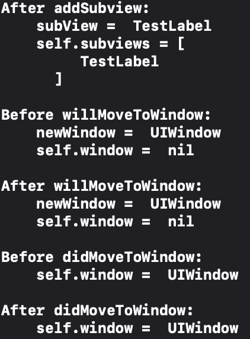

# 触摸事件

## UIView 生命周期

### addSubView 调用链

调用 addSubview 时，父子控件方法调用时机如下：

``` swift
father.addSubView(child)
 |- child.willMoveToSuperView(father)
 |- child.didMoveToSuperView()
child.willMoveToWinodw(window)
child.didMoveToWindow()
```

<div align=center> </div>

### removeFromSuperview 调用链

调用 removeFromSuperview 时，父子控件方法调用时机如下：

``` swift
child.removeFromSuperView()
 |- father.willRemoveSubview(child)
 |- child.willMoveToSuperView(nil)
 |- child.willMoveToWindow(nil)
 |- child.didMoveToWindow()
 |- child.didMoveToSuperView()
```

<div align=center> </div>

## 点击手势

### 触摸事件的生命周期

1. 当系统捕捉到用户的触摸行为后，会由 SpringBoard 将该事件转发给当前正在前台运行的 app；

2. app 收到该事件时，会将其封装为 UIEvent ，其中和触摸相关的参数会被封装在 UIEvent 的 touches 属性中。然后再通过对所有 UIView 类调用 `hitTest(_:with:)` 和 `point(inside:with:)` 方法，确认最佳响应者，以及从最佳响应者到 UIApplication 的响应链，并再次对 UIEvent 做一次封装；

   - 点击坐标在 TestContainer 内，而不在 TestGestureView 内时：
        <div align=center></div>
   - 点击坐标同时在 TestContainer 和 TestGestureView 内时：
        <div align=center></div>
   - 点击坐标不在 TestContainer 内，而在 TestGestureView 内时：
        <div align=center></div>

    > -hitTest:withEvent: called twice?
    > Q: Is it normal for a single view to be hit-tested twice?
    > A: Yes, it’s normal. The system may tweak the point being hit tested between the calls. Since hitTest should be a pure function with no side-effects, this should be fine.

3. 最后调用 UIApplication 的 sendEvent() 方法，将上一步封装的 UIEvent 传递给所确认的最佳响应者，并在响应链上传递，并最终被消费或释放。

### UIResponder

UIResponder 是 iOS 系统中用于处理用户事件的类，包括触摸（touches）、按压（presses）、摇动（motion）等事件。前文所提到的响应链上的对象，均是 UIResponder 的子类，包括对应用程序进行控制和协调处理的 UIApplication，管理视图层次结构的 UIViewController 和管理最终内容呈现的 UIView（包括 UIWindow）。
    <div align=center></div>

#### 响应方法

以触摸事件举例，系统在找到最佳响应者后，UIApplication 会将事件按照响应链进行传递，每个控件可通过重写响应方法来响应具体事件：

``` swift
func touchesBegan(_touches: Set<UITouch>, with event: UIEvent?)
func touchesMoved(_ touches: Set<UITouch>, with event: UIEvent?)
func touchesEnded(_touches: Set<UITouch>, with event: UIEvent?)
func touchesCancelled(_ touches: Set<UITouch>, with event: UIEvent?)
```

<div align=center></div>

### UIGestureRecognizer

UIGestureRecognizer 是一个抽象类，内部对触摸事件进行了封装，其子类则封装了具体的用户的触摸行为，例如点击、长按、滑动等。
    <div align=center></div>

#### 为什么需要手势

通过 UIResponder 提供的响应方法，我们可以完整的感知到用户的行为，包括用户手指的按压、移动与抬起，用户此次触摸事件的持续时间，用户此次触摸事件中的触控点的数量，等等。当我们想要实现一个点击功能时，通过重写 `touchesEnded(_:with:)` 方法可以轻松做到，但是当触摸事件复杂起来，就需要加一些逻辑判断。例如，判断用户长按 2s，判断用户三指聚合等等。同时，当我们有多个控件且在同一响应链时，因为上述响应方法会依次传递，还需要额外考虑冲突和优先级问题。而通过系统提供的 UIGestureRecognizer，可以自定义的封装一些特殊逻辑，比如要求触控点的数量，要求按压的时间，等等，方便复用。对于较为常见的手势，如点击、长按、滑动等，系统也为我们预先做了封装，为开发者提供了极大的便利。

#### 响应方法

UIGestureRecognizer 内部提供了和 UIResponder 一致的生命周期相关的响应方法，前面有提到我们可以通过对于 UIGestureRecognizer 做一些自定义封装，例如限定用户需要画一个 “S”，就是通过这些方法来实现的。

``` swift
func touchesBegan(_touches: Set<UITouch>, with event: UIEvent?)
func touchesMoved(_touches: Set<UITouch>, with event: UIEvent?)
func touchesEnded(_touches: Set<UITouch>, with event: UIEvent?)
func touchesCancelled(_touches: Set<UITouch>, with event: UIEvent?)
```

此外，我们还需要给手势绑定一系列的响应方法，当手势识别通过之后，会调用到其绑定的所有 action。

``` swift
func init(target: Any?, action: Selector?)
func addTarget(_target: Any, action: Selector)
func removeTarget(_target: Any?, action: Selector?)
```

对于单个控件，当同时使用 UIGestureRecognizer 和 UIResponder 的机制时，系统会优先处理手势事件，如果识别成功，会取消掉 UIResponder 的响应，即先调用 UIGestureRecognizer 对应的响应方法，同时会调用 UIView 所对应的响应方法中的  `touchesCancelled(_:action:)` 来替代 `touchesEnded(_:action:)`：
    <div align=center>
    
    
    </div>

#### 和响应链的关系

对于 UIResponder，前面有提到可通过 hittest 的机制来确认最佳响应者，而在引入了手势之后，系统会在确认响应链的同时，会将响应链上的控件的所有手势按照响应链的顺序（从最佳响应者到 UIApplication）也封装进 UIEvent 中的 touches 里。

- 父控件 TestContainer 具有手势 TestContainerGesture，子控件 TestTapGestureView 具有手势 TestTapGesture，最终 UIEvent 内部的手势数组中，子控件手势在前，父控件手势在后：
    <div align=center></div>

所以，当响应链上的控件具有手势时，就会被封装进 UIEvent 中，且此时手势具有更高的优先级，无论手势所对应的控件是否是最佳响应者。

- 父控件 TestContainer 具有手势 TestContainerGesture，子控件 TestResponderView 没有，最终响应了父控件的手势：
    <div align=center></div>

### UIControl

UIControl 是 UIView 的子类，也同样具备 UIResponder 的特性，同时其本身提供了类似于手势的 target-action 的模式来处理触摸事件。同样的，系统也为我们封装了一些常用的子类，如 UIButton、UISwitch 等。
    <div align=center></div>

#### 响应方法

UIControl 提供了一套独有的方法来追踪事件，还有手动添加和移除 action 的方法：

``` swift
func beginTracking(_touch: UITouch, with event: UIEvent?) -> Bool
func continueTracking(_ touch: UITouch, with event: UIEvent?) -> Bool
func endTracking(_ touch: UITouch?, with event: UIEvent?)
func cancelTracking(with event: UIEvent?)

func addTarget(_target: Any?, action: Selector, for controlEvents: UIControl.Event)
func removeTarget(_ target: Any?, action: Selector?, for controlEvents: UIControl.Event)
```

同时也可以看到，UIResponder 的生命周期相关的方法，会更优先调用，且与 UIControl 之间没有冲突关系。更进一步，通过断点调试可看到，UIControl 所对应的方法，其实是在 UIResponder 所对应方法的内部被调用的：
    <div align=center></div>

而当加入手势时，则会产生优先级问题：

1. 手势添加在 UIControl 上，此时 button 不会阻止其自身的 gesture 的响应，当 gesture 响应成功后，会取消掉 UIResponder 的响应，并进而取消掉 UIControl 的响应。此时 gesture 优先级更高：
    <div align=center></div>

2. 手势添加在 UIControl 的父控件上，button 则会阻止其父控件的 gesture 的响应，当 UITapGesture 走到 Ended 阶段之后，状态位会被置为 UIGestureRecognizerStateFailed (= 5)，可以正常响应 UIResponder 和 UIControl 对应的方法。此时 button 的优先级更高：
    <div align=center></div>

## others

<https://www.jianshu.com/p/c4d8082989e>

<https://www.jianshu.com/p/4ca805af1570>

<https://www.jianshu.com/p/8f8f555a1133>
