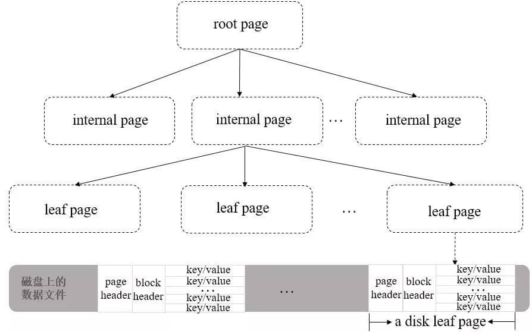

# MongoDB

MongoDB 是一种基于文档的分布式数据库，采用 BSON（二进制 JSON）格式存储数据，属于 NoSQL 数据库，适合处理非结构化或半结构化数据，支持水平扩展和高可用性。

适用场景如下：

- **内容管理系统（CMS）**：灵活存储多态内容（如文章、评论）
- **实时分析**：处理日志、传感器数据等时序数据
- **移动应用**：支持快速迭代和地理位置查询
- **物联网（IoT）**：存储设备生成的海量非结构化数据
- **不适合场景**：需要复杂事务（如金融系统）或多表关联查询的应用

## 核心特点

- **文档模型**：数据以类似 JSON 的文档形式存储，支持嵌套结构和动态模式
- **高性能**：通过内存映射、索引优化和高效的查询引擎实现快速读写
- **水平扩展**：通过分片（Sharding）技术将数据分布到多台服务器，支持海量数据存储
- **高可用性**：通过复制集（Replica Set）实现自动故障转移和数据冗余
- **灵活查询**：支持丰富的查询语言（如范围查询、聚合管道、地理空间查询）和多种索引类型（单字段、复合、全文、TTL 索引等）
- **事务支持**：自 4.0 版本起支持多文档 ACID 事务（在复制集和分片集群中）

## 存储结构

### 文档（Document）

文档数据的基本单元，采用 BSON 格式，由键值对组成，类似于 JSON 对象，如 `{ "name": "Alice", "age": 30 }`。BSON（Binary JSON） 是 JSON 文档的二进制表示，在遍历速度上要优于 JSON，同时额外支持很多数据类型，如日期、正则表达式、时间戳、二进制数据、JS 代码等。

文档的 `value` 支持任意合法类型，包括其他文档、数据和文档数据，文档的 `key` 可以使用任意 UTF-8 字符，特殊要求如下：

- `key` 不能包含空字符 `\0`，需要用来表示字符串的结尾（底层是 C++ 实现）
- `.` 和 `$` 有特殊含义，在特定环境下使用
- 以 `_` 开头的键一般认为是保留字符（非严格要求）

每个文档会有一个唯一标识符 `_id`，类似于关系型数据库的 Primary Key，默认自动生成。

### 集合（Collection）

文档的容器，类似关系型数据库的“表”，但无固定结构，可以插入不同格式和类型的数据。

集合不需要预先创建，当插入第一个文档或创建第一个索引时，会自动创建。

集合名是 UTF-8 字符串，有如下限制条件：

- 不能是空字符串 `""`
- 不能包含空字符 `\0`，需要用来表示集合名的结尾
- 不能以 `system.` 开头，是系统保留集合
  - `system.users` 存储数据库的用户信息
  - `system.namespaces` 存储数据库的集合信息
- 必须以 `_` 或字符符号开始，并且不能包含 `$`

### 数据库（Database）

集合的物理分组，一个 MongoDB 实例可包含多个数据库，每个数据库有自己的集合和权限。

MongoDB 中预留了几个特殊数据库：

- **admin**：存储 root 用户和角色
- **local**：存储本地数据，无法被正常备份或复制到其他分片
- **config**：存储分片相关配置
- **test**：默认创建的测试库

数据库名同样是 UTF-8 字符串，有如下限制条件：

- 不能是空字符串 `""`
- 不能包含 `\0`、` `、`.`、`$`、`/`、`\`
- 字母应全部小写
- 最多 64 字节

## 存储引擎

与 MySQL 一样，MongoDB 采用插件式的存储引擎架构，支持不同类型，常见引擎如下所示：

- **WiredTiger**：目前的默认引擎，适合绝大多数工作场景
- **In-Memory**：在 MongoDB Enterprise 中可用，将文档存储在内存中以获得更可预测的数据延迟
- **MMAPV1**：老版本默认引擎，4.x 版本中废弃

### 存储结构

WiredTiger 在底层实现上，默认采用了 B+ 树作为作为存储结构，与 MySQL 的 InnoDB 一致，其整体结构如下所示：

- **root page**：根节点
- **internal page**：非叶子节点，存储索引键值与子节点指针
- **leaf page**：叶子节点，存储索引键值与最终数据



### 事务

在新版本中，WiredTiger 支持了事务能力，并同样具备 ACID 特性，在实现上主要使用了 `snapshot`、`MVCC` 和 `redo log`，其相关结构描述如下：

```c
// 事务对象
wt_transaction {
    transaction_id      // 事务 ID
    snapshot_object     // 当前事务开始时，其他活跃事务，用于事务隔离
    operation_array     // 本次事务中已执行的操作列表，用于事务回滚
    redo_log_buf        // 操作日志缓冲区，用于事务提交后的持久化
    state               // 事务当前状态
}

// mvcc 链表节点
wt_mvcc {
    transaction_id      // 本次修改事务的ID
    value               // 本次修改后的值
}

// 数据快照
snapshot_object {
    snap_min            // 活跃事务的最小 ID
    snap_max            // 活跃事务的最大 ID
    snap_array          // 活跃事务列表
};
```

**事务流程**

- **开启**
  - 创建一个事务对象并添加至全局的事务管理器中
  - 根据隔离级别，判断是否创建 `snapshot`

- **执行（写操作）**
  - 根据隔离级别，判断是否创建 `snapshot`
  - 新增一个 update 记录
  - 写入 `operation_array` 和 `redo_log_buf` 中，用于回滚和持久化
  - 同时写入 `mvcc_list` 中，以版本链的形式管理

- **提交**
  - 将 `redo_log_buf` 中的数据写入 redo log file 中，并持久化到磁盘
  - 清除创建的 `snapshot`
  - 修改 `mvcc_list` 中对应的 `transaction_id` 为 `WT_TNX_NONE`，代表已提交

- **回滚**
  - 修改 `mvcc_list` 中对应的 `transaction_id` 为 `WT_TXN_ABORTED`，代表已回滚

**隔离性**

WT 引擎的隔离性分为如下三种：

- **Read-Uncommited**（读未提交）
  - 将 `snapshot` 中的 `snap_array` 设置为空
  - 读取 `mvcc_list` 时，总是以最新的值为准

- **Read-Commited**（读已提交）
  - 操作前创建一个 `snapshot`
  - 读取 `mvcc_list` 时，根据事务 ID 和状态来做可见性判断

- **snapshot-Isolation**（快照隔离）
  - 开启事务时，创建快照，后续操作以此为准

其中 **snapshot-Isolation** 级别能够同时避免重复读与幻读问题，核心在于快照是全局快照，而 InnoDB 的 Read View 仅是行级快照

**持久化**

WT 引擎同样使用 WAL（Write-Ahead Log）的方案，先写入 Redo Log，再更新实际数据。

当有多个事务同时发生提交时，会触发类似组提交的机制：

- 事务提交时，会尝试加入当前活跃的缓冲区
- 首个加入的事务，会修改当前缓冲区状态，并从缓冲区池中获取一个新缓冲区来提供给新的事务使用
- 缓冲区的所有事务写入 Page Cache 后，会统一执行 Sync 操作
- 如果当前事务加入缓冲区时，发现剩余空间不够，会自旋等待新的活跃缓冲区
- 如果当前事务大于缓冲区大小，会直接写入，同时引擎会尝试放大缓冲区大小，尽可能让后续事务合并提交

## 索引

## 高可用

### 集群

### 分片

## 拓展功能

- **数据压缩**：WT 引擎默认使用 Snappy 压缩算法，对所有集合使用块压缩，对所有索引使用前缀压缩
- **聚合管道**：通过多个阶段（如 `$match`, `$group`, `$sort`）处理数据
- **MapReduce**：用于大规模数据批处理（较聚合管道更复杂）
- **GridFS**：存储大文件（如视频），将文件分块保存为文档
- **Change Streams**：监听数据库变更，实现实时应用

## Ref

- <https://javaguide.cn/database/mongodb/mongodb-questions-01.html>
- <https://javaguide.cn/database/mongodb/mongodb-questions-02.html>
- <https://pdai.tech/md/db/nosql-mongo/mongo-y-trans.html>
