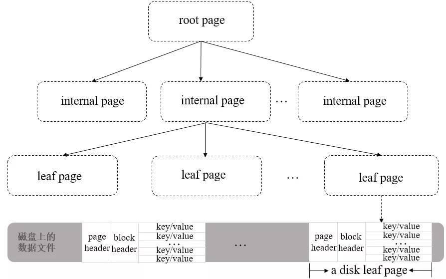

# MongoDB

MongoDB 是一种基于文档的分布式数据库，采用 BSON（二进制 JSON）格式存储数据，属于 NoSQL 数据库，适合处理非结构化或半结构化数据，支持水平扩展和高可用性。

适用场景如下：

- **内容管理系统（CMS）**：灵活存储多态内容（如文章、评论）
- **实时分析**：处理日志、传感器数据等时序数据
- **移动应用**：支持快速迭代和地理位置查询
- **物联网（IoT）**：存储设备生成的海量非结构化数据
- **不适合场景**：需要复杂事务（如金融系统）或多表关联查询的应用

## 核心特点

- **文档模型**：数据以类似 JSON 的文档形式存储，支持嵌套结构和动态模式
- **高性能**：通过内存映射、索引优化和高效的查询引擎实现快速读写
- **水平扩展**：通过分片（Sharding）技术将数据分布到多台服务器，支持海量数据存储
- **高可用性**：通过复制集（Replica Set）实现自动故障转移和数据冗余
- **灵活查询**：支持丰富的查询语言（如范围查询、聚合管道、地理空间查询）和多种索引类型（单字段、复合、全文、TTL 索引等）
- **事务支持**：自 4.0 版本起支持多文档 ACID 事务（在复制集和分片集群中）

## 存储结构

### 文档（Document）

文档数据的基本单元，采用 BSON 格式，由键值对组成，类似于 JSON 对象，如 `{ "name": "Alice", "age": 30 }`。BSON（Binary JSON） 是 JSON 文档的二进制表示，在遍历速度上要优于 JSON，同时额外支持很多数据类型，如日期、正则表达式、时间戳、二进制数据、JS 代码等。

文档的 `value` 支持任意合法类型，包括其他文档、数据和文档数据，文档的 `key` 可以使用任意 UTF-8 字符，特殊要求如下：

- `key` 不能包含空字符 `\0`，需要用来表示字符串的结尾（底层是 C++ 实现）
- `.` 和 `$` 有特殊含义，在特定环境下使用
- 以 `_` 开头的键一般认为是保留字符（非严格要求）

每个文档会有一个唯一标识符 `_id`，类似于关系型数据库的 Primary Key，默认自动生成。

### 集合（Collection）

文档的容器，类似关系型数据库的“表”，但无固定结构，可以插入不同格式和类型的数据。

集合不需要预先创建，当插入第一个文档或创建第一个索引时，会自动创建。

集合名是 UTF-8 字符串，有如下限制条件：

- 不能是空字符串 `""`
- 不能包含空字符 `\0`，需要用来表示集合名的结尾
- 不能以 `system.` 开头，是系统保留集合
  - `system.users` 存储数据库的用户信息
  - `system.namespaces` 存储数据库的集合信息
- 必须以 `_` 或字符符号开始，并且不能包含 `$`

### 数据库（Database）

集合的物理分组，一个 MongoDB 实例可包含多个数据库，每个数据库有自己的集合和权限。

MongoDB 中预留了几个特殊数据库：

- **admin**：存储 root 用户和角色
- **local**：存储本地数据，无法被正常备份或复制到其他分片
- **config**：存储分片相关配置
- **test**：默认创建的测试库

数据库名同样是 UTF-8 字符串，有如下限制条件：

- 不能是空字符串 `""`
- 不能包含 `\0`、` `、`.`、`$`、`/`、`\`
- 字母应全部小写
- 最多 64 字节

## 存储引擎

与 MySQL 一样，MongoDB 采用插件式的存储引擎架构，支持不同类型，常见引擎如下所示：

- **WiredTiger**：目前的默认引擎，适合绝大多数工作场景
- **In-Memory**：在 MongoDB Enterprise 中可用，将文档存储在内存中以获得更可预测的数据延迟
- **MMAPV1**：老版本默认引擎，4.x 版本中废弃

### 存储结构

WiredTiger 在底层实现上，默认采用了 B+ 树作为作为存储结构，与 MySQL 的 InnoDB 一致，其整体结构如下所示：

- **root page**：根节点
- **internal page**：非叶子节点，存储索引键值与子节点指针
- **leaf page**：叶子节点，存储索引键值与最终数据



### 事务

在新版本中，WiredTiger 支持了事务能力，并同样具备 ACID 特性，在实现上主要使用了 `snapshot`、`MVCC` 和 `redo log`，其相关结构描述如下：

```c
// 事务对象
wt_transaction {
    transaction_id      // 事务 ID
    snapshot_object     // 当前事务开始时，其他活跃事务，用于事务隔离
    operation_array     // 本次事务中已执行的操作列表，用于事务回滚
    redo_log_buf        // 操作日志缓冲区，用于事务提交后的持久化
    state               // 事务当前状态
}

// mvcc 链表节点
wt_mvcc {
    transaction_id      // 本次修改事务的ID
    value               // 本次修改后的值
}

// 数据快照
snapshot_object {
    snap_min            // 活跃事务的最小 ID
    snap_max            // 活跃事务的最大 ID
    snap_array          // 活跃事务列表
};
```

**事务流程**

- **开启**
  - 创建一个事务对象并添加至全局的事务管理器中
  - 根据隔离级别，判断是否创建 `snapshot`

- **执行（写操作）**
  - 根据隔离级别，判断是否创建 `snapshot`
  - 新增一个 update 记录
  - 写入 `operation_array` 和 `redo_log_buf` 中，用于回滚和持久化
  - 同时写入 `mvcc_list` 中，以版本链的形式管理

- **提交**
  - 将 `redo_log_buf` 中的数据写入 redo log file 中，并持久化到磁盘
  - 清除创建的 `snapshot`
  - 修改 `mvcc_list` 中对应的 `transaction_id` 为 `WT_TNX_NONE`，代表已提交

- **回滚**
  - 修改 `mvcc_list` 中对应的 `transaction_id` 为 `WT_TXN_ABORTED`，代表已回滚

**隔离性**

WT 引擎的隔离性分为如下三种：

- **Read-Uncommited**（读未提交）
  - 将 `snapshot` 中的 `snap_array` 设置为空
  - 读取 `mvcc_list` 时，总是以最新的值为准

- **Read-Commited**（读已提交）
  - 操作前创建一个 `snapshot`
  - 读取 `mvcc_list` 时，根据事务 ID 和状态来做可见性判断

- **snapshot-Isolation**（快照隔离）
  - 开启事务时，创建快照，后续操作以此为准

其中 **snapshot-Isolation** 级别能够同时避免重复读与幻读问题，核心在于快照是全局快照，而 InnoDB 的 Read View 仅是行级快照

**持久化**

WT 引擎同样使用 WAL（Write-Ahead Log）的方案，先写入 Redo Log，再更新实际数据。

当有多个事务同时发生提交时，会触发类似组提交的机制：

- 事务提交时，会尝试加入当前活跃的缓冲区
- 首个加入的事务，会修改当前缓冲区状态，并从缓冲区池中获取一个新缓冲区来提供给新的事务使用
- 缓冲区的所有事务写入 Page Cache 后，会统一执行 Sync 操作
- 如果当前事务加入缓冲区时，发现剩余空间不够，会自旋等待新的活跃缓冲区
- 如果当前事务大于缓冲区大小，会直接写入，同时引擎会尝试放大缓冲区大小，尽可能让后续事务合并提交

## 索引

MongoDB 会默认为 `_id` 建立索引（类似于主键索引），`_id` 字段强制唯一，不可删除和修改，同时也可以手动创建其他字段的索引。

在底层存储上，所有索引的叶子节点的值，均为文档的物理地址，与 InnoDB 不同。

### 核心作用

- **加速查询**：通过减少全集合扫描，快速定位文档。
- **支持排序**：索引存储数据的顺序，避免内存中的高成本排序。
- **唯一性约束**：确保字段值的唯一性。
- **特殊查询优化**：如地理空间、文本搜索等。

### 索引类型

**单字段索引**

- **定义**：对单个字段创建索引，排序无所谓，MongoDB 可以头/尾开始遍历
- **示例**

    ```javascript
    db.collection.createIndex({ field: 1 }) // 1为升序，-1为降序
    ```

**复合索引**

- **定义**：对多个字段联合索引，顺序影响查询效率
- **适用场景**：多条件查询或需要排序的查询
- **示例**：

    ```javascript
    db.collection.createIndex({ a: 1, b: -1 })
    ```

**多键索引（数组索引）**

- **自动创建**：当字段为数组时，MongoDB 自动为每个元素创建索引
- **限制**：不支持复合索引中的多个数组字段

**地理空间索引**

- **定义**：基于经纬度的索引
- **2dsphere**：支持地球几何查询（如距离、相交）
- **2d**：平面地图的坐标索引
- **示例**：

    ```javascript
    db.places.createIndex({ location: "2dsphere" })
    ```

**文本索引**

- **全文搜索**：支持文本内容的搜索和分词
- **示例**：

    ```javascript
    db.articles.createIndex({ content: "text" })
    ```

**哈希索引**

- **分片键优化**：将字段值哈希后存储，支持等值查询
- **示例**：

    ```javascript
    db.collection.createIndex({ field: "hashed" })
    ```

**TTL索引**

- **自动过期**：设置文档的存活时间，自动删除过期数据。
- **示例**：

    ```javascript
    db.logs.createIndex({ createdAt: 1 }, { expireAfterSeconds: 3600 })
    ```

### 索引属性

**唯一索引**

- **强制唯一性**：字段值不可重复，`null` 视为重复值
- **示例**：

    ```javascript
    db.users.createIndex({ email: 1 }, { unique: true })
    ```

**部分索引**

- **条件过滤**：仅对满足条件的文档创建索引，节省空间。
- **示例**：

    ```javascript
    db.orders.createIndex({ status: 1 }, { partialFilterExpression: { total: { $gt: 100 } } })
    ```

**稀疏索引**

- **跳过空值**：仅索引存在该字段的文档。
- **示例**：

    ```javascript
    db.products.createIndex({ sku: 1 }, { sparse: true })
    ```

### 索引管理

- **创建索引**

   ```javascript
   db.collection.createIndex({ field: 1 }, { options })
   ```

- **查看索引**

   ```javascript
   db.collection.getIndexes() // 列出所有索引
   ```

-**删除索引**

   ```javascript
   db.collection.dropIndex("index_name") // 删除指定索引
   db.collection.dropIndexes()           // 删除所有索引
   ```

- **重建索引**

   ```javascript
   db.collection.reIndex() // 修复或重建损坏的索引
   ```

### 查询优化

**`explain()` 方法**

用于分析查询是否使用索引，关键指标如下：

- `totalDocsExamined`：扫描的文档数
- `executionTimeMillis`：查询耗时
- `stage`：查询阶段（如`IXSCAN`表示使用索引）

```javascript
db.collection.find({ a: 5 }).explain("executionStats")
```

**最左匹配**

MongoDB 的复合索引，仍然遵循最左匹配原则。

**覆盖查询**

当所有的查询字段都是索引的一部分时，会直接从索引返回结果，无需访问文档：

```javascript
// 若存在索引 { a: 1, b: 1 }
db.collection.find({ a: 5 }, { _id: 0, a: 1, b: 1 })
```

特殊要求如下：

- 查询中没有字段等于 `null`
- MongoDB 会默认返回 `_id` 字段，所以需要显式指定 `_id: 0`，将其从结果中排除

## 集群

MongoDB 的集群逻辑主要围绕**高可用性**和**水平扩展**两大核心需求设计，其核心架构包括 **副本集（Replica Set）** 和 **分片集群（Sharded Cluster）**。

### 副本集

**目的**

实现数据冗余、故障自动切换、读写分离，保障高可用性。

**核心角色**

- **Primary（主节点）**：唯一可处理写操作的节点，所有写操作通过主节点完成，并记录操作日志（Oplog）
- **Secondary（从节点）**：异步复制主节点的数据，默认不可写但可读（需配置读偏好）。数量通常为 1 个或多个
- **Arbiter（仲裁节点）**：不存储数据，仅参与选举投票，用于避免选举僵局（如偶数节点场景）

**读写分离**

- 默认读操作由主节点处理
- 可通过设置读偏好（Read Preference）将读请求路由到从节点（如 `secondary` 或 `nearest`）

**数据同步机制**

- **Oplog（操作日志）**：主节点将所有写操作记录到 `local.oplog` 集合，从节点通过拉取并重放 Oplog 实现数据同步
  - oplog 是 local 库下的一个特殊的**上限集合(Capped Collection)**
  - 上限集合类似于定长循环队列，数据顺序追加到集合尾部，并覆盖历史文档
- **心跳检测**：节点间通过心跳（默认每 2 秒）监测彼此状态

**故障转移**

- **触发时机**：若主节点失联超过一定时间（默认 10 秒），认为不可用，触发选举
- **选举逻辑**：剩余节点会基于 Raft 协议，选出新的主节点
- **选举条件**：多数派（N/2 + 1）节点存活且达成共识

### 分片集群

**目的**

将数据水平拆分到多个节点（分片），实现海量数据的分布式存储和负载均衡。

**核心组件**

- **Shard（分片）**：每个分片存储集群数据的一个子集，从 3.6 版本开始，每个分片必须部署为副本集
- **Config Server（配置服务器）**：存储集群元数据（如分片键、数据分布信息），必须为副本集（3 节点起步）
- **Mongos（查询路由器）**：客户端入口，负责从 config Server 获取数据，路由请求到对应分片，合并结果返回给客户端

**分片键（Shard Key）**

选择集合中某个字段（或复合字段）作为分片依据，决定数据在分片间的分布，要求如下：

- 必须在所有文档中均出现
- 必须是集群的单索引或复合索引的最左前缀
- 大小不能超过 512 字节

4.2 版本之前，分片键字段的值不可变，4.2 版本开始，不做限制，5.0 版本开始，实现了实时重新分片（live resharding），可以实现分片键的完全重新选择。

分片键的选择直接影响集群性能和数据均衡性，需重点关注以下四个因素：

- **高基数（High Cardinality）**
  - **原则**：分片键的取值范围应尽可能大（如用户 ID、订单号），避免低基数字段（如性别、年龄）
  - **原因**：低基数字段可能导致 `Chunk` 数量不足，随着数据增长，单个 `Chunk` 易超出默认大小（64MB），形成无法迁移的 `Jumbo Chunk`，引发数据倾斜和性能瓶颈

- **均匀分布（Even Distribution）**
  - **原则**：分片键的取值分布需尽量均匀，避免数据集中在特定范围
  - **原因**：分布不均同样会导致数据倾斜和性能瓶颈问题

- **查询相关性（Query Coverage）**
  - **原则**：优先选择高频查询条件中的字段作为分片键
  - **原因**：查询包含分片键时，`mongos` 可精准路由到特定分片（定向查询）；否则需向所有分片广播查询，增加延迟和资源消耗

- **避免单调变化（Non-Monotonic）**
  - **原则**：避免使用单调递增/递减字段（如时间戳、自增ID）作为分片键
  - **原因**：此类分片键会导致写入集中在单个分片（最新/最旧 `Chunk`），形成热点，且频繁触发 `Chunk` 迁移，影响写入性能
  - **替代方案**：对单调字段哈希分片，或采用复合分片键（如 `{_id: 1, timestamp: 1}`）

**分片策略**

- **范围分片（Range Sharding）**
  - 按分片键的值范围划分数据
  - **优点**：适合范围查询
  - **缺点**：数据可能分布不均，容易造成读写热点
- **哈希分片（Hash Sharding）**
  - 对分片键计算哈希值后分布
  - **优点**：数据均匀，避免单调问题
  - **缺点**：范围查询效率低
- **区域分片（Zone Sharding）**
  - 自定义数据分布规则，如将特定范围数据分配到指定分片
  - **优缺点**：与具体业务规则有关

**数据均衡与迁移**

- **Chunk（数据块）**：每个分片内的数据按分片键划分为多个 Chunk（默认64MB），当 Chunk 大小超过阈值时触发分裂
- **Balancer（均衡器）**：监控各分片的 Chunk 数量，自动迁移 Chunk 以实现负载均衡

**查询路由**

- **定向查询**：若查询包含分片键，Mongos 直接将请求路由到对应分片
- **广播查询**：若查询不包含分片键，Mongos 需向所有分片发送请求，合并结果后返回

**最佳实践**

- **分片键选择**
  - **原则**：高基数（大量唯一值）、低频率（避免重复值）、非单调递增（防止写入热点）
  - **示例**：用户ID（哈希分片）、时间戳（范围分片但需结合其他字段避免热点）

- **预分片（Pre-Splitting）**
  - 初始化时手动划分 Chunk，避免写入初期因频繁迁移导致性能下降

- **跨分片事务**
  - MongoDB 4.2+ 支持跨分片事务，但需注意性能影响，建议控制事务范围。

- **监控与管理**
  - 使用工具（如 MongoDB Atlas、Ops Manager）监控集群状态，关注 Chunk 分布、Balancer 状态等

## 拓展功能

- **数据压缩**：WT 引擎默认使用 Snappy 压缩算法，对所有集合使用块压缩，对所有索引使用前缀压缩
- **聚合管道**：通过多个阶段（如 `$match`, `$group`, `$sort`）处理数据
- **MapReduce**：用于大规模数据批处理（较聚合管道更复杂）
- **GridFS**：存储大文件（如视频），将文件分块保存为文档
- **Change Streams**：监听数据库变更，实现实时应用

## Ref

- <https://javaguide.cn/database/mongodb/mongodb-questions-01.html>
- <https://javaguide.cn/database/mongodb/mongodb-questions-02.html>
- <https://pdai.tech/md/db/nosql-mongo/mongo-y-trans.html>
