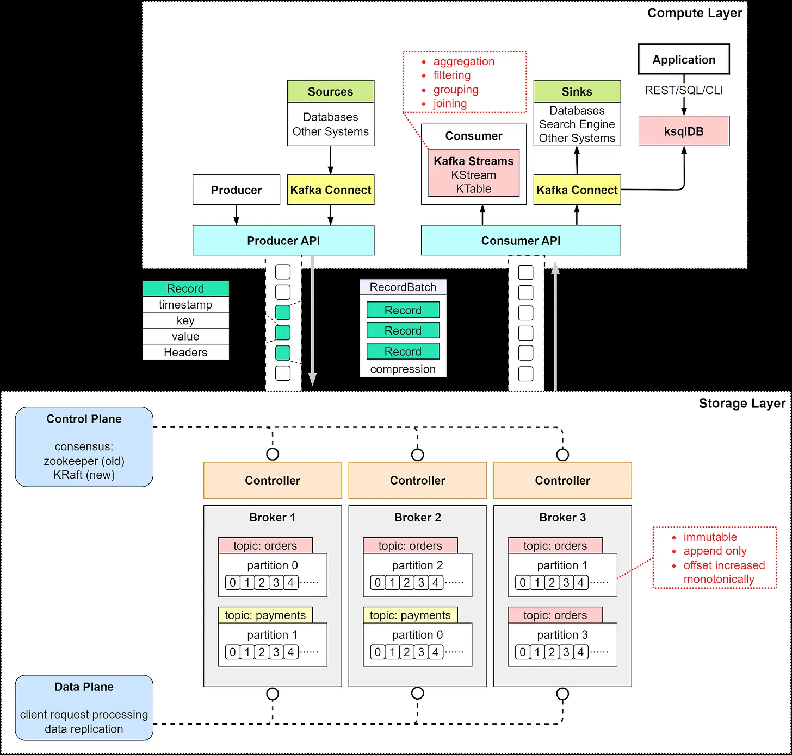
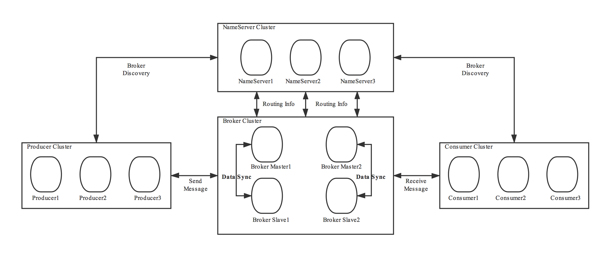

# MQ

## 基本概念

消息队列（Message Queue，MQ）是一种在分布式系统中用于**异步通信**的中间件技术。它通过**存储和转发消息**的方式，实现不同服务或组件之间的解耦、流量削峰、异步处理等目标，其相关概念如下所示：

- **消息（Message）**
  - 传递的数据单元，通常包含业务数据、元数据（如消息ID、时间戳）等
  - 消息根据实际需要，可分为普通消息、定时/延时消息、顺序消息、事务消息等

- **生产者（Producer）**
  - 负责创建并发送消息到 Broker 的服务或应用

- **消费者（Consumer）**
  - 从 Broker 中获取消息并进行处理的角色

- **队列（Queue）**
  - 存储消息的容器，遵循先进先出（FIFO）的规则，部分系统支持优先级
  - 用于**点对点模型**，即单播场景，多个消费者绑定同一个 Queue 时，消息会分摊给多个消费者
  - 不考虑优先级的场景下，同一队列的消息，天然有序，消息在队列中的位置通过 Offset 进行管理

- **主题（Topic）**
  - 消息传输和存储的顶层逻辑容器，内部由多个 Queue/Partition 组成
  - 用于**发布订阅模型**，即多播场景，绑定同一个 Topic 的多个消费者成为订阅者组，消息会发给所有消费者
  - 为数据隔离、订阅隔离、权限管控提供分类标识

- **消息中间件（Broker）**：
  - 消息队列的核心服务，负责接收、存储、路由和投递消息
  - 某些场景下还需要支持消费确认、发送确认等能力
  - Broker 可以看作一个消息队列的实例，多个 Broker 可以构成一个 Cluster（集群）
  - 一个 Broker 内部一般会包含多个 Topic/Queue

## 工作流程

### **生产者发送消息**

**创建消息**

- 生产者生成包含业务数据的消息

**选择目标 Queue/Topic**  

- 根据业务规则，将消息发送到指定的 Queue/Topic

**发送消息到 Broker**  

- 生产者通过协议将消息传输到 Broker

### **Broker 处理**

**接收消息**  

- Broker 验证消息格式和权限，确认生产者有权发送到目标队列

**存储消息**  

- **内存暂存**：高性能但可能丢失
- **磁盘持久化**：确保消息可靠性

**路由与分发**  

- **队列模式**：直接存储到指定队列
- **发布-订阅模式**：分发至指定的 Topic 中，并根据路由规则存储在指定的 Queue/Partition 中
  - **路由规则**：精准匹配、随机、优先级、负载均衡、时间窗口、关键字匹配、业务标签、条件匹配、广播等

**消息超时与重试**  

- Broker 可设置消息存活时间（TTL）
- 超时后移入死信队列（Dead-Letter Queue）或丢弃

### **消费者消费消息**

**订阅队列/主题**

- 消费者向Broker声明监听的队列或订阅的主题

**拉取消息（Pull）或推送消息（Push）**

- **Pull模式**：消费者主动从 Broker 拉取消息
- **Push模式**：Broker 主动将消息推送给消费者

**处理消息**

- 消费者根据获取的消息，执行业务逻辑

**消息确认（ACK）**

- **自动ACK**：Broker推送消息后立即标记为已消费（可能丢失消息）

- **手动ACK**：消费者处理完成后显式发送 ACK，Broker 删除消息
  - 若消费者处理失败或超时未 ACK，Broker 会将消息重新投递（可能引发重复消费）

**错误处理**

- **重试队列**：处理失败的消息进入重试队列，按策略重试
- **死信队列（DLQ）**：多次重试失败的消息进入死信队列，人工介入处理

## 使用场景

**异步**

- 将耗时操作异步化，避免同步阻塞

**接耦**

- 生产者与消费者通过 Queue/Topic 进行关联，无需直接耦合
- 新增或修改消费者，不影响生产者

**削峰**

- 突发流量下，MQ 作为缓冲区，服务根据实际能力去消费消息，避免过载

**最终一致性**

- 利用 MQ 实现 TCC、Sagas 等协议，并实现分布式场景下的事务一致性

**顺序消息**

- 保障生产者发送的消息，按照特定顺序被消费

**定时/延时消息**

- 消息发送后，在未来的一个时间点被消费

**数据流**

- 针对分布式系统的数据流，如业务日志、监控数据、用户行为等，通过 MQ 聚合到大数据平台

## 保障策略

### 服务质量

在保证消息一致性时，存在三种语义：

- **At Least Once**：最少一次。在消息队列中，指消息不丢失，一条消息最少被消费一次，但是可能会有重复消费
- **Exactly Once**：恰好一次。在消息队列中，消息被精准消费一次，不丢失，也不会重复
- **At Most Once**：最多一次。在消息队列中，消息不会被重复消费，但是可能会有消息丢失

可以看到，**Exactly Once** 的要求最高，既不能有重复消费，也不能有消息丢失，而对于其他两个语义，则分别在重复消费和消息丢失上做了妥协。

在实现上，MQ 对于生产者的幂等处理，以 Kafka 为例，需要以 Producer ID、Topic、Partition、Sequence Number 四个元素作为 Key 来判断，对于 Producer 重启（PID 更新）和多分区消息重试（Leader 切换但是 Seq Num 未同步）的场景，则无法继续保障幂等性。

所以，想要真正实现 **Exactly Once** 语义，则需要事务消息来保障跨会话、跨分区的原子性问题，会带来额外的性能开销。

从消费者角度考虑，大部分场景下本身也需要做幂等保证，**At Least Once** 即可满足诉求。对于对数据丢失容忍度更高的场景，比如非关键的实时监控和 UDP，也可以直接选择 **At Most Once**。

### 消息丢失

**生产者**

- **场景**：网络抖动或 Broker 宕机导致发送失败
- **解决方案**
  - 配置 `ACK` 和 `Retries` 策略，同步等待或异步回调进行处理
  - 对 `ACK` 超时或 `Retries` 超限的异常场景做兜底处理

**Broker**

- **场景**：未持久化时宕机导致内存数据丢失
- **解决方案**
  - 强化主备逻辑，当副本也同步收到消息时，才认为消息接收成功，但是只能降低消息丢失概率
  - 强化持久化逻辑，当持久化成功时，才认为消息接收成功，处理耗时会额外增加

**消费者**

- **场景**：自动提交 Offset 后处理失败
- **解决方案**
  - 关闭自动提交 Offset 的能力，消费完后手动提交
  - 如果消费后、提交前宕机，有可能导致重复消费

### 重复消费

**生产者**

- **场景**：Broker Ack 异常引发重试等原因导致重复发送
- **解决方案**
  - 通过 ProducerID 和 SequenceID 来标识消息，并在 Broker 做幂等判断
  - 无法保障全局幂等，仅能保障 Topic/Queue 级别幂等

**消费者**

- **场景**：消费完成后，提交 Offset 时失败，导致重复获取
- **解决方案**
  - 生产者额外给消息添加一个全局 ID（分布式 ID），消费者根据该 ID 做幂等

### 消息顺序

**生产者**

- **场景**：生产者并发发送导致消息乱序
- **解决方案**
  - **全局有序**：Topic 内采取单 Partition/Queue
  - **局部有序**：发送消息时，指定 Key 或者 Partition/Queue（相同的 Key 会分配至相同的 Partition/Queue）

**消费者**

- **场景**：消费者并发消费导致消息乱序
- **解决方案**
  - **单线程消费**：每个 Partition/Queue 分配独立单线程处理

### 消息堆积

- 消费速度快速下降：排查消费者异常
- 发送速度快速上升：
  - 排查生产者异常
  - 流量突发，临时扩容处理，或流量降级，非核心消息降级丢弃或转存死信队列
- 发送、消费速度无突变，逐渐积压：优化消费速度或扩容

### 死信队列

死信队列（Dead Letter Queue, DLQ） 是处理异常消息的核心机制，用于捕获无法被正常消费的消息，避免消息丢失或无限重试，当达到以下条件时，会将消息转发至死信队列中：

- 消费失败重试耗尽：消息被消费者多次重试后仍失败
- 消息过期（TTL）：消息或队列设置 TTL（Time-To-Live），超时未被消费
- 队列满或消息被拒绝：队列达到最大长度（x-max-length）或消费者主动拒绝（basic.reject）且不重新入队
- 路由错误：消息无法路由到任何队列

对于死信队列中的消息，需要采取特殊的消费策略，例如告警通知、延迟重试、消息补偿等。

## Kafka

### 整体架构

Kafka 整体架构如下所示

**Control Plane**

- 负责管理 Kafka 集群的元数据，包括 Broker 注册、Topic 注册、负载均衡等
- 旧版本使用 ZooKeeper 实现，新版本使用基于 Raft 的 KRaft 协议实现，更加轻量化
- 新增 **Broker** 时，**Partition** 自动重新分配，实现负载均衡
- **Partition** Leader 故障时，从 ISR 中选举新 Leader

**Data Plane**

- **Broker**：Kafka 的服务节点，可看作是一个独立的 Kafka 实例，多个 Broker 组成一个集群
- **Topic**：逻辑上的消息分类，每个 Topic 可分为多个 **Partition**，方便水平拓展
- **Partition**：消息存储的最小单元，每个 Partition 在物理上对应一个日志文件
- **Replica**：每个 Partition 有多个副本，包括 **Leader**（处理读写）和 **Follower**（异步/同步复制数据），
- **ISR（In-Sync Replicas）**：与 Leader 数据同步的副本集合，触发故障转移时，控制面会从这部分集合中选举新 Leader

### 消息类型

**有序**

- **局部有序**：每个分区（Partition）内的消息按写入顺序严格有序，但不同分区之间的消息顺序无法保证
- **全局有序**：需要限制 Topic 保持单分区
- **消费有序**：消费者按分区顺序消费（单线程或分区内多线程）

**延迟**

默认不支持延迟消息，需要业务处理。

- **消费者过滤**：消息附带目标触发时间戳，消费者轮询过滤未到期的消息
- **外部调度**：结合外部系统记录延迟时间，到期后重新投递到 Kafka

### 事务

Kafka 在高版本中支持了事务消息，其主要目标是实现 Exactly-Once 语义，确保生产者和消费者在分布式环境下的原子性操作。

**关键组件**

- **事务协调器（Transaction Coordinator）**：Broker 中的组件，负责管理事务状态
- **事务日志（Transaction Log）**：存储事务元数据（如事务 ID、状态）的内部 Topic（`__transaction_state`）
- **生产者事务 ID（Transactional ID）**：唯一标识一个生产者实例，用于故障恢复和跨会话事务关联

**实现流程**

- **初始化事务**：生产者通过 `initTransactions()` 向协调器注册，获取事务 ID 并建立会话
- **开启事务**：生产者调用 `beginTransaction()`，标记事务开始
- **发送消息**：消息被发送到目标 Topic，但处于未提交状态，消费者不可见
  - isolation.level=read_committed 时，仅读取已提交的消息
  - isolation.level=read_uncommitted 时，读取所有消息（默认）
- **提交或回滚**
  - **提交**：生产者发送 `commitTransaction()` 请求，协调器将事务标记为提交，消息对消费者可见
  - **回滚**：生产者调用 `abortTransaction()`，协调器丢弃事务相关的消息
- **两阶段提交（2PC）**
  - **Prepare 阶段**：协调器将事务状态标记为 "Prepare Commit" 并持久化到事务日志
  - **Commit 阶段**：协调器向所有相关分区写入提交标记，使消息可见

**Exactly-Once 保障**

- 跨会话幂等
  - Producer 重启会导致 Producer ID 重置，重新发送时 PID 无法满足幂等性
  - 通过生产者事务 ID 可以进行保障

- 跨分区原子性
  - 多分区消息提交时可能部分成功、部分失败，但是生产者只能全部重新发送
  - 若分区恰好更换 Leader 且 Seq Num 未同步，同样无法满足幂等性
  - 通过 2PC 保障跨分区发送消息时的原子性

### 容错

**发送重试**

- **重试策略**：配置**重试次数**和**重试间隔**，应对网络抖动或 Broker 短暂不可用
- **幂等性**：支持按照 ProducerID 和 SequenceID 去重

**死信队列**

默认不支持死信队列，需要业务处理。

- 消费者将多次失败的消息转发到指定的 DLQ Topic
- 监控 DLQ 并人工处理异常消息

### 持久化

**刷盘**

- 消息默认异步刷盘，Kafka 将消息写入 Page Cache 后立即返回成功
- 依赖操作系统定期将缓存数据刷新到磁盘
- 可手动配置同步刷盘策略，如消息量或时间

**副本**

- 可通过 `replication.factor` 配置分区的副本数量，降低消息丢失风险
- 可通过 `min.insync.replicas` 参数配置消息写入多少个副本后，代表接受成功
- 一般可设置 `min.insync.replicas=replication.factor-1`，兼顾可用性

### 高可用

**分区副本**

- 每个分区有且仅有一个 Leader 副本，负责处理所有读写请求
  - 生产者和消费者均与 Leader 交互
- 其他副本均为 Follower，从 Leader 异步拉取（Pull）消息并持久化到本地日志，保持与 Leader 的数据同步
  - Follower 副本不对外提供服务，仅作为 Leader 的备份，用于故障时快速切换
- Kafka 维护一个 ISR（In-Sync Replicas）列表，包含所有与 Leader 保持同步的副本（包括 Leader 自身）
  - 同步条件：Follower 副本的 LEO（Log End Offset，最新消息位置）与 Leader 的 HW（High Watermark，已提交消息位置）差距在可接受范围内
  - 若 Follower 副本长时间未同步，会被移出 ISR 列表，避免拖慢整体同步效率

**故障恢复**

- 若 Leader 宕机，Controller 节点从 ISR（In-Sync Replicas）列表选举新 Leader
- 若 ISR 列表为空，根据配置，可能选举非同步副本

**拓展**

- 支持动态添加 Broker，分区自动均衡

## RocketMQ

### 整体架构

RocketMQ 整体架构如下所示

**NameServer**

- RocketMR 的注册中心，负责 Broker 和路由信息的管理

**Broker Cluster**

- **Broker**：存储消息，分为 **Master**（读写）和 **Slave**（只读或故障切换）
- **Topic**：逻辑消息分类，分为多个 **MessageQueue**（类似 Kafka 的 Partition）
- **MessageQueue**：消息存储单元，分布在多个 Broker 上，避免单点故障

### 消息类型

**有序**

- 生产顺序：需要满足单一生产者，串行发送消息
  - 全局有序：Topic 仅一个 MessageQueue
  - 分区有序：相同业务键分配到同一队列
- 消费顺序：消费者串行消费

**延迟**

- 原生支持，内置 **18 个固定延迟等级**（1s/5s/10s/30s/1m/.../2h）
- 生产者发送时指定 `delayTimeLevel`，Broker 根据等级将消息暂存到延迟队列，到期后转发到目标 Topic

### 事务

RocketMQ 通过半消息和事务状态回查，保障事务的最终一致性。

**关键组件**

- **半消息（Half Message）**：暂存于 Broker 的特殊消息，消费者不可见
- **事务监听器（Transaction Listener）**：由生产者实现，用于执行本地事务和回查状态
- **事务回查线程**：Broker 主动询问生产者事务状态

**实现流程**

- **发送半消息**
  - 生产者发送消息到 Broker
  - Broker 将其标记为 `PREPARED` 状态（消费者不可见）
- **执行本地事务**
  - 生产者执行本地事务，并返回事务状态（COMMIT/ROLLBACK）
- **提交或回滚**
  - COMMIT：将消息转为 `COMMITTED` 状态，消费者可见
  - ROLLBACK：丢弃消息
- **事务状态回查**
  - 若 Broker 未收到确认（如网络超时），会定期向生产者回查事务状态
  - 生产者需实现 `checkLocalTransaction` 方法返回最终状态。

### 容错

**发送重试**

- **自动重试**
  - 消费失败后，消息进入 **重试队列（%RETRY%Topic）**，由 Broker 定时重投
  - 重试次数可配置（默认 16 次，间隔逐步增加：10s/30s/1m/2m/.../2h）
- **重试队列管理**
  - 每个 Consumer Group 有独立的重试队列
  - 超过最大重试次数后，消息进入死信队列

**死信队列**

- **原生支持**
  - 消息重试超过最大次数后，自动进入 **死信队列（%DLQ%Topic）**
  - 死信队列独立于原 Topic，需单独订阅和处理
- **管理功能**
  - 支持查询和重新投递死信消息（需人工干预）

### 持久化

**存储架构**

- RocketMQ 采用 CommitLog + ConsumeQueue 的混合存储结构，兼顾高效写入与快速检索
- CommitLog
  - 所有消息按顺序追加写入 CommitLog 文件（物理存储），确保顺序写盘的高性能
  - 单个 CommitLog 文件默认大小为 1GB，滚动生成新文件。
- ConsumeQueue
  - 逻辑队列，按 Topic 和 Queue 存储消息在 CommitLog 中的偏移量（物理位置）和元数据（Tag、消息大小等）
  - 消费者通过 ConsumeQueue 快速定位消息在 CommitLog 中的位置
- IndexFile
  - 可选索引文件，支持按消息 Key 或时间范围快速查询消息。

**刷盘策略**

- 同步刷盘（SYNC_FLUSH）：消息写入内存后，立即调用 fsync 强制刷盘，保证数据不丢失
- 异步刷盘（ASYNC_FLUSH）：消息写入内存后即返回成功，由后台线程定期批量刷盘（默认间隔 500ms）
- 利用 mmap 将 CommitLog 文件映射到内存，写入内存即代表写入 Page Cache

### 高可用

**主从架构**

- Broker 分为 Master 与 Slave
  - Master：处理读写请求，负责消息存储和同步到 Slave。
  - Slave：从 Master 异步 / 同步拉取数据，仅作为备份（默认不提供读服务）。

- 同步模式
  - 同步复制：Master 需等待 Slave 写入成功后才返回生产者确认（HA=SYNC）
  - 异步复制：Master 写入本地后立即返回确认，Slave 异步同步数据（默认模式）

**故障转移**

- NameServer
  - 去中心化的集群，无状态，集群间不通信，仅维护 Topic 路由信息（Broker 地址、队列分布）
  - Broker 定时向所有 NameServer 注册心跳，NameServer 宕机不影响集群能力
  - 客户端缓存路由表，NameServer 全部宕机时仍可短暂正常工作

- DLedger 模式（RocketMQ 4.5+）
  - 基于 Raft 协议实现多副本强一致性，支持自动选主和数据同步
  - Leader 选举：Master 宕机时，Slave 通过 Raft 协议选举新 Leader
  - 数据同步：所有写入需多数节点（N/2+1）确认，确保数据一致性

- 传统主从切换
  - 依赖运维工具（如 RocketMQ-Console）手动切换 Master，需人工介入

## Ref

- <https://javaguide.cn/high-performance/message-queue/message-queue.html>
- <https://rocketmq.apache.org/zh/docs/>
- <https://xiaolincoding.com/interview/win.html>
- <https://blog.bytebytego.com/p/why-is-kafka-so-fast-how-does-it>
