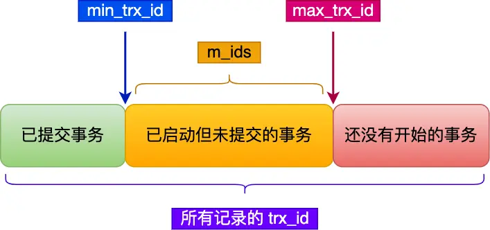

# Transaction

## ACID

事务是数据库操作的逻辑单元，用于确保数据的一致性和完整性，在 MySQL 的存储引擎中，原本的 MyISAM 不支持事务，而支持事务的 InnoDB 也因此成为了目前 MySQL 的默认存储引擎。

事务具有 ACID 四种特性，如下所示：

**原子性（Atomicity）**

- **目标**：事务中的操作要么全部成功，要么全部失败回滚
- **实现机制**
  - 在事务回滚时，利用 Undo Log 回滚之前的操作

**一致性（Consistency）**

- **目标**：事务执行前后，数据满足完整性约束，数据库保持一致性
- **实现机制**
  - **数据库层面**：通过主键、唯一索引等特性进行约束
  - **应用层面**：业务逻辑中保持操作的一致性
  - **协同 A、I、D**：依靠原子性、隔离性和持久性共同保障一致性

**隔离性（Isolation）**

- **目标**：多个并发事务互不干扰，中间状态不可见
- **实现机制**
  - **锁**：通过行级锁、间隙锁等，保障写操作之间隔离
  - **MVCC**：通过版本链和快照，保障读操作与写操作隔离

**持久性（Durability）**

- **目标**：事务提交后，修改永久保存，即使系统崩溃也不丢失
- **实现机制**
  - 通过 Redo Log 实现事务操作的持久化

## 隔离性

### 并发问题

在并发场景下，事务之间可能因并发执行导致以下问题：

**脏读（Dirty Read）**

- **描述**：事务读取到其他未提交事务的中间数据
- **示例**：事务 A 修改数据未提交，事务 B 读取该数据；若 A 回滚，B 读到的是无效数据

**不可重复读（Non-Repeatable Read）**

- **描述**：同一事务内多次读取同一数据，结果不一致（因其他事务提交了修改）
- **示例**：事务 A 读取数据 X=100，事务 B 修改 X=200 并提交；事务 A 再次读取 X=200。

**幻读（Phantom Read）**

- **描述**：同一事务内多次查询同一范围的数据，返回的行数不同（因其他事务插入 / 删除）
- **示例**：事务 A 查询年龄 > 20 的用户有 5 人，事务 B 插入一个年龄 = 25 的用户并提交；事务 A 再次查询得到 6 人。

### 隔离级别

SQL 标准定义了四个隔离级别，隔离强度从低到高排序：

| 隔离级别              | 脏读 | 不可重复读 | 幻读 |
|----------------------|------|-----------|------|
| **READ UNCOMMITTED** | ✓    | ✓        | ✓    |
| **READ COMMITTED**   | ✗    | ✓        | ✓    |
| **REPEATABLE READ**  | ✗    | ✗        | ✓*   |
| **SERIALIZABLE**     | ✗    | ✗        | ✗    |

**✓\***：其中，InnoDB 在 **REPEATABLE READ** 级别下通过 **Next-Key Lock** 机制基本避免了幻读，且 **SERIALIZABLE** 性能较差，所以不推荐使用。

各隔离级别的实现原理，如下所示：

**READ UNCOMMITTED（读未提交）**

- 无任何并发控制，直接读最新数据

**READ COMMITTED（读已提交）**

- **避免脏读**：快照读仅读取已提交的数据
- **允许不可重复读和幻读**：每次 `SELECT` 生成新 Read View，可能读到其他事务已提交的修改

**REPEATABLE READ（可重复读）**

- **避免脏读和不可重复读**：通过 **MVCC** 的快照读实现，事务内始终看到一致的数据视图
- **避免幻读**：通过 **Next-Key Lock** 锁定范围，阻止其他事务插入或删除范围内的数据（无法完全避免）

**SERIALIZABLE（串行化）**

- 通过读写锁控制所有操作串行执行

### **锁**

#### **锁的模式**

定义事务对数据的访问权限，分为 **共享锁（S）** 和 **排他锁（X）**，以及二者的衍生类型：

**共享锁（Shared Lock, S Lock）**

- **描述**：允许事务读取数据，阻止其他事务修改数据（允许多个事务同时持有共享锁）
- **兼容性**：与其他共享锁兼容，与排他锁冲突

**排他锁（Exclusive Lock, X Lock）**

- **描述**：允许事务读写数据，阻止其他事务读写数据（同一数据只能有一个排他锁）
- **兼容性**：与所有锁（包括其他排他锁和共享锁）冲突

**意向锁（Intention Lock）**

- **描述**：表级锁，表示事务在准备执行某些事情，用于快速判断表中是否存在行级锁
  - 例如意向共享锁、意向排他锁
- **兼容性**：与其他意向锁兼容，与表级非意向锁冲突
- **生成时机**：事务准备对某些行加共享锁（S）或排他锁（X）时，自动在表级加意向锁
- **释放时机**：事务结束

#### **锁的粒度**

定义锁定的数据范围，分为 **行级锁**、**间隙锁**、**表级锁** 等。

**记录锁（Record Lock）**

- **描述**：锁定索引中的 **单行记录**
- **模式**：S 或 X
- **生成时机**：
  - 精确匹配单行的操作（如 `UPDATE ... WHERE id=1`）
  - 显示加锁（如 `SELECT ... FOR UPDATE`）
- **释放时机**：事务结束

**间隙锁（Gap Lock）**

- **描述**： 锁定索引记录的 **间隙（区间）**，阻止插入数据（如 `id BETWEEN 5 AND 10`）
- **模式**：通常为 X
- **生成时机**：
  - `RR` 隔离级别下，对范围进行操作（如 `SELECT ... WHERE id BETWEEN 10 AND 20 FOR UPDATE`）
  - 唯一索引冲突：插入操作因唯一键冲突失败时，可能对冲突的间隙加锁
- **释放时机**：事务结束

**临键锁（Next-Key Lock）**

- **描述**：组合 **记录锁 + 间隙锁**，锁定左开右闭区间（如 `(5, 10]`），用于在 `RR` 模式防止部分幻读
- **模式**：通常为 X
- **生成时机**：
  - `RR` 隔离级别下，InnoDB 默认对范围查询加临键锁
- **释放时机**：事务结束

**插入意向锁（Insert Intention Lock）**

- **描述**：如果要插入位置已经存在间隙锁，则阻塞当前插入操作并生成插入意向锁，表示处于等待插入的状态
- **模式**：特殊的间隙锁（X），非意向锁
- **生成时机**：
  - 在插入操作前，尝试对目标间隙加锁，表示事务准备插入数据
- **释放时机**：事务结束

**表级锁（Table Lock）**

- **描述**：锁定整张表
- **模式**：S 或 X
- **生成时机**：
  - MyISAM 默认锁机制
  - InnoDB 显式使用（如 `LOCK TABLES ... READ/WRITE`）
- **释放时机**：
  - 显示执行 `UNLOCK TABLES` 或会话终止

**自增锁（AUTO-INC Lock）**

- **描述**：保证自增列（`AUTO_INCREMENT`）的唯一性
- **模式**：特殊的表级锁（X）
- **生成时机**：插入数据时自动触发（默认轻量级连续模式）
- **释放时机**：根据 `innodb_autoinc_lock_mode` 决定
  - `= 0`：语句执行结束时释放
  - `= 2`：轻量级，申请到自增 id 后释放
  - `= 1`：混合模式，普通 `inset` 语句在申请后释放，批量插入时等语句结束释放

### MVCC

**MVCC（Multi-Version Concurrency Control）** 的核心思想是通过维护数据的多个版本，使读写操作互不阻塞，避免锁竞争，从而提升并发性能。

InnoDB 中 MVCC 的实现依赖于隐藏字段、Undo Log 和 Read View 机制，通过隐藏字段和 Undo Log 构成版本链，并以此维护数据的多个版本，通过 Read View 为读写操作生成快照，使其互补阻塞。

**隐藏字段**

InnoDB 每一行记录中，有两个重要的隐藏字段：

- `trx_id`：最后一次插入会更新该行的事务 ID（删除操作在事务执行过程中，仅会修改 `deleted_flag` 标志位，也被视为更新）
- `roll_pointer`：每次执行改动时，会把操作信息写入 Undo Log 中，该指针会执行上一个 Undo Log

**Undo Log**

- Undo Log 会存储记录的历史版本信息，并通过 `roll_pointer` 指针，串联成版本链

**Read View**

Read View 定义了事务在读取时，可见的数据版本，主要用于做可见性判断，主要字段如下：

- `m_ids`：生成 Read View 时活跃（未提交）的事务 ID 列表
- `creator_trx_id`：创建该 Read View 的事务 ID
- `min_trx_id`：活跃事务中的最小事务 ID
- `max_trx_id`：生成 Read View 时下一个待分配的事务 ID

#### 工作机制

**可见性判断**

当创建 Read View 时，可以将当前记录中的事务划分为如下区域：

- 如果行数据的 `trx_id` < `min_trx_id`，说明该版本在 Read View 生成前已提交，可见

- 如果行数据的 `trx_id` ≥ `max_trx_id`，说明该版本在 Read View 生成后创建，不可见

- 如果 `min_trx_id` ≤ `trx_id` < `max_trx_id`，则检查 `trx_id` 是否在 `m_ids` 列表中：
  - 在列表中：说明该版本由未提交事务生成，不可见
  - 不在列表中：说明该版本已提交，可见

- 若当前事务修改了该行数据，则始终读取自身的最新版本

**快照读**

- **触发操作**
  - 执行的是普通 `SELECT` 语句，无锁
- **视图创建时机**
  - **RC**：每次操作时，都会重新生成 Read View
  - **RR**：事务中第一次操作时生成，后续的快照都复用该视图

**当前读**

- **触发操作**
  - **加锁读**：`SELECT ... FOR UPDATE`（排他锁）、`SELECT ... LOCK IN SHARE MODE`（共享锁）
  - **数据修改**：`UPDATE`、`DELETE`、`INSERT`
- **视图创建时机**
  - 每次操作时，都会重新生成 Read View
- **锁粒度**
  - **RC**：Record Lock（行锁）
  - **RR**：Next-Key Lock（行锁 + 间隙锁）

## Ref

- <https://javaguide.cn/database/mysql/transaction-isolation-level.html>
- <https://javaguide.cn/database/mysql/innodb-implementation-of-mvcc.html>
- <https://xiaolincoding.com/mysql/transaction/mvcc.html#>
