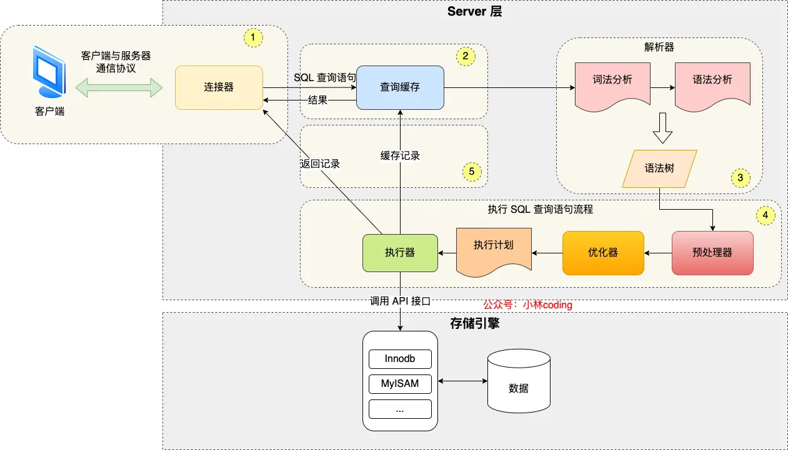

# Execution

## 基础架构



MySQL 的架构可以分为 Server 层与存储引擎层：

- **Server 层主要负责建立连接、分析与执行 SQL**。大多数核心功能模块都在这里实现，包括内置函数（如日期、时间、数学和加密函数等）和所有跨存储引擎的功能（如存储过程、触发器、视图等）。

- **存储引擎层负责数据的存储和提取**。其架构模式是插件式的，支持InnoDB、MyISAM、Memory等多个存储引擎。现在最常用的存储引擎是InnoDB，索引类型为 B+ 树，它从MySQL 5.5.5版本开始成为了默认存储引擎。

执行一条 SQL 语句的详细流程，如下所示：

**连接器（Connector）**

- **作用**：管理客户端连接、身份认证和权限校验

- **流程**：
  1. 客户端通过 TCP/IP 或 Socket 与 MySQL 建立连接
  2. 连接器验证用户名、密码及主机权限
  3. 存储用户权限，即权限修改不会影响已经存在的链接
  4. 若认证通过，分配线程并保持连接（`show processlist` 可查看活跃连接）
  5. 连接超时后自动断开，由 `wait_timeout` 控制（默认 8 小时）

**查询缓存（Query Cache，MySQL 8.0+ 已移除）**

- **旧版本行为**：
  - 若开启缓存且语句为 `SELECT`，先检查缓存是否存在哈希匹配的结果
  - 命中缓存直接返回结果；否则继续执行，并最终将结果存入缓存

- **注意**：当一个表被更新时，其相关的查询缓存会被清空，因为维护缓存开销大且易失效。在 MySQL 8.0 时，移除了查询缓存

**解析器（Parser）**

- **词法分析**：将 SQL 字符串拆分为关键字（如 `SELECT`、`FROM`）
- **语法分析**：验证语法正确性，生成抽象语法树（AST）
- **错误处理**：若语法错误（如缺少括号），抛出 `You have an error in your SQL syntax`

**预处理器（Preprocessor）**

- **语义检查**：
  - 验证表、列是否存在
  - 检查别名歧义（如 `SELECT a FROM t1, t2` 中 `a` 是否唯一）
  - 校验用户对目标数据的访问权限
  - 将 `select *` 中的 `*` 符号，扩展为表上的所有列

- **输出**：生成新的解析树，供优化器使用

**优化器（Optimizer）**

- **作用**：生成成本最低的执行计划
- **优化策略**：
  - 选择索引（如全表扫描 vs 索引扫描）
  - 决定 JOIN 顺序（如小表驱动大表）
  - 子查询优化（如转化为 JOIN）
- **输出**：生成执行计划（可通过 `EXPLAIN` 查看）

**执行器（Executor）**

- **流程**：
  1. 检查执行权限（如无 `SELECT` 权限则拒绝）
  2. 调用存储引擎接口，按执行计划逐行处理
  3. 存储引擎根据索引定位数据
  4. 执行过滤、排序、聚合等操作
  5. （写操作）加锁并修改数据
  6. （写操作）处理日志与事务
  7. 返回数据

**存储引擎（Storage Engine）**

- **特性**：
  - InnoDB：支持事务、行锁，通过 Buffer Pool 缓存热点数据
  - MyISAM：表锁、无事务，适合读多写少场景

- **关键机制**：
  - **索引下推 & 覆盖索引 & 索引合并**：减少回盘次数
  - **Buffer Pool**：缓存数据页，减少磁盘访问
  - **Change Buffer**：优化非唯一索引的写入性能
  - **WAL（Write-Ahead Logging）**：先写日志再刷脏页，确保数据持久性

## 执行流程

假定 `id` 为主键索引，`age` 与 `gender` 为联合索引，`grade` 不是索引，当执行一条如下所示的更新语句时，具体流程如下所示：

```sql
UPDATE a SET grade = 10 WHERE id > 4 AND age > 18 AND gender = 1 AND grade > 6
```

**存储引擎定位数据**

- 通过联合索引  `(age, gender)` 中 `age > 18` 来定位数据

- 未触发索引下推时：
  - 定位到 `age > 18` 的数据及其主键值
  - 进行回表，将数据返回给执行器
  - 执行器判断是否满足  `id > 4`、`gender = 1` 和 `grade > 6` 的过滤条件

- 触发索引下推：
  - 定位到 `age > 18` 的数据，然后直接判断是否 `gender = 1` 与 `id > 4` 的条件
  - 进行回表，将数据返回给执行器
  - 执行器仅判断是否满足 `grade > 6` 的过滤条件
- 会优先从 Buffer Pool 中查找，未命中时，再读取磁盘并更新 Buffer Pool

**加锁（事务隔离与并发控制）**

- InnoDB 在可重复读（RR）隔离级别下，为扫描到的行和间隙加锁：
  - 记录锁（Record Lock）：对符合条件的行加排他锁（X Lock），阻止其他事务修改或删除
  - 间隙锁（Gap Lock）：对联合索引扫描的区间的间隙加锁，防止其他事务插入新数据（避免幻读）

**数据修改与索引维护**

- Undo Log：在修改数据前，记录旧值到 Buffer Pool 中的 Undo Log，用于事务回滚和 MVCC
  - 对 Undo Log 的操作，也会记录在 Redo Log 中

- 更新聚集索引：修改 Buffer Pool 中主键索引的数据页，将 grade 更新为新值，并标记为脏页

- 维护辅助索引：
  - 如果 UPDATE 影响索引列（如修改 age 或 gender）：删除旧的联合索引条目，插入新的条目
  - 如果仅修改 grade（非索引列）：无需更新辅助索引

**事务提交与 Binlog 处理**

- 对于事务的提交，通过两阶段提交（2PC）确保 Redo Log 和 Binlog 的一致性

- Prepare 阶段：
  - 将 Buffer Pool 中的修改操作写入 Redo Log Buffer，并标记为 PREPARE
  - 根据 `innodb_flush_log_at_trx_commit` 决定要不要直接将 Redo Log 持久化到磁盘

- Commit 阶段：
  - Binlog 写入内存缓冲区（Binlog Cache）
  - 根据 `sync_binlog` 决定要不要直接将 Binlog 持久化到磁盘
  - Redo Log 标记为 COMMIT 状态，事务正式提交。
  - 释放行锁和间隙锁。

## Ref

- [执行一条 select 语句，期间发生了什么？](https://xiaolincoding.com/mysql/base/how_select.html)
- [MySQL 日志：undo log、redo log、binlog 有什么用？](https://xiaolincoding.com/mysql/log/how_update.html)
- [01 基础架构：一条SQL查询语句是如何执行的？](https://jums.gitbook.io/mysql-shi-zhan-45-jiang/01-ji-chu-jia-gou-yi-tiao-sql-cha-xun-yu-ju-shi-ru-he-zhi-hang-de)
- [02 日志系统：一条SQL更新语句是如何执行的？](https://jums.gitbook.io/mysql-shi-zhan-45-jiang/02-ri-zhi-xi-tong-yi-tiao-sql-geng-xin-yu-ju-shi-ru-he-zhi-hang-de)
