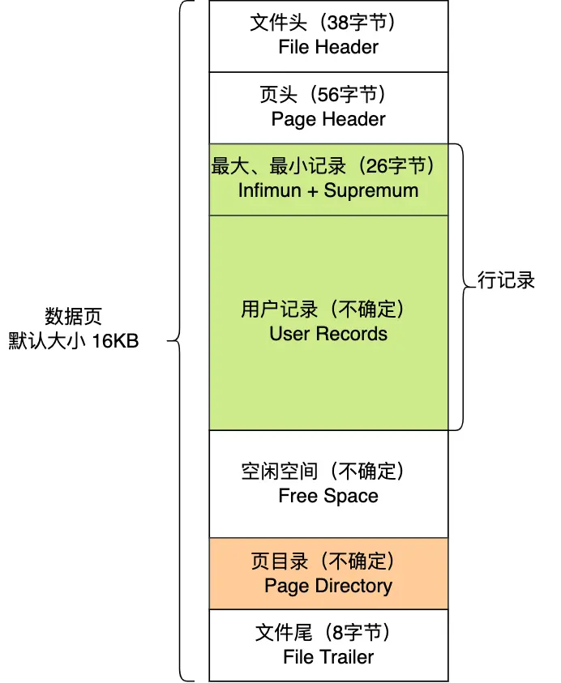
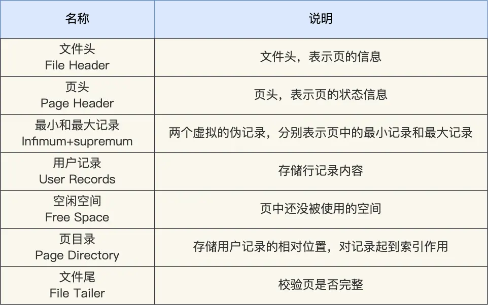
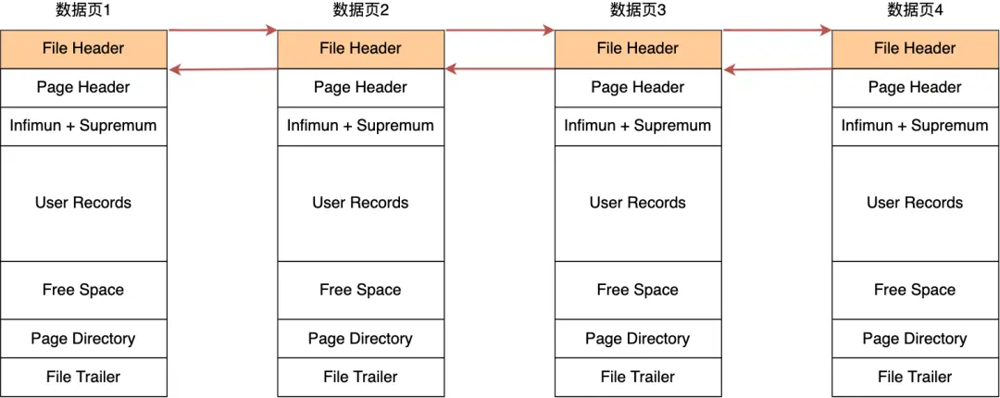
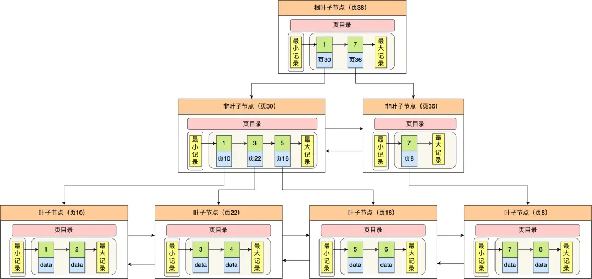
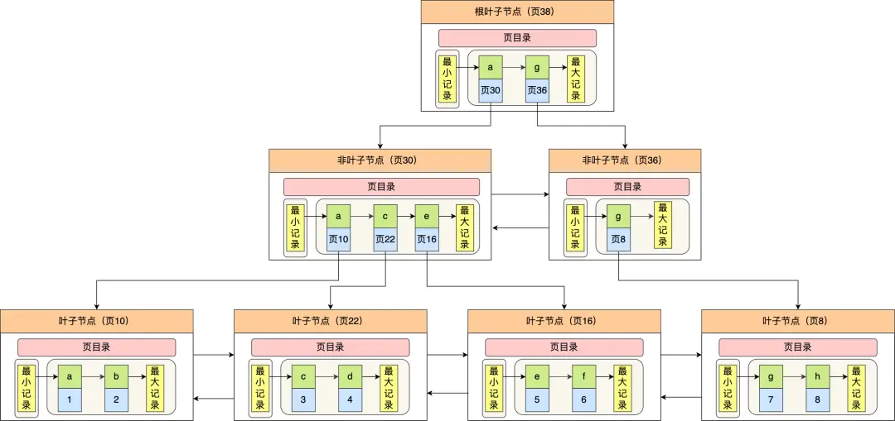

# Index

## 数据结构

### 选型

InnoDB 中，索引默认使用 **B+ 树** 实现，相比于其他数据结构，差异如下：

**哈希表（Hash Table）**

- 哈希表不支持范围查询，仅适合 KV 场景

**二叉搜索树（Binary Search Tree）**

- BST 保障了左右子树与根节点的关系，查询性能为 $O(log_{2}^{n})$，但是仍需要多次 I/O
- 但是容易出现不平衡的情况，最坏情况下会退化为链表，查询效率为 $O(N)$

**AVL 树**

- AVL 树是一种平衡二叉搜索树，插入、修改、删除元素时，会通过旋转左右子树的方式，保持左右子树高度差不超过 1
- 频繁触发旋转，会有较大的性能开销，会显著降低写操作的性能
- AVL 树虽然优化了不平衡的情况，使得查询性能始终为 $O(log_{2}^{n})$，但是 I/O 开销仍然较大

**红黑树**

- 红黑树也是一种平衡二叉搜索树，相较于 AVL 树，不追求严格的平衡，而是通过红黑两个颜色来进行限制，保障大致的平衡
- 相较于 AVL 树，红黑树在查询性能接近 AVL 树的基础上，大幅提高了写操作的效率
- 但是红黑树仍然会有较大的 I/O 开销，更适用于内存场景

**B 树**

- B 树最是一种平衡多路搜索树，其特定是每个节点中，可以同时包含多个元素
- 对于写操作会存在节点分裂的情况，导致额外的性能开销
- 对于读操作，其节点内部遍历的复杂度为 $O(log_{2}^{m})$，节点间的复杂度为 $O(log_{m}^{n})$，由于前者可以在内存中执行，相对于 I/O 操作可以忽略不计，所以在这种下，其读操作的时间复杂度可认为是 $O(log_{m}^{n})$，较之于 $O(log_{2}^{n})$，有常数倍的提升

**B+ 树**

- B+ 树与 B 树的区别为非叶子节点，B+ 树仅存放索引值，而 B 树存放实际数据
- 在数据量较大的情况下，B+ 树的非叶子节点的存储能力，远高于 B 树，会使得整体树的高度显著降低，I/O 操作更少

### 存储结构

在 B+ 树中，每一个节点对应一个数据页或索引页，其结构如下所示：

  
  

 

同层节点间按照索引键排序，构成双向链表，方便范围查询。

在具体实现上，分为聚簇索引和非聚簇索引，其中聚簇索引会使用主键作为索引键，其他索引如普通索引、唯一索引、前缀索引、联合索引等，都为非聚簇索引，也称二级索引。

不存在主键时，会选择第一个非空且值唯一的列作为聚簇索引的键，如果也不存在，则会自动生成一个自增的隐藏列来作为聚簇索引的索引键。

其结构差异如下所示：

**聚簇索引（主键索引）**

- 叶子节点存储索引值和实际数据
- 非叶子节点存储索引值和子节点指针

**非聚簇索引（二级索引）**

- 叶子节点存储索引值和主键值
- 非叶子节点存储索引值和子节点指针
- **回表**：在获取实际数据时，需要通过主键值再进行查找

### 存储容量

假定主键和子节点指针共占用 16 字节，一行数据约为 1024 字节，忽略页内其他数据，如文件头、页头、文件尾等，此时，其存储容量计算如下：

- **索引页**：约为 $16KB / 16Byte = 1024 条$
- **数据页**：约为 $16KB / 1Byte = 16 条$
- **3 层容量**：约为 $1024 * 1024 * 16 \approx 1600万条$
- **4 层容量**：约为 $1024 * 1024 * 1024 * 16 \approx 160亿条$

## 索引维护

### 页分裂 & 页合并

B+Tree 在插入新数据时，必须保障整体仍然是有序的。如果向一个已满的索引页中插入，则会触发页分裂，并将原本索引页中的部分数据迁移至新的索引页中，并更新相关的指针信息。

页分裂会带来如下问题：

- **性能开销**
  - 磁盘 I/O：涉及新页的分配、数据的迁移以及索引的更新
  - 锁竞争：分裂中需要加锁，可能会阻塞其他事务

- **存储碎片**
  - 分离后的两个页面均只有部分数据，空间利用率下降

- **树高度增长**
  - 若涉及到根节点分裂，则会导致 B+Tree 高度增加，影响后续所有查询

当更新或删除索引时，可能会导致已有的索引页空间利用率降低，当低于阈值时，InnoDB 会尝试将相邻的页进行合并，减小碎片，释放空间，但是仍会带来额外的性能开销。

### 自增主键

在设置聚簇索引的索引键时，如果是分布式场景，则需要额外考虑分布式 ID 的生成方案，例如 Redis 原子递增或雪花 ID，其他场景下，则推荐使用自增主键，其优势如下所示：

**减少页分裂与页合并**

- 使用自增主键时，新数据总是追加到索引末尾的页中，避免了插入随机位置导致的页分裂
- 主键只能自增，不允许修改，同样也减少了页合并的频率

**写入性能优化**

- 自增主键能够保障插入时会按照顺序插入，相较于随机写入，磁盘寻道效率更高（快 10~100 倍）

**空间利用率高**

- 顺序写入在减少页分裂的同时，也显著减少了空间碎片的数量，提供空间利用率

**空间占用小**

- 使用自增索引时，Bigint 一般即可满足使用诉求，通常为 8 字节，相比与 UUID、哈希值或其他业务数据，占用空间更小
- 针对于二级索引，其叶子节点占用空间也更小
- 空间占用小整体会使得 B+Tree 高度降低，提高查询效率

**事务并发**

- 自增主键的顺序写入，会减少行级锁的竞争

### 索引的选择

- 优先选择频繁查询的字段，提高利用率
- 优先选择经常用来做等值匹配的字段，提高命中率
- 优先选择需要排序的字段，可以直接利用索引的排序
- 优先选择连表查询的字段，提高连接效率
- 尽量建立联合索引，而不是单列索引
- 尽量避免频繁更新的字段，减少索引的维护成本
- 尽量避免重复值较多的字段，其索引效果较差
- 限制索引的数量，降低维护成本，加快优化器的索引选择效率

## 优化策略

### 最左匹配

当使用联合索引时，会按照定义时的顺序来构建 B+Tree。例如定义索引 `(A, B, C)` 时，会优先按照 `A` 排序，`A` 相同时按照 `B` 排序，`B` 相同时再按照 `C` 排序。

因此当查询时，如果不满足**最左匹配**原则，从 `B` 或 `C` 开始查询，则没有办法判断元素在索引中的顺序，无法利用索引。

### 覆盖索引

一般情况下，使用非聚簇索引时，需要通过回表获取到完整数据，但是当索引包含了查询中所有需要访问的字段（包括 WHERE 条件、SELECT 字段、ORDER BY 字段等），会触发**覆盖索引**。

此时，查询只需扫描索引结构而无需回表查找数据行，能够显著减少磁盘 I/O 和内存消耗，从而提升查询效率。

即使遇到常规意义上**索引失效**的场景，例如复合索引 `(A, B, C)`，查询语句为 `select A,B,C from t where A like %xxx`，因为满足**覆盖索引**的条件，所以也会选择走索引进行遍历，而非全盘扫描。

### 索引下推

**索引下推**（Index Condition Pushdown，简称ICP）是 MySQL 5.6 引入的查询优化技术，核心目标是通过将 WHERE 条件中可索引的过滤操作下推到存储引擎层执行，是对联合索引不满足最左匹配的部分场景的特殊优化策略。

触发索引下推时，能够减少回表次数和 Server 层的数据处理量，从而提升查询性能。

以索引为 `(A, B, C)`，查询条件为 `where A=1 and C>3` 为例：

**无 ICP 时**

- 按照最左匹配原则，`A` 能够使用索引，`C` 不会触发索引
- 将所有满足 `A=1` 的数据进行回表，然后返回 Server 层进行过滤

**有 ICP 时**

- 引擎在找到满足 `A=1` 的数据时，直接过滤不满足 `C>3` 的数据
- 仅对满足 `A=1 and C>3` 的数据进行回表，并返回给 Server 层

### 前缀索引

前缀索引是 MySQL 中针对长字符串字段（如 VARCHAR、TEXT）的一种优化技术，通过仅对字段的前 N 个字符建立索引，减少索引存储空间并提升查询效率。

适合于前缀区分度高的场景，例如域名长度较短的 URL、以时间开头的 UUID、地址信息等。

## 索引失效

索引能够提供查询效率，但是索引的高效性依赖于以下两个条件：

- **有序性**：按照索引键顺序存储
- **快速定位**：通过树的分层结果，快速定位目标元素范围

当优化器判断当前语句无法利用上述两个特点时，即数据结构不匹配时，索引就会失去价值，转而使用全表扫描的方案来替代索引。

即索引失效的核心是 **B+ 树的结构特性无法支持查询的高效执行**，本质是**全盘扫描的成本低于索引**。例如当**索引失效**时，如果满足**覆盖索引**的条件，仍会选择索引进行遍历。

以下是常见的**索引失效**的场景：

**模糊匹配**

- **示例**： `like %xxx` 或 `like %xxx%`
- **原因**：前缀是不确定的，无法利用索引的有序性

**违法最左匹配**

- **示例**：复合索引 `(A, B, C)`，但查询条件未从最左列 `A` 开始，或中间跳过了某一列。
- **原因**：复合索引按列顺序构建，未使用最左列时无法利用索引树结构

**函数/表达式**

- **场景**：在 WHERE 条件中对索引列使用函数、数学运算或表达式，例如 `length(name) = xx` 或 `age + 1 = 19`，
- **原因**：索引存储的是原始值，计算后的值无法直接匹配索引结构

**隐式类型转换**

- **场景**：索引列与查询值类型不匹配，导致 MySQL 自动转换类型，例如 `column = 123`，其中 `column` 是 VARCHAR 类型
- **原因**：在字符串与数字比较时，会自动将字符串转为数字，类型转换等价于对列应用函数（如 `CAST`），导致无法使用索引。

**使用 OR 连接非索引列**

- **场景**：OR 连接的多个条件中存在未索引的列，例如 `indexed_column = 'a' OR non_indexed_column = 'b'`
- **原因**：当非索引列元素量较大时，无法仅通过索引列快速定位目标元素的范围，会转为使用全表扫描

**数据分布不均**

- **场景**：当索引列的值重复率极高，如 `gender = 'M'`，但是 90% 的数据都是 `'m'`，或是 `NULL` 值占比较大
- **原因**：高重复值时，无法通过索引快速定位元素，全表扫描成本更低

**使用 `!=`、`<>` 或 `NOT IN`**

- **场景**：查询条件包含不等于操作符或排除值列表，如 `column != 100`、`column NOT IN (1, 2, 3)`
- **原因**：需要扫描所有数据进行判断，也无法利用索引来快速定位

**排序不符合索引顺序**

- **场景**：`ORDER BY` 的列顺序或方向与索引不一致，例如符合索引 `(A, B)`，查询语句为 `ORDER BY B, A`
- **原因**：索引按定义顺序排序，不匹配时无法利用索引排序

**JOIN 时字符集或排序规则不匹配**

- **场景**：关联表的字符集或排序规则不一致，例如 `FROM table1 JOIN table2 ON table1.column = table2.column`，表1的字符集为 utf8mb4，表2为 latin1
- **原因**：字符集转换导致索引失效

## Ref

- <https://javaguide.cn/database/mysql/mysql-index.html>
- <https://jums.gitbook.io/mysql-shi-zhan-45-jiang/04-shen-ru-qian-chu-suo-yin-shang>
- <https://jums.gitbook.io/mysql-shi-zhan-45-jiang/05-shen-ru-qian-chu-suo-yin-xia>
- <https://xiaolincoding.com/mysql/index/index_interview.html>
- <https://xiaolincoding.com/mysql/index/page.html>
- <https://xiaolincoding.com/mysql/index/index_lose.html>
- <https://xiaolincoding.com/mysql/index/index_issue.html>
