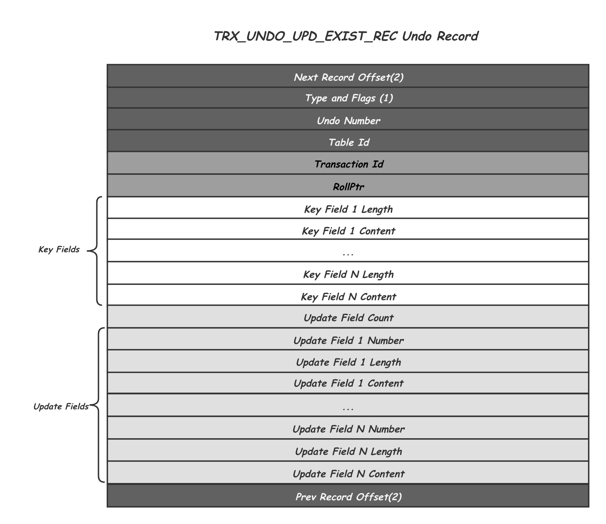
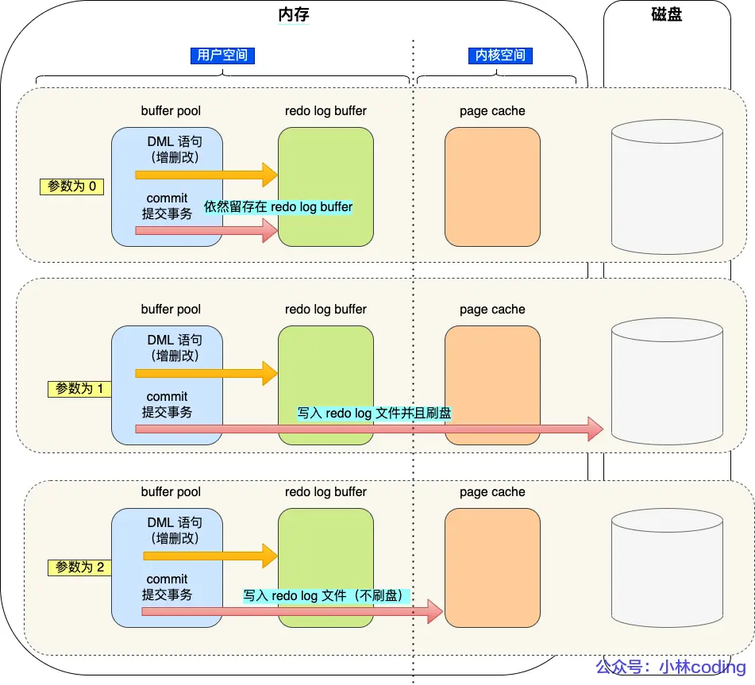

# Log

更新语句的流程会涉及到 Undo Log（回滚日志）、Redo Log（重做日志） 、BinLog （归档日志）这三种日志：

- Undo Log（回滚日志）：是 Innodb 存储引擎层生成的日志，实现了事务中的原子性，主要用于事务回滚和 MVCC
- Redo Log（重做日志）：是 Innodb 存储引擎层生成的日志，实现了事务中的持久性，主要用于掉电等故障恢复
- BinLog（归档日志）：是 Server 层生成的日志，主要用于数据备份和主从复制

## Undo Log（回滚日志）

Undo Log 是 InnoDB 存储引擎的核心日志之一，主要用于事务回滚和多版本并发控制（MVCC）。它通过记录事务修改前的数据旧版本，保证了事务的原子性和读操作的一致性。

**核心作用**

- **事务回滚**
  - 当事务执行 `ROLLBACK` 或中途失败时，Undo Log 提供逆向操作（如将数据恢复为旧值），确保事务的原子性（Atomicity）
- **MVCC(Multi-Version Concurrency Control)**
  - 为读操作（如 `SELECT`）提供一致性视图，可以通过 Undo Log 访问旧版本数据，允许读写操作并发执行而不加锁。

**结构**

- **存储内容**
  - Undo Log 存储在回滚段中，每条 Undo Log 日志，包含事务 ID、回滚指针（指向前一个版本）、旧数据和操作类型 4 部分内容

- **insert**
  - 存储新纪录的所有内容，回滚指针为空
  - 回滚时按照主键进行删除
  - 日志存储在临时回滚段中，不参与 MVCC，事务提交后即可删除，生命周期较短

- **update**
  - 存储被更新列的旧值，回滚指针指向历史 Undo Log
  - 回滚时更新为存储的旧值
  - 日志存储在持久回滚段中，参与 MVCC，需要等所有依赖其的事务提交后，才能删除

- **delete**
  - del 操作实质是修改隐藏字段中的 `delete_mask` 标记，所以也会被转化为 update 操作
  - 如果该字段重新插入，相对应的，也是重新修改  `delete_mask` 标记
  - del 对应的 Undo Log 与 Update 操作基本相同
  - 等待相关事务都结束后，会有后台线程根据  `delete_mask` 标记，去真正执行删除操作

- **版本链**
  - 针对于 MySQL（Innodb）的一条记录，系统列中的有两个特殊列，分别为事务 ID `trx_id` 和回滚指针 `roll_pointer`（与 Undo Log 中的两列一致）
  - 通过行记录中回滚指针与 Undo Log 的回滚指针，将与该行相关联的 Undo Log 全部串联起来，形成版本链

以下是一个 update 操作的 Undo Log 示例：

**生命周期**

- **生成**
  - 事务操作前，生成 Undo Log 记录旧值
  - 通过版本链的方式和历史的 Undo Log 串联起来
  - Undo Log 的修改也会同步写入 Redo Log，并依赖其实现持久化

- **清理**
  - Redo Log 提交时，会标记相关的 Undo Log 为可删除，但是该 Undo Log 可能被其他事务依赖，不会立即删除
  - 后台 Purge 线程，定期扫描不需要的 Undo Log 进行清理

## Redo Log（重做日志）

Redo Log 是 InnoDB 存储引擎实现事务持久性（Durability）的核心机制，通过记录 Buffer Pool 中的数据修改操作，包括数据页、索引页、Undo 页，确保事务提交后的修改不会因系统故障而丢失。

**核心作用**

- **崩溃恢复（crash-safe）**：数据库异常崩溃时，通过重放 Redo Log 中未持久化到数据页的操作，将数据库恢复到崩溃前的状态，保证事务的持久性
  - 根据 CheckPoint LSN，按序重放 Redo Log，恢复数据页和 Undo Log
  - 根据 Undo Log 回滚未提交的事务，保证数据库达到一致状态

- **Write-Ahead Logging (WAL)**：遵循 "日志先行" 原则，所有数据页的修改必须先写入 Redo Log 并持久化，再写入内存中的 Buffer Pool。
  - 数据页的磁盘刷盘可以延迟进行，避免频繁随机 I/O。
  - 顺序写入优化：Redo Log 采用追加写入模式，相比数据页的随机写入，大幅提升事务提交效率。

**结构**

- **存储内容**
  - **LSN（Log Sequence Number）**：全局唯一递增的日志序列号，标记日志写入顺序
  - **事务 ID**：标识关联的事务
  - **被修改的页面信息**：包括表空间 ID、数据页号、页内偏移量
  - **操作类型**：物理日志（如页面的字节变化）与逻辑日志（如操作语义）的结合
  - **修改后的数据**：记录物理层面的具体变更（如新值、B + 树分裂操作等）

- **日志类型**
  - **物理日志**：直接记录数据页的字节变化（如页内某偏移量的值从 0x12 变为 0x34），崩溃恢复效率高
  - **逻辑日志**：记录操作语义（如 INSERT INTO table (id) VALUES (100)），便于解析但恢复较慢
  - InnoDB 采用混合模式，多数操作为物理日志，部分复杂操作（如 B + 树分裂）使用逻辑日志

- **文件结构**
  - 由 ib_logfile0、ib_logfile1 等文件组成的循环队列，大小固定（默认为 48MB × 文件数）
  - 写入时按顺序追加，写满后循环覆盖旧日志
    - 通过 LSN 和 Checkpoint 机制保证有效日志不被覆盖

**生命周期**

- **生成**
  - 事务执行修改操作前，Undo Log 生成并写入 Undo 页
  - 事务执行修改操作时，修改数据页和索引页
  - 生成 Redo Log 记录时，会先写入内存中的 Redo Log Buffer
  - 日志内容包含修改前后的数据页状态及操作元数据

- **刷盘**
  - 事务提交时，根据配置 `innodb_flush_log_at_trx_commit` 决定刷盘策略：
    - `=0`：延迟刷盘，由后台线程触发，每秒刷盘，可能丢失最近 1 秒事务
    - `=1`：同步刷盘，事务提交时调用 `write()` 函数，并同步调用 `fsync()` 函数写入磁盘
    - `=2`：仅调用 `write()` 函数写入 Page Cache，此时不会受 MySQL 程序崩溃影响，后续由操作系统或后台线程触发 `fsync()` 函数写入磁盘
  - 后台线程异步刷盘：当 Log Buffer 满 75% 或每秒定期刷盘
  - MySQL 正常关闭时：触发结束任务，执行刷盘

- **更新 & 清理**
  - 刷盘时，会将 Redo Log Buffer 中的脏页，以追加的方式，持久化至磁盘中
  - 当 Buffer Pool 中的脏页持久化至磁盘时，会推进 Redo Log 中的 CheckPoint LSN，标记这部分数据已完成持久化，可被复用写入新的 Redo Log
  - 当 Redo Log Buffer 刷盘时，如果 Cur LSN 已经追上 CheckPoint LSN，说明已经没有剩余空间可供写入，此时会阻塞 MySQL，将 Buffer Pool 中的脏页刷新到磁盘中，并更新 CheckPoint，执行完成后 MySQL 会恢复运行

## Binary Log（归档日志）

Binary Log（简称 Binlog）是 MySQL Server 层维护的全局逻辑日志，以事件形式记录所有对数据库的变更操作（DDL 和 DML）。它不依赖存储引擎，为数据备份恢复、主从复制、数据同步等场景提供核心支持。

**核心作用**

- **主从复制（Replication）**：主库将 BinLog 异步传输给从库，从库重放日志事件实现数据同步，构建高可用集群
- **时间点恢复（PITR, Point-in-Time Recovery）**：结合全量备份与 BinLog 增量日志，可将数据库恢复到任意历史时间点
- **数据审计与分析**：通过解析 BinLog（如使用 `mysqlbinlog` 工具），追踪数据变更历史或生成统计报表
- **日志订阅**：业务可以通过监听 BinLog，低成本、无侵入的感知存储数据的变化，并实现自定义的业务逻辑，如同步给 redis 或下游业务

**结构**

- **事件类型**
  - **Statement**：记录原始 SQL 语句，日志量小，节省存储和网络带宽，但是动态函数（如 `NOW()`）可能导致主从不一致
  - **Row**：记录数据行级别的变更前/后镜像（如 `id=1` 的行，`name` 从 `Bob` 变为 `Alice`），能够确保强一致，但是日志大小会显著增加（尤其影响批量操作）
  - **Mixed**：默认使用 Statement 格式，对不确定性操作自动切换为 Row 格式，平衡日志量与一致性需求

- **文件结构**
  - **二进制文件序列**：文件名形如 `mysql-bin.000001`、`mysql-bin.000002`，按序号递增生成
  - **索引文件**：`mysql-bin.index` 记录所有 BinLog 文件列表，确保顺序完整性
  - **事件组成**：每个事件包含头部（时间戳、事件类型、服务器 ID）和具体数据（SQL 或行变更）

**生命周期**

- **生成**
  - 事务执行过程中，会将日志写入 BinLog Cache（内存缓存）
  - 事务提交时，会将 BinLog Cache 中的完整事务写入 BinLog 文件中
  - 与 Redo Log 采取两阶段提交机制，确保一致性

- **刷盘**
  - 事务提交时，通过参数 `sync_binlog` 控制：
    - `=0`：仅调用 `write()` 函数写入 Page Cache，由操作系统自己决定何时调用 `fsync()` 函数写入磁盘
    - `=1`：同步刷盘，事务提交时调用 `write()` 函数，并同步调用 `fsync()` 函数写入磁盘
    - `=N`：每次提交时都调用 `write()` 函数，每 N 个事务提交后调用 `fsync()` 函数批量写入磁盘，平衡性能与可靠性

- **清理**
  - **自动清理**：通过 `expire_logs_days` 设置日志保留天数，超期文件自动删除。
  - **手动清理**：执行 `PURGE BINARY LOGS TO 'mysql-bin.000010';` 删除指定文件之前的日志。

## 主从复制

MySQL 主从复制（Replication）核心是基于二进制日志（Binary Log, Binlog）和中继日志（Relay Log）来实现的，主要分为以下三个阶段：

- **主库记录 Binlog**
  - 当主库执行事务时，将所有数据变更会写入本地 Binlog

- **从库复制日志**
  - 从库通过 I/O 线程连接到主库，请求 Binlog 内容
  - 主库的 Binlog Dump Thread 将 Binlog 发送给从库，从库的 I/O 线程将接收到的日志写入本地的中继日志（Relay Log）

- **从库重放日志**
  - 从库的 SQL 线程读取 Relay Log 中的事件，并按顺序执行这些 SQL 操作，使从库数据与主库保持一致

在执行主从复制时，MySQL 主从复制支持多种模式，每种模式在数据一致性、性能和可用性方面有不同的特点，其主要差异如下：

**异步复制（Asynchronous Replication）**

- **默认模式**，主库提交事务后立即响应客户端，不等待从库确认

- **工作原理**
  - **主库**：将事务写入 Binlog 后直接返回成功
  - **从库**：异步拉取并重放 Binlog，主库不关心从库是否完成同步

- **优缺点**
  - **优点**：性能高、延迟低，主库无额外等待，吞吐量高
  - **缺点**：一致性弱，从库可能落后主库，若主库宕机，可能存在数据丢失风险

- **适用场景**
  - 读写分离（读多写少）
  - 数据备份或报表分析
  - 对一致性要求不高的业务

**半同步复制（Semisynchronous Replication）**

- 平衡性能与一致性，主库提交事务后需等待至少一个从库确认收到 Binlog

- **工作原理**
  - **主库**：提交事务后，等待至少一个从库返回 ACK（确认收到 Binlog）
  - **从库**：收到 Binlog 后写入 Relay Log 即返回ACK，无需等待重放完成
  - **超时**：若从库 ACK 超时，主库可能退化为异步复制

- **优缺点**
  - **优点**：相比于异步，一致性增强，确保事务至少存在于一个从库的 Relay Log 中
  - **缺点**：主库需等待 ACK，吞吐量略低于异步模式

- **适用场景**
  - 金融、订单等对数据一致性要求较高的业务
  - 主从切换时需尽量减少数据丢失的场景

**组复制（Group Replication / MGR）**

- 基于 Paxos 协议的多主同步复制，提供强一致性和高可用性

- **工作原理**
  - **组通信**：节点通过组通信机制（Group Communication System, GCS）同步事务
  - **一致性协议**：事务需由多数节点（N/2+1）确认后才能提交（类似Raft协议）
  - **多主模式**：支持单主（Single-Primary）和多主（Multi-Primary）模式

- **优缺点**
  - **优点**：在多主架构下，提供较强的一致性，事务在多数节点提交后才生效，避免数据丢失
  - **缺点**：多主架构的复杂度高，需要等待多数节点确认，延迟高

- **适用场景**
  - 高可用集群（如金融核心系统）
  - 分布式数据库架构（多主架构）

**延迟复制（Delayed Replication）**

- 人为设置从库延迟同步，用于防止误操作导致的数据丢失

- **工作原理**
  - 从库延迟指定时间（如1小时）后重放主库的 Binlog
  - 主库正常同步，但从库的 SQL 线程延迟执行

- **适用场景**
  - 防止误删数据（如`DROP TABLE`）后快速恢复
  - 审计或调试历史数据

**多源复制（Multi-Source Replication）**

- 一个从库同时同步多个主库，用于数据聚合或分库分表架构

- **工作原理**
  - 每个主库对应一个独立的复制通道（Channel）
  - 从库通过不同通道接收并重放多个主库的 Binlog

- **适用场景**
  - 数据聚合（如将多个分片库合并到一个从库查询）
  - 跨数据中心的备份

**各种模式对比**

| 模式           | 一致性 | 性能 | 数据丢失风险 | 复杂度 | 适用场景    |
|---------------|-------|------|-----------|-------|------------|
| **异步复制**   | 弱     | 高   | 高        | 低     | 读写分离、备份 |
| **半同步复制**  | 中等   | 中   | 低        | 中    | 金融、订单  |
| **组复制**     | 强     | 中低 | 极低       | 高    | 高可用集群、多活架构 |
| **延迟复制**   | 弱     | 高   | 高（可控）  | 低    | 数据恢复 |
| **多源复制**   | 弱     | 中   | 依赖主库   | 中     | 数据聚合、分库分表|

## 两阶段提交

两阶段提交（Two-Phase Commit, 2PC）是 MySQL 用于保证事务在 **Redo Log（存储引擎层日志）** 和 **Binlog（服务层日志）** 之间一致性的核心机制，能够确保事务在 Redo Log 和 Binlog 中的状态要么全部提交，要么全部回滚，避免出现“半成功”状态。

两阶段提交把单个事务的提交拆分为 Prepare 和 Commit 两个阶段：

- **Prepare 阶段**（预提交）
  - 事务执行中：先将所有数据修改写入内存中的 Buffer Pool，生成对应的 Undo Log 和 Redo Log
  - 事务提交时：InnoDB 将 Redo Log 写入磁盘，并标记事务状态为 `PREPARE`，此时事务尚未最终提交，但已保证 Redo Log 持久化（受 Redo Log 刷盘策略影响）

- **Commit 阶段**（正式提交）
  - BinLog 写入：MySQL Server 将事务的 Binlog 事件写入磁盘，若 Binlog 写入失败，事务将回滚
  - Redo Log 提交：BinLog 持久化后，InnoDB 将 Redo Log 中的事务状态更新为 `COMMIT`，标志事务正式提交

两阶段提交能够保障两份日志的一致性，但是性能开销较大，主要有两个方面的影响：

- **磁盘 I/O 次数**：Redo Log 与 Binlog 都有自己的刷盘策略配置，在最差情况下，一次事务提交，Redo Log 和 Binlog 都会触发 `fsync()` 函数，即共执行 2 次刷盘操作
- **资源竞争**：为了保障多事务场景的顺序一致，早期通过锁来限制了事务提交顺序，当前事务彻底结束时，才会释放锁，下个事务才能拿到锁，进入 prepare 阶段

### 组提交

针对于此，MySQL 引入了组提交（Group Commit）机制，引入了队列机制，保障多事务场景下，Commit 顺序与日志提交顺序一致，并针对在同一个队列中的事务中的 `fsync()` 函数，交由一个事务来执行，减少 I/O 次数。

在组提交模式下，事务提交被分为三个阶段，每个阶段单独加锁，阶段内部有自己独立的队列，第一个进入队列的事务会成为 leader，负责整个队列内部所有事务，从而保障了事务的有序。三个阶段详细流程如下所示：

- **Flush 阶段**
  - 事务组 Leader 对队列中所有事务的 Redo Log 调用 `write()` 和 `fsync()` 函数，将 Redo Log 写入磁盘，并标记事务状态为 `PREPARE`
  - 事务组 Leader 在处理完 Redo Log 后，对队列中所有事务的 Binlog 调用 `write()` 函数，将 Binlog 加载进 Page Cache
- **Sync 阶段**：
  - 当超时或者到达一定数量时，事务组 Leader 对队列中所有事务的 Binlog 调用 `fsync()` 函数，将 Binlog 写入磁盘
  - `binlog_group_commit_sync_delay`：延迟多少微秒后执行组提交
  - `binlog_group_commit_sync_no_delay_count`：累积多少事务后立即提交
- **Commit 阶段**：
  - 事务组 Leader 将队列中所有事务的 Redo Log 状态更新至 `COMMIT`

### 恢复策略

依靠于两阶段提交（或组提交），在事务执行发生异常时，MySQL 的恢复策略如下所示：

| 崩溃阶段        | Redo Log  | BinLog  | 恢复策略               |
|----------------|-----------|---------|----------------------|
| Prepare 前     |  未记录    | 未记录   | 回滚事务               |
| Prepare 后     | `PREPARE` | 未记录   | 回滚事务               |
| Binlog 写入后   | `PREPARE` | 完整记录 | 提交事务，重放 Redo Log |
| Redo Log 提交后 | `COMMIT`  | 完整记录 | 重放 Redo Log         |

## Ref

- [MySQL 日志：undo log、redo log、binlog 有什么用？](https://xiaolincoding.com/mysql/log/how_update.html)
- [02 日志系统：一条SQL更新语句是如何执行的？](https://jums.gitbook.io/mysql-shi-zhan-45-jiang/02-ri-zhi-xi-tong-yi-tiao-sql-geng-xin-yu-ju-shi-ru-he-zhi-hang-de)
- <https://catkang.github.io/2021/10/30/mysql-undo.html>
