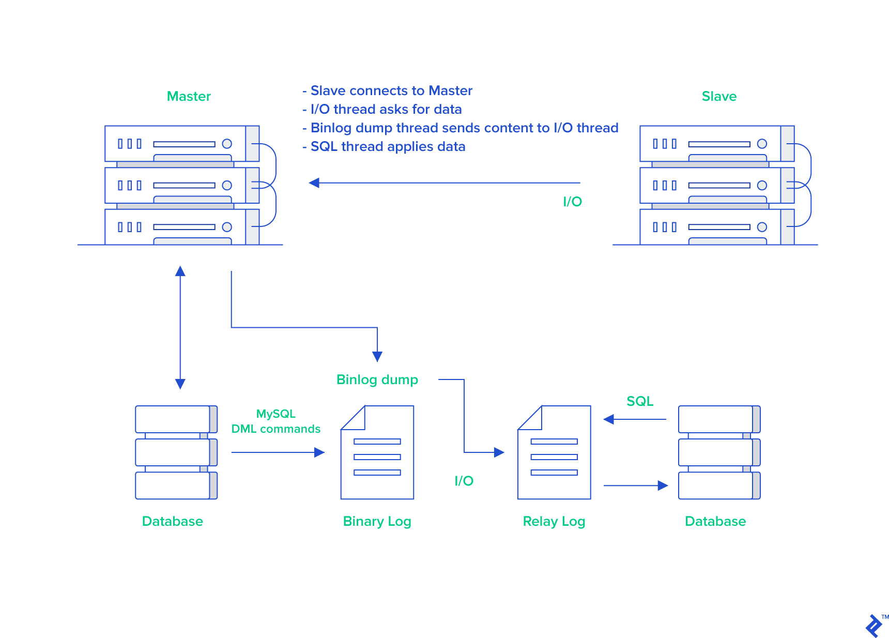

# Replication

## 核心流程

MySQL 主从复制（Replication）核心是基于二进制日志（Binary Log, Binlog）和中继日志（Relay Log）来实现的，主要分为以下三个阶段：

- **主库记录 Binlog**
  - 当主库执行事务时，将所有数据变更会写入本地 Binlog

- **从库复制日志**
  - 从库通过 I/O 线程连接到主库，请求 Binlog 内容
  - 主库的 Binlog Dump Thread 将 Binlog 发送给从库，从库的 I/O 线程将接收到的日志写入本地的中继日志（Relay Log）

- **从库重放日志**
  - 从库的 SQL 线程读取 Relay Log 中的事件，并按顺序执行这些 SQL 操作，使从库数据与主库保持一致

## 复制模式

### 异步复制（Asynchronous Replication）

默认模式，主库提交事务后立即响应客户端，不等待从库确认。

**工作原理**

- **主库**：将事务写入 Binlog 后直接返回成功
- **从库**：异步拉取并重放 Binlog，主库不关心从库是否完成同步

**优缺点**

- **优点**：性能高、延迟低，主库无额外等待，吞吐量高
- **缺点**：一致性弱，从库可能落后主库，若主库宕机，可能存在数据丢失风险

**适用场景**

- 读写分离（读多写少）
- 数据备份或报表分析
- 对一致性要求不高的业务

### 半同步复制（Semisynchronous Replication）

平衡性能与一致性，主库提交事务后需等待至少一个从库确认收到 Binlog。

**工作原理**

- **主库**：提交事务后，等待至少一个从库返回 ACK（确认收到 Binlog）
- **从库**：收到 Binlog 后写入 Relay Log 即返回ACK，无需等待重放完成
- **超时**：若从库 ACK 超时，主库可能退化为异步复制

**优缺点**

- **优点**：相比于异步，一致性增强，确保事务至少存在于一个从库的 Relay Log 中
- **缺点**：主库需等待 ACK，吞吐量略低于异步模式

**适用场景**

- 金融、订单等对数据一致性要求较高的业务
- 主从切换时需尽量减少数据丢失的场景

### 组复制（Group Replication / MGR）

基于 Paxos 协议的多主同步复制，提供强一致性和高可用性。

**工作原理**

- **组通信**：节点通过组通信机制（Group Communication System, GCS）同步事务
- **一致性协议**：事务需由多数节点（N/2+1）确认后才能提交（类似Raft协议）
- **多主模式**：支持单主（Single-Primary）和多主（Multi-Primary）模式

**优缺点**

- **优点**：在多主架构下，提供较强的一致性，事务在多数节点提交后才生效，避免数据丢失
- **缺点**：多主架构的复杂度高，需要等待多数节点确认，延迟高

**适用场景**

- 高可用集群（如金融核心系统）
- 分布式数据库架构（多主架构）

### 延迟复制（Delayed Replication）

人为设置从库延迟同步，用于防止误操作导致的数据丢失。

**工作原理**

- 从库延迟指定时间（如1小时）后重放主库的 Binlog
- 主库正常同步，但从库的 SQL 线程延迟执行

**适用场景**

- 防止误删数据（如`DROP TABLE`）后快速恢复
- 审计或调试历史数据

### 多源复制（Multi-Source Replication）

一个从库同时同步多个主库，用于数据聚合或分库分表架构。

**工作原理**

- 每个主库对应一个独立的复制通道（Channel）
- 从库通过不同通道接收并重放多个主库的 Binlog

**适用场景**

- 数据聚合（如将多个分片库合并到一个从库查询）
- 跨数据中心的备份

### 各种模式对比

| 模式           | 一致性 | 性能 | 数据丢失风险 | 复杂度 | 适用场景    |
|---------------|-------|------|-----------|-------|------------|
| **异步复制**   | 弱     | 高   | 高        | 低     | 读写分离、备份 |
| **半同步复制**  | 中等   | 中   | 低        | 中    | 金融、订单  |
| **组复制**     | 强     | 中低 | 极低       | 高    | 高可用集群、多活架构 |
| **延迟复制**   | 弱     | 高   | 高（可控）  | 低    | 数据恢复 |
| **多源复制**   | 弱     | 中   | 依赖主库   | 中     | 数据聚合、分库分表|

## Ref

- <https://xiaolincoding.com/mysql/log/how_update.html>
- <https://javaguide.cn/high-performance/read-and-write-separation-and-library-subtable.html>
