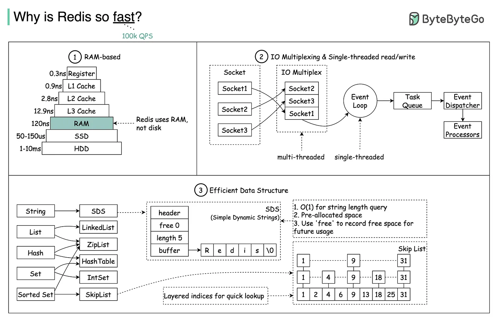

# Redis

Redis 是一个基于内存的 KV 数据库，提供了极高的读写性能和丰富的数据类型，支持数据的持久化存储以及分布式部署。在命令执行上，以单线程的方式执行，所有操作都是原子性的，且支持通过 Lua 脚本来编写复杂操作。

## Data Type

[Data Type](data_type.md)

## Expiration Algorithm

[Expiration Algorithm](expiration_algorithm.md)

## Eviction Policy

当 Redis 的内存达到上限时，如果仍有新数据写入，则会因为内存不足而出现问题，此时可以根据淘汰策略的不同，Redis 命令的执行逻辑也会存在差异。

目前，Redis 7.0 共支持 8 种不同的淘汰策略，即 [maxmemory_policy_enum](https://github.com/redis/redis/blob/7.0.0/src/config.c#L49)，详细说明如下：

<table style="width:100%; text-align:center;">
    <tr>
        <th>Scope</th>
        <th>Policy</th>
        <th>Desc</th>
    </tr>
    <tr>
        <td>\</td>
        <td>noeviction</th>
        <td style="text-align:left;">禁止写入并报错</td>
    </tr>
    <tr>
        <td rowspan="4">设置了过期时间的键值</td>
        <td>volatile-random</td>
        <td style="text-align:left;">随机淘汰</td>
    </tr>
    <tr>
        <td>volatile-ttl</td>
        <td style="text-align:left;">过期时间最短</td>
    </tr>
    <tr>
        <td>volatile-lru</td>
        <td style="text-align:left;">最近最久未使用</td>
    </tr>
    <tr>
        <td>volatile-lfu</td>
        <td style="text-align:left;">最不常用</td>
    </tr>
    <tr>
        <td rowspan="3">Rides 中所有的键值</td>
        <td>allkeys-random</td>
        <td style="text-align:left;">随机淘汰</td>
    </tr>
    <tr>
        <td>allkeys-lru</td>
        <td style="text-align:left;">最近最久未使用</td>
    </tr>
    <tr>
        <td>allkeys-lfu</td>
        <td style="text-align:left;">最不常用</td>
    </tr>
</table>

## High Availability

- 持久化
  - 通过 AOF 和 RDB 两种方案，保障单机数据的高可用
- 主从架构
  - 多服务器对外提供服务，避免单机故障问题
  - 通过一主多从的架构，实现集群间的数据一致性
- 哨兵
  - 在主从架构的基础上，提供自动故障转移的能力
- 集群
  - 数据分片存储，支持横向拓展
  - 每个分片由主从节点构成，支持自动故障转移能力

## High Performance

- 内存存储
  - 数据全部在内存中，读写速度极高
- 单线程模型
  - 使用单线程来处理网络 I/O 和读写逻辑，避免线程切换和资源竞争
  - 网络 I/O 多路复用，支持单线程处理大量并发连接
- 多线程优化
  - 引入多线程处理网络 I/O 和序列化，提高并发能力
- 批处理
  - 命令支持批处理，减少网络 I/O 次数
- 数据结构
  - 针对不同场景，选择不同的底层结构，从而优化读写性能

## High Concurrency

- 网络 I/O 多路复用
  - 提高并发能力
- 主从 & 集群
  - 通过读写分离、数据分片的方式，分散读写压力
- 高性能
  - 能够快速响应请求

## Q & A

1. big-key

   - 影响 AOF 的 fsync 过程，在 Always 策略下，可能会阻塞主线程
   - 影响 AOF 重写和 RDB 构建过程，两者都会通过子进程进行处理，如果触发大 Key 的写时复制策略，可能会阻塞主线程

2. Why is Redis so fast?

  

## Ref

- <https://xiaolincoding.com/redis/module/strategy.html>
- <https://xiaolincoding.com/redis/base/redis_interview.html>
- <https://blog.bytebytego.com/p/why-is-redis-so-fast>
