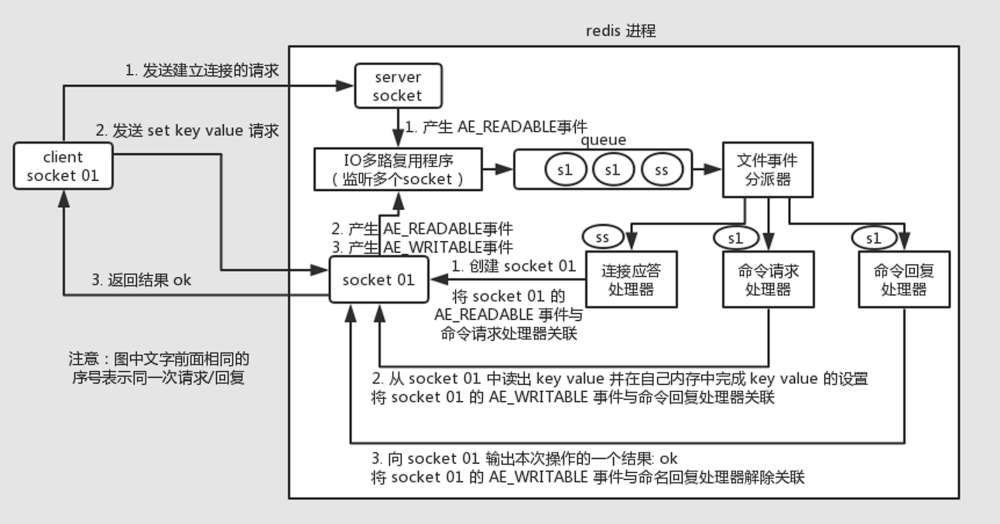

# Thread Model

Redis 主要采用单线程模型，在主线程中完成网络 I/O、命令处理、数据读写等操作，在后台线程执行非阻塞命令或 AOF、RDB、数据清理等耗时任务。

单线程模型避免了锁竞争、上下文切换等并发问题，同时利用 **I/O 多路复用** 大幅提高网络 I/O 的性能，保障 Redis 的高性能与高并发。

在 6.0 版本中，支持了多线程处理网络 I/O，提高序列化等操作性能，额外使得网络吞吐量能提升 1 倍，但是对于命令执行、数据读写等任务，仍在主线程中进行。

以执行一次 `set` 命令为例，整体的流程如下图所示：



## Server 初始化

在启动程序时，即 [`main()`](https://github.com/redis/redis/blob/7.0.0/src/server.c#L6832) 函数中，会调用 [`initServer()`](https://github.com/redis/redis/blob/7.0.0/src/server.c#L2374) 函数来初始化服务器相关配置，其中包括对于 epoll 的初始化逻辑，随后调用 [`aeMain()`](https://github.com/redis/redis/blob/7.0.0/src/ae.c#L493) 函数，循环执行事件处理，包括调用 `epoll_wail()` 函数处理新连接请求。

```c
int main(int argc, char **argv) {
    ...
    initServer();
    ...
    aeMain(server.el);
    ...
}
```

### initServer()

在 [`initServer()`](https://github.com/redis/redis/blob/7.0.0/src/server.c#L2374) 函数中，针对于 Socket（包括 TCP 与 TLS 两种连接），主要执行了如下三项操作：

- 创建 epoll 对象
- 创建监听 Socket，并配置监听端口
- 注册监听 Socket 至 epoll 中

```c
void initServer(void) {
    ...
    server.el = aeCreateEventLoop(server.maxclients+CONFIG_FDSET_INCR);
    ...
    if (server.port != 0 &&
        listenToPort(server.port,&server.ipfd) == C_ERR) {
        ...
    }
    if (server.tls_port != 0 &&
        listenToPort(server.tls_port,&server.tlsfd) == C_ERR) {
        ...
    }
    ...
    if (createSocketAcceptHandler(&server.ipfd, acceptTcpHandler) != C_OK) {
        serverPanic("Unrecoverable error creating TCP socket accept handler.");
    }
    if (createSocketAcceptHandler(&server.tlsfd, acceptTLSHandler) != C_OK) {
        serverPanic("Unrecoverable error creating TLS socket accept handler.");
    }
    ...
}
```

#### aeCreateEventLoop()

[`aeCreateEventLoop()`](https://github.com/redis/redis/blob/7.0.0/src/ae.c#L67) 函数中主要逻辑如下所示：

- 初始化 [`aeEventLoop`](https://github.com/redis/redis/blob/7.0.0/src/ae.h#L99) 对象以及相关属性，是对于 epoll 的一层封装

    ```c
    aeEventLoop *aeCreateEventLoop(int setsize) {
        aeEventLoop *eventLoop;
        ...
        if ((eventLoop = zmalloc(sizeof(*eventLoop))) == NULL) goto err;
        eventLoop->events = zmalloc(sizeof(aeFileEvent)*setsize);
        ...
        for (i = 0; i < setsize; i++)
            eventLoop->events[i].mask = AE_NONE;
        return eventLoop;

    err:
        ...
    }
    ```

- 调用 [`aeApiCreate()`](https://github.com/redis/redis/blob/7.0.0/src/ae_epoll.c#L39) 函数，创建底层 epoll 对象

    ```c
    aeEventLoop *aeCreateEventLoop(int setsize) {
        ...
        if (aeApiCreate(eventLoop) == -1) goto err;
        ...
    }

    static int aeApiCreate(aeEventLoop *eventLoop) {
        ...
        state->epfd = epoll_create(1024); /* 1024 is just a hint for the kernel */
        ...
    }
    ```

#### listenToPort()

[`listenToPort()`](https://github.com/redis/redis/blob/7.0.0/src/server.c#L2267) 函数内部区分 IP 地址格式，然后分别调用 [`anetTcp6Server()`](https://github.com/redis/redis/blob/7.0.0/src/anet.c#L474) 或 [`anetTcpServer()`](https://github.com/redis/redis/blob/7.0.0/src/anet.c#L469) 进行处理，其内部会统一调用至 [`_anetTcpServer()`](https://github.com/redis/redis/blob/7.0.0/src/anet.c#L427) 函数。

```c
int listenToPort(int port, socketFds *sfd) {
    ...
    for (j = 0; j < server.bindaddr_count; j++) {
        char* addr = bindaddr[j];
        int optional = *addr == '-';
        if (optional) addr++;
        if (strchr(addr,':')) {
            /* Bind IPv6 address. */
            sfd->fd[sfd->count] = anetTcp6Server(server.neterr,port,addr,server.tcp_backlog);
        } else {
            /* Bind IPv4 address. */
            sfd->fd[sfd->count] = anetTcpServer(server.neterr,port,addr,server.tcp_backlog);
        }
        ...
    }
    return C_OK;
}
```

[`_anetTcpServer()`](https://github.com/redis/redis/blob/7.0.0/src/anet.c#L427) 函数主要负责遍历给定的地址并创建监听 Socket：

- **创建 Socket**：调用 `socket()` 函数创建 Socket
- **IPv6 配置**：调用 [`anetV6Only()`](https://github.com/redis/redis/blob/7.0.0/src/anet.c#L418) 函数设置 `IPV6_V6ONLY` 属性
- **地址复用**：允许将不同 IP 的 Socket 绑定至同一端口
  - TCP 连接关闭时，主动关闭的一方会进入 `TIME_WAIT` 状态，并占用一段时间（1~4分组），防止延迟的数据包干扰
  - 若服务器崩溃或重启，其原有端口可能仍处于 `TIME_WAIT` 状态，导致无法立即重新绑定
  - 启用该字段后，允许新套接字绑定到处于 TIME_WAIT 状态的端口，使服务器无需等待即可重启
- **绑定并开启监听**：通过 [`anetListen()`](https://github.com/redis/redis/blob/7.0.0/src/anet.c#L403) 函数，调用 `bind()` 和 `listen()` 函数，开启监听

    ```c
    static int _anetTcpServer(char *err, int port, char *bindaddr, int af, int backlog)
    {
        ...
        if ((rv = getaddrinfo(bindaddr,_port,&hints,&servinfo)) != 0) {
            anetSetError(err, "%s", gai_strerror(rv));
            return ANET_ERR;
        }
        for (p = servinfo; p != NULL; p = p->ai_next) {
            if ((s = socket(p->ai_family,p->ai_socktype,p->ai_protocol)) == -1)
                continue;

            if (af == AF_INET6 && anetV6Only(err,s) == ANET_ERR) goto error;
            if (anetSetReuseAddr(err,s) == ANET_ERR) goto error;
            if (anetListen(err,s,p->ai_addr,p->ai_addrlen,backlog) == ANET_ERR) s = ANET_ERR;
            goto end;
        }
        ...
    }

    static int anetListen(char *err, int s, struct sockaddr *sa, socklen_t len, int backlog) {
        if (bind(s,sa,len) == -1) {
            ...
        }

        if (listen(s, backlog) == -1) {
            ...
        }
        return ANET_OK;
    }
    ```

#### createSocketAcceptHandler()

[`createSocketAcceptHandler()`](https://github.com/redis/redis/blob/7.0.0/src/server.c#L2236) 函数会遍历传入的 Socket 描述符，统一调用 [`aeCreateFileEvent()`](https://github.com/redis/redis/blob/7.0.0/src/ae.c#L158) 函数、[`aeApiAddEvent()`](https://github.com/redis/redis/blob/7.0.0/src/ae_epoll.c#L74) 函数来注册 Socket 事件的回调函数，即更新 `rfileProc` 属性，并最终调用 `epoll_ctl()` 函数将其注册进 epoll 中。

当 `epoll_wait()` 发现某个 `fd` 上有事件发生时，Redis 会根据 `fd` 找到其 `aeFileEvent` 对象，并最终找到其读写回调 `wfileProc` 和 `rfileProc`。

```c
int createSocketAcceptHandler(socketFds *sfd, aeFileProc *accept_handler) {
    int j;

    for (j = 0; j < sfd->count; j++) {
        if (aeCreateFileEvent(server.el, sfd->fd[j], AE_READABLE, accept_handler,NULL) == AE_ERR) {
            ...
        }
    }
    return C_OK;
}

int aeCreateFileEvent(aeEventLoop *eventLoop, int fd, int mask,
        aeFileProc *proc, void *clientData)
{
    ...
    aeFileEvent *fe = &eventLoop->events[fd];
    if (aeApiAddEvent(eventLoop, fd, mask) == -1)
        return AE_ERR;
    fe->mask |= mask;
    if (mask & AE_READABLE) fe->rfileProc = proc;
    if (mask & AE_WRITABLE) fe->wfileProc = proc;
    ...
}

static int aeApiAddEvent(aeEventLoop *eventLoop, int fd, int mask) {
    ...
    if (epoll_ctl(state->epfd,op,fd,&ee) == -1) return -1;
    return 0;
}
```

### aeMain()

[`aeMain()`](https://github.com/redis/redis/blob/7.0.0/src/ae.c#L493) 函数负责循环调用事件处理函数 [`aeProcessEvents()`](https://github.com/redis/redis/blob/7.0.0/src/ae.c#L357)，函数内部会先调用 [`aeApiPoll()`](https://github.com/redis/redis/blob/7.0.0/src/ae_epoll.c#L109) 函数，从 epoll 中获取就绪的事件数量，然后遍历进行处理。

```c
void aeMain(aeEventLoop *eventLoop) {
    eventLoop->stop = 0;
    while (!eventLoop->stop) {
        aeProcessEvents(eventLoop, AE_ALL_EVENTS|
                                   AE_CALL_BEFORE_SLEEP|
                                   AE_CALL_AFTER_SLEEP);
    }
}

int aeProcessEvents(aeEventLoop *eventLoop, int flags)
{
    ...
    numevents = aeApiPoll(eventLoop, tvp);
    for (j = 0; j < numevents; j++) {
        ...
    }
    ...
}
```

遍历时会根据事件编号从 `eventLoop->fired` 属性中获取实际的 `fd`，然后再从全局事件列表 `eventLoop->events` 中获取实际的事件对象。

执行时，默认先执行读回调 `rfileProc`，再执行写回调 `wfileProc`，在特殊场景下，会反转执行顺序，并通过 `invert` 来控制。具体执行时，会通过 `fired` 标志位和 `fe->wfileProc != fe->rfileProc` 判等逻辑，避免回调重复执行。

```c
int aeProcessEvents(aeEventLoop *eventLoop, int flags)
{
    ...
    numevents = aeApiPoll(eventLoop, tvp);
    for (j = 0; j < numevents; j++) {
        int fd = eventLoop->fired[j].fd;
        aeFileEvent *fe = &eventLoop->events[fd];
        int mask = eventLoop->fired[j].mask;
        int fired = 0; /* Number of events fired for current fd. */

        int invert = fe->mask & AE_BARRIER;

        if (!invert && fe->mask & mask & AE_READABLE) {
            fe->rfileProc(eventLoop,fd,fe->clientData,mask);
            fired++;
            fe = &eventLoop->events[fd];
        }

        if (fe->mask & mask & AE_WRITABLE) {
            if (!fired || fe->wfileProc != fe->rfileProc) {
                fe->wfileProc(eventLoop,fd,fe->clientData,mask);
                fired++;
            }
        }

        if (invert) {
            fe = &eventLoop->events[fd];
            if ((fe->mask & mask & AE_READABLE) &&
                (!fired || fe->wfileProc != fe->rfileProc))
            {
                fe->rfileProc(eventLoop,fd,fe->clientData,mask);
                fired++;
            }
        }

        processed++;
    }
    ...
}
```

[`aeApiPoll()`](https://github.com/redis/redis/blob/7.0.0/src/ae_epoll.c#L109) 函数中，会调用 `epoll_wait()` 函数获取就绪事件数量，然后调用遍历所有就绪事件，将其转化为 AE 相关标志位，并存入 `eventLoop->fired` 属性中。

```c
static int aeApiPoll(aeEventLoop *eventLoop, struct timeval *tvp) {
    aeApiState *state = eventLoop->apidata;
    int retval, numevents = 0;

    retval = epoll_wait(state->epfd,state->events,eventLoop->setsize,
            tvp ? (tvp->tv_sec*1000 + (tvp->tv_usec + 999)/1000) : -1);
    if (retval > 0) {
        int j;

        numevents = retval;
        for (j = 0; j < numevents; j++) {
            int mask = 0;
            struct epoll_event *e = state->events+j;

            if (e->events & EPOLLIN) mask |= AE_READABLE;
            if (e->events & EPOLLOUT) mask |= AE_WRITABLE;
            if (e->events & EPOLLERR) mask |= AE_WRITABLE|AE_READABLE;
            if (e->events & EPOLLHUP) mask |= AE_WRITABLE|AE_READABLE;
            eventLoop->fired[j].fd = e->data.fd;
            eventLoop->fired[j].mask = mask;
        }
    } else if (retval == -1 && errno != EINTR) {
        panic("aeApiPoll: epoll_wait, %s", strerror(errno));
    }

    return numevents;
}
```

## 客户端连接

当客户端发起连接时，会触发上文所注册的读回调函数 [`acceptTcpHandler()`](https://github.com/redis/redis/blob/7.0.0/src/networking.c#L1331)，函数主要逻辑如下所示：

- 调用 [`anetTcpAccept()`](https://github.com/redis/redis/blob/7.0.0/src/anet.c#L534) 函数获取新的 Socket 连接（内部调用 `accept()` 函数）
- 调用 [`connCreateAcceptedSocket()`](https://github.com/redis/redis/blob/7.0.0/src/connection.c#L95) 函数创建 [`connection`](https://github.com/redis/redis/blob/7.0.0/src/connection.h#L77) 对象
- 调用 [`acceptCommonHandler()`](https://github.com/redis/redis/blob/7.0.0/src/networking.c#L1259) 函数，并最终调用 [`createClient()`](https://github.com/redis/redis/blob/7.0.0/src/networking.c#L120) 函数，为新连接创建 [`client`](https://github.com/redis/redis/blob/7.0.0/src/server.h#L1078) 对象

```c
void acceptTcpHandler(aeEventLoop *el, int fd, void *privdata, int mask) {
    ...
    while(max--) {
        cfd = anetTcpAccept(server.neterr, fd, cip, sizeof(cip), &cport);
        if (cfd == ANET_ERR) {
            if (errno != EWOULDBLOCK)
                serverLog(LL_WARNING,
                    "Accepting client connection: %s", server.neterr);
            return;
        }
        serverLog(LL_VERBOSE,"Accepted %s:%d", cip, cport);
        acceptCommonHandler(connCreateAcceptedSocket(cfd),0,cip);
    }
}

connection *connCreateAcceptedSocket(int fd) {
    connection *conn = connCreateSocket();
    conn->fd = fd;
    conn->state = CONN_STATE_ACCEPTING;
    return conn;
}

static void acceptCommonHandler(connection *conn, int flags, char *ip) {
    client *c;
    ...
    /* Create connection and client */
    if ((c = createClient(conn)) == NULL) {
        ...
    }
    ...
}
```

### anetTcpAccept()

[`anetTcpAccept()`](https://github.com/redis/redis/blob/7.0.0/src/anet.c#L534) 函数内部会调用 [`anetGenericAccept()`](https://github.com/redis/redis/blob/7.0.0/src/anet.c#L503) 函数来接受新的连接，函数内部会确保该操作是非阻塞的。

针对支持 `accept4()` 的场景，会优先使用 `accept4()` 函数进行处理，保障标志位的原子操作，不支持的情况下，使用 `accept()` 函数接受新连接，并手动设置非阻塞标志位。

```c
int anetTcpAccept(char *err, int serversock, char *ip, size_t ip_len, int *port) {
    ...
    if ((fd = anetGenericAccept(err,serversock,(struct sockaddr*)&sa,&salen)) == ANET_ERR)
        return ANET_ERR;
    ...
    return fd;
}

static int anetGenericAccept(char *err, int s, struct sockaddr *sa, socklen_t *len) {
    int fd;
    do {
        /* Use the accept4() call on linux to simultaneously accept and
         * set a socket as non-blocking. */
#ifdef HAVE_ACCEPT4
        fd = accept4(s, sa, len,  SOCK_NONBLOCK | SOCK_CLOEXEC);
#else
        fd = accept(s,sa,len);
#endif
    } while(fd == -1 && errno == EINTR);
    if (fd == -1) {
        anetSetError(err, "accept: %s", strerror(errno));
        return ANET_ERR;
    }
#ifndef HAVE_ACCEPT4
    if (anetCloexec(fd) == -1) {
        anetSetError(err, "anetCloexec: %s", strerror(errno));
        close(fd);
        return ANET_ERR;
    }
    if (anetNonBlock(err, fd) != ANET_OK) {
        close(fd);
        return ANET_ERR;
    }
#endif
    return fd;
}
```

### createClient()

[`createClient()`](https://github.com/redis/redis/blob/7.0.0/src/networking.c#L120) 函数中，会额外将连接的写回调设置为 [`readQueryFromClient()`](https://github.com/redis/redis/blob/7.0.0/src/networking.c#L2584) 函数，并将该 [`client`](https://github.com/redis/redis/blob/7.0.0/src/server.h#L1078) 对象实例设置为连接的数据对象。

```c
client *createClient(connection *conn) {
    client *c = zmalloc(sizeof(client));
    if (conn) {
        connEnableTcpNoDelay(conn);
        if (server.tcpkeepalive)
            connKeepAlive(conn,server.tcpkeepalive);
        connSetReadHandler(conn, readQueryFromClient);
        connSetPrivateData(conn, c);
    }
    ...
}
```

在 [`readQueryFromClient()`](https://github.com/redis/redis/blob/7.0.0/src/networking.c#L2584) 函数中，会通过 [`connGetPrivateData()`](https://github.com/redis/redis/blob/7.0.0/src/connection.c#L137) 函数拿到最终的客户端实例，然后调用 [`processInputBuffer()`](https://github.com/redis/redis/blob/7.0.0/src/networking.c#L2488) 函数、[`processCommandAndResetClient()`](https://github.com/redis/redis/blob/7.0.0/src/networking.c#L2434) 函数直至最终的 [`processCommand()`](https://github.com/redis/redis/blob/7.0.0/src/server.c#L3565) 函数，解析命令并进行处理。

```c
void readQueryFromClient(connection *conn) {
    client *c = connGetPrivateData(conn);
    ...
    if (processInputBuffer(c) == C_ERR)
        c = NULL;
    ...
}

int processInputBuffer(client *c) {
    while(c->qb_pos < sdslen(c->querybuf)) {
        ...
        if (c->argc == 0) {
            resetClient(c);
        } else {
            ...
            if (processCommandAndResetClient(c) == C_ERR) {
                return C_ERR;
            }
        }
    }
    ...
}

int processCommandAndResetClient(client *c) {
    ...
    if (processCommand(c) == C_OK) {
        ...
    }
    ...
}
```

## Ref

- <https://mp.weixin.qq.com/s/oeOfsgF-9IOoT5eQt5ieyw>
- <https://www.cnblogs.com/mrmirror/p/13587311.html>
