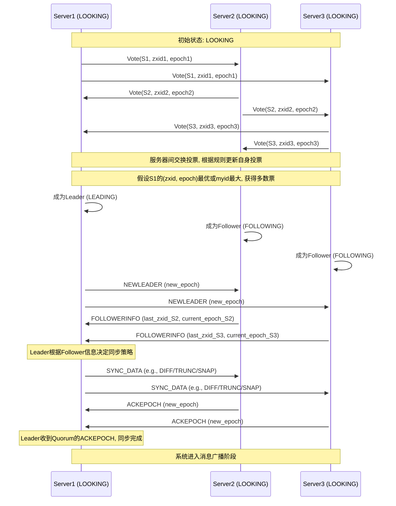
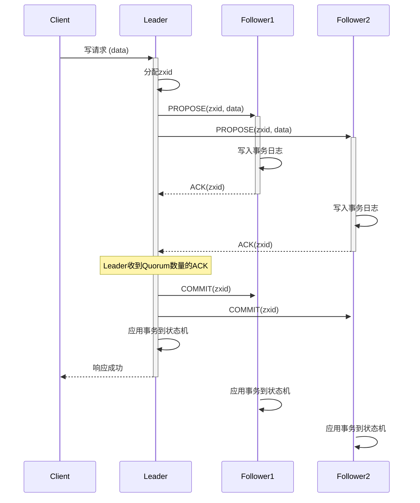
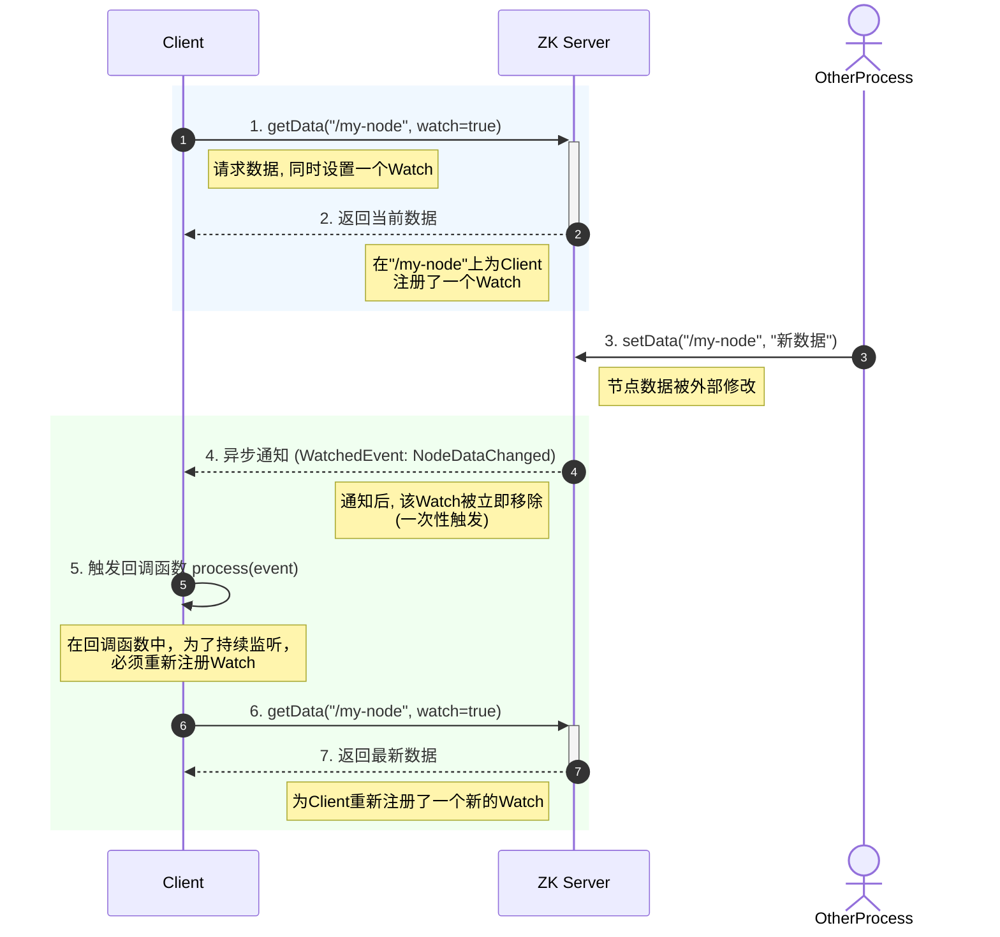
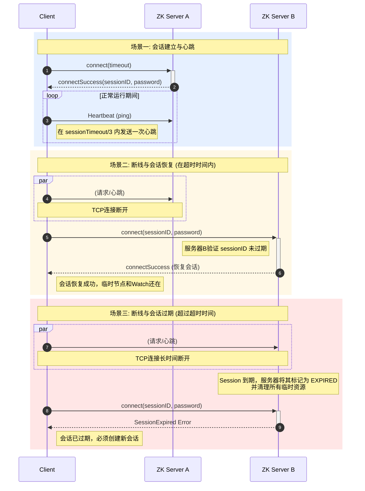

# ZooKeeper

ZooKeeper 是一个开源的分布式协调服务框架，即为分布式应用提供一致性服务，最初是 Apache Hadoop 项目的一个子项目，后来发展成为一个独立的顶级项目。

在架构上，通过集群部署，提供了高可用、高并发，并定制了 ZAB（ZooKeeper Atomic Broadcast） 协议，用于解决分布式场景下，主从之间的数据一致性问题。与此同时，结合 Zxid 确保顺序一致性，结合 WAL(Write-Ahead Log) 与快照能力，确保持久性，通过读写分离，提高了读操作性能。

此外，ZooKeeper 还有着一定的局限性，所有写操作均由 Leader 进行处理，存在写操作瓶颈问题，且从设计上考虑，仅支持存储小数据，存储较大数据时（如 100mb），会显著增大内存、GC、网络传输、持久化等问题，在 Leader 选举期间，集群不能对外提供服务，简言之，即仅适用于小数据流、变更频率低的协调/元数据等场景。

## 核心特性

**顺序一致性**

来自任何特定客户端的更新请求都会按照其发送顺序被应用，同时所有服务器上的事务是全局有序的。

主要机制：

- ZAB 协议：保障顺序一致性
- Zxid：标识事务顺序

**持久性 (Durability)**

一旦一个更新操作被成功应用并得到确认，这个状态变化就会被持久化，即使发生服务器故障也不会丢失。

主要机制：

- WAL: 日志先行，所有确认的变更都会先持久化存储
- 定期快照: 定期将内存中的数据树状态完整地转储到磁盘快照文件中
- 数据恢复: 当服务器启动或从故障中恢复时，它会先加载最新的快照，然后重放快照之后的所有事务日志，从而恢复到最新的状态

**原子性 (Atomicity)**

更新操作要么完全成功，要么完全失败，不存在部分成功的情况。

主要机制：

- 一致性：保障数据一致性
- 持久性：保障服务器意外退出后，也能恢复所有已确认的变更
- `multi` 操作：将多个操作视为一个原子操作

**高可用性**

ZooKeeper 集群只要有超过半数的服务器正常工作，整个服务就是可用的。

主要机制：

- Replication: 多个服务器中的数据是一致的，均可对外提供服务
- ZAB 协议: 超过半数服务器时，可完成选举、投票等操作

**高性能**

在保障顺序一致性的同时，提供高吞吐量和低延迟的服务。

主要机制：

- 内存存储：所有数据均存在于内存中，读写性能极高
- 读写分离：写操作仅由 Leader 处理，但是读操作可以由各节点单独响应
- 拓展节点：支持 Observer 角色，会参与日志同步，并对外提供读服务，但是不会参与投票，即不影响写操作和选举的性能

## 数据模型

ZooKeeper 的数据模型是一个**层次化的命名空间（hierarchical namespace）**，其结构与标准文件系统非常相似，这个命名空间由一系列的 **ZNode** (ZooKeeper Node) 组成。

核心要点如下：

- **不是通用数据库：** 不要用来存储大量应用数据，强项在于协调和元数据管理
- **内存为主，持久化为辅：** 为了高性能，数据主要存储在内存中，但会通过事务日志和快照持久化到磁盘，实现持久化
- **版本号：** `Stat` 中的 `version` (数据版本) 和 `cversion` (子节点版本) 对于实现乐观并发控制非常重
- **临时节点：** 临时节点是实现许多分布式协调模式（如服务发现、活性检测、分布式锁）的关键
- **顺序节点：** 顺序节点为实现公平锁、分布式队列等提供了便利

### ZNode (ZooKeeper 节点)

**路径 (Path)**

每个 ZNode 都通过一个唯一的、以 `/` 分隔的路径来标识，类似于文件系统中的文件路径

- 路径必须是绝对路径，以 `/` 开头
- 路径中不能包含 `.` 或 `..` 这样的相对路径元素
- 路径的组成部分不能包含 `/` 字符本身

**数据 (Data)**

每个 ZNode 都可以存储少量数据（通常是配置信息、状态信息、元数据等）

- 数据是以字节数组 (`byte[]`) 的形式存储的
- ZooKeeper 不会解析或关心这些数据的具体内容，它只负责存储和检索
- ZNode 存储的数据量默认上限是 1MB，应该仅存储少量的、关键的用于协调的数据

**子节点 (Children)**

ZNode 可以有子节点，从而形成树状结构

- 一个 ZNode 可以同时拥有数据和子节点

**Stat 结构 (Metadata)**

每个 ZNode 都关联一个 `Stat` 对象，它包含了该 ZNode 的元数据信息

- `cZxid`: 创建该 ZNode 的事务 ID，由 epoch (纪元号，每次选举新的 Leader 时递增) 和 counter (该 epoch 内的事务计数器)两部分组成
- `mZxid`: 最后一次修改该 ZNode 的事务 ID
- `pZxid`: 最后一次修改该 ZNode 的子节点列表的事务 ID
- `ctime`: ZNode 的创建时间 (毫秒)
- `mtime`: ZNode 的最后修改时间 (毫秒)
- `dataVersion`: ZNode 数据内容的版本号。每次数据修改，版本号都会增加，用于乐观锁
- `cversion`: ZNode 子节点的版本号。每次子节点列表（增删子节点）发生变化，版本号都会增加
- `aclVersion`: ZNode ACL (访问控制列表) 的版本号
- `ephemeralOwner`: 如果该 ZNode 是临时节点，则此字段为创建该节点的会话 ID (Session ID)，如果不是临时节点，则为 0
- `dataLength`: ZNode 数据内容的长度
- `numChildren`: 该 ZNode 的子节点数量

### ZNode 类型

ZooKeeper 中的 ZNode 有多种类型，这些类型决定了 ZNode 的生命周期和行为：

**持久节点 (Persistent Nodes)**

- 默认的节点类型，一旦创建，除非被显式删除，否则会一直存在
- 生命周期与创建节点的客户端会话无关
- 用途：存储需要长期存在的配置信息、应用元数据等

**临时节点 (Ephemeral Nodes)**

- 生命周期与创建它的客户端会话绑定，会话结束时，会自动删除
- **重要特性：临时节点只能做叶子节点，不能有子节点**
- 用途：适合实现服务发现（服务提供者注册一个临时节点，服务消费者监听）、集群成员管理（每个成员注册一个临时节点）、领导者选举（竞争创建临时节点）、分布式锁（创建临时节点表示持有锁）

**顺序节点 (Sequential Nodes)**

- 当创建这类节点时，ZooKeeper 会自动在指定的路径名后附加一个单调递增的 10 位数字序号
- 顺序节点可以是持久节点或临时节点
- 例如，如果客户端请求创建路径为 `/myapp/lock-` 的顺序节点，ZooKeeper 可能会创建 `/myapp/lock-0000000001`，下一个可能是 `/myapp/lock-0000000002`，以此类推
- 这个序号在父节点的所有子节点中是唯一的且单调递增的
- 用途：常用于实现分布式锁（特别是公平锁，序号最小的获得锁）、分布式队列、唯一命名等

**容器节点 (Container Nodes) (自 ZooKeeper 3.5.3 版本引入)**

- 一种特殊的持久节点
- 当一个容器节点的最后一个子节点被删除后，该容器节点本身将在未来的某个时刻（不是立即）被 ZooKeeper 服务器自动删除
- 用途：用于管理那些作为父节点但本身不存储重要数据，只用于组织子节点的 ZNode，当子节点都被清理后，这些父节点可以被自动清理，避免留下大量空的父节点

**TTL 节点 (TTL Nodes) (自 ZooKeeper 3.5.3 版本引入)**

- 可以为持久节点设置一个 TTL (Time To Live) 值（以毫秒为单位）
- 如果一个 TTL 节点在 TTL 时间内没有被修改，并且没有任何子节点，那么它将被 ZooKeeper 服务器自动删除
- 用途：用于自动清理过期的、不再使用的数据，例如一些有时效性的状态信息

## ZAB

ZAB (ZooKeeper Atomic Broadcast) 是一种专门为 ZooKeeper 设计的协议，其核心是写操作均由主服务器串行执行，并确保主从服务器间数据实时同步，是 ZooKeeper 实现强一致性（包括顺序一致性和数据一致性）的基石。与 Paxos 和 Raft 等共识算法有相似之处，但更侧重于构建一个高可用的主备系统。

### 核心概念

- **Zxid (ZooKeeper Transaction ID)**：一个 64 位的数字，全局唯一且严格递增，高 32 位是 epoch (纪元)，低 32 位是事务计数器。
  - **Epoch**：每当选举产生一个新的 Leader，epoch 就会递增，用于区分不同 Leader 任期内的事务
  - **事务计数器**：在同一个 epoch 内，每产生一个事务，计数器就递增

- **服务器状态**
  - **LOOKING**：选举状态，服务器正在寻找 Leader
  - **LEADING**：领导者状态，负责处理和广播事务
  - **FOLLOWING**：跟随者状态，接收并处理 Leader 发来的事务
  - **OBSERVING**：观察者状态，类似于 Follower，但不参与投票和事务提交的 Quorum 确认，只同步数据

- **Quorum (法定人数)**：集群中大多数服务器，通常是 (N/2) + 1，其中 N 是集群中的服务器总数
  - Leader 的选举和事务的提交都需要得到 Quorum 数量的服务器的确认

### 崩溃恢复 (Crash Recovery)

当 ZooKeeper 集群启动时，或者当现有的 Leader 节点崩溃，或与多数 Follower 失去联系时，ZAB 协议会进入**崩溃恢复**模式。

此阶段的目标是选举出一个新的 Leader，并确保新的 Leader 拥有所有已经被集群中多数节点确认（committed）的事务，同时丢弃那些只被旧 Leader 提出但未被多数节点确认的事务，核心流程如下：

**领导者选举 (Fast Leader Election Algorithm)**

- 所有服务器初始状态为 `LOOKING`（不包含 Observer 节点）

- `LOOKING` 状态的服务器向其他服务器发送投票，投票内容通常包含：
  - `proposed_leader_id`: 提议的 Leader 的服务器 ID (myid)
  - `proposed_zxid`: 提议的 Leader 已知的最新事务 ID (Zxid)
    - 即已持久化在本地的的事务 ID，有可能还未提交
  - `election_epoch` (or `logical_clock`): 当前选举的逻辑时钟或纪元

- **投票规则**
  - 优先选择 `election_epoch` 更大的。
  - 如果 `election_epoch` 相同，则选择 `proposed_zxid` 更大的。
  - 如果 `proposed_zxid` 也相同，则选择 `myid` 更大的。

- **选举规则**
  - 服务器收到投票后，会与自己的投票做比较，如果收到的投票更优，则更新自己的投票并重新广播。
  - 若某服务器获得超过半数（Quorum）的投票，且是已知的最优结果，则成为准 Leader，状态为 `LEADING`，投票给它的服务器为 Follower，状态为 `FOLLOWING`。

**数据同步(Synchronization)**

- **核心原则**
  - 新 Leader 必须包含所有已经在集群上被确认的事务，且必须同步给所有 Follower
  - 所有未被集群确认的事务会被丢弃
- **前期准备**
  - Leader 选举成功后，等待 Follower 连接
  - Follower 连接时，会发送自己的最后事务 ID（`lastZxid`）给 Leader
  - Leader 综合所有 Follower 的 `lastZxid`，确定集群的一致性起点
- **同步流程**
  - Leader 确定新的 `epoch`，并发起 `NEWLEADER` 提案，Follower 回复事务 ID（`lastZxid`）
  - Leader 收到 Quorum 数量的 ACK 后，综合所有`lastZxid`，确定同步策略：
    - `DIFF` (差异同步)：若 Follower 部分落后，Leader 会补发缺失事务
    - `SNAP` (快照同步)：若 Follower 落后太多，Leader 先先补发快照，再补发缺失事务
    - `TRUNC` (截断)：若 Follower 有未提交的事务，Leader 会要求截断 / 回滚
  - Follower 执行同步指令，并回复 `ACK`
  - Leader 收到 Quorum 数量的 `ACK` 后，会发送 `UPTODATE` 指令，集群进入正常运行状态，开始接受客户端请求。
- **启动广播**：完成同步后，Leader 可以正常接受新的客户端请求，并进行消息广告，集群恢复正常

### 消息广播 (Message Broadcasting)

当集群中存在一个活跃的 Leader 并且有过半数的 Follower 与其完成了同步后，ZAB 协议进入消息广播阶段。此阶段会采取类似 2PC 的方式，处理客户端的写请求。

**提议 (Proposal)**

Leader 接受请求，并发起提案（`PROPOSAL` 消息）：

- 所有写请求都会被转发给 Leader（如果客户端连接的是 Follower，Follower 会将请求转发给 Leader）
- Leader 为该写请求分配一个全局唯一的、单调递增的 Zxid
- Leader 将这个写操作封装成一个事务提案 (`PROPOSAL` 消息)，其中包含 Zxid 和操作内容
- Leader 将该 `PROPOSAL` 广播给所有 Follower（包括 Leader 自身）

**确认 (Ack)**

Follower 收到 `PROPOSAL` 消息后，以严格的 FIFO 顺序处理这些提案：

- Follower 将提案写入本地的事务日志（持久化）
- 写入成功后，Follower 向 Leader 发送一个 `ACK` 消息，表示已收到并持久化该提案

**提交 (Commit)**

Leader 等待来自 Follower 的 `ACK` 消息：

- 当 Leader 收到超过半数（Quorum）的 `ACK` 后，认为该提案已经被“提交” (committed)
- Leader 向所有 Follower 广播一个 `COMMIT` 消息，通知它们提交该 Zxid 对应的事务

**应用 (Apply)**

Follower 收到 `COMMIT` 消息后：

- 将对应的事务从事务日志中取出
- 按照 Zxid 的顺序，将事务应用到本地的内存状态机中

**响应（Resp）**

Leader 响应了 `COMMIT` 消息，并应用了对应事务后，会向客户端发送成功响应。

## ZAB VS Raft

ZAB 和 Raft 都属于 Leader-based 的共识协议，通过日志复制（Log Replication）和多数派投票（Quorum）来保证数据的一致性和系统的可用性，但由于它们的设计目标和应用场景不同，导致在具体实现和细节上存在显著差异。

### 设计目标

**ZAB (ZooKeeper Atomic Broadcast)**

专为 ZooKeeper 设计的协议，首要目标是服务于 ZooKeeper 的主从架构，保障集群对外提供服务时，主从节点中事务的顺序一致性，属于 **CP** 系统。

**Raft**

作为 Paxos 算法的易于理解和实现的替代品而被设计出来，首要目标是可理解性（Understandability），它将复杂的共识问题分解为三个相对独立的子问题：领导者选举（Leader Election）、日志复制（Log Replication）和安全性（Safety），旨在成为一个通用的、可以被广泛应用的共识算法，属于 **AP** 系统。

对于主从节点的一致性，Raft 不会保障物理数据上的一致，但可以通过 Read Index 或 Lease Read 的方案，保障从节点中不确定的数据，对用户是不可见的，即逻辑上是一致的。

### 纪元 && 任期

ZAB 的 `Epoch` 在选举后由新 Leader 确立，并作为 `zxid` 的一部分，直接服务于事务的排序。Raft 的 `Term` 主要服务于选举，在选举阶段递增。

**ZAB**

- **核心概念**：`epoch` 是与**特定领导者生命周期**绑定的逻辑时钟。
- **核心目标**：通过 `zxid` 保障事务的全局有序。
- **生成机制：选举结束后生成**
  - 在选举过程中，各个节点会交换它们最后处理的 `zxid`。
  - 当一个新的 Leader 被选举出来后，它会从自己（或所见过的所有节点中）最高的 `zxid` 中提取出 `epoch`，然后将其加一，形成新的 `epoch`。
- **主要作用**：
  - **构成 `zxid`**：`epoch` 是 `zxid` 的高位部分，这使得 `zxid` 能够保证全局唯一且有序，所有由新 Leader 发起的事务，都会使用这个新的 `epoch` 来构造 `zxid`。
  - **确保数据一致性**：在选举完成后、正式对外提供服务前，Leader 会使用新的 `epoch` 来确保所有 Follower 的日志状态同步到一致，特别是要确保所有旧 `epoch` 中已提交的事务都存在于所有 Follow-up 节点上。

**Raft**

- **核心概念**：`term` 是一个全集群共享的、严格单调递增的逻辑时钟。
- **核心目标**：一个 `term` 仅对应一个领导者，保障安全地更换 Leader。
  - 将时间划分为一个个连续的“任期”，每个 Leader 对应的 `term` 均不相同。
- **生成机制：选举驱动**
  - 当一个 Follower 或 Candidate 决定发起新一轮选举时，它会**首先将自己本地的 `term` 加一**，然后才向其他节点发送投票请求。
  - 任何节点（无论是 Leader, Candidate, 还是 Follower）如果收到来自更高 `term` 的请求，都会立即更新自己的 `term` 并转为 Follower 状态。
- **主要作用：**
  - **废黜旧领导者：** 任何来自旧 `term` 的 Leader 发出的消息都会被集群中的其他节点拒绝，确保一个 `term` 最多只有一个 Leader。
  - **标记选举周期：** 每个 `term` 都从一次选举开始。如果选举成功，则该 `term` 的剩余时间由一个 Leader 主导；如果选举失败（例如，票数分裂），该 `term` 也会结束，新的选举将在一个更高的 `term` 中进行。

### 选举

在选举期间，ZAB 和 Raft 都无法对外提供服务，但是在流程上，ZAB 会有一个明确的同步节点，会先选举出一个数据最新的节点，再完成同步操作，会显著延长无法服务的时间，Raft 则先保障选举出的 Leader，必然包含所有 Follower 的日志，是最完整的，后续通过日志同步阶段，让 Follower 补齐即可。

此外，在选举时，ZAB 会通过 `myid`（服务器 ID）避免节点优先级冲突的问题，而 `Raft` 通过引入随机的 `timeout` 来进行规避，`timeout` 结合 `Term`，还可以减少选举时的 Candidate 数量，进一步缩短选举耗时。

**ZAB**

1. 选举：
   1. 现有 Leader 崩溃，或与大部分 Follower 失联时，触发选举。
   2. 综合 `epoch`、`zxid` 等信息，选取出新的 Leader，新 Leader 拥有所有集群中已提交的事务。
2. 同步：新 Leader 以自己的日志为基准，向所有 Follower 发送同步指令。

**Raft**

1. 选举：
   1. 节点通过心跳超时成为 Candidate，发起投票，获得多数票后成为 Leader。
   2. 节点仅会投票给 `term` 更大且日志更新的 Candidate

- **可线性提升可用性：** 通过引入"Pre-Vote"等机制（比如etcd等实现中），进一步避免了无用的选举。

### 日志提交

ZAB 有一个**显式的 `COMMIT` 消息**，保障所有节点同步应用事务，而 Raft 是通过 Leader 的后续通信中**捎带**提交信息，Leader 先行，Follower 会滞后应用。

**ZAB**

1. 提议 (Proposal)：Leader 收到写请求后，向所有 Follower 广播一个事务提议（`PROPOSAL`）。
2. 确认 (Ack)：Follower 把 `PROPOSAL` 先记录到磁盘，然后回复 Leader 一个 `ACK`。
3. 提交 (Commit)：Leader 收到过半数的 `ACK` 后，向所有 Follower 广播 `COMMIT` 消息。
4. 应用 (Apply)：所有节点（包括 Leader）收到 `COMMIT` 消息后，把数据更新到内存里。

**Raft**

1. 复制 (Replicate)：Leader 收到写请求后，会把日志记在自己本地，并发送 `AppendEntries` RPC 给所有 Follower。
2. 确认 (Acknowledge)：Follower 收到后，会写入本地日志并回复 `ACK`。
3. 应用 (Apply)：Leader 收到过半数 `ACK` 后，会直接在自己本地应用数据（提交）。
4. 通知 (Notify)：Leader 通过下一次心跳或 `AppendEntries` RPC，告诉 Follower 哪些日志已经可以应用了，Follower 随后再应用数据。

## 其他特性

### Watches

Watches 是 Zookeeper 提供的观察者模式，是实现其分布式协调服务的核心机制之一。

当改节点发生特定类型的变化时，Zookeeper 会异步通知所有设置了监视点（Watch） 的客户端：

**核心特性**

- **一次性触发**：当 Watch 被触发后，会被立即移除，客户端如果需要继续监听，需要重新注册一个新的 Watch。
- **顺序保障**：Zookeeper 保障 Watch 事件的发送顺序与实际变化顺序是一致的。
- **轻量级**：Watch 事件会异步发送，且只包含事件类型和 Znode 路径，不包含具体数据。

**常见问题**

- **羊群效应**：需要考虑当监听者数量较多时，触发通知后，所有监听者同时发起读请求的峰值问题。
  - 可以考虑引入随机延迟，或者监听不同节点，如分布式锁的场景下，等待锁的客户端监听排在前面的其他客户端而不是锁节点

### Session

Session 是客户端与 Zookeeper 服务器之间的一个 TCP 长链接，在数据传输以外，还起到了生命周期控制、状态保障的能力。

**核心特性**

- **生命周期**：每个 Session 都有一个明确的生命周期，包括 `CONNECTING`（连接中）、`CONNECTED`（已连接）、`CLOSED`（已关闭）、`EXPIRED`（已过期）等状态。

- **唯一标识**：首次连接时，Zookeeper 会为客户端创建一个 Session，并返回一个全局唯一的 `Session ID`，这个 ID 在整个会话的生命周期内都保持不变。

- **超时控制**：客户端在创建会话时，会与服务端协商一个**会话超时时间**（`Session Timeout`）。
  - 在超时时间内，如果服务端没有收到客户端任何消息，会认为会话过期（`Expired`），客户端可以通过心跳包来保活。
  - 在超时时间内，如果会话断开但是重连成功，会复用原有的 `Session ID`，之前创建的临时节点与 Watch 仍然有效。

- **顺序一致性**: 同一个 Session 内，客户端的请求会被服务端按顺序处理，这是实现很多分布式原语（如队列）的基础。

## 典型应用场景详解

### 统一配置管理

- **场景描述**
  - 在一个分布式系统中，通常有大量的服务节点需要共享一些配置信息，例如数据库连接信息、功能开关、黑白名单等。当这些配置需要变更时，希望能实时通知到所有服务节点，而无需逐个重启服务。

- **实现方案**
  1. 将配置信息存储在 ZooKeeper 的一个或多个 Znode 上（例如 `/app/config/db_config`）。
  2. 所有客户端应用（服务节点）在启动时连接 ZooKeeper，获取并监听（`watch`）这些 Znode。
  3. 当配置需要变更时，管理员或运维工具直接修改 ZooKeeper 上对应的 Znode 数据。
  4. ZooKeeper 会立即向所有监听该 Znode 的客户端发送 `NodeDataChanged` 通知。
  5. 客户端收到通知后，重新从 ZooKeeper 拉取最新的配置数据并动态更新到内存中，使其生效。

- **优势**
  - 解决了分布式环境下配置管理的**中心化、动态化和实时性**问题。
  - 避免了手动维护多份配置文件带来的不一致和高昂的运维成本，实现了配置的秒级生效。

### 集群成员管理与服务发现

- **场景描述**
  - 在分布式系统中，需要动态获取集群节点或服务实例的列表，以实现负载均衡、任务分发或服务调用。

- **实现方案**
  - 注册：节点/服务启动时，在预定义的根路径（如 `/services/order-service`）下创建代表自身的临时 Znode，并可写入 IP、端口等信息。
  - 订阅：管理端或服务消费端监听（watch）该根路径的子节点变化。
  - 感知：当有节点加入或退出（宕机导致临时节点被自动删除）时，订阅方会收到通知，随即更新可用的节点列表。

- **优势**
  - 实现了节点的自动注册与动态发现。
  - 这种实时、可靠的监控机制，是服务治理、负载均衡和高可用等功能的核心基础。

### Master 选举

- **场景描述**
  - 在一些高可用集群中，为了避免单点故障，通常会部署多个节点，但只有一个节点能作为 Master 对外提供服务。当 Master 宕机时，需要从剩下的 Slave 节点中选举出一个新的 Master。

- **实现方案**
  1. 所有竞选节点尝试在 ZooKeeper 上创建一个**唯一的临时 Znode**，例如 `/master`。
  2. 由于 ZooKeeper 的写操作是原子性的，最终只有一个节点能成功创建该 Znode。成功创建的节点即成为 Master。
  3. 其他创建失败的节点则成为 Slave，并监听 `/master` 这个 Znode 的 `NodeDeleted` 事件。
  4. 如果现任 Master 宕机或与 ZooKeeper 断开连接，其创建的临时 Znode 会被自动删除。
  5. 所有监听该节点的 Slave 都会收到通知，然后再次发起创建 `/master` 节点的尝试，进入新一轮的选举。
  6. **优化（避免惊群效应）**: 可使用临时顺序节点，所有节点都创建 `/election/node-`，序号最小的成为 Master，其他节点只需监听比自己序号小的前一个节点即可。

- **优势**
  - 保证了在分布式集群中**领导者的唯一性**，并实现了**自动化的故障转移（Failover）**。
  - 避免了“脑裂”（Split-Brain）问题，确保了系统在任何时候都有一个明确的协调者。

### 分布式锁

- **场景描述**
  - 在多台机器上运行的多个进程需要互斥地访问某个共享资源（如一个关键任务、一个订单库存），需要一种跨机器的锁机制来保证同一时间只有一个进程能访问。

- **实现方案**
  - **排他锁**
    1. 与 Master 选举类似，所有需要获取锁的进程尝试创建一个**临时 Znode**，如 `/lock/shared_resource`。
    2. 成功创建的进程获得锁，可以访问共享资源。
    3. 操作完成后，进程主动删除该 Znode 以释放锁。
    4. 如果进程崩溃，临时 Znode 会自动删除，避免死锁。
  - **共享锁（读写锁）**
    - 通过创建临时顺序节点实现。所有请求锁的进程都在 `/lock` 下创建节点，读请求和写请求有不同标识。通过判断自己节点前的节点序列来决定是否能获得读锁或写锁。

- **优势**
  - 提供了可靠的**跨进程、跨机器的互斥访问控制**。解决了分布式环境下的资源竞争问题，防止数据不一致，同时通过临时节点的特性有效避免了死锁。

### 分布式屏障

- **场景描述**
  - 在分布式计算中，有时需要等待一组（N个）任务全部执行到某个阶段后，再一起进入下一个阶段。这个同步点就是“屏障”。

- **实现方案**
  1. 首先创建一个屏障 Znode，例如 `/barrier`，并规定一个阈值 N（参与的进程数）。
  2. 每个进程在到达屏障点时，在 `/barrier` 下创建一个自己的临时 Znode。
  3. 然后，每个进程获取 `/barrier` 下的子节点数量。
  4. 如果子节点数量小于 N，则该进程进入等待状态（通过监听 `/barrier` 的子节点变化）。
  5. 如果子节点数量达到 N，则所有等待的进程都会被唤醒，撤销屏障，继续执行后续任务。

- **优势**
  - 实现了分布式环境下的**进程同步**。确保多个独立的计算单元在特定点上步调一致，这对于需要协同完成的大规模并行计算任务至关重要。

## Ref

- <https://zh.wikipedia.org/zh-hans/Apache_ZooKeeper>
- <https://javaguide.cn/distributed-system/distributed-process-coordination/zookeeper/zookeeper-intro.html>
- <https://javaguide.cn/distributed-system/distributed-process-coordination/zookeeper/zookeeper-plus.html>
- <https://ivanzz1001.github.io/records/post/paxos/2018/01/02/zookeeper-part2>
- <https://www.cnblogs.com/way2backend/p/17364272.html>
- <https://wingsxdu.com/posts/database/zookeeper/#%E4%BC%9A%E8%AF%9D>
