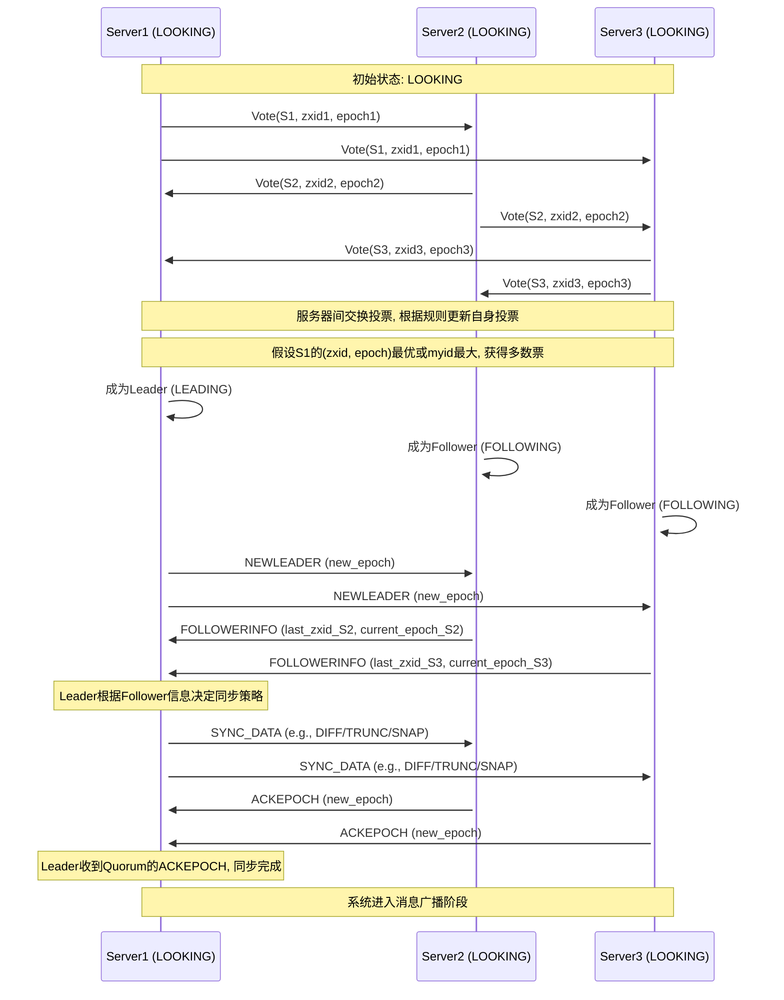
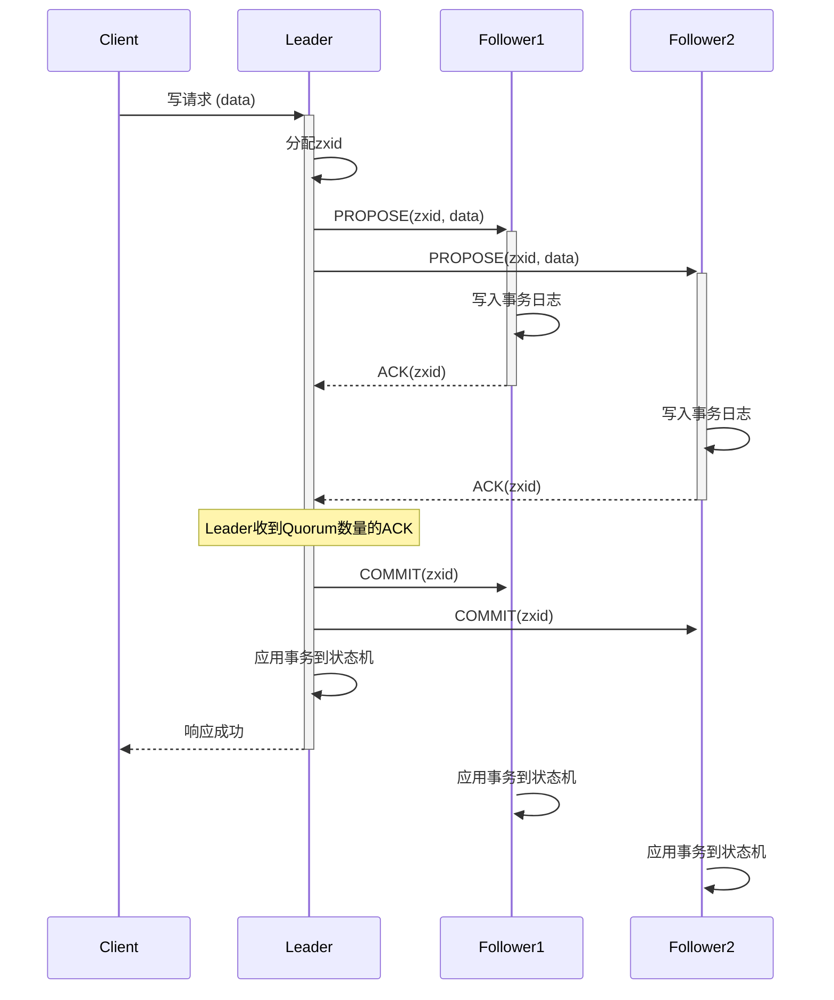

# ZooKeeper

ZooKeeper 是一个开源的分布式协调服务框架，即为分布式应用提供一致性服务，最初是 Apache Hadoop 项目的一个子项目，后来发展成为一个独立的顶级项目。

在架构上，通过集群部署，提供了高可用、高并发，并定制了 ZAB（ZooKeeper Atomic Broadcast） 协议，用于解决分布式场景下，主从之间的数据一致性问题。与此同时，结合 Zxid 确保顺序一致性，结合 WAL(Write-Ahead Log) 与快照能力，确保持久性。

## 核心特性

**一致性**

保障顺序一致性和数据一致性，来自任何特定客户端的更新请求都会按照其发送顺序被应用，同时所有服务器上的数据是最终一致的。

主要机制：

- Zxid：保障操作的顺序
- ZAB 协议：保障数据一致性

**持久性 (Durability)**

一旦一个更新操作被成功应用并得到确认，这个状态变化就会被持久化，即使发生服务器故障也不会丢失。

主要机制：

- WAL: 日志先行，所有确认的变更都会先持久化存储
- 定期快照: 定期将内存中的数据树状态完整地转储到磁盘快照文件中
- 数据恢复: 当服务器启动或从故障中恢复时，它会先加载最新的快照，然后重放快照之后的所有事务日志，从而恢复到最新的状态

**原子性 (Atomicity)**

更新操作要么完全成功，要么完全失败，不存在部分成功的情况。

主要机制：

- 一致性：保障数据一致性
- 持久性：保障服务器意外退出后，也能恢复所有已确认的变更
- `multi` 操作：将多个操作视为一个原子操作

**高可用性**

ZooKeeper 集群只要有超过半数的服务器正常工作，整个服务就是可用的。

主要机制：

- Replication: 多个服务器中的数据是一致的，均可对外提供服务
- ZAB 协议: 超过半数服务器时，可完成选举、投票等操作

## 数据模型

ZooKeeper 的数据模型是一个**层次化的命名空间（hierarchical namespace）**，其结构与标准文件系统非常相似，这个命名空间由一系列的 **ZNode** (ZooKeeper Node) 组成。

核心要点如下：

- **不是通用数据库：** 不要用来存储大量应用数据，强项在于协调和元数据管理
- **内存为主，持久化为辅：** 为了高性能，数据主要存储在内存中，但会通过事务日志和快照持久化到磁盘，实现持久化
- **版本号：** `Stat` 中的 `version` (数据版本) 和 `cversion` (子节点版本) 对于实现乐观并发控制非常重
- **临时节点：** 临时节点是实现许多分布式协调模式（如服务发现、活性检测、分布式锁）的关键
- **顺序节点：** 顺序节点为实现公平锁、分布式队列等提供了便利

### ZNode (ZooKeeper 节点)

**路径 (Path)**

每个 ZNode 都通过一个唯一的、以 `/` 分隔的路径来标识，类似于文件系统中的文件路径

- 路径必须是绝对路径，以 `/` 开头
- 路径中不能包含 `.` 或 `..` 这样的相对路径元素
- 路径的组成部分不能包含 `/` 字符本身

**数据 (Data)**

每个 ZNode 都可以存储少量数据（通常是配置信息、状态信息、元数据等）

- 数据是以字节数组 (`byte[]`) 的形式存储的
- ZooKeeper 不会解析或关心这些数据的具体内容，它只负责存储和检索
- ZNode 存储的数据量默认上限是 1MB，应该仅存储少量的、关键的用于协调的数据

**子节点 (Children)**

ZNode 可以有子节点，从而形成树状结构

- 一个 ZNode 可以同时拥有数据和子节点

**Stat 结构 (Metadata)**

每个 ZNode 都关联一个 `Stat` 对象，它包含了该 ZNode 的元数据信息

- `cZxid`: 创建该 ZNode 的事务 ID，由 epoch (纪元号，每次选举新的 Leader 时递增) 和 counter (该 epoch 内的事务计数器)两部分组成
- `mZxid`: 最后一次修改该 ZNode 的事务 ID
- `pZxid`: 最后一次修改该 ZNode 的子节点列表的事务 ID
- `ctime`: ZNode 的创建时间 (毫秒)
- `mtime`: ZNode 的最后修改时间 (毫秒)
- `dataVersion`: ZNode 数据内容的版本号。每次数据修改，版本号都会增加，用于乐观锁
- `cversion`: ZNode 子节点的版本号。每次子节点列表（增删子节点）发生变化，版本号都会增加
- `aclVersion`: ZNode ACL (访问控制列表) 的版本号
- `ephemeralOwner`: 如果该 ZNode 是临时节点，则此字段为创建该节点的会话 ID (Session ID)，如果不是临时节点，则为 0
- `dataLength`: ZNode 数据内容的长度
- `numChildren`: 该 ZNode 的子节点数量

### ZNode 类型

ZooKeeper 中的 ZNode 有多种类型，这些类型决定了 ZNode 的生命周期和行为：

**持久节点 (Persistent Nodes)**

- 默认的节点类型，一旦创建，除非被显式删除，否则会一直存在
- 生命周期与创建节点的客户端会话无关
- 用途：存储需要长期存在的配置信息、应用元数据等

**临时节点 (Ephemeral Nodes)**

- 生命周期与创建它的客户端会话绑定，会话结束时，会自动删除
- **重要特性：临时节点只能做叶子节点，不能有子节点**
- 用途：适合实现服务发现（服务提供者注册一个临时节点，服务消费者监听）、集群成员管理（每个成员注册一个临时节点）、领导者选举（竞争创建临时节点）、分布式锁（创建临时节点表示持有锁）

**顺序节点 (Sequential Nodes)**

- 当创建这类节点时，ZooKeeper 会自动在指定的路径名后附加一个单调递增的 10 位数字序号
- 顺序节点可以是持久节点或临时节点
- 例如，如果客户端请求创建路径为 `/myapp/lock-` 的顺序节点，ZooKeeper 可能会创建 `/myapp/lock-0000000001`，下一个可能是 `/myapp/lock-0000000002`，以此类推
- 这个序号在父节点的所有子节点中是唯一的且单调递增的
- 用途：常用于实现分布式锁（特别是公平锁，序号最小的获得锁）、分布式队列、唯一命名等

**容器节点 (Container Nodes) (自 ZooKeeper 3.5.3 版本引入)**

- 一种特殊的持久节点
- 当一个容器节点的最后一个子节点被删除后，该容器节点本身将在未来的某个时刻（不是立即）被 ZooKeeper 服务器自动删除
- 用途：用于管理那些作为父节点但本身不存储重要数据，只用于组织子节点的 ZNode，当子节点都被清理后，这些父节点可以被自动清理，避免留下大量空的父节点

**TTL 节点 (TTL Nodes) (自 ZooKeeper 3.5.3 版本引入)**

- 可以为持久节点设置一个 TTL (Time To Live) 值（以毫秒为单位）
- 如果一个 TTL 节点在 TTL 时间内没有被修改，并且没有任何子节点，那么它将被 ZooKeeper 服务器自动删除
- 用途：用于自动清理过期的、不再使用的数据，例如一些有时效性的状态信息

## ZAB

ZAB (ZooKeeper Atomic Broadcast) 是一种专门为 ZooKeeper 设计的协议，其核心是写操作均由主服务器串行执行，并确保主从服务器间数据实时同步，是 ZooKeeper 实现强一致性（包括顺序一致性和数据一致性）的基石。与 Paxos 和 Raft 等共识算法有相似之处，但更侧重于构建一个高可用的主备系统。

### 核心概念

- **Zxid (ZooKeeper Transaction ID)**：一个 64 位的数字，全局唯一且严格递增，高 32 位是 epoch (纪元)，低 32 位是事务计数器。
  - **Epoch**：每当选举产生一个新的 Leader，epoch 就会递增，用于区分不同 Leader 任期内的事务
  - **事务计数器**：在同一个 epoch 内，每产生一个事务，计数器就递增

- **服务器状态**
  - **LOOKING**：选举状态，服务器正在寻找 Leader
  - **LEADING**：领导者状态，负责处理和广播事务
  - **FOLLOWING**：跟随者状态，接收并处理 Leader 发来的事务
  - **OBSERVING**：观察者状态，类似于 Follower，但不参与投票和事务提交的 Quorum 确认，只同步数据

- **Quorum (法定人数)**：集群中大多数服务器，通常是 (N/2) + 1，其中 N 是集群中的服务器总数
  - Leader 的选举和事务的提交都需要得到 Quorum 数量的服务器的确认

### 崩溃恢复 (Crash Recovery)

当 ZooKeeper 集群启动时，或者当现有的 Leader 节点崩溃，或与多数 Follower 失去联系时，ZAB 协议会进入**崩溃恢复**模式。

此阶段的目标是选举出一个新的 Leader，并确保新的 Leader 拥有所有已经被集群中多数节点确认（committed）的事务，同时丢弃那些只被旧 Leader 提出但未被多数节点确认的事务，核心流程如下：

**领导者选举 (Fast Leader Election Algorithm)**

- 所有服务器初始状态为 `LOOKING`（不包含 Observer 节点）

- `LOOKING` 状态的服务器向其他服务器发送投票，投票内容通常包含：
  - `proposed_leader_id`: 提议的 Leader 的服务器 ID (myid)
  - `proposed_zxid`: 提议的 Leader 已知的最新事务 ID (Zxid)
  - `election_epoch` (or `logical_clock`): 当前选举的逻辑时钟或纪元

- **投票规则**
  - 优先选择 `election_epoch` 更大的
  - 如果 `election_epoch` 相同，则选择 `proposed_zxid` 更大的
  - 如果 `proposed_zxid` 也相同，则选择 `myid` 更大的

- **选举规则**
  - 服务器收到投票后，会与自己的投票做比较，如果收到的投票更优，则更新自己的投票并重新广播
  - 若某服务器获得超过半数（Quorum）的投票，且是已知的最优结果，则成为准 Leader，投票给它的服务器为 Follower

**数据同步(Synchronization)**

- **核心原则**
  - 新 Leader 必须包含所有已经在旧 Leader 上被 Quorum 确认的事务，且必须同步给所有 Follower
  - 所有未被 Quorum 确认的事务会被丢弃
- **前期准备**
  - Leader 选举成功后，等待 Follower 连接
  - Follower 连接时，会发送自己的最后事务 ID（`lastZxid`）给 Leader
  - Leader 综合所有 Follower 的 `lastZxid`，确定集群的一致性起点
- **同步流程**
  - Leader 确定新的 `epoch`，并发起 `NEWLEADER` 提案，Follower 回复事务 ID（`lastZxid`）
  - Leader 收到 Quorum 数量的 ACK 后，综合所有`lastZxid`，确定同步策略：
    - `DIFF` (差异同步)：若 Follower 部分落后，Leader 会补发缺失事务
    - `SNAP` (快照同步)：若 Follower 落后太多，Leader 先先补发快照，再补发缺失事务
    - `TRUNC` (截断)：若 Follower 有未提交的事务，Leader 会要求截断 / 回滚
  - Follower 执行同步指令，并回复 `ACK`
  - Leader 收到 Quorum 数量的 `ACK` 后，会发送 `UPTODATE` 指令，集群进入正常运行状态，开始接受客户端请求。
- **启动广播**：完成同步后，Leader 可以正常接受新的客户端请求，并进行消息广告，集群恢复正常

### 消息广播 (Message Broadcasting)

当集群中存在一个活跃的 Leader 并且有过半数的 Follower 与其完成了同步后，ZAB 协议进入消息广播阶段。此阶段会采取类似 2PC 的方式，处理客户端的写请求。

**提议 (Proposal)**

Leader 接受请求，并发起提案（`PROPOSAL` 消息）：

- 所有写请求都会被转发给 Leader（如果客户端连接的是 Follower，Follower 会将请求转发给 Leader）
- Leader 为该写请求分配一个全局唯一的、单调递增的 Zxid
- Leader 将这个写操作封装成一个事务提案 (`PROPOSAL` 消息)，其中包含 Zxid 和操作内容
- Leader 将该 `PROPOSAL` 广播给所有 Follower（包括 Leader 自身）

**确认 (Ack)**

Follower 收到 `PROPOSAL` 消息后，以严格的 FIFO 顺序处理这些提案：

- Follower 将提案写入本地的事务日志（持久化）
- 写入成功后，Follower 向 Leader 发送一个 `ACK` 消息，表示已收到并持久化该提案

**提交 (Commit)**

Leader 等待来自 Follower 的 `ACK` 消息：

- 当 Leader 收到超过半数（Quorum）的 `ACK` 后，认为该提案已经被“提交” (committed)
- Leader 向所有 Follower 广播一个 `COMMIT` 消息，通知它们提交该 Zxid 对应的事务

**应用 (Apply)**

Follower 收到 `COMMIT` 消息后：

- 将对应的事务从事务日志中取出
- 按照 Zxid 的顺序，将事务应用到本地的内存状态机中

**响应（Resp）**

Leader 响应了 `COMMIT` 消息，并应用了对应事务后，会向客户端发送成功响应。

## Ref

- <https://zh.wikipedia.org/zh-hans/Apache_ZooKeeper>
- <https://javaguide.cn/distributed-system/distributed-process-coordination/zookeeper/zookeeper-intro.html>
- <https://javaguide.cn/distributed-system/distributed-process-coordination/zookeeper/zookeeper-plus.html>
- <https://ivanzz1001.github.io/records/post/paxos/2018/01/02/zookeeper-part2>
- <https://www.cnblogs.com/way2backend/p/17364272.html>
