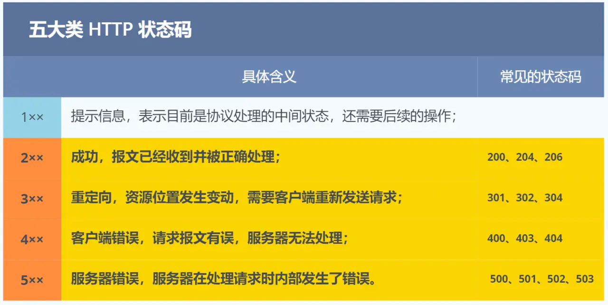
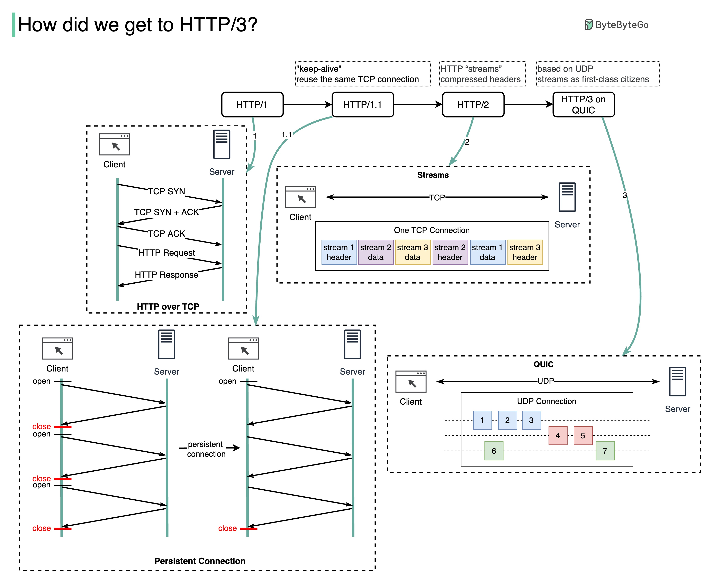
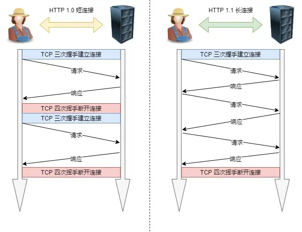
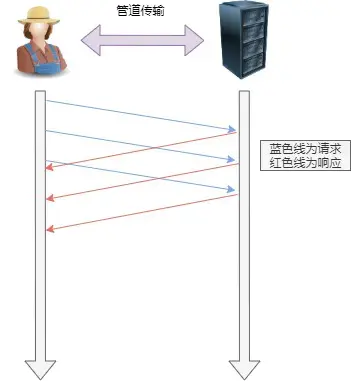
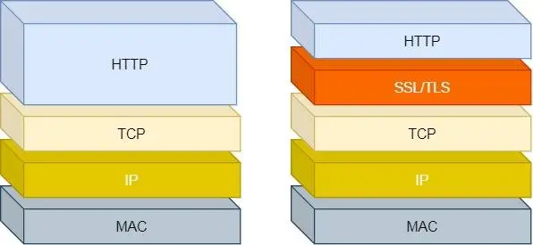
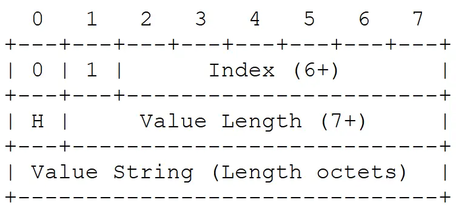
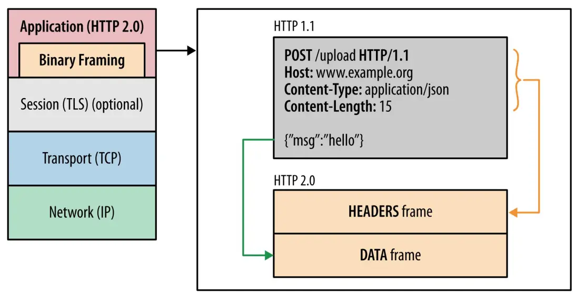
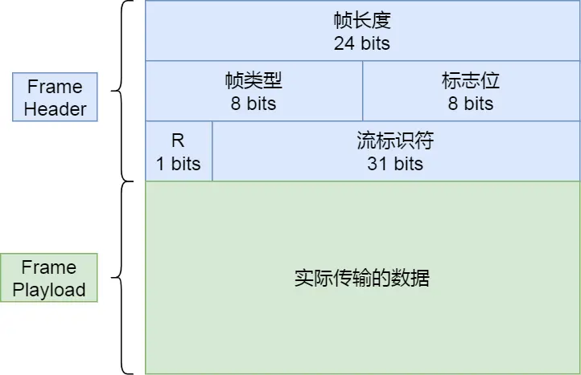
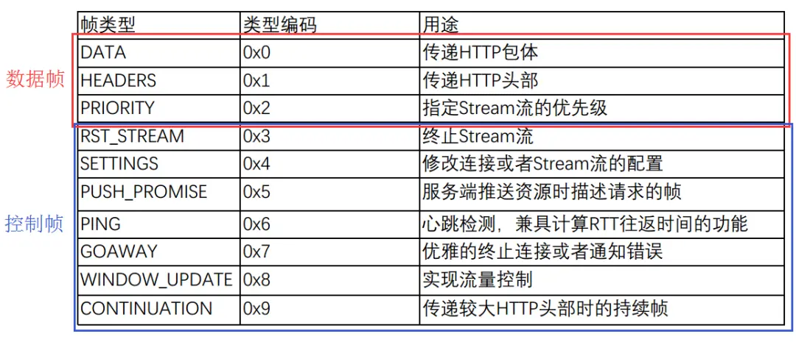
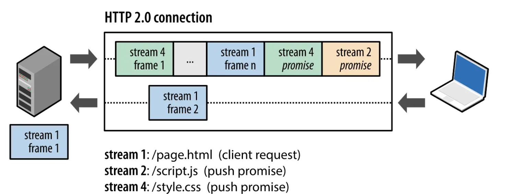

# HTTP

HTTP（HyperText Transfer Protocol，超文本传输协议）是一种用于分布式、协作式超媒体信息系统的应用层协议，是万维网数据通信的基础。

## 基本概念

### 主要特性（HTTP/1.1）

- **无状态性**：每个请求独立，服务器不保留之前请求的信息
  - 可通过 Cookie、Session 等技术实现状态管理
- **基于 TCP/IP**：默认端口 80（HTTP）和 443（HTTPS）
  - 支持下层协议随意变化，如 HTTP/3.0 改用 UDP（QUIC）
- **HTTPS**：HTTP 仅支持明文传输，HTTPS 引入了 SSL/TLS 进行加密和认证，保障数据安全

### 头部字段

| 字段               | 描述     |
|--------------------|--------|
| Host               | 请求的服务器域名 |
| Content-Type       | 实体类型（如`text/html; charset=utf-8`）|
| Content-Length     | 实体大小（字节）|
| Cache-Control      | 缓存策略（如`max-age=3600`） |
| ETag/Last-Modified | 资源标识与缓存验证 |
| Cookie             | 客户端 Cookie 管理    |
| Authorization      | 认证信息（如`Bearer token`） |
| User-Agent         | 客户端标识（如浏览器类型）   |
| Accept-*           | 内容协商（如`Accept-Language: en`） |

### 请求方法

| 方法    | 描述      |
|---------|---------|
| GET     | 请求资源，参数在 URL 中，无请求体 |
| POST    | 提交数据（如表单），请求体包含数据 |
| PUT     | 更新服务器资源，客户端提供完整内容 |
| PATCH   | 部分更新资源  |
| DELETE  | 删除资源 |
| HEAD    | 获取响应头，不返回内容 |

### 状态码



- `200 OK`：响应成功
- `301 Moved Permanently`：永久重定向
- `302 Found`：临时重定向
- `400 Bad Request`：客户端请求报文异常
- `403 Forbidden`：服务器禁止访问
- `404 Not Found`：资源不存在
- `500 Internal Server Error`：服务端异常
- `502 Bad Gateway`：网关异常

### 版本演进



- **HTTP/0.9**：1991年，仅支持 GET 方法，响应纯文本
- **HTTP/1.0**（1996）：
  - 支持多种方法（GET、POST、HEAD）
  - 引入状态码、头部字段、Content-Type 等
  - 每个请求需新建 TCP 连接，效率低
- **HTTP/1.1**（1997，主流版本）：
  - **持久连接**：默认保持 TCP 连接复用（`Connection: keep-alive`）
  - **管道化**（Pipelining）：允许发送多个请求，但响应必须按序返回
  - 新增方法（PUT、DELETE、OPTIONS、TRACE）
  - 分块传输（`Transfer-Encoding: chunked`）
  - 缓存控制（`Cache-Control`、`ETag`）
- **HTTP/2**（2015）：
  - **二进制分帧**：提升解析效率
  - **多路复用**：解决响应队列队头阻塞，支持并行请求
  - **头部压缩**（HPACK 算法）
  - **服务器推送**：主动推送资源
- **HTTP/3**（2022）：
  - 基于 QUIC 协议（UDP实现），减少连接延迟
  - 改进多路复用，避免 TCP 队头阻塞

## 高级特性（HTTP/1.1）

### 缓存

HTTP 缓存的核心目标是**减少重复请求、降低服务器负载、加速页面加载**，其实现主要分为两类：**强制缓存**和**协商缓存**：

#### 强制缓存

强制缓存的规则是：**浏览器直接从本地缓存中读取资源，不向服务器发送请求**，其工作流程如下：

1. 浏览器首次请求资源，服务器返回资源并附加 `Cache-Control` 或 `Expires`
2. 在有效期内，浏览器直接读取本地缓存，**状态码显示 `200 (from disk cache)` 或 `200 (from memory cache)`**
3. 缓存过期后，进入协商缓存流程

**头部字段**

- **`Cache-Control`（HTTP/1.1 标准）**  
  - `max-age=3600`：资源有效期（秒），优先级高于 `Expires`
  - `public`：允许所有缓存（如 CDN、浏览器）存储资源
  - `private`：仅允许浏览器缓存
  - `no-cache`：禁用强制缓存，需走协商缓存
  - `no-store`：完全禁止缓存（敏感数据）

- **`Expires`（HTTP/1.0 遗留字段）**  
  - 指定资源的过期时间（绝对时间，如 `Expires: Wed, 21 Oct 2025 07:28:00 GMT`）
  - 缺点：依赖客户端本地时间，可能因时区或时钟偏差失效

#### 协商缓存

当强制缓存失效时，浏览器向服务器发送请求，**由服务器判断资源是否修改**，其工作流程如下：

1. 浏览器请求资源时携带 `If-Modified-Since` 或 `If-None-Match`
2. 服务器检查资源是否变化：  
   - 未变化：返回 `304 Not Modified`（无响应体），浏览器使用缓存
   - 已变化：返回 `200 OK` 和新资源，更新缓存头

**头部字段**

- **`Last-Modified`（响应头）与 `If-Modified-Since`（请求头）**  
  - 服务器返回资源时附加 `Last-Modified: <修改时间>`
  - 浏览器下次请求时携带 `If-Modified-Since: <Last-Modified值>`
  - 服务器对比时间，若未修改则返回 `304`
  - **缺点**：  
    - 时间精度为秒级，短时间内的修改可能无法检测
    - 文件内容未变但修改时间更新（如重新生成）会导致无效请求

- **`ETag`（响应头）与 `If-None-Match`（请求头）**  
  - 服务器返回资源时附加 `ETag: <唯一标识符>`（如哈希值）
  - 浏览器下次请求时携带 `If-None-Match: <ETag值>`
  - 服务器对比标识符，若一致则返回 `304`
  - **优势**：  
    - 精确标识内容变化，避免时间误差问题
  - **缺点**：生成 ETag 可能增加服务器计算开销

### 内容协商

用于客户端与服务器协商返回资源的最佳表现形式（如语言、编码、格式等）。

**协商类型**

- **服务器驱动**：客户端发送请求头，服务器根据头信息选择资源（常用方式）
- **客户端驱动**：服务器返回可选列表，客户端手动选择
- **透明协商**：中间代理（如 CDN）协助决策（较少使用）

**头部字段**

- `Accept`：客户端支持的 MIME 类型（如 `text/html, application/json`）
- `Accept-Language`：语言偏好（如 `en-US, zh-CN;q=0.9`）
- `Accept-Encoding`：支持的压缩方式（如 `gzip, deflate`）
- `Accept-Charset`：字符集偏好（如 `utf-8`）

**服务器响应**

- 通过 `Content-Type`、`Content-Language` 等头部告知客户端最终选择的资源形式
- 若无法满足请求，返回 `406 Not Acceptable` 或默认格式

### 分块传输

动态发送未知大小的内容（如实时生成的数据流），无需预先计算 `Content-Length`。

**适用场景**

- 适用于大文件下载、实时流（如视频直播）或服务器动态生成内容
- 避免因无法预知内容长度而延迟传输

其实现逻辑如下：

- 响应头设置 `Transfer-Encoding: chunked`
- 数据按块（chunk）发送，每块格式为：`[十六进制长度]\r\n[数据]\r\n`
- 结束标志：`0\r\n\r\n`

### 断点续传

支持从中断位置继续传输，减少重复流量消耗。

**客户端请求**

- 通过 `Range` 头指定请求的字节范围：
  - `Range: bytes=0-499`（前 500 字节）  
  - `Range: bytes=500-`（从第 500 字节到结尾）

**服务器响应**

- 支持范围请求时返回 `206 Partial Content`
- 头部 `Content-Range` 标记实际返回的范围：  
  - `Content-Range: bytes 0-499/1000`（总长度 1000 字节）
- 若不支持，返回 `200 OK` 及完整内容

**校验机制**

- 使用 `ETag` 或 `Last-Modified` 确保资源未变更，避免续传错误

## 性能优化（HTTP/1.1）

### 请求合并

将多个小请求合并为单个请求，减少 HTTP 请求数量，降低网络开销。

**常见实现**

- **资源合并**：合并多个 CSS/JS 文件为一个，减少请求次数（需权衡缓存效率）
- **CSS Sprites**：将多个小图标合并为一张大图，通过`background-position` 定位显示
- **数据URI**：将小图片转为 Base64 嵌入HTML/CSS，减少请求（适用于极小的资源）

**优点**：减少请求次数，降低延迟
**缺点**：可能影响缓存粒度，合并文件频繁变更会导致缓存失效

### 压缩

通过无损压缩或有损压缩，减小传输数据体积，提升传输效率。

**常见实现**

- **文本压缩**：服务器启用 Gzip、Brotli（更高效）压缩 HTML/CSS/JS
- **图片优化**：使用 WebP 格式替代 JPEG/PNG，调整压缩率平衡质量与大小
- **视频压缩**：采用 H.265 编码，或使用流媒体分片（如 MPEG-DASH）

### CDN 加速（Content Delivery Network）

通过全球分布的边缘节点缓存静态资源，用户就近访问，降低延迟。

**应用场景**

- 静态资源（图片、JS/CSS、字体）分发
- 视频流媒体加速
- DDoS 防护与 SSL 卸载

**优势**

- 减少物理距离带来的延迟
- 分担源服务器压力
- 提供冗余和高可用性

**注意事项**

- 合理设置缓存策略（如Cache-Control头部）
- 版本化文件名（如`style.v2.css`）确保资源更新后及时刷新

### 长连接

支持复用 TCP 连接，避免重复握手开销，提升效率。



### 管道传输

在支持 TCP 长连接的情况下，客户端可以连续发起多次请求，无需等待服务端返回，但是服务端必须按序进行处理。即 HTTP/1.1 解决了请求队列的队头阻塞问题，但没有解决响应队列的队头阻塞问题。



## HTTPS

**HTTPS**（HyperText Transfer Protocol Secure）是在 HTTP 基础上通过SSL/TLS 协议提供加密、身份验证和数据完整性保障的安全通信协议。

**主要区别**

- **安全性**：HTTPS 通过 SSL/TLS 加密传输数据，HTTP 为明文传输，易被窃听或篡改
- **建连**：HTTP 仅需 TCP 握手即可，HTTPS 额外需要 SSL/TLS 握手
- **端口**：HTTP 默认使用 80 端口，HTTPS 使用 443 端口
- **证书**：HTTPS 需服务器配置数字证书，验证身份并建立信任

**核心机制**

- **加密传输**：混合加密（非对称加密交换密钥 + 对称加密传输数据），避免数据明文传输
- **身份认证**：数字证书验证服务器身份，防止钓鱼网站与中间人攻击
- **数据完整性**：哈希算法（如SHA-256）确保数据未被篡改

### SSL/TLS

SSL/TLS 主要用于在传输层与应用层之间加密数据，防止中间人攻击，其区别如下：

- **SSL（Secure Sockets Layer）**：由 Netscape 开发，现已被TLS取代
- **TLS（Transport Layer Security）**：SSL 的升级版，主流版本为TLS 1.2 和 1.3，提供更强的安全性



**握手过程（TLS 1.2）**

1. **Client Hello**：客户端发送支持的 TLS 版本、加密套件列表及随机数
2. **Server Hello**：服务器选择加密套件，返回随机数及数字证书（含公钥）
3. **证书验证**：客户端验证证书有效性（CA 签名、域名匹配、有效期等）
4. **密钥交换**：客户端生成预主密钥，用服务器公钥加密后发送
5. **生成会话密钥**：双方通过随机数和预主密钥生成对称加密密钥
6. **加密通信**：后续数据传输使用对称加密（如 AES）

**TLS 1.3 改进**

- 简化握手步骤至 1-RTT（往返一次），提升速度
- 移除不安全算法（如 RSA 密钥交换），默认支持前向保密（PFS）

### 数字证书与 CA

- **证书内容**：域名、公钥、签发者（CA）、有效期、数字签名。
- **CA（证书颁发机构）**：受信任的第三方机构（如Let's Encrypt、DigiCert）。
- **证书链**：根证书 → 中间证书 → 服务器证书，客户端需信任根证书。
- **证书类型**：DV（域名验证）、OV（组织验证）、EV（扩展验证）。

## HTTP/2

HTTP/2（2015 年正式发布）是 HTTP 协议的第二个主要版本，旨在解决 HTTP/1.x 的性能瓶颈，提升网络传输效率。

### 头部压缩（HPACK）

通过 **HPACK** 算法显著减少了 HTTP 头部的大小（通常压缩率可达 **50-90%**），解决了 HTTP/1.x 中头部冗余导致的性能瓶颈。

HPACK 是一种**静态与动态表结合**的压缩算法，其核心组件如下所示：

**静态表（Static Table）**

- 预定义了 **61 个常见 HTTP 头部字段和值**，直接通过**索引值**引用这些字段（例如索引 `2` 表示 `:method: GET`），无需重复传输

  | **Index** | **Header Name**    | **Header Value** |
  |-----------|--------------------|------------------|
  | 1         | `:authority`       | (空值)           |
  | 2         | `:method`          | `GET`            |
  | 3         | `:method`          | `POST`           |
  | ...       | ...                | ...              |
  | 60        | `via`              | (空值)           |
  | 61        | `www-authenticate` | (空值)           |

- 对于 Value 为空值的字段，其数值是动态变化的，会通过其他策略进行优化（如采用哈夫曼编码），其头部格式如下：
  - 第一个字节中，头部 `01` 表示使用静态表，但是 value 为动态值
  - 第二个字节中，头部 `H` 表示是否使用 Huffman 编码，后面为 value 具体长度

  

**动态表（Dynamic Table）**

- 在通信过程中动态维护的键值对表，存储**当前连接中频繁出现的自定义或重复的头部字段**
- **更新规则**：
  - 客户端和服务器根据请求/响应的头部字段更新各自的动态表
  - 动态表大小有限（可通过 `SETTINGS` 帧协商），遵循先进先出（FIFO）淘汰机制

**哈夫曼编码（Huffman Coding）**

- 对头部值（如长 URL、Cookie）使用**哈夫曼编码**进一步压缩，通过高频字符用短编码、低频字符用长编码优化空间
- **示例**：字符 `e`（高频）可能编码为 `01`，而 `z`（低频）可能编码为 `111000`

**压缩过程示例**

假设客户端首次发送请求：

```http
GET /index.html HTTP/2
Host: example.com
User-Agent: Chrome/120
Cookie: session=abc123
```

1. **静态表匹配**：
   - `:method: GET` → 静态表索引 `2`
   - `:path: /index.html` → 无匹配，使用动态表或哈夫曼编码
2. **动态表更新**：
   - 将 `Host: example.com`、`User-Agent: Chrome/120`、`Cookie: session=abc123` 存入动态表，分配新索引
3. **后续请求**：
   - 若再次发送相同头部，直接引用动态表索引，无需重复传输

### **二进制分帧（Binary Framing）**

将 HTTP 消息（请求/响应）分解为更小的二进制帧（如 HEADERS 帧、DATA 帧），替代 HTTP/1.x 的文本格式，显著提高传输效率和解析效率。



**帧结构**

每个 HTTP/2 帧由 **Header** 和 **Payload** 组成：

- **帧头（Header）**：HTTP/2 中帧相关属性
  - 帧长度：帧数据的长度
  - 标志位：额外携带控制信息，如 `PRIORITY` 表示流的优先级
  - 流标识：用来标识该 frame 属于哪个流，实现多路复用
- **帧数据（Playload）**：HTTP/1.x 中数据，即 HTTP 头部信息或 Body 信息



**帧类型**

HTTP/2 定义了 10 种类型的帧，一般分为**数据帧**和**控制帧**：



**核心优势**

- **多路复用（Multiplexing）**
  - 通过**流（Stream）** 实现并发传输
  - 每个流是独立的双向通信通道，多个流的帧可以交错发送
  - **示例**：
    - 客户端在同一连接中发送请求 A 和 B
    - 服务器可先返回请求 B 的响应（如小图片），再返回请求 A 的响应（如大文件），避免队头阻塞

- **高效解析**
  - 二进制格式无需文本解析，可直接按字节处理，提升解析速度和准确性

- **细粒度控制**
  - 通过帧的 **Flags** 和 **Stream Identifier**，精确控制流的生命周期和数据传输顺序
  - 支持优先级（`PRIORITY` 帧）和流量控制（`WINDOW_UPDATE` 帧）

### **服务器推送（Server Push）**

在同一个 TCP 连接中，客户端与服务端双方都可以建立 Stream，此时服务端可以主动向客户端推送资源（如 CSS、JS），无需等待客户端显式请求。

- **优势**：预加载关键资源，减少往返延迟，提升页面渲染速度。
- **流标识**：同一个连接中的流标识，即 Stream ID 不能复用，只能顺序递增
  - 客户端建立的 Stream 必须是奇数，服务端建立的 Stream 必须是偶数
  - 当 Stream ID 达到配置上限时，需要通过控制帧 `GOAWAY` 关闭连接



## Ref

- <https://xiaolincoding.com/network/2_http/http_interview.html>
- <https://xiaolincoding.com/network/2_http/http2.html>
