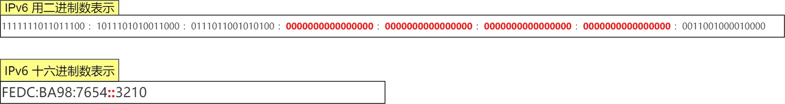

# IP

**IP协议（Internet Protocol）**是网络层的核心协议，负责在不同网络间进行数据包的**寻址**和**路由**，确保数据从源主机传输到目标主机。

## 关键特性

- **无连接**：不预先建立连接，每个数据包独立传输
- **不可靠**：不保证数据包送达、顺序或完整性，可靠性由上层协议（如TCP）保障
- **分片与重组**：IPv4 支持数据包分片（由路由器处理），IPv6 仅在源主机分片

## IPv4

IPv4 由 32 位正整数来表示，并采取了点分十进制的标记方法，每 8 位为一组，每组以 `.` 隔开，如 `192.168.1.1`

### 分类

早期 IP 较为充裕，故设计了分类地址，将 IP 分割为类别、网络号和主机号三部分，并划分为 5 类：

其中 A、B、C 类地址支持的最大主机数各不相同（$2^{len\_host}-2$），按需申请使用：

- 最大主机数需要减去两个特殊主机号
- 主机号全 0 代表某个网络
- 主机号全 1 代表某个网络下所有主机，用于广播

IP 分类会导致使用上不够灵活，主要存在两个问题：

- 同一网络下没有层次划分，缺少灵活性
- A、B、C 三类地址支持的主机数差异过大，C 类过小而 B 类、A 类过大

### CIDR

CIDR 将 IPv4 划分为网络号与主机号两部分，取消了分类标识符，通过分割位数，动态调整，如 `10.100.122.2/24`：

### 子网掩码

子网掩码可以掩盖主机号，将 IP 地址与子网掩码按位做与运算，即可得到网络号：

对于分类地址来说，子网掩码可以在网络号固定的基础上，再划分出子网网络号，提供更灵活的划分方式：

### 公有 IP

对于 A、B、C 三类地址，有公有和私有之分，私有 IP 可以由组织内部的 IT 人员自己管理，但是公有 IP 必须由组织统一分配。

## IPv6

相比与 IPv4，IPv6 的地址是 128 位，所能提供的地址数量，远超 IPv4（32 位，约 42 亿），能够彻底解决地址耗尽问题。

IPv6 以 16 位为一组，以十六进制表示，每组间用 `:` 隔开：

当出现连续的 0 时，可将其省略并用两个 `:` 隔开，为了准确识别地址，仅允许出现一次两个连续冒号：

### 分类

IPv6 的主要类别如下：

- 链路本地单播地址：同一链路内单播通信，不经过路由器（IPv4 没有该类型）
- 唯一本地地址：在内网中单播通信（相当于 IPv4 的私有 IP）
- 全局单播地址：在互联网中通信（相当于 IPv4 的公有 IP）

### 首部

IPv4 与 IPv6 首部对比如下：

- IPv6 取消了首部校验和，因为在数据链路层和传输层都会校验，无需在网络层单独校验
- 取消了分片/重组相关字段，仅允许源服务器操作，不允许中间路由器进行操作，避免了 MTU 不一致的问题，提高转发效率
- 取消可选字段，替换为 `next_header` 所指向的位置，无需中间设备进行解析

### 优势

- **地址空间大**
  - 共支持 128 位地址长度，几乎不会耗尽
  - 无需 NAT 协议，简化网络架构

- **首部结构优化**
  - 固定 40 字节，移除了无用字段，减小体积，提高处理效率和传输性能

- **自动配置**
  - **无状态地址自动配置（SLAAC）**：设备可通过本地路由器的 RA（Router Advertisement）报文自动生成 IPv6 地址（基于 MAC 地址或随机生成），无需依赖 DHCP 服务器

- **原生安全性高**
  - **强制支持IPsec**：IPv6原生集成 IPsec 协议（加密、认证、完整性保护），为端到端通信提供安全保障（IPv4 中 IPsec 为可选扩展）

- **更高效的多播与任播**
  - **多播优化**：IPv6 多播地址范围更广（如 `FF00::/8`），支持更灵活的多播组管理（如视频会议、流媒体分发）
  - **广播改为多播**：IPv6 完全摒弃广播机制，使用多播替代，减少网络中的无效流量
  - **任播（Anycast）**：允许将数据包发送到“最近”的服务节点（如 DNS 根服务器、CDN 节点），提升服务响应速度

- **服务质量**
  - **流标签字段**：IPv6 头部新增 20 位“流标签”（Flow Label），标识特定数据流的优先级，支持更精细的流量管理（如实时视频、在线游戏的低延迟传输）
  - **移动IPv6（MIPv6）**：设备在不同网络间切换时，可通过家乡地址（Home Address）和转交地址（Care-of Address）保持通信连续性，无需重新建立连接

- **过渡机制**
  - **双栈技术**：设备可同时运行 IPv4 和 IPv6 协议栈，逐步过渡到纯 IPv6 网络
  - **隧道技术**：通过 IPv4 网络承载 IPv6 流量（如 6to4、Teredo 隧道）
  - **协议转换**：使用 NAT64/DNS64 实现 IPv6 与 IPv4 网络的互通

## 其他常见协议

### DNS

**DNS**（Domain Name System，域名系统）负责域名解析，将域名转化为具体的 IP 地址，其流程如下所示：

- 优先查询本地缓存：浏览器缓存、操作系统缓存、路由器缓存
- 向本地 DNS 服务器发起查询请求（ISP 或公共 DNS 服务商）
- 本地 DNS 服务器递归查询各级 DNS 服务器并返回结果

### ARP

**ARP**（Address Resolution Protocol，地址解析协议）负责将 IP 地址解析为 MAC 地址，实现局域网通信，其流程如下：

- 主机广播 ARP 请求，内部包含想要解析的 IP 地址
- 其他设备解析 ARP 请求，如果发现与自己的 IP 地址一致，就将自己的 MAC 地址放入 ARP 响应包返回给主机

相对应的，**RAPR**（Reverse-ARP）负责已知 MAC 地址求 IP 地址，常用于小型嵌入式设备接入网络时，向 RARP 服务器请求自己的 IP 地址：

### DHCP

**DHCP**（Dynamic Host Configuration Protocol，动态主机配置协议）用于自动为网络中的设备分配IP地址及其他网络配置参数（如子网掩码、默认网关、DNS服务器），其核心流程分为 4个阶段（DORA 流程）：

- **DHCP Discover（发现阶段）**
  - **广播请求**：客户端发送 **DHCP Discover** 报文（UDP 67 端口，目标地址 `255.255.255.255`），寻找可用 DHCP 服务器
  - **报文内容**：包含客户端 MAC 地址、事务 ID 等

- **DHCP Offer（提供阶段）**
  - **服务器响应**：收到 Discover 报文的 DHCP 服务器，从地址池中选择一个可用 IP，发送 **DHCP Offer** 报文（广播或单播）
  - **报文内容**：  
    - 分配的 IP 地址、子网掩码、租期（Lease Time）
    - 其他参数：默认网关、DNS 服务器、域名等

- **DHCP Request（请求阶段）**
  - **客户端确认**：客户端可能收到多个 Offer（如多台 DHCP 服务器），选择**首个收到的 Offer**，发送 **DHCP Request** 报文（广播），正式请求分配 IP
  - **报文内容**：明确指定选中的 DHCP 服务器和 IP 地址

- **DHCP Acknowledge（确认阶段）**
  - **最终确认**：被选中的 DHCP 服务器发送 **DHCP ACK** 报文，确认 IP 分配生效
  - **客户端配置**：客户端应用网络参数，完成初始化
  - **租期计时**：客户端开始倒计时租期（如 24 小时），并在租期过半时尝试续租

**租期管理与续约**

- **租期续约（Renewal）**：  
  - 客户端在租期过半（T1=50% Lease Time）时，向原DHCP服务器单播 **DHCP Request**，请求延长租期
  - 服务器回应 **DHCP ACK**（允许续约）或 **DHCP NAK**（强制释放IP）

- **重新绑定（Rebinding）**：  
  - 若续约失败（如原服务器无响应），客户端在租期 87.5%（T2）时广播 **DHCP Request**，寻找其他可用服务器

- **租期到期**：  
  - 若租期到期仍未续约，客户端停止使用该 IP，重新发起 Discover 流程

**异常场景与处理**

- **无DHCP服务器响应**：  
  - 客户端启用 **APIPA（自动私有IP寻址）**，分配`169.254.x.x`（链路本地地址），但仅限局域网通信

- **IP冲突检测**：  
  - DHCP 服务器分配 IP 前，通过 **ARP探测** 确保 IP 未被占用
  - 若冲突，标记该 IP 为“已用”并分配新地址

- **跨子网分配**：  
  - 使用 **DHCP中继代理（Relay Agent）** 转发客户端请求到其他子网的 DHCP 服务器

### NAT

**NAT**（Network Address Translation，网络地址转换）用于将私有 IP 与公有 IP 进行转换，实现内网与公网的互通，能够缓解公有 IP 紧缺问题：

- NAT 转换时，私有 IP 需要与公有 IP 一一对应
- 当私有 IP 较多时，NAT 转换表根据实际需要动态调整

**NAPT**（Network Address Port Translation，网络地址端口转换）则可以将多个私有 IP 映射到单个公有 IP 的不同端口，用于缓解 IPv4 地址耗尽问题：

传统的 NAT 方案，需要由 NAT 网关统一维护映射关系，外部设备无法主动连接内网设备（NAT 映射表无对应条目），且端口号的变化难以预测。

基于此，可以使用 NAT 穿透技术，让双方设备通过三方服务器，获取自己对应的公网 IP 与端口号，从而实现直接通信。

### ICMP

**ICMP**（Internet Control Message Protocol，互联网控制消息协议）用于传递网络控制与错误消息，确认 IP 包能否成功送达目标地址，以及过程中的异常信息。

常见的类型如下：

基于 ICMP，可以实现 `Ping`、`Traceroute` 等工具。

### IGMP

**IGMP**（Internet Group Management Protocol，互联网组管理协议）用于管理组播组成员，支持视频会议等组播应用，其工作机制如下：

- **组成员加入**
  - 主机发送 IGMP Membership Report 到目标组播地址（如 224.0.0.22 为IGMPv3 专用地址）
  - 路由器记录该子网存在组成员，开始转发对应组播流量

- **组成员维护**
  - 查询器（Querier）定期（默认 60 秒）发送 General Query，询问子网内所有组播组的成员状态
  - 主机响应 Membership Report，确认仍需接收流量

- **组成员离开**
  - 主机发送 Leave Group 消息（仅 IGMPv2/v3 支持）
  - 路由器发送 Group-Specific Query 确认无其他成员后，停止转发流量

### IPsec

**IPsec**（Internet Protocol Security，互联网协议安全）是一组用于保护IP通信的协议套件，通过在**网络层**提供加密、身份认证和数据完整性验证，确保数据在公共网络（如互联网）中传输的安全性。

其核心功能包括 **机密性**、**完整性**、**身份验证** 和 **防重放攻击**，广泛应用于VPN、远程访问、企业分支互联等场景。

**核心组件**

- **安全协议**
  - **AH（Authentication Header，认证头）**：
    - **功能**：提供数据完整性校验、身份认证和防重放保护
    - **不加密数据**，仅保护 IP 包头和负载的完整性

  - **ESP（Encapsulating Security Payload，封装安全载荷）**：
    - **功能**：在 AH 的基础上增加**数据加密**（如 AES、3DES）
    - **保护范围**：加密负载数据，可选认证 IP 包头（隧道模式）

- **工作模式**
  - **传输模式**：
    - **保护对象**：上层协议数据（如 TCP/UDP），适合端到端通信
    - **数据包结构**：IP头 + AH/ESP头 + 上层数据

  - **隧道模式**：
    - **保护对象**：整个原始 IP 数据包（封装为新 IP 包），适合 VPN 
    - **数据包结构**：新 IP 头 + AH/ESP头 + 原始 IP 头 + 上层数据

- **安全关联（SA，Security Association）**  
  - **定义**：单向的安全策略集合，包括加密算法、密钥、生存周期等参数
  - **SA 三元组**：安全参数索引（SPI）、目标 IP 地址、安全协议（AH/ESP）
  - **双向通信**：需要两个 SA（一个方向使用一个）

- **密钥管理协议**
  - **手动配置**：预共享密钥（PSK），适用于小型网络
  - **自动配置**：  
    - **IKE（Internet密钥交换协议）**：动态协商密钥，分两阶段：  
      - **IKE Phase 1**：建立安全通道（使用 Diffie-Hellman 交换），支持主模式（Main Mode）或积极模式（Aggressive Mode）
      - **IKE Phase 2**：协商 IPsec SA 参数（如加密算法、生存时间）
    - **IKEv1/IKEv2**：IKEv2 简化流程并增强安全性（抗 DoS 攻击）

**工作流程**

- **建立安全关联（SA）**
  - **策略匹配**：根据预先定义的安全策略库（SPD），确定是否需要对数据包应用IPsec
  - **IKE协商**：  
    - **Phase 1**：验证对方身份（预共享密钥或数字证书），生成加密通道
    - **Phase 2**：协商 IPsec SA 的具体参数（如 AES-256 加密 + SHA-256 认证）

- **数据传输**
  - **出站处理**：根据 SA 对数据包加密/认证，添加 AH 或 ESP 头
  - **入站处理**：验证数据完整性，解密数据，还原原始报文

- **SA维护**
  - **密钥更新**：根据 SA 生存周期（如时间或流量阈值），触发 IKE 重新协商密钥
  - **防重放保护**：使用序列号窗口丢弃重复或过期数据包

### 路由协议

路由协议是网络层中用于**动态维护路由表**的核心机制，通过交换路由信息，帮助路由器确定数据包从源到目标的最佳路径。

**RIP（路由信息协议）**

- **协议类型**：距离向量（Distance Vector）  
- **工作原理**：  
  - 每 30 秒广播路由表，最大跳数 15（16 跳视为不可达）
  - 使用“毒性逆转”和“水平分割”防止环路
    - 水平分割：路由器不会从接收路由信息的接口再次向外通告该路由
    - 毒性逆转：当某条路由失效时，将其标注为 16 跳（不可达），加速路由失效信息的传播
- **特点**：简单易配置，但收敛慢，扩展性差
- **应用场景**：适用于小型局域网或早期网络

**OSPF（开放最短路径优先）**

- **协议类型**：链路状态（Link State）
- **核心机制**：  
  - **邻居发现**：通过 Hello 包建立邻接关系（组播地址 224.0.0.5）
  - **LSA泛洪**：链路状态通告（LSA）描述网络拓扑，构建 LSDB（链路状态数据库）
  - **SPF计算**：Dijkstra 算法生成最短路径树，更新路由表
- **区域划分**：  
  - **骨干区域（Area 0）**：必须连续，其他区域直接或虚链路连接
  - **Stub/NSSA 区域**：减少 LSA 传播，优化性能
- **特点**：快速收敛，支持分层网络设计，但配置复杂
- **应用场景**：中大型企业网、数据中心

**EIGRP（增强型内部网关路由协议）**

- **协议类型**：混合型（Cisco 私有，结合距离向量与链路状态特性）  
- **核心机制**：  
  - **DUAL算法**：通过可行距离（FD）和通告距离（AD）选择无环路径
  - **邻居表/拓扑表**：维护邻居状态和备用路径
  - **增量更新**：仅发送变化的路由信息，减少带宽占用
- **特点**： 快速收敛，支持非等成本负载均衡，但仅限 Cisco 设备
- **应用场景**：Cisco 设备主导的企业网络

**BGP（边界网关协议）**

- **协议类型**：路径向量（Path Vector）
- **核心机制**：  
  - **基于 TCP 179 端口**：建立稳定会话，通过 UPDATE 报文交换路由信息
  - **路径属性**：AS_PATH（记录经过的自治系统）、NEXT_HOP、LOCAL_PREF等
  - **策略控制**：通过路由映射（Route-map）和社区属性（Community）实现流量工程
- **特点**：高度可定制，支持大规模网络，但配置复杂
- **应用场景**：ISP 互联、企业多宿主接入互联网

## Ref

- <https://xiaolincoding.com/network/4_ip/ip_base.html>
