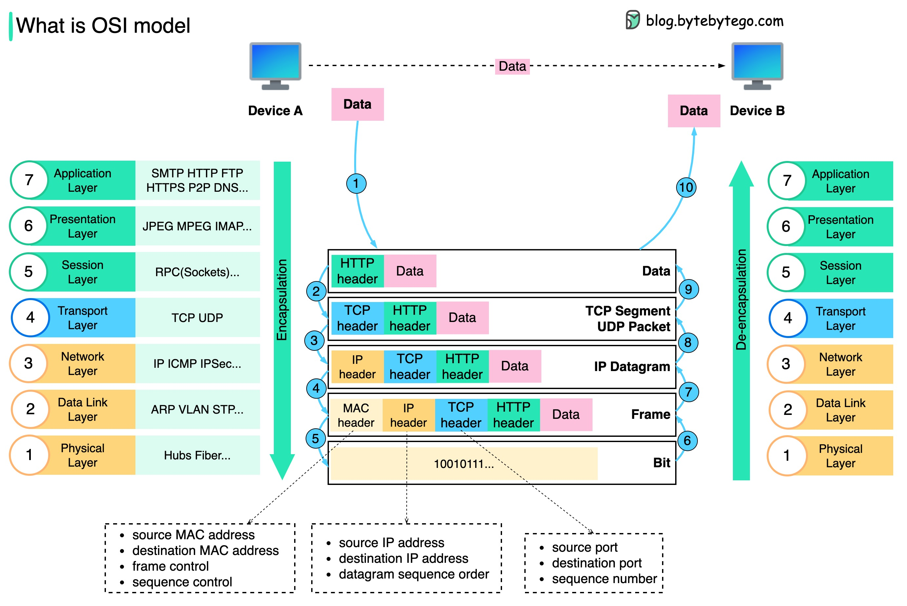

# Network

## TCP/IP（OSI） 网络模型

通过分层架构的设计，保障各层协议职责隔离，专注单一功能。各层间使用标准化的头部字段进行交互，确保升级迭代或出现异常时，互不影响。

- **步骤 1**：在应用层添加 HTTP 头部
  - 形成应用层数据单元
  - 标明 HTTP 协议规范

- **步骤 2**：添加 TCP / UDP 头部（源 / 目的端口号 + 序列号）
  - 形成 TCP 段/ UDP 数据报
  - 建立端到端通信管道，确保传输可靠性

- **步骤 3**：添加 IP 头部（源/目的 IP 地址）
  - 生成 IP 数据报
  - 实现跨网络路由寻址，处理网络拓扑路径

- **步骤 4**：添加 MAC 头部（源/目的 MAC 地址
  - 生成数据帧
  - 解决局域网内设备间物理寻址问题

- **步骤 5**：将数据帧转换为比特流，通过物理介质传输（光信号/电信号/电磁波）
  - 实现原始比特流的可靠传输

- **步骤 6 - 10**：自底向上逐层解封装
  - 物理层接收比特流并重组为数据帧
  - 数据链路层校验 MAC 地址，剥离 MAC 头部
  - 网络层解析 IP 地址，移除 IP 头部
  - 传输层验证端口信息，去除 TCP/UDP 头部
  - 应用层最终获得原始 HTTP 数据

## HTTP 全流程

**解析 URL**

- **浏览器解析 URL**：提取协议（HTTP/HTTPS）、域名、端口（默认 HTTP 为 80，HTTPS 为 443）、路径等信息
- **特殊字符处理**：对 URL 进行编码（如空格转为 `%20`）

**发送 HTTP 请求**

- **请求格式**：
  - 请求行：方法（GET/POST）、路径、HTTP 版本
  - 请求头：`Host`、`User-Agent`、`Cookie` 等
  - 请求体（如 POST 提交数据）
- **协议**：**HTTP/HTTPS 协议**（应用层协议）

**DNS 域名解析**

- **目标**：将域名转换为服务器 IP 地址
- **过程**：
  1. **浏览器缓存**：检查是否缓存过该域名
  2. **操作系统缓存**：查看本地 `hosts` 文件及系统缓存
  3. **路由器缓存**：查询本地路由器
  4. **ISP 的 DNS 服务器**：向 ISP 提供的 DNS 发起递归查询
  5. **根域名服务器 → 顶级域（.com）→ 权威 DNS 服务器**：最终获取 IP 地址
- **协议**：**DNS 协议**（基于 UDP 53 端口，大响应时使用 TCP）

**TCP 连接**

- **目标**：建立可靠链接
- **三次握手**：
  1. 客户端发送 `SYN` 包（序列号初始化）
  2. 服务器返回 `SYN-ACK` 包（确认客户端序列号并初始化服务器序列号）
  3. 客户端发送 `ACK` 包（确认服务器序列号）
- **协议**：**TCP 协议**（可靠传输层协议）

**TLS 握手（仅 HTTPS 需要）**

- **目标**：加密后续通信
- **过程**：
  1. 客户端发送支持的 TLS 版本、加密套件列表
  2. 服务器返回选择的加密套件、数字证书（含公钥）
  3. 客户端验证证书（颁发机构、有效期、域名匹配）
  4. 客户端生成会话密钥，用服务器公钥加密后发送
  5. 双方用会话密钥加密通信
- **协议**：**TLS/SSL 协议**（基于 TCP）

**局域网传输**

- **关键角色**：
  - **网卡（NIC）**：物理设备，负责将数据转为电信号/光信号，并处理 MAC 地址
  - **交换机**：局域网（二层设备），基于 MAC 地址表 转发数据帧
- **过程**：
  - **ARP 协议**：通过本地 ARP 缓存或广播查询目标 IP 对应的 MAC 地址（如网关的 MAC）
  - **封装数据帧**：源 MAC（本机网卡）→ 目标 MAC（网关或目标主机）
  - **交换机转发**：根据 MAC 地址表，将帧发送到目标端口；若未知则广播
- **协议**：ARP（地址解析协议）、以太网协议（二层）

**跨网络路由**

- **关键角色**：
  - **路由器**：连接不同网络（三层设备），基于**路由表**选择最佳路径
  - **NAT（网络地址转换）**：将内网私有 IP 转换为公网 IP（如家庭路由器）
- **过程**：
  - **路由选择**：根据目标 IP 匹配路由表，选择下一跳路由器或直接发送到目标网络
  - **IP 分片与重组**：若数据包超过 MTU（如 1500 字节），分片传输后重组
  - **NAT 转换**：修改 IP 包头中的源/目标地址（如内网 IP → 公网 IP）
- **协议**：IP 协议（IPv4/IPv6）、ICMP（错误诊断）、OSPF/BGP（路由协议）

**服务器处理请求**

- **反向代理与负载均衡**：服务器可能通过 Nginx 等反向代理转发请求
- **应用服务器处理**：执行后端代码
- **生成响应**：状态码（200、404 等）、响应头（`cache control`、`content-type` 等）、响应体（HTML/JSON 等）

**服务器返回 HTTP 响应**

- **响应传输**：通过已建立的 TCP 连接返回数据
- **内容编码**：可能压缩（如 `gzip`）或分块传输（`Transfer-Encoding: chunked`）

**浏览器解析与渲染**

1. **解析 HTML**：构建 DOM 树
2. **加载子资源**：通过 ``, `<link>`, `<script>` 标签触发额外 HTTP 请求（重复上述流程）
3. **解析 CSS**：构建 CSSOM 树
4. **执行 JavaScript**：可能修改 DOM/CSSOM
5. **渲染页面**：合并 DOM 和 CSSOM，布局、绘制、合成

**关闭 TCP 连接**

- **四次挥手**：
  1. 客户端发送 `FIN` 包。
  2. 服务器返回 `ACK` 包。
  3. 服务器发送 `FIN` 包。
  4. 客户端返回 `ACK` 包。
- **HTTP/1.1 连接复用**：默认保持连接（`Connection: keep-alive`），减少握手开销

## Ref

- <https://github.com/ByteByteGoHq/system-design-101?tab=readme-ov-file#tcpip-encapsulation>
