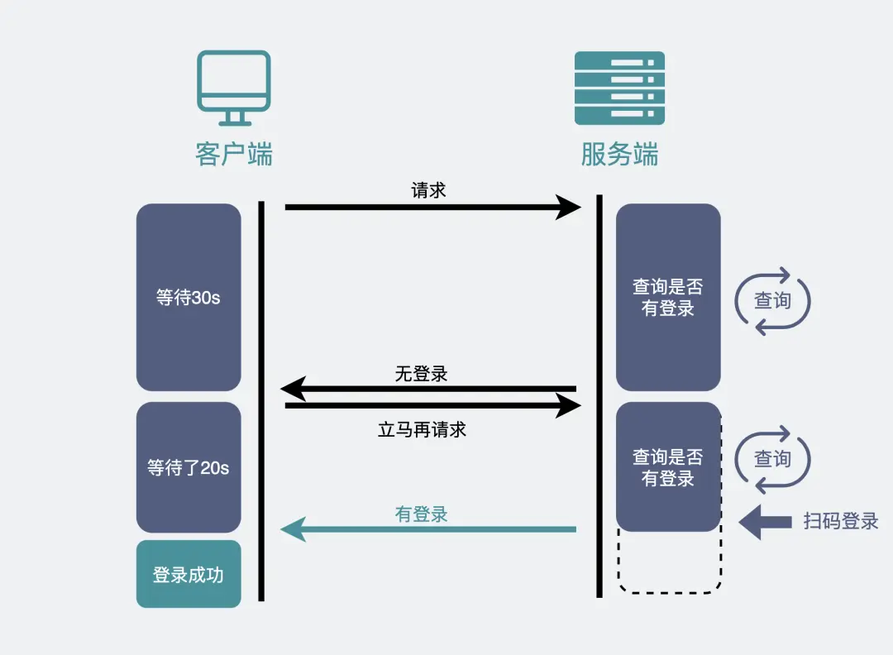
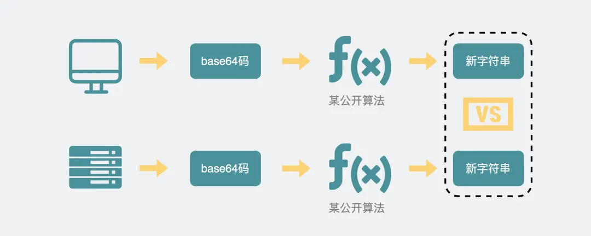
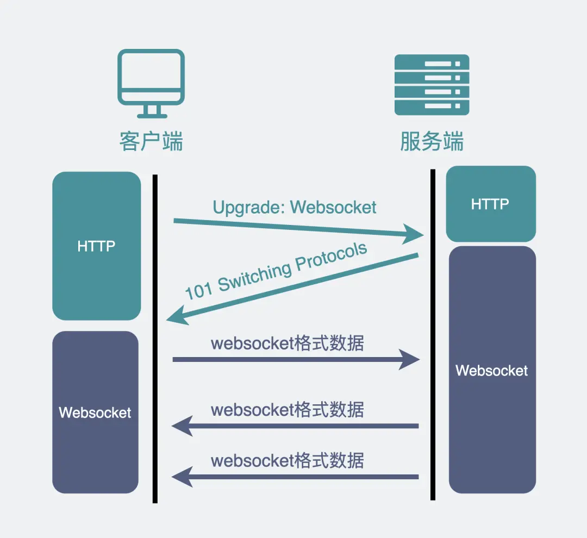
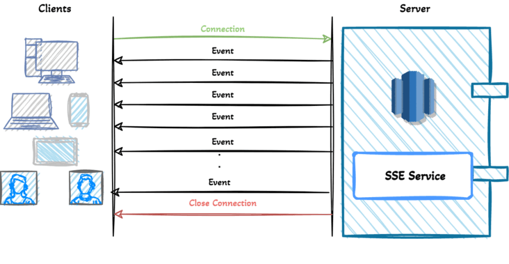

# Push Message

消息推送是指服务器主动向客户端发送数据的技术，适用于实时通知、即时通讯等场景。

## 轮询（Polling）

### 短轮询（Short Polling）

客户端定期（如每秒）发送 HTTP 请求到服务器，询问是否有新消息。

- **优点**：实现简单，兼容性强
- **缺点**：
  - 高延迟：消息到达后需等待下一次轮询才能获取
  - 资源浪费：频繁请求消耗带宽和服务器资源
- **适用场景**：低实时性需求，如简单状态更新

### 长轮询（Long Polling）

客户端发送请求后，服务器保持连接打开，直到有新消息或超时才进行响应。客户端收到响应后立即发起下一次请求。

- **优点**：相比短轮询，减少无效请求，实时性更高
- **缺点**：
  - 服务器需维护大量挂起连接
  - 超时后仍需重新建立连接
- **适用场景**：中等实时性需求，如早期聊天应用



## WebSocket

WebSocket 是基于 TCP 的全双工通信协议，客户端与服务器通过一次 HTTP 握手后，可以升级为 WebSocket 连接，后续可双向实时通信。

- **特点**：
  - 低延迟：长连接避免重复握手
  - 支持二进制和文本数据
- **优点**：
  - 高实时性，适合高频交互场景
  - 浏览器原生支持（现代浏览器）
- **缺点**：
  - 需处理连接状态（如重连、心跳包）
  - 服务器资源消耗较高
- **适用场景**：实时聊天、在线游戏、协同编辑

### 升级流程

1. 客户端发起升级请求，携带特殊 Header 字段：

    ```http
    Connection: Upgrade 
    Upgrade: WebSocket 
    Sec-WebSocket-Key: T2a6wZlAwhgQNqruZ2YUyg==
    ```

2. 服务端响应 `101` 状态码，并使用公开算法，将客户端携带的 `Sec-WebSocket-Key` 做二次处理：

    ```http
    HTTP/1.1 101 Switching Protocols
    Sec-WebSocket-Accept: iBJKv/ALIW2DobfoA4dmr3JHBCY=
    Upgrade: WebSocket
    Connection: Upgrade
    ```

3. 客户端采用同样的算法，验证服务端返回的 `Sec-WebSocket-Accept` 是否与请求中携带的一致：

    

4. 验证通过后，WebSocket 建立成功，后续可使用 WebSocket 数据格式进行通信：

    

### SSE（Server-Sent Events）

SSE 是基于 HTTP 的单向推送协议，客户端通过 `EventSource` API 建立长连接，服务器通过流式响应（`Accept:text/event-stream`）推送消息。



- **特点**：
  - 单向通信（仅服务器→客户端）
  - 自动重连机制
  - 仅支持文本数据（UTF-8）
- **优点**：
  - 实现简单，兼容性好（支持 HTTP/1.1 和 HTTP/2）
  - 适合服务器主动推送场景
- **缺点**：
  - 无法双向通信
  - 不支持二进制数据
- **适用场景**：实时通知（新闻推送、股票行情）、日志流

## MQTT（Message Queuing Telemetry Transport）

轻量级发布/订阅协议，基于 TCP，专为低带宽、不稳定网络设计。

- **特点**：
  - 支持 QoS（消息可靠性分级）
  - 低功耗，适合物联网设备
- **优点**：
  - 跨平台、跨语言支持
  - 支持大规模设备连接
- **缺点**：
  - 需部署 MQTT Broker（如 EMQX、Mosquitto）
  - 浏览器端需使用 MQTT.js 等库
- **适用场景**：物联网设备监控、移动应用后台推送

## Ref

- <https://javaguide.cn/system-design/web-real-time-message-push.html>
- <https://xiaolincoding.com/network/2_http/http_websocket.html>
