# TCP

TCP（Transmission Control Protocol，传输控制协议）是互联网核心协议之一，属于传输层协议，提供**面向连接、可靠的、基于字节流**的数据传输服务，常用于 `FTP`、`HTTP/HTTPS` 等场景。

UDP（User Datagram Protocol）同样也是传输层协议，相比与 TCP，其是面向无连接的，处理逻辑简单，性能高，常用于 `DNS`、`SNMP` 等数据量较少或是音视频等对延迟敏感、丢包容忍度高的场景。

## 核心特性

**面向连接**

- 通信前需通过**三次握手**建立连接，通信后通过**四次挥手**释放连接。
- 确保双方准备好数据传输。

**可靠性保障**

- **确认应答（ACK）**：接收方收到数据后发送确认信号
- **超时重传**：未收到 ACK 时，发送方重传数据
- **序列号与确认号**：标识数据顺序，解决乱序、重复问题

**流量控制**

- 通过**滑动窗口机制**动态调整发送速率，防止接收方缓冲区溢出

**拥塞控制**

- 算法包括**慢启动、拥塞避免、快速重传、快速恢复**，避免网络过载

**全双工通信**

- 双方可同时发送和接收数据

## 报文格式

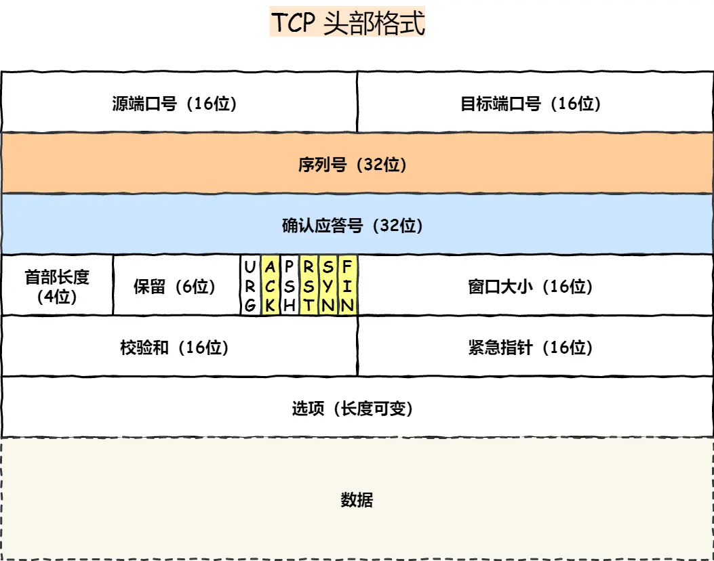

- **源端口/目的端口**：标识应用程序，结合源 IP/目标 IP，确定一条连接
- **序列号**：建立连接时随机生成，标识当前数据字节的起始位置
  - 解决网络包乱序问题
  - 检测重复或丢包问题
- **确认应答号**：接收方期望的下一个字节的序列号，用于确认已接收的数据
  - 解决丢包问题
  - 推动滑动窗口
- **标志位**
  - `SYN`：建立连接，并初始化序列化
  - `ACK`：确认应答，除最初的 `SYN` 以外，必须设置为 1
  - `FIN`：终止连接
  - `RST`：重置连接
- **窗口大小**：接收方可接收的数据量

## 连接管理

### 三次握手

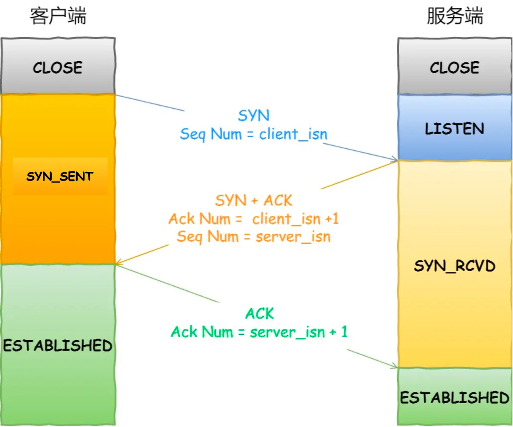

- **步骤**：
  1. 客户端发送 `SYN=1, seq=x`（同步请求）
  2. 服务端回复 `SYN=1, ACK=1, seq=y, ack=x+1`
  3. 客户端发送 `ACK=1, seq=x+1, ack=y+1`
- **目的**：
  - 协商初始序列号
  - 确认双方收发能力正常
  - 阻止历史连接的初始化，避免资源浪费

**SYN Flood 攻击**

正常流程下，当接收到 `SYN` 报文时，会创建一个半连接对象并将其添加至 `SYN` 队列种，接收到 `ACK` 报文后，才会将其放入 `Accept` 队列，等待应用获取。

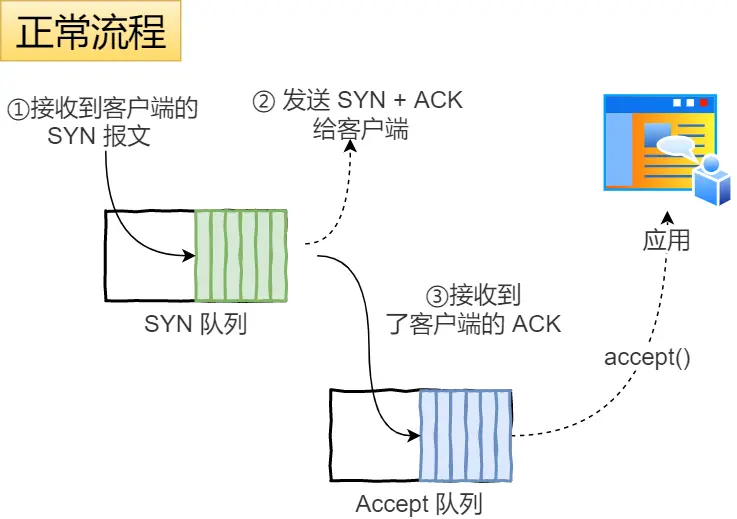

如果攻击者只发送 `SYN` 报文，而不发送 `ACK` 报文，即 **SYN Flood 攻击**，会迅速把半连接队列占满，从而导致正常的请求也无法建立连接。

其主要解决方案为启用 **SYN Cookie**。在这种情况下，如果 `SYN` 队列已满，后续收到的 `SYN` 报文不会直接丢弃，而是计算出一个 `cookie` 值放在响应的序列号中，后续接收到 `ACK` 报文后，通过验证 `cookie` 来判断其合法性。

### 四次挥手

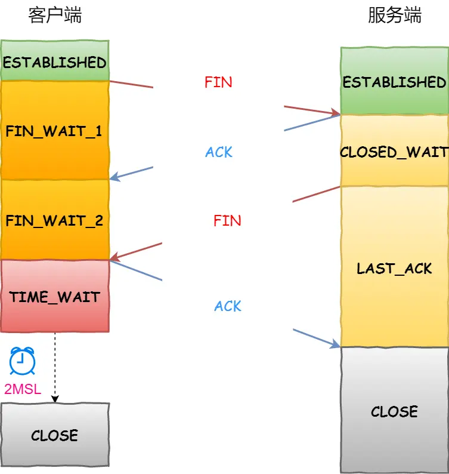

- **步骤**：
  1. 主动方发送 `FIN=1, seq=u`（终止请求）
  2. 被动方回复 `ACK=1, seq=v, ack=u+1`
  3. 被动方发送 `FIN=1, ACK=1, seq=w, ack=u+1`
  4. 主动方回复 `ACK=1, seq=u+1, ack=w+1`，并等待 2MSL 后关闭
  5. 被动方收到 `ACK` 后立即关闭
- **目的**：
  - 需双方分别关闭发送和接收通道
  - 主动方最后等待 2MSL 是为了当最后一次 `ACK` 丢失，被动方触发超时重传时，主动方可以正常响应 `ACK`
- **特殊场景**：
  - 当超时重试达到最大次数时，会触发超时关闭，强制断开连接
  - 当触发延迟确认逻辑时，被动方的 `ACK` 和 `FIN` 可能一起发送，变为三次挥手

## 可靠传输机制

### 请求确认

**序列号与确认号**

对于每个请求，都会携带序列号与确认号，以保障字节流有序，避免乱序问题，同时检测出丢包、重复发送等问题。

在请求交互中，序列号与确认号的规则如下：

- **序列号**：上一次发送的序列号 + 数据长度
- **确认号**：上一次收到的序列号 + 数据长度
- 当请求不携带数据时
  - 对于 `SYN` 或 `FIN` 报文，认为数据长度为 1，因为其是控制标识，需要被占用序列号以保障被可靠确认
  - 对于 `ACK`、`RST` 等报文，序列号不变，相对于的接收方的确认号也不变

**延迟确认**

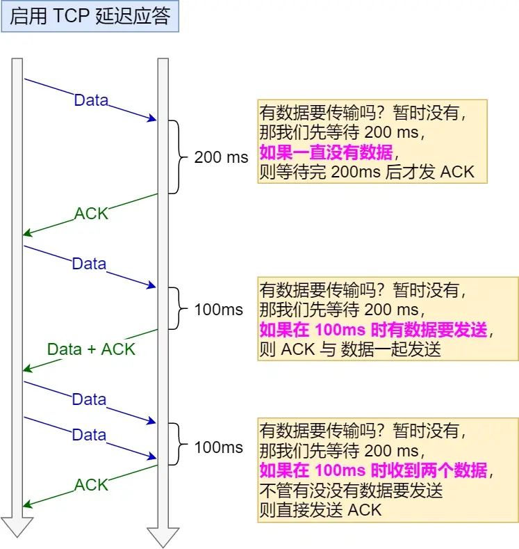

为了解决只发送 `ACK` 导致的传输效率低的问题，引入了延迟确认逻辑，其核心目标是尽量合并确认，减少不必要的 `ACK` 发送，其实现如下：

- 当有响应数据要发送时，`ACK` 会和数据一起发送
- 当没有响应数据要发送时，`ACK` 会延迟一段时间，以等待可能到来的影响数据并一起发送
- 在延迟期间，收到了第二个数据请求，会根据具体实现，重置 `ACK` 的确认号并重置定时器，或立即发送
- 在延迟期间，收到乱序报文或涉及窗口大小更新，会立即发送

### 重传

**超时重传**

当 TCP 数据包丢失或 `ACK` 报文丢失时，会触发超时重传逻辑：

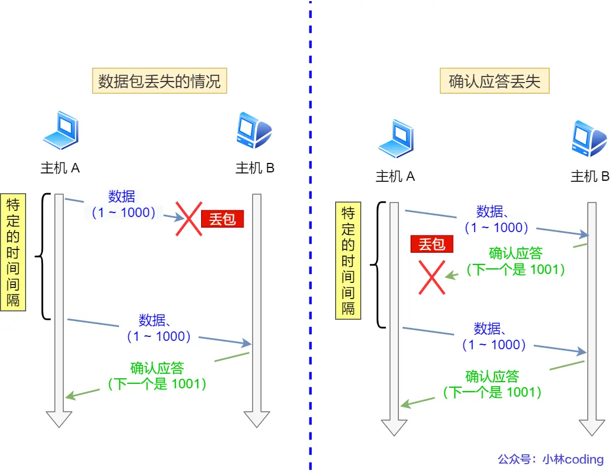

超时时间 RTO（Retransmission Timeout）基于 RTT（Round-Trip Time，数据往返时间）动态计算，计算规则如下：

- `SRTT`：计算权重平滑衰减的 RTT
- `DevRTT`：计算差值
- 在 Linux 下，取值逻辑为 $\alpha=0.125,\beta=0.25,\mu=1,∂=4$

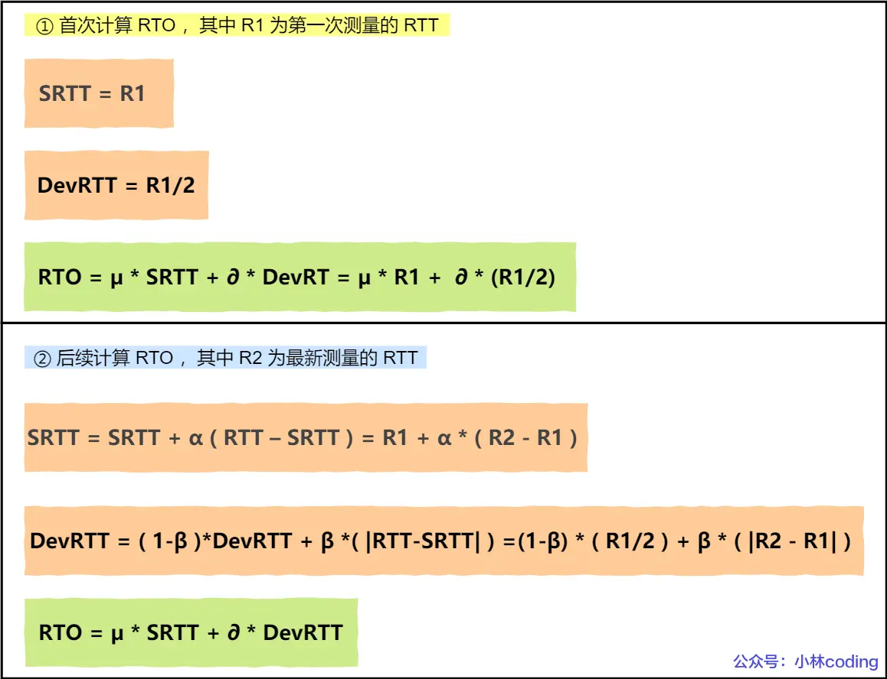

如果超时重发的数据再次超时，下次超时的时间会变为上次的两倍，以避免网络波动问题。

**快速重传**

区别于定时逻辑，快速重传由事件触发，当发送方收到连续三个重复的 `ACK` 报文后，会判断对应的报文丢失，并立即触发重传：

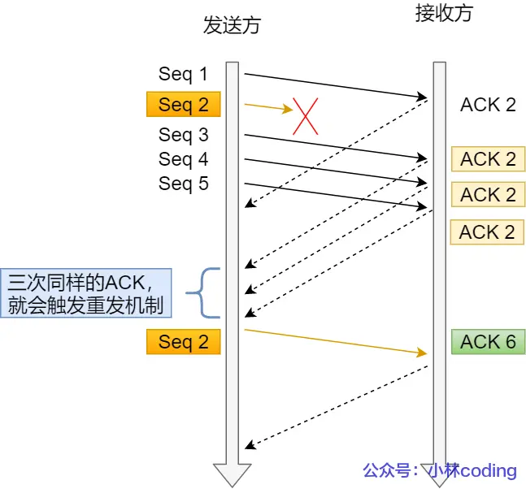

**SACK**

为了解决中间序列丢失的问题，TCP 头部可以添加 `SACK`（Selective Acknowledgment），将已收到的数据发送给发送方，让其仅重传丢失的数据。

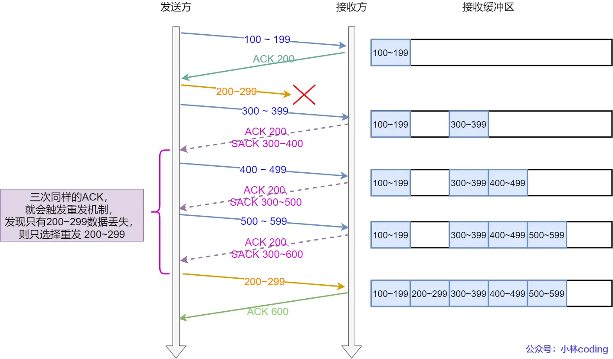

同时，还使用 `SACK` 告诉发送者哪些数据被重复接收了，即 `D-SACK`（Duplicate SACK），让发送者判断更多网络细节，如超时未确认的原因是丢包还是延迟。

### 流量控制

为了避免因等待确认导致的请求发送延迟问题，TCP 引入了缓冲区，可以使得发送者可以持续发送数据，而无需等待确认。

同时又引入了**滑动窗口**的概念，用来表示接收方可以缓存的数据最大值，防止发送者压垮接收者的缓冲区。

同时针对于 `ACK` 丢失的情况，可以通过后续的 `ACK` 报文来辅助确认是否触发重传逻辑。

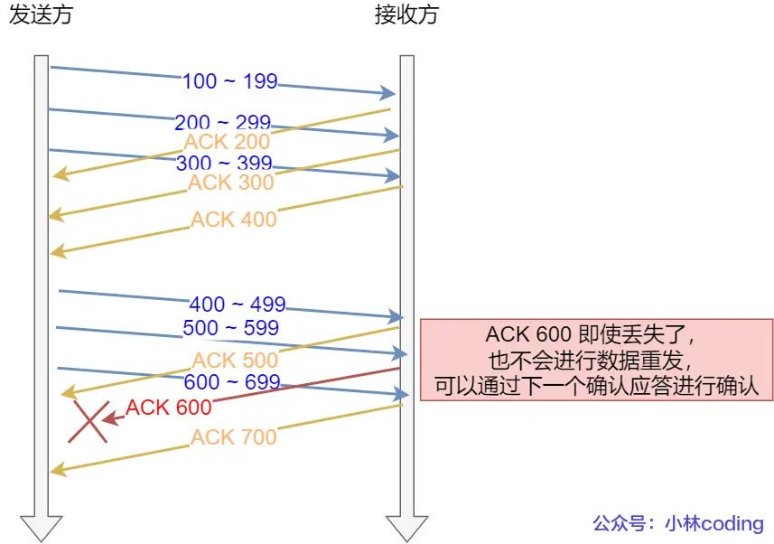

**发送窗口**

发送窗口（`swnd`）表示允许未确认的最大数据量，通过三个指针来表示：

- `SND.WND`：表示发送窗口的大小，由接收方指定，动态更新
- `SND.UNA`：指向 #2，即已发送但未收到确认的数据
- `SND.NXT`：指向 #3，即未发送但是处于可发送范围的数据
- 通过 `SND.UNA` 和 `SND.WND` 动态计算出 #4 指针，即未发送且总大小超出接收方窗口的数据

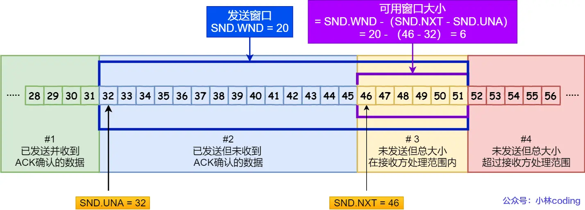

**接收窗口**

接收窗口（`rwnd`）缓冲区剩余空间，通过 `ACK` 告知发送方，并使用两个指针来表示：

- `RCV.WND`：接收窗口的大小，每次发送 `ACK` 时告知发送方
- `RCV.NXT`：指向 #3，即期望从发送者处收接收的数据
- 通过 `RCV.NXT` 和 `RCV.WND` 动态计算出 #4 指针，即超出缓冲区范围的数据

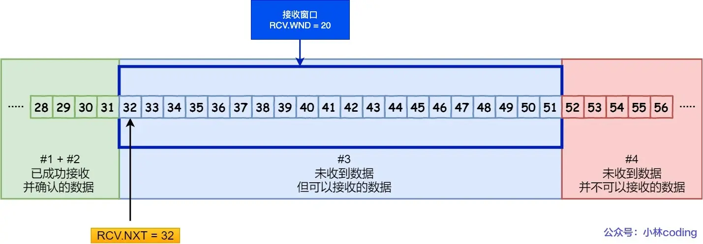

**调控策略**

- 为了保障发送者与接收者双方数据同步，接收方必须先收缩窗口，等一段时间后（发送者收到窗口调整），再实际缩小缓冲区
- 当窗口大小为 0 时，不能发送数据，但是会通过窗口探测报文来尝试感知接收方窗口变化，如果多次探测仍为 0（例如 3 次探测，每次间隔 60 秒），会发送 `RST` 报文来中断连接
- 当发送方窗口过小时，为了避免持续发送小数据（报文头部占比过大）导致的资源浪费，会针对性的进行额外调控
  - 接收者：当窗口大小小于 $min(MSS，缓存空间/2)$ 时，会告诉发送者窗口为 `0`，避免发送新数据
  - 发送者：使用 Nagle 算法控制，当窗口和数据均大于等于 MSS 或收到之前发送的 `ACK` 报文时，才发送新数据

  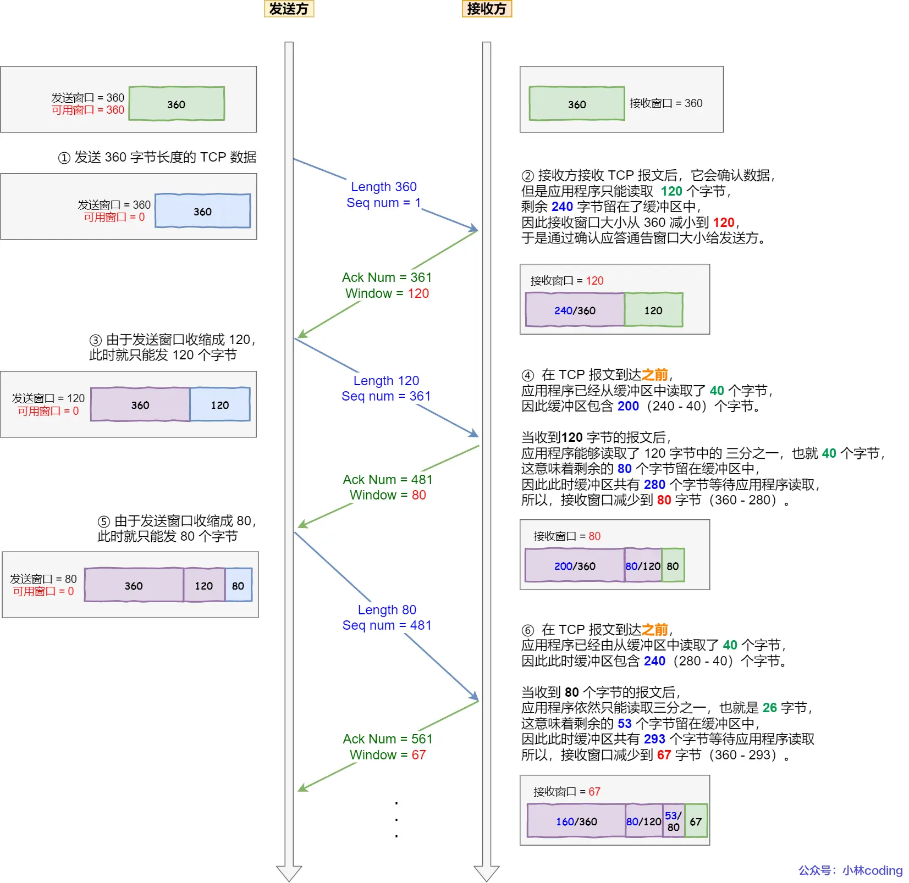

### 拥塞控制

当网络拥塞出现时，如果继续发送大量数据包，可能会出现丢包、重试等问题，进一步增大网络负载，并导致恶性循环。由此，需要发送方根据网络拥塞状态，动态调整自己的发送能力，即调整**拥塞窗口（`cwnd`）**，其变化规则为：

- 当网络中没有出现拥塞时，`cwnd` 会增大
- 当网络中出现拥塞时，`cwnd` 会减小

在此基础上，发送方最终的发送窗口（`swnd`）需要同时结合接收窗口（`rwnd`）和拥塞窗口（`cwnd`）来判断，即 $swnd=min(rwnd,cwnd)$。

**慢启动**

当发送方每收到一个 `ACK`，拥塞窗口 `cwnd` 的大小就会加 1，即窗口从初始值开始，每 RTT 指数增长（如 1, 2, 4, 8...）。

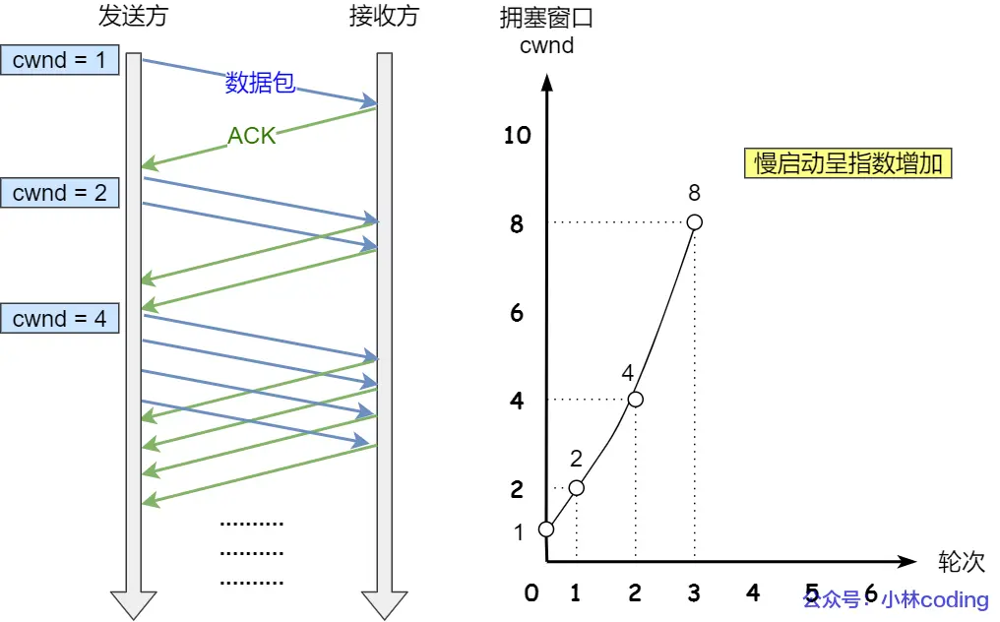

**拥塞避免**

当拥塞窗口 `cwnd` 的大小达到慢启动门限 `ssthresh` 时，会进入拥塞避免算法，每收到一个 `ACK` 时，拥塞窗口 `cwnd` 的大小就会加 `1/cwnd`，即每 RTT 线性增长（如 +1）。

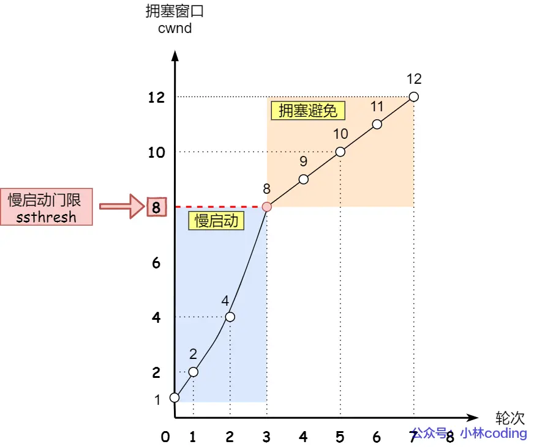

**超时重传**

当发生超时重传时，说明网络存在拥塞情况，此时处理逻辑如下：

- 慢启动门限 `ssthresh` 设置为拥塞窗口 `cwnd` 的一半
- 拥塞窗口 `cwnd` 重置为初始值（如 1）

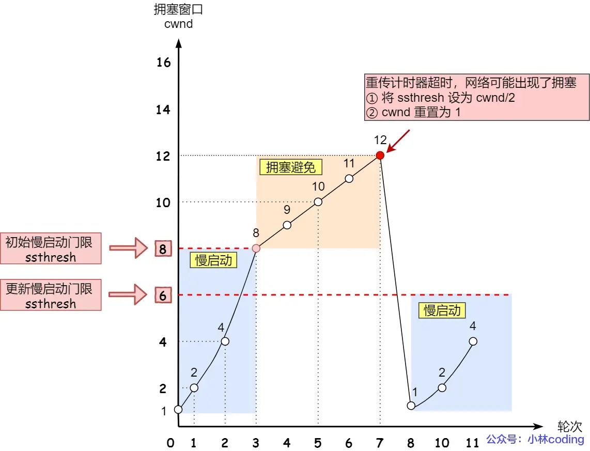

**快速重传**

当发生快速重传时，即收到 3 次重复 `ACK` 时，立即重传丢失报文时，说明网络存在拥塞，但是实际负载不严重，此时处理逻辑如下：

- 拥塞窗口 `cwnd` 设置为原来的一半
- 慢启动门限 `ssthresh` 设置为拥塞窗口
- 进入快速恢复算法：
  - 拥塞窗口设置为 $ssthresh+3$（收到 3 次重复 `ACK`）
  - 重传丢失的数据包
  - 如果再收到重复的 `ACK`，`cwnd` 继续自增，尽快重传丢失的数据包
  - 如果收到新的 `ACK`，`cwnd` 重置为 `ssthresh`，并进入拥塞避免算法

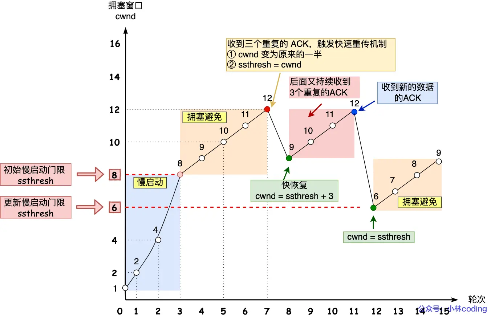

## 常见问题

**粘包问题**  

TCP 本身基于数据流进行传输，所以会存在数据边界不清晰，需应用层协议自行处理（如 HTTP 通过回车换行明确 HTTP 首部边界，通过 Content-Length 读取特定长度消息体）。

## Ref

- <https://xiaolincoding.com/network/3_tcp/tcp_interview.html>
- <https://xiaolincoding.com/network/3_tcp/tcp_seq_ack.html>
- <https://xiaolincoding.com/network/3_tcp/tcp_three_fin.html>
- <https://xiaolincoding.com/network/3_tcp/tcp_feature.html>
