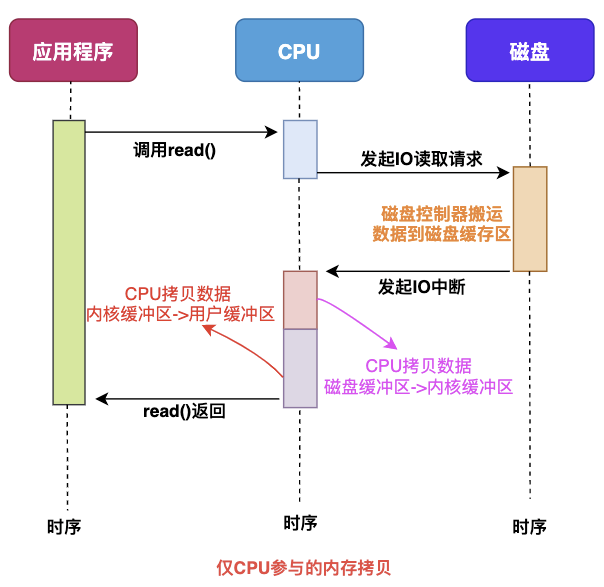
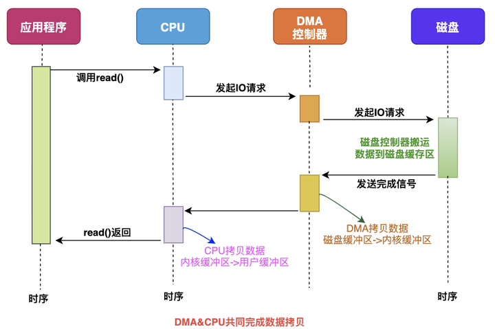
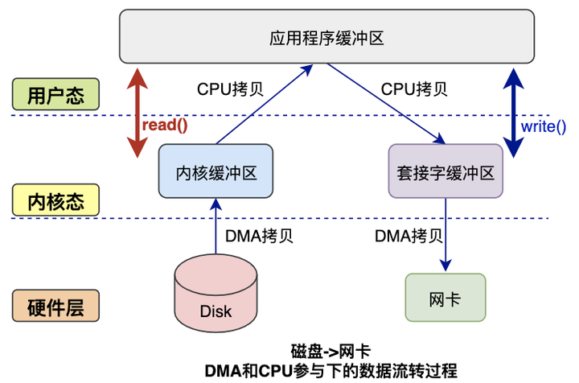
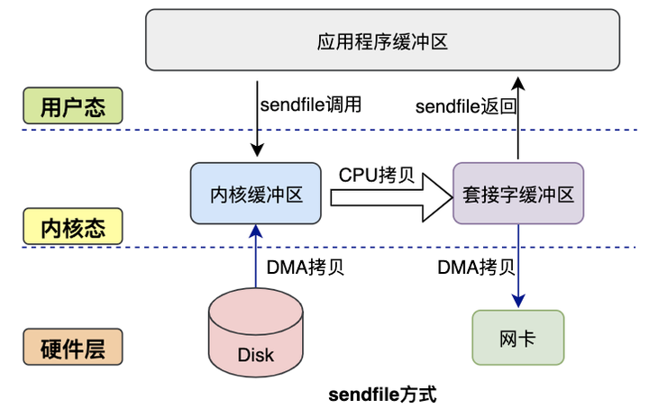
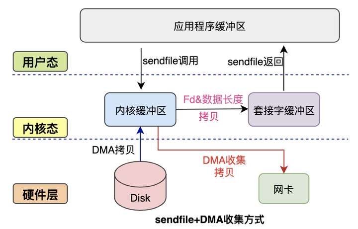
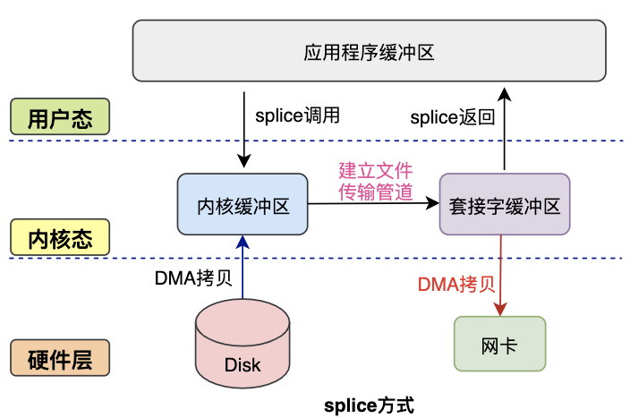

# Network

## 零拷贝

对于 web 服务器来说，经常需要从磁盘中读取数据到内存，然后将内存中的数据通过网卡，真正发送给用户。

在这个过程中，涉及到用户态与内核态的切换，还涉及到多次的数据拷贝，整体开销较大。

**零拷贝**是一种优化数据传输性能的技术，其核心目标是减少甚至消除数据在内核空间和用户空间之间的冗余拷贝操作，从而降低 CPU 负载、内存占用和延迟，提升系统吞吐量。

### 传统 I/O

**仅 CPU**

在最早期，完全由 CPU 进行数据的传输工作，当数据量较大时，对 CPU 的占用及其严重，大量时间被浪费。



**DMA**

DMA（Direct Memory Access）是一种让硬件设备绕开 CPU 独立访问内存的机制，可以替代 CPU 将数据从磁盘缓冲区拷贝至内核缓冲区，有效降低 CPU 的负载。



**数据交互**

在 CPU + DMA 的方案下，一次完整的网络数据传输流程如下所示，可以发现在读数据与写数据过程中，都涉及到了 2 次空间切换、1 次 CPU 拷贝和 1 次 DMA 拷贝，即**总共 4 次空间切换和 4 次数据拷贝**，在应用程序不对数据做修改的场景下，存在较多的冗余操作：



### 零拷贝技术

零拷贝技术主要的几个实现方案为 `mmap()`、`sendfile()`、`sendfile()`+ SG-DMA、`splice()` 等。

**mmap()**

`mmap()` 是 Linux 提供的一种内存映射文件的机制，通过将内核中读缓冲区地址与用户空间缓冲区地址进行映射，实现内核缓冲区与用户缓冲区的共享，用户空间可以通过指针，直接操作内核缓冲区，免去数据拷贝开销。

```c
void *mmap(void *addr, size_t length, int prot, int flags, int fd, off_t offset);
```

通过引入 `mmap()`，可以减少一次 CPU 拷贝，直接将数据从内核缓冲区拷贝至 socket 缓冲区，无需经过用户缓冲区：


**sendfile()**

`sendfile()` 函数可以在两个文件间直接建立数据传输管道，在内核空间直接完成数据拷贝，减少数据拷贝次数的同时，还能减少上下文切换次数。

```c
ssize_t sendfile(int out_fd, int in_fd, off_t *offset, size_t count);
```

初版方案如下所示，通过 `sendfile()` 函数，直接将数据从内核缓冲区发送至 socket 缓冲区，过程中仅会触发一次上下文切换：



**sendfile() + SG-DMA**

Linux 2.4 内核对 `sendfile()` 函数的系统调用进行优化，但是需要硬件设备支持 SG-DMA（Scatter-Gather DMA），相较于普通 DMA 仅能传输连续内存区域的数据，SG-DMA 支持配置描述符链表，批量完成多个分散内存区域的读写。

升级后的 `sendfile()` 函数，可以直接将内核缓冲区中的数据描述信息（文件描述符、地址偏移量等）发送至 socket 缓冲区中，而 DMA 控制器直接根据 socket 缓冲区中的数据描述信息，将数据从内核缓冲区直接拷贝至网卡中。

在这种方案下，需要 2 次上下文切换，2 次 DMA 拷贝，无需 CPU 拷贝，但是无法对数据进行修改，且 `sendfile()` 函数仅支持将数据描述信息拷贝至 socket 描述符上。



**splice()**

Linux 在 2.6 版本引入了 `splice()` 函数，用于实现两个普通文件间的数据零拷贝，不需要硬件支持，也不再限定文件和 socket 缓冲区之间进行传输。

```c
ssize_t splice(int fd_in, loff_t *off_in, 
               int fd_out, loff_t *off_out, 
               size_t len, unsigned int flags);
```

`splice()` 函数将管道作为中介，提供标准化的内存缓冲区管理机制，使得零拷贝方案可以适用于任意两个文件，即使文件类型不同（如普通文件、socket 等）。再在从文件传输数据到管道时，并不会触发数据拷贝，而是直接共享文件的页面缓存指针（Page Cache），读取时同理。



## Ref

- <https://xiaolincoding.com/os/8_network_system/zero_copy.html>
- <https://github.com/0voice/linux_kernel_wiki/blob/main/%E6%96%87%E7%AB%A0/%E8%BF%9B%E7%A8%8B%E7%AE%A1%E7%90%86/%E4%B8%80%E6%96%87%E5%B8%A6%E4%BD%A0%EF%BC%8C%E5%BD%BB%E5%BA%95%E4%BA%86%E8%A7%A3%EF%BC%8C%E9%9B%B6%E6%8B%B7%E8%B4%9DZero-Copy%E6%8A%80%E6%9C%AF.md>
- <https://xiaolincoding.com/os/8_network_system/selete_poll_epoll.html>
