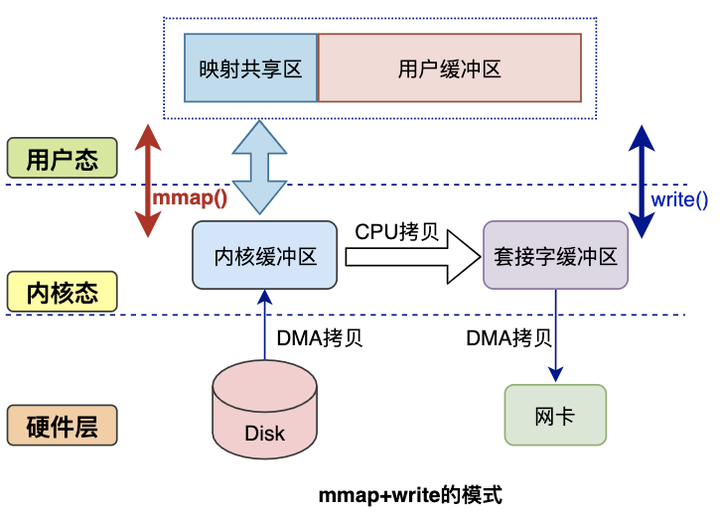

# Network

## 零拷贝

对于 web 服务器来说，经常需要从磁盘中读取数据到内存，然后将内存中的数据通过网卡，真正发送给用户。

在这个过程中，涉及到用户态与内核态的切换，还涉及到多次的数据拷贝，整体开销较大。

**零拷贝**是一种优化数据传输性能的技术，其核心目标是减少甚至消除数据在内核空间和用户空间之间的冗余拷贝操作，从而降低 CPU 负载、内存占用和延迟，提升系统吞吐量。

### 传统 I/O

**仅 CPU**

在最早期，完全由 CPU 进行数据的传输工作，当数据量较大时，对 CPU 的占用及其严重，大量时间被浪费。


**DMA**

DMA（Direct Memory Access）是一种让硬件设备绕开 CPU 独立访问内存的机制，可以替代 CPU 将数据从磁盘缓冲区拷贝至内核缓冲区，有效降低 CPU 的负载。


**数据交互**

在 CPU + DMA 的方案下，一次完整的网络数据传输流程如下所示，可以发现在读数据与写数据过程中，都涉及到了 2 次空间切换、1 次 CPU 拷贝和 1 次 DMA 拷贝，即**总共 4 次空间切换和 4 次数据拷贝**，在应用程序不对数据做修改的场景下，存在较多的冗余操作：


### 零拷贝技术

零拷贝技术主要的几个实现方案为 `mmap()`、`sendfile()`、`sendfile()`+ SG-DMA、`splice()` 等。

**mmap()**

`mmap()` 是 Linux 提供的一种内存映射文件的机制，通过将内核中读缓冲区地址与用户空间缓冲区地址进行映射，实现内核缓冲区与用户缓冲区的共享，用户空间可以通过指针，直接操作内核缓冲区，免去数据拷贝开销。

```c
void *mmap(void *addr, size_t length, int prot, int flags, int fd, off_t offset);
```

通过引入 `mmap()`，可以减少一次 CPU 拷贝，直接将数据从内核缓冲区拷贝至 socket 缓冲区，无需经过用户缓冲区：



**sendfile()**

`sendfile()` 函数可以在两个文件间直接建立数据传输管道，在内核空间直接完成数据拷贝，减少数据拷贝次数的同时，还能减少上下文切换次数。

```c
ssize_t sendfile(int out_fd, int in_fd, off_t *offset, size_t count);
```

初版方案如下所示，通过 `sendfile()` 函数，直接将数据从内核缓冲区发送至 socket 缓冲区，过程中仅会触发一次上下文切换：


**sendfile() + SG-DMA**

Linux 2.4 内核对 `sendfile()` 函数的系统调用进行优化，但是需要硬件设备支持 SG-DMA（Scatter-Gather DMA），相较于普通 DMA 仅能传输连续内存区域的数据，SG-DMA 支持配置描述符链表，批量完成多个分散内存区域的读写。

升级后的 `sendfile()` 函数，可以直接将内核缓冲区中的数据描述信息（文件描述符、地址偏移量等）发送至 socket 缓冲区中，而 DMA 控制器直接根据 socket 缓冲区中的数据描述信息，将数据从内核缓冲区直接拷贝至网卡中。

在这种方案下，需要 2 次上下文切换，2 次 DMA 拷贝，无需 CPU 拷贝，但是无法对数据进行修改，且 `sendfile()` 函数仅支持将数据描述信息拷贝至 socket 描述符上。


**splice()**

Linux 在 2.6 版本引入了 `splice()` 函数，用于实现两个普通文件间的数据零拷贝，不需要硬件支持，也不再限定文件和 socket 缓冲区之间进行传输。

```c
ssize_t splice(int fd_in, loff_t *off_in, 
               int fd_out, loff_t *off_out, 
               size_t len, unsigned int flags);
```

`splice()` 函数将管道作为中介，提供标准化的内存缓冲区管理机制，使得零拷贝方案可以适用于任意两个文件，即使文件类型不同（如普通文件、socket 等）。再在从文件传输数据到管道时，并不会触发数据拷贝，而是直接共享文件的页面缓存指针（Page Cache），读取时同理。


## 多路复用

在 Web 服务中，单机能够建立的连接数量为 $client\_ip\_cnt * client\_port\_cnt$，即 $2^{32}*2^{16}=2^{48}$，这个数量远超实际需要，且单机的文件描述符与内存也无法承担这么大的开销。

以最常见的 C10K 为例，在多线程模型下，需要维护 1 万个线程，按默认线程栈为 8MB 预估，至少需要 80 GB 内存，远超普通单机所具备的能力。所以想要真正实现 C10K、C100K 的高并发，必须采取更有效的策略，即 I/O 多路复用。

I/O 多路复用指的是多个连接复用同一个线程来处理，由内核监控多个连接的状态变化，当数据就绪时，为多个连接分配一个线程进行处理。

对比于多线程模型与非阻塞 I/O 轮询模型，I/O 多路复用将原本的阻塞、轮询等方案，改为了事件驱动，避免频繁创建和销毁线程以及线程切换的开销，也避免 CPU 空转以及轮询所有连接导致的资源浪费。

### Socket 模型

最简单的 TCP socket 模型如下所示：


服务端的核心流程如下所示，可以看到在获取连接和数据读写时，均为阻塞操作，无法同时处理多个连接，若客户端连接不释放，服务端会完全阻塞。

- `socket()`：创建 Socket，指定网络协议（IPV4 / IPV6）和传输协议（TCP）
- `bind()`：绑定网卡 IP 地址和端口
- `listen()`：开启监听
- `accept()`：阻塞等待，直至从内核获取与客户端完成连接的 Socket
  - 服务端最初创建的 Socket 只负责监听，后续传输使用与客户端完成连接的 Socket
- `read() / write()`：阻塞读、写

### 多进程模型

在多进程模型下，由父进程负责执行 `accept()` 函数接受新连接，并通过 `fork()` 函数创建子进程，由子进程处理请求。

```c
while(1) {
    int client_fd = accept();  // 主进程阻塞等待新连接
    if (fork() == 0) {         // 创建子进程
        close(listen_fd);      // 子进程关闭监听套接字
        handle_client(client_fd); // 处理客户端请求（recv/send）
        exit();                // 处理完成后退出
    }
    close(client_fd);          // 主进程关闭客户端套接字
}
```


多进程模型具备一定的并发能力，每个客户端连接由独立进程处理，但是进程的创建和销毁成本较高（内存占用、上下文切换），并发量有效。

### 多线程模型

在多线程模型下，由主线程负责执行 `accept()` 函数接受新连接，子线程处理请求。

```c
while(1) {
    int client_fd = accept();
    pthread_create(&tid, NULL, handle_client, (void*)client_fd); 
    // 主线程继续等待新连接
}
```


相比于子进程，子线程模型更轻量，并发能力有所提升，但是仍有较大的内存占用以及性能开销，频繁切换线程还会导致 CPU 利用率下降。

此外针对于子线程的创建与销毁，可以使用线程池进行管理，免去一部分性能开销，但是针对于线程池的操作需要加锁，避免多线程竞争问题。

### 非阻塞 I/O + 轮询

将 Listen Socket 设置为非阻塞模式，通过轮询的方式，对所有连接进行处理。

```c
set_non_blocking(listen_fd);
while(1) {
    int client_fd = accept();  // 非阻塞，立即返回
    if (client_fd != -1) {
        add_to_client_list(client_fd);
    }
    for (fd in client_list) {  // 轮询所有客户端套接字
        if (recv(fd) > 0) {
            // 处理数据
        }
    }
}
```

在单线程的基础上，实现了并发能力，但是并发能力优先，无法利用 CPU 多核特性，且轮询会持续占用 CPU，可能会导致利用率过低。

### Select()

通过 `fd_set` 位掩码结构管理文件描述符集合，将所有已连接的 Socket 放在该集合中，调用 `select()` 函数监听将该集合**拷贝**至内核中，内核会**遍历**该集合，当检查到有事件变化时，将该 Socket 标记为可读或可写，在将该集合**拷贝**至用户态中。最后在用户态，通过**遍历**的方式找到有标记的 Socket，然后对其进行处理。

在整个过程中，共发生了两次**拷贝**操作与两次**遍历**操作。

```c
fd_set read_fds;
FD_ZERO(&read_fds); 
FD_SET(sockfd, &read_fds);
select(sockfd + 1, &read_fds, NULL, NULL, NULL);
if (FD_ISSET(sockfd, &read_fds)) {
    // 处理就绪的 sockfd
}
```

## Ref

- <https://xiaolincoding.com/os/8_network_system/zero_copy.html>
- <https://github.com/0voice/linux_kernel_wiki/blob/main/%E6%96%87%E7%AB%A0/%E8%BF%9B%E7%A8%8B%E7%AE%A1%E7%90%86/%E4%B8%80%E6%96%87%E5%B8%A6%E4%BD%A0%EF%BC%8C%E5%BD%BB%E5%BA%95%E4%BA%86%E8%A7%A3%EF%BC%8C%E9%9B%B6%E6%8B%B7%E8%B4%9DZero-Copy%E6%8A%80%E6%9C%AF.md>
- <https://xiaolincoding.com/os/8_network_system/selete_poll_epoll.html>
