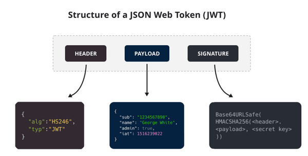
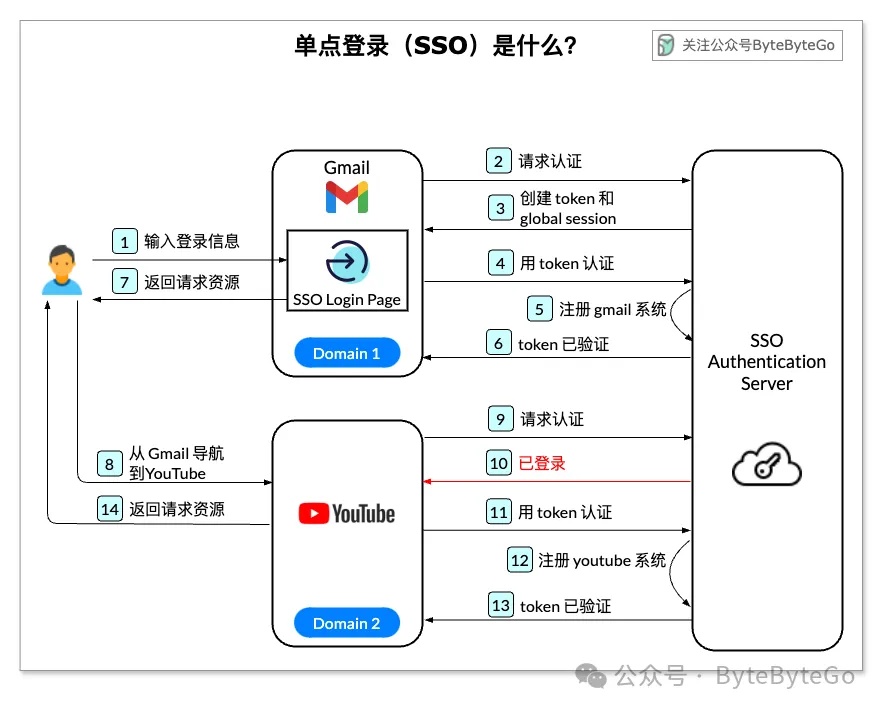
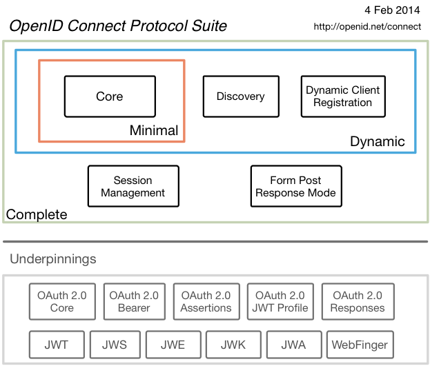
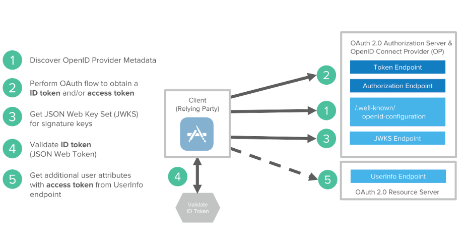

# Authentication

认证（Authentication）主要用于验证用户身份的过程，确保用户身份真实有效。

## Session-Cookie

Session 和 Cookie 是 Web 开发中用于跟踪用户状态的核心技术，两者协同工作以弥补 HTTP 协议的无状态性，也可以基于此验证用户身份。

### Cookie

Cookie 是由服务器生成并发送到浏览器的小型文本数据（通常 ≤4KB），浏览器会将其存储在本地，后续请求自动携带，用于保存用户偏好、登录状态等信息。

**工作流程**

- 服务器创建：服务器通过 HTTP 响应头 `Set-Cookie: name=value; attributes` 发送 Cookie
- 浏览器存储：浏览器解析并保存 Cookie（按域名分类）
- 自动回传：后续对同一域名的请求会自动附加 Cookie 信息

**关键属性**

- `Expires/Max-Age`：设置过期时间（持久化 Cookie）或会话期 Cookie（浏览器关闭失效）
- `Domain`：指定生效的域名（默认为当前域名，可包含子域名）。
- `Path`：限制 Cookie 仅在特定路径下生效。
- `Secure`：仅通过 HTTPS 协议传输。
- `HttpOnly`：禁止 JavaScript 访问（防范 XSS 攻击）。
- `SameSite`：控制跨站请求时是否发送（防范 CSRF 攻击，可选 Strict/Lax/None）。

### Session

Session 是服务器为每个用户创建的临时数据存储（如用户 ID、权限），通常依赖 Cookie 传递 Session ID 来关联用户。

**工作流程**

- **创建 Session**：用户首次访问时，服务器生成唯一 Session ID 和对应的存储空间（内存、数据库、Redis 等）
- **传递 Session ID**：通过 Set-Cookie 将 Session ID 发送给浏览器
- **验证请求**：后续请求携带 Session ID，服务器据此查找对应的 Session 数据

需要注意的是，执行认证逻辑的，是 **Session ID**，而 **Cookie** 只是传递 **Session ID** 的一种方式。在禁用 **Cookie** 的情况下，可以在 `Header` 或 `Query` 中携带 **Session ID**。

## JWT(JSON Web Token)

JWT 是一种基于 Token 的认证机制，其内部直接存储了用户信息，无需服务端额外存储其他内容，所以是**无状态**的，能较大情况节省服务端资源，且解决多系统间 Session 共享问题。

### 格式

JWT 本质上就是一组字串，通过（.）切分成三个为 Base64 编码的部分：

- **Header**：声明类型（typ: "JWT"）和签名算法（如 alg: "HS246"）
- **Payload**：携带用户信息和其他声明
- **Signature**：对 Header 和 Payload 的签名，防止篡改



其最终的格式通常为 `xxx.yyy.zzz`，如

```text
eyJhbGciOiJIUzI1NiIsInR5cCI6IkpXVCJ9.
eyJzdWIiOiIxMjM0NTY3ODkwIiwibmFtZSI6IkpvaG4gRG9lIiwiaWF0IjoxNTE2MjM5MDIyfQ.
SflKxwRJSMeKKF2QT4fwpMeJf36POk6yJV_adQssw5c
```

### 常见属性

- 标准注册声明：JWT 规范中预定义的一些声明
  - **iss(Issuer)**：JWT 的签发者（如服务名称或 URL）
  - **sub(Subject)**：JWT 的主题（如用户 ID）
  - **aud(Audience)**：JWT 的目标接收方（如服务端 API 的 URL）
  - **exp(Expiration Time)**：JWT 的过期时间（Unix 时间戳）
  - **nbf(Not Before)**：JWT 的生效时间（Unix 时间戳）
  - **iat(Issued At)**：JWT 的签发时间（Unix 时间戳）
  - **jti(JWT ID)**：JWT 的唯一标识符，用于防止重放攻击

- 公共声明：由开发者自定义，但需避免与标准声明冲突
  - **name**：用户姓名，如 `"name": "chen"`
  - **email**：用户邮箱，如 `"email": "chen@example.com"`
  - **roles**：用户角色列表（如权限控制），如 `"roles": ["admin", "editor"]`
  - **scope**：权限范围，如`"scope": "read write delete"`

- 私有声明：由双方协商定义，需确保不与标准或公共声明冲突
  - **userId**：用户唯一标识符（与 sub 类似），如 `"userId": "u_abc123"`
  - **company**：用户所属公司，如 `"company": "Tech Corp"`
  - **preferences**：用户个性化设置，如 `"preferences": {"theme": "dark"}`
  - **deviceId**：用户设备标识符（用于多设备管理），如 `"deviceId": "d_xyz789"`

## SSO(Single Sign On)

SSO 允许用户通过一次登录访问多个相互信任的应用或服务，而无需重复输入凭据，其优势如下所示：

- **用户**：登录一次，可以同时访问多个服务，简化操作成本，无需记录多套用户名和密码
- **管理**：管理员只需维护一个认证服务即可
- **开发**：新系统开发时，直接使用统一的认证服务，无需二次开发

### 工作原理

SSO 的核心是集中式身份认证，用户只需在认证中心验证一次身份，即可通过 Token 在不同系统间传递认证信息，访问所有已授权的服务。

- 通过统一的认证服务，解决客户端 Cookie 跨域问题
- 通过 JWT 的无状态特性，解决服务端多系统 Session 共享问题。

### 核心组件

- **身份提供者（Identity Provider, IdP）**
  - 负责用户身份验证（如输入用户名密码）
  - 生成加密的认证令牌（如 JWT 令牌）

- **服务提供者（Service Provider, SP）**
  - 依赖 IdP 验证用户身份的应用或服务
  - 接收并验证令牌的有效性

- **令牌（Token）**
  - 用户通过认证后，IdP 生成的加密凭证
  - 用于向 SP 证明身份

### 工作流程

**第 1 步**

- 用户访问 Gmail 时请求 IdP
- Idp 发现用户未登录，则重定向至 SSO 登录页面
- 用户在该页面输入登录信息（账号密码或 MFA）

**第 2-3 步**

- IdP 验证登录信息，并为用户创建全局会话 Cookie 和 Token
- 将 Cookie 返回至客户端存储，并限制 IdP 域名
- 将 Token 返回给 Gmail 服务使用

**第 4-7 步**

- Gmail 请求 IdP 并验证 Token，IdP 返回验证成功
- Gmail 返回请求资源

**第 8-10 步**

- 用户浏览到另一个 Google 旗下的网站，例如 YouTube
- YouTube 发现用户未登录，请求 IdP 进行身份验证，并携带 Cookie
- IdP 发现用户已经登录，会将令牌返回给 YouTube

**第 11 - 14 步**

- YouTube 请求 IdP 并验证 Token，IdP 返回验证成功
- YouTube 返回请求资源



### SAML

SAML（Security Assertion Markup Language）是一种基于 XML 的标准协议，用于在不同系统之间安全地交换用户身份认证和授权信息，主要用于实现单点登录（SSO）。

**协议主体**

- **浏览器**：SP 和 IdP 借助浏览器互相通信
- **SP**：资源提供方
- **IdP**：身份认证提供方

**登录流程**


**优势**

- 标准化：跨平台兼容，支持企业级应用集成
- 安全性：依赖数字签名和加密，防止篡改和窃听
- 跨域支持：适用于不同组织的联合身份（如合作伙伴系统）
- 用户体验：单点登录减少重复登录，提升效率

**局限性**

- 复杂性：XML 解析和配置较为繁琐，需处理证书、时钟同步等问题
- 性能开销：XML 体积较大，可能影响传输效率（尤其在移动端）
- 依赖浏览器：大多数实现依赖浏览器重定向，不适合非 Web 场景

## OIDC

**OIDC（OpenID Connect）** 是基于 OAuth 2.0 协议构建的身份认证协议，它通过标准化方式扩展 OAuth 2.0，通过 **ID Token** 传递用户信息，使其不仅能处理授权，还能验证用户身份。

**核心概念**

- **End-User(EU)**：用户（OAuth 2.0 中的 Resource Owner）
- **ID Token**：JWT 格式，包含用户身份信息（如用户 ID、昵称、邮箱等）
- **OpenID Provider (OP)**: 提供身份认证的服务方（OAuth 2.0 中的 Authorization Server）
- **Relying Party (RP)**：受信任的第三方应用(OAuth 2.0 中的 Client)
- **UserInfo Endpoint**：RP 可通过 `Access Token` 访问该接口，获取更详细的用户信息（如头像等）

**协议簇**

- **Core**：必须项，定义 OIDC 的核心功能
- **Discovery**：定义客户端如何发现 OP 信息
- **Dynamic Client Registration**：定义客户端如何动态注册 OP



**核心流程**

相比与 OAuth，OIDC 的核心点在于支持用户认证：

- 除了 Access Token 外，同步返回 ID Token，包含部分用户信息
- 标准化用户信息接口为 `UserInfo`



## MFA

MFA（（Multi-Factor Authentication））是一种安全验证机制，要求用户提供两个或多个独立的身份验证因素才能访问系统、账户或数据。其核心目的是通过多层验证降低账户被盗风险。

**认证因素**

- **知识因素（Something You Know）**：如密码、PIN 码、安全问题的答案

- **持有因素（Something You Have）**：如手机（接收短信验证码）、硬件令牌、智能卡、认证应用程序（Google Authenticator）

- **固有因素（Something You Are）**：如指纹、面部识别、虹膜扫描、声纹等生物特征

**常见实现方式**

- 短信/邮件验证码（易受 SIM 卡劫持攻击，安全性较低）
- 认证应用程序（如 Google Authenticator、Microsoft Authenticator）
- 硬件令牌（如 YubiKey，物理设备生成一次性密码）
- 生物识别（如 iPhone 的 Face ID、Windows Hello）

## Ref

- <https://javaguide.cn/system-design/security/basis-of-authority-certification.html>
- <https://javaguide.cn/system-design/security/design-of-authority-system.html>
- <https://javaguide.cn/system-design/security/jwt-intro.html>
- <https://mp.weixin.qq.com/s/ul0AHZ0zP5BxKTJFtxDeIQ?token=724645736&lang=zh_CN>
- <https://www.cnblogs.com/CKExp/p/16084545.html>
- <https://www.cnblogs.com/Zhang-Xiang/p/14733907.html>
- <https://docs.authing.cn/v2/concepts/saml/saml-flow.html>
