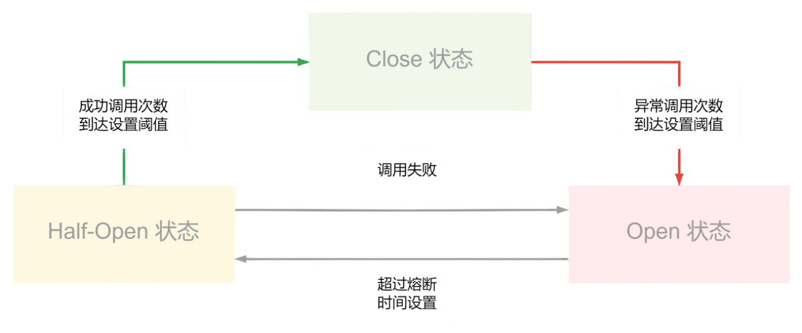

# Circuit Breaker

熔断机制（Circuit Breaker）的核心思想是通过**快速失败**和**自动恢复**来避免因局部服务不可用导致的系统雪崩，其目标如下：

- **快速失败**：减少无效等待，释放系统资源
- **故障隔离**：防止单个服务故障扩散至整个系统
- **自动恢复**：通过半开状态试探，无需人工介入即可恢复

## 核心原理

熔断器模仿电路中的保险丝，通过**状态机模型**监控服务调用的健康状态：

- **关闭状态（Closed）**：默认状态，允许请求正常通过，同时统计调用失败率
- **打开状态（Open）**：当失败率超过阈值，熔断器开启，后续请求直接拒绝（快速失败），避免资源耗尽
- **半开状态（Half-Open）**：经过设定的熔断时间后，允许少量试探请求，若成功则恢复服务，否则重新进入打开状态

## 关键参数

- **失败阈值（Failure Threshold）**：触发熔断的失败率或错误次数（如 50% 失败率或连续 5 次失败）
- **熔断时间（Timeout）**：熔断器保持开启的持续时间（如 10 秒）
- **超时时间（Timeout Duration）**：单个请求的超时时间，避免长时间阻塞
- **半开状态试探次数**：允许通过的试探请求数量（如 10% 的流量）

## 工作流程

- **正常请求**：熔断器关闭，请求正常执行，统计成功/失败次数
- **触发熔断**：当失败率达到阈值，熔断器开启，后续请求直接返回错误或降级响应
- **尝试恢复**：熔断时间过后进入半开状态，允许部分请求试探
- **恢复或重新熔断**：
  - 试探成功：熔断器关闭，恢复正常
  - 试探失败：重新开启熔断器，等待下一个恢复周期

## 应用场景

- **微服务间调用**：防止某个下游服务故障导致上游服务线程阻塞
- **数据库访问**：避免因数据库过载导致应用崩溃
- **第三方API依赖**：如支付、短信服务不可用时快速降级
- **高并发场景**：结合限流（Rate Limiting）和降级（Degradation）形成立体防护
