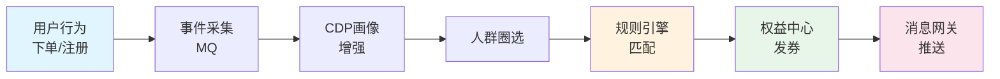
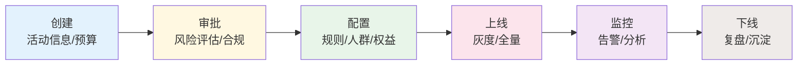
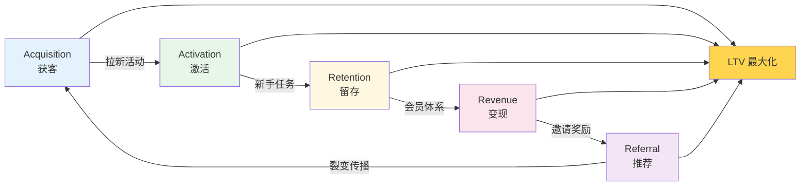
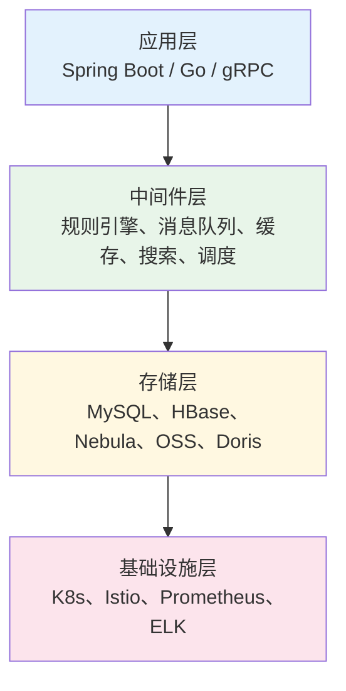
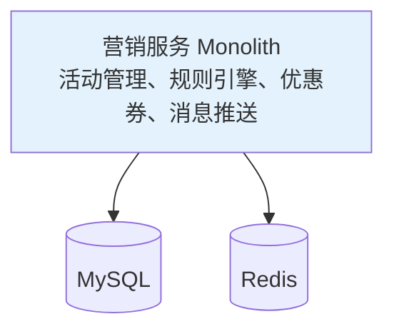
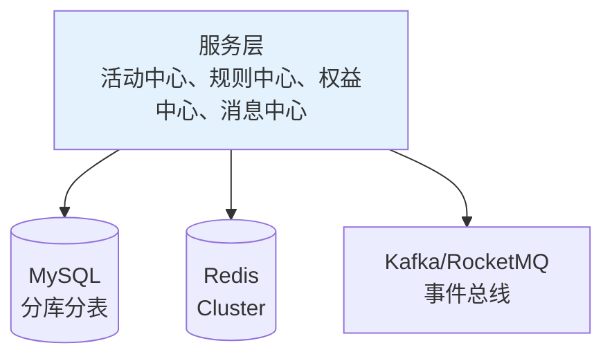
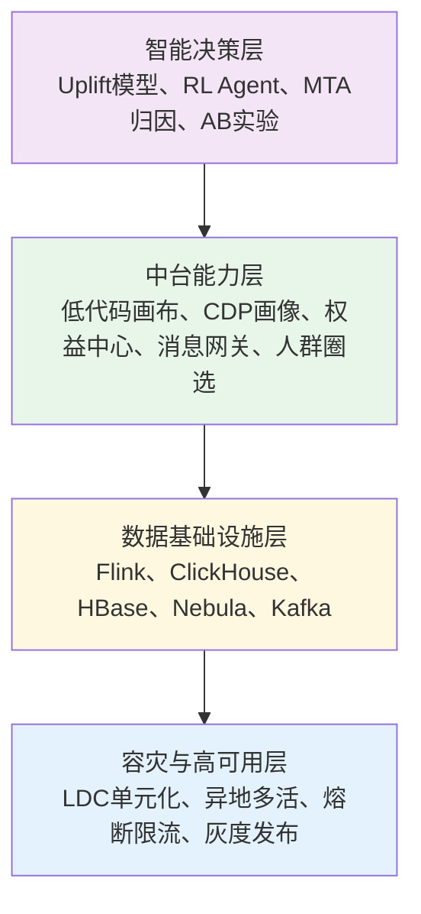

# 营销系统

**摘要**：随着全渠道营销（Omnichannel Marketing）与大数据处理技术的深度融合，企业营销系统已由传统的烟囱式结构演进为高度解耦的分层架构。本文结合超大规模互联网平台的工程实践，系统性地阐述了一种由“底层基础能力层、中台能力层、上层业务应用层以及智能化决策层”构成的四层技术架构模型。通过深入分析各层级的核心组件——包括基于连通图算法的 ID Mapping、基于 ClickHouse BitMap 的高性能人群计算、分布式权益核销引擎以及基于因果推断的 Uplift 模型，本文揭示了现代营销系统如何在高并发与异构环境下实现大规模个性化干预与 99.99% 的高可用性。此外，本文还探讨了单元化（LDC）容灾体系与隐私计算技术在保障系统高可用性与数据合规性方面的重要作用。

**核心观点概览**：

- **分层解耦是标准范式**：基础、中台、应用、决策四层架构实现了技术复用与业务敏捷。
- **隐私计算成为必然趋势**：“数据可用不可见”的联邦学习与 TEE 正逐步取代传统明文交互。
- **智能化是 ROI 优化的核心**：从“规则驱动”转向“算法驱动”，利用 Uplift 模型最大化边际效应。
- **AIGC 重塑内容生产**：生成式 AI 将 DCO 从“素材检索”升级为“实时生成”，赋能真正的“千人千面”。

## 1. 数字化营销系统分层模型概述

现代营销架构的核心逻辑在于将静态的数据资源转化为动态的营销指令，并通过反馈闭环持续优化投资回报率（ROI）。本研究提出的分层架构模型如下表所示：

| 架构层次 | 核心组件 | 功能描述 |
| :--- | :--- | :--- |
| **底层基础能力层** | CDP/DMP、异构存储矩阵、隐私计算平台 (FL/TEE) | 负责异构数据清洗、One ID 标识对齐及海量画像存储；在合规前提下实现跨域数据价值共享。 |
| **中台能力层** | 规则决策中心、权益计费引擎、低代码营销画布 | 抽象通用的业务逻辑（ECA 模型），提供可视化编排与沙盒仿真能力，实现策略的敏捷迭代与高并发管控。 |
| **上层业务应用层** | 交互式营销场景、Gamification 系统、AIGC 内容工厂 | 针对特定业务目标构建终端用户交互界面，利用 LLM 与扩散模型实现“千人千面”的实时内容生成。 |
| **智能化决策层** | Uplift 因果模型、强化学习 (RL) 代理、多触点归因 (MTA) | 利用机器学习进行增益预测与资源配置优化，通过闭环反馈实现策略自动进化。 |

## 2. 底层基础能力层：原子化资源与身份一致性

底层架构是营销系统的“基础设施”，其核心目标是解决数据孤岛、渠道碎片化以及海量数据的实时查询问题。

### 2.1 客户数据平台 (CDP) 与 ID Mapping

DMP/CDP 通过整合来自 Web、App 及第三方平台的异构数据，构建 360° 客户画像。其技术核心在于 **ID Mapping**，通过连通图算法将手机号、设备 ID（IMEI/OAID）及平台标识（OpenID）映射为唯一的 Global ID (QAID)。

- **冲突解决机制**：对于单值型标识，系统采用全局合并策略。当高优先级 ID 出现冲突时，基于 $Recency$（新近度）或 $Frequency$（频率）原则进行权重裁定。

### 2.2 存储架构的异构化与 ClickHouse BitMap

面对百亿级数据和复杂的标签组合查询，单一数据库难以满足需求，本系统采用异构存储矩阵：

- **主体画像存储 (HBase)**：基于用户 ID 构建 Rowkey，支持海量用户画像的毫秒级实时点查。
- **高性能人群圈选 (ClickHouse + BitMap)**：
  - **原理**：利用 ClickHouse 的 BitMap 引擎，将复杂的 SQL 逻辑（AND, OR, NOT）转化为底层的位运算。
  - **实现**：将“当日活跃”且“未购买”的人群计算转化为 `Bitmap(Active) AND Bitmap(NOT Purchased)`，实现秒级亿量级圈选。
  - **ID 映射**：为适配 BitMap，通过分布式 ID 生成服务将业务 ID 预先映射为连续的整数 ID。

### 2.3 数字资产中心 (DAM) 与触达网关

- **数字资产管理 (DAM)**：作为营销素材（图片、文案、优惠券模板）的中央存储库，支持自定义对象建模与内容标签化，为上层应用提供标准化的素材调用接口。
- **全渠道路由网关 (Omnichannel Routing)**：负责跨渠道（短信、微信、Push）的优先级管理与疲劳度控制，防止过度触达导致的用户流失。

### 2.4 隐私计算与合规下的“后 ID 时代”

在全球隐私政策收紧（如苹果 IDFA、谷歌淘汰 Cookie、国内《个保法》）的背景下，隐私计算成为解决数据孤岛的关键技术。核心目标是实现：**数据可用不可见，用途可控可计量**。

#### 核心对比：传统 ID Mapping 模式 vs 隐私计算模式

| 维度 | 传统 ID Mapping 模式 | 隐私计算模式 (后 ID 时代) |
| :--- | :--- | :--- |
| **数据流动** | 原始数据明文传输、集中存储 | 原始数据不出域，仅交换加密中间结果 |
| **信任基础** | 法律协议 + 商务信任 | 算法数学证明 + 硬件安全保障 🛡️ |
| **核心挑战** | 隐私泄露风险、合规成本高 | 计算性能开销、工程实现复杂 |
| **主要工具** | ETL、One ID 映射表 | 联邦学习、PSI、TEE、MPC |

#### 关键技术概览

- **联邦学习 (Federated Learning)**：采用“数据不动模型动”的模式。参与方无需共享原始数据，只需在本地训练模型，然后交换加密后的模型参数（梯度），最终聚合出一个全局模型。
- **可信执行环境 (TEE)**：基于硬件的隔离方案（CPU 内部的“保险箱”）。数据只有进入安全区域后才会解密并运算，外部系统无法窥探。
- **隐私集合求交 (PSI)**：允许合作方在不泄露用户清单的前提下，找出共同用户集合，实现精准触达。

## 3. 中台能力层：逻辑抽象与策略编排

中台层通过对营销逻辑的标准化建模，极大降低了业务创新的边际成本。

### 3.1 规则决策引擎：ECA 模型与 Rete 算法

规则引擎是营销自动化的核心，它采用 **ECA (Event-Condition-Action)** 模型来实现业务逻辑的解耦与动态编排。该模型将复杂的业务规则拆解为三个标准要素：

#### 1. Event (事件)：触发源

事件是规则执行的驱动力，通常通过消息队列 (MQ) 异步输入。

- **原子事件**：单一的、离散的用户行为，如“用户登录”、“点击商品”、“支付完成”。
- **复杂事件 (CEP)**：基于时间窗口的事件序列。例如，结合 **Flink CEP** 框架，捕捉“30分钟内连续浏览 3 个同类商品但未下单”的组合行为。

#### 2. Condition (条件)：逻辑判定

条件用于评估当前事件与上下文是否满足预设规则。

- **模式匹配**：系统基于 **Rete 算法** 构建有向无环图 (DAG)，共享相同的条件节点（如“用户等级 > Lv5”），从而在处理成千上万条并行规则时，避免重复计算，显著降低复杂度。
- **上下文注入**：除了事件本身的属性，判定过程还需实时拉取用户画像 (Profile) 和环境特征 (Context) 作为辅助判断依据。

#### 3. Action (动作)：响应执行

当事件满足所有条件时，触发相应的业务动作。

- **权益发放**：调用权益中心接口，发放优惠券、积分或红包。
- **消息触达**：触发短信、Push 或站内信通知。
- **状态流转**：更新用户在营销状态机 (FSM) 中的状态，如从“潜在客户”流转为“高意向客户”。

### 3.2 权益中心与分布式库存管理

分布式权益引擎 (Coupon Core) 负责优惠券及虚拟资产的生命周期管理。为应对秒杀场景下的瞬时高并发，采用以下策略：

- **Redis Lua 原子操作**：利用 Lua 脚本将“校验资格”与“扣减库存”逻辑合并，确保操作的原子性，防止超卖。
- **热点 Key 拆分 (Sharding)**：将单个热门权益的库存（Total）拆分为 $N$ 个子库存（如 `stock_0` ... `stock_9`），将流量随机散列到不同分片，解决 Redis 单点瓶颈。
- **本地缓存预扣**：在极端流量下，应用层使用 Caffeine/Guava 进行本地库存预扣与限流，保护后端存储。

### 3.3 业务敏捷化：低代码营销画布与策略仿真

业务敏捷化的核心是将复杂的后端技术栈封装成非技术人员也能操作的生产力工具。

#### 核心对比：传统开发模式 vs 低代码画布模式

| 维度 | 传统开发模式 | 低代码画布模式 |
| :--- | :--- | :--- |
| **操作主体** | 研发人员 (编写代码) | 运营人员 (视觉编排) |
| **上线周期** | 周/月 (需求评审->开发->上线) | 分钟/小时 (拖拽即所得) ⚡ |
| **逻辑形态** | 嵌套的代码分支 | 直观的节点流转图 🗺️ |
| **风险预控** | 依赖小流量灰度 | 仿真沙盒模拟预测 🧪 |

#### 核心技术点解析

- **低代码画布 (Visual Orchestration)**：利用 ECA 模型，运营人员通过拖拽事件、条件、动作节点，可视化编排消费者旅程。
- **策略仿真沙盒 (Strategy Sandbox)**：营销系统的“数字孪生”。通过“数据回放”技术，将历史样本数据流输入新策略，预测核销率和 ROI，为决策提供量化依据。

## 4. 上层业务应用层：场景化交互与创意渲染

应用层是营销策略的最终承载，强调高并发稳定性与用户感知的个性化。

### 4.1 互动营销与高并发场景

在春节红包、秒杀等极端高并发场景下，应用层通过削峰填谷与异步记账机制确保系统稳定性。

- **SEI 技术**：将互动信令嵌入视频流帧中，确保直播场景下画面与营销互动（如红包弹出）的严格同步。
- **长连接推送**：利用 WebSocket/HTTP2 建立端云通道，实现实时消息下发。

### 4.2 游戏化 (Gamification) 与社交裂变

- **游戏化机制**：利用积分 (Points)、勋章 (Badges) 和排行榜 (Leaderboards) 等机制构建用户激励体系，提升长效留存。
- **图数据库应用**：引入 Nebula Graph 或 Neo4j 存储百亿级社交关系网络，高效支持“二度人脉”、“团队业绩计算”等图遍历查询。
- **精准归因**：结合剪贴板匹配与设备指纹 (Device Fingerprinting) 技术，解决 App 安装过程中的归因断链问题。

### 4.3 动态创意优化 (DCO) 与 AIGC

传统的 DCO 更多是基于“模版+素材”的拼凑，其核心公式为：

$$Creative = f(User\_Profile, Context, Past\_Performance)$$

随着 AIGC 技术的发展，DCO 正从“检索式”向“生成式”演进。

#### 核心对比：传统 DCO (Retrieval-based) vs 下一代 DCO (Generative-based)

| 维度 | 传统 DCO | 下一代 DCO |
| :--- | :--- | :--- |
| **内容来源** | 预先拍摄/设计的静态素材 | LLM 与扩散模型实时生成 ⚡ |
| **个性化粒度** | 受限于素材库规模（千人十面） | 无限排列组合（真正千人千面） ♾️ |
| **DAM 功能** | 存储、索引、版权管理 | 模型权重管理、Prompt 库、合规审核 |
| **生产成本** | 随创意数量线性增加 | 边际成本趋近于零 📉 |

## 5. 智能化决策层：因果推断与 ROI 优化

决策层从传统的“规则驱动”转向“算法预测”，核心解决营销资源的边际贡献问题。

### 5.1 Uplift 模型与营销增益评估

区别于传统的响应模型（Response Model），Uplift 模型专注于估计个体处理效应（Individual Treatment Effect, ITE）。

$$Uplift = P(Y|T=1, X) - P(Y|T=0, X)$$

> **公式解释**：Uplift 值等于对特定用户（特征为 $X$）进行营销干预（$T=1$）后的转化概率，减去不对其干预（$T=0$）情况下的自然转化概率。

基于 Uplift 分数，将用户划分为四象限进行差异化策略：

| 人群类别 | 特征 | 策略 |
| :--- | :--- | :--- |
| **说服型 (Persuadables)** | 给权益才转化 | **重点营销**（ROI 核心来源） |
| **自然转化型 (Sure Things)** | 不给权益也转化 | **停止预算**（避免自然流量补贴） |
| **无动于衷型 (Lost Causes)** | 给不给都不转化 | **放弃干预**（节省资源） |
| **反作用型 (Sleeping Dogs)** | 给权益反而流失 | **严格隔离**（避免品牌伤害） |

### 5.2 强化学习 (RL) 与多触点归因 (MTA)

- **强化学习框架**：将营销过程建模为马尔可夫决策过程 (MDP)。RL 代理根据用户状态演进不断调整干预策略，以最大化长期客户终身价值 (LTV)。
- **多触点归因 (MTA)**：利用 Shapley 值或马尔可夫链模型，科学衡量用户转化路径中各触点的贡献度，自动调整不同渠道的预算分配权重。

## 6. 高可用架构与数据一致性

为支撑大促级流量与金融级准确性，系统需具备极高的容灾能力与数据一致性保障。

### 6.1 单元化架构 (LDC)

- **逻辑数据中心 (Logic Data Center)**：按用户 ID 将流量路由至不同的逻辑单元，每个单元包含独立的应用与存储栈。
- **异地多活**：当单机房故障时，通过路由层秒级切流至备用单元，实现故障隔离。

### 6.2 分布式事务

- **TCC (Try-Confirm-Cancel)**：适用于强一致性场景，通过资源预留、确认扣减与回滚释放三阶段保障数据一致性。
- **Saga 模式**：适用于长链路业务，通过一系列本地事务与补偿操作实现最终一致性。

## 7. 关键指标与评估体系

一个成功的数字化营销系统不仅需要强大的技术架构，还需要一套科学的指标体系来衡量其效果和效率。

### 7.1 业务效果指标

- **用户增长**：新增用户数 (New Users)、获客成本 (CAC)、用户激活率。
- **转化效率**：转化率 (CVR)、客单价 (AOV)、投资回报率 (ROI)。
- **用户留存**：次日留存率、7日留存率、30日留存率、用户生命周期价值 (LTV)。
- **营销活动效果**：活动参与人数、优惠券核销率、活动 ROI、拉新成本、复购率提升。

### 7.2 系统稳定性指标

营销系统直接关联资金发放，稳定性指标至关重要。

| 指标类别 | 核心指标 | 目标值 | 说明 |
| :--- | :--- | :--- | :--- |
| **可用性** | SLA | ≥ 99.99% | 年度不可用时间 < 53分钟 |
| **延迟** | P99 延迟 | < 200ms | 规则匹配 + 权益计算 |
| **吞吐** | QPS 峰值 | > 10万 | 秒杀场景峰值承载 |
| **准确性** | 资损率 | < 0.001% | 多发/错发金额占比 |
| **一致性** | 数据对账延迟 | < 1分钟 | 缓存与数据库一致性校验 |

**关键监控维度**：
- **规则引擎**：匹配延迟、命中率、编译错误数
- **权益中心**：库存准确率、发放成功率、核销延迟
- **消息网关**：触达成功率、渠道延迟、退信率
- **人群圈选**：圈选耗时、人群规模误差、BitMap 内存占用

### 7.3 成本效率指标

营销资源的有效利用是成本控制的核心。

- **资源利用率**：
  - 计算资源：CPU/内存利用率、容器弹性伸缩效率
  - 存储资源：画像压缩率、冷热数据分层比例
  - 网络资源：CDN 命中率、跨机房流量成本

- **营销效率**：
  - **补贴率**：营销补贴金额 / GMV，衡量营销成本占比
  - **核销率**：已使用优惠券 / 已发放优惠券，衡量权益吸引力
  - **人效提升**：低代码画布上线活动数 / 人天，衡量业务敏捷度

### 7.4 实验评估框架

营销系统的迭代依赖科学的实验评估体系。

#### 7.4.1 A/B 实验设计

| 要素 | 说明 | 示例 |
| :--- | :--- | :--- |
| **实验假设** | 明确要验证的因果关系 | "满100减20比满150减30转化率更高" |
| **分流策略** | 用户维度随机分流，保证组间同质 | Hash(UserID) % 100 |
| **样本量计算** | 基于最小可检测效应 (MDE) | MDE=5%, Power=80%, α=0.05 |
| **实验周期** | 考虑周末/节假日效应 | 至少覆盖一个完整周期 (7天) |

#### 7.4.2 统计显著性评估

```text
# 核心指标
- 提升幅度 (Lift): (实验组指标 - 对照组指标) / 对照组指标
- 置信区间 (CI): 提升幅度的 95% 置信区间
- P值 (P-value): 原假设成立的概率，P < 0.05 视为显著
- 统计功效 (Power): 检测到真实效应的概率，通常要求 ≥ 80%

# 显著性判断标准
1. P值 < 0.05 且 置信区间不跨 0
2. 实验组样本量达到预设阈值
3. 多重比较校正 (Bonferroni / FDR)
```

#### 7.4.3 增量归因与 Uplift 分析

传统的 A/B 实验只能回答"策略是否有效"，Uplift 分析可以回答"对谁有效"。关于 Uplift 模型的核心原理和四象限分析，详见 [5.1 Uplift 模型与营销增益评估](#51-uplift-模型与营销增益评估)。

**实验平台核心能力**：
- **分层实验**：多个实验并行执行，互不干扰
- **互斥实验**：保证同一用户只参与一个实验
- **动态调权**：根据中期结果自动调整流量分配
- **自动下线**：检测到显著负向效果时自动停止

## 8. 典型业务流程

本节通过典型业务场景，展示营销系统各组件的协作方式。

### 8.1 优惠券发放全链路



**详细步骤**：

1. **事件触发**：用户完成下单行为，埋点系统采集事件并投递至消息队列。
2. **画像增强**：规则引擎调用 CDP 服务，实时获取用户标签（等级、历史消费等）。
3. **规则匹配**：基于 ECA 模型，判断用户是否满足发券条件（如"首单用户"、"金额>100"）。
4. **库存扣减**：权益中心通过 Redis Lua 脚本原子性扣减优惠券库存。
5. **幂等校验**：检查用户是否已领取该优惠券，防止重复发放。
6. **消息触达**：调用消息网关，通过 Push/短信/站内信通知用户。

### 8.2 营销活动生命周期管理



**关键阶段要点**：

| 阶段 | 核心活动 | 风险控制 |
| :--- | :--- | :--- |
| **创建** | 活动类型、预算、时间、目标人群 | 预算上限校验、时间冲突检测 |
| **审批** | 预算审批、风控审批、合规审核 | 多级审批流、敏感词过滤 |
| **配置** | 规则配置、权益绑定、渠道选择 | 规则冲突检测、仿真验证 |
| **上线** | 灰度放量、全量发布 | 实时监控、熔断机制 |
| **监控** | 指标看板、异常告警 | 自动熔断、预算熔断 |
| **复盘** | 效果分析、经验沉淀 | 数据归档、知识库更新 |

### 8.3 用户转化闭环



**各阶段典型营销策略**：

| 阶段 | 核心目标 | 典型策略 | 关键指标 |
| :--- | :--- | :--- | :--- |
| **Acquisition** | 获取新用户 | 渠道投放、拉新红包、首单优惠 | CAC、新增用户数、渠道 ROI |
| **Activation** | 激活首次核心行为 | 新手任务、引导奖励、体验优化 | 激活率、首次转化时间 |
| **Retention** | 提升留存和活跃 | 签到奖励、会员体系、个性化推荐 | 留存率、DAU/MAU、使用频次 |
| **Revenue** | 促进付费转化 | 优惠券、满减、会员折扣 | ARPU、付费转化率、客单价 |
| **Referral** | 激励用户传播 | 邀请奖励、拼团、分享红包 | K因子、裂变系数、分享率 |

## 9. 技术选型与开源方案

### 9.1 整体架构技术栈



### 9.2 核心组件选型对比

#### 9.2.1 规则引擎选型

| 方案 | 语言 | 性能 | 复杂度 | 适用场景 | 生产案例 |
| :--- | :--- | :--- | :--- | :--- | :--- |
| **Drools** | Java | 高 | 高 | 企业级复杂规则、CEP | 金融、保险 |
| **LiteFlow** | Java | 中 | 中 | 流程编排、组件化规则 | 电商、营销 |
| **Easy Rules** | Java | 低 | 低 | 简单规则、学习入门 | 中小项目 |
| **Grule** | Go | 高 | 中 | 云原生、微服务架构 | 互联网公司 |
| **自研引擎** | - | 极高 | 极高 | 高性能定制化需求 | 超大规模平台 |

**选型建议**：
- 规则数量 < 100 且逻辑简单 → Easy Rules / Aviator
- 规则数量 > 1000 且需要 CEP → Drools
- 流程编排为主 → LiteFlow
- Go 技术栈 → Grule
- 性能极致要求 → 自研

#### 9.2.2 消息队列选型

| 方案 | 吞吐量 | 延迟 | 可靠性 | 适用场景 |
| :--- | :--- | :--- | :--- | :--- |
| **Kafka** | 100万+/s | ms级 | 高 | 日志采集、事件流、大数据管道 |
| **RocketMQ** | 10万+/s | ms级 | 极高 | 金融交易、事务消息、顺序消息 |
| **RabbitMQ** | 万级 | μs级 | 高 | 延迟队列、路由复杂、AMQP协议 |
| **Pulsar** | 100万+/s | ms级 | 极高 | 多租户、跨机房、存算分离 |

**营销场景推荐**：
- 事件触发（实时性要求高）→ RocketMQ
- 日志采集、离线分析 → Kafka
- 延迟任务（定时发券）→ RabbitMQ 延迟队列

#### 9.2.3 存储选型

| 场景 | 推荐方案 | 备选方案 | 选型依据 |
| :--- | :--- | :--- | :--- |
| 用户画像 | HBase | Cassandra | 海量数据、稀疏存储、毫秒级点查 |
| 人群圈选 | ClickHouse | Doris | BitMap 加速、列存、OLAP 查询 |
| 规则配置 | MySQL | TiDB | 事务支持、强一致性 |
| 社交关系 | Nebula Graph | Neo4j | 图遍历、二度人脉、团队关系 |
| 会话状态 | Redis Cluster | Memcached | 高性能、数据结构丰富 |
| 活动素材 | OSS/MinIO | - | 对象存储、CDN 加速 |

### 9.3 开源方案生态

| 组件类型 | 开源方案 | 成熟度 | 社区活跃度 |
| :--- | :--- | :--- | :--- |
| 规则引擎 | Drools, LiteFlow, Grule | ⭐⭐⭐⭐⭐ | 高 |
| 工作流引擎 | Camunda, Temporal, Activiti | ⭐⭐⭐⭐⭐ | 高 |
| AB实验平台 | GrowthBook, Statsd, ABBA | ⭐⭐⭐⭐ | 中 |
| 用户画像平台 | Apache Atlas, DataHub | ⭐⭐⭐⭐ | 中 |
| 实时计算 | Flink, Spark Streaming | ⭐⭐⭐⭐⭐ | 极高 |
| 配置中心 | Nacos, Apollo, Etcd | ⭐⭐⭐⭐⭐ | 高 |

## 10. 实施路径与演进建议

### 10.1 从 0 到 1：MVP 阶段

**目标**：快速验证核心业务价值，支撑早期业务增长。



**关键决策**：
- 单体架构，快速迭代
- 使用成熟开源组件（Spring Boot + Redis + MySQL）
- 规则引擎可选 LiteFlow 或自研简单表达式引擎
- 消息推送使用第三方服务（如极光、个推）

**不推荐**：
- 过度设计的微服务架构
- 自研复杂规则引擎
- 引入过多中间件

### 10.2 从 1 到 10：业务扩展阶段

**目标**：支撑业务快速增长，提升系统稳定性与扩展性。



**关键演进**：
- **服务拆分**：活动中心、规则中心、权益中心、消息中心
- **数据库分库分表**：按业务域拆分，引入 ShardingSphere
- **引入消息队列**：Kafka/RocketMQ 解耦异步流程
- **规则引擎升级**：从简单表达式引擎升级为 Drools/LiteFlow
- **引入分布式事务**：Seata/TCC 解决跨服务事务

**监控告警**：
- Prometheus + Grafana 监控体系
- ELK 日志采集与分析
- 链路追踪：SkyWalking / Jaeger

### 10.3 从 10 到 100：规模化阶段

**目标**：支撑海量用户与高并发场景，实现智能化运营。



**关键能力**：
- **CDP 平台建设**：统一用户画像，支持实时标签计算
- **人群圈选引擎**：基于 ClickHouse BitMap 的秒级亿级圈选
- **低代码画布**：可视化编排，支持沙盒仿真与灰度发布
- **智能决策**：Uplift 模型、强化学习、多触点归因
- **单元化架构**：LDC 容灾，异地多活

### 10.4 演进时间线建议

| 阶段 | 时间周期 | 核心目标 | 关键里程碑 |
| :--- | :--- | :--- | :--- |
| **MVP** | 0-6个月 | 快速验证 | 单体应用上线，支撑首个营销活动 |
| **扩展** | 6-18个月 | 稳定性提升 | 服务拆分，QPS 破万，SLA 99.9% |
| **规模化** | 18-36个月 | 智能化转型 | CDP 平台，Uplift 模型，ROI 提升 20% |
| **平台化** | 36个月+ | 生态建设 | 开放 API，多业务线复用，智能运营闭环 |

### 10.5 常见陷阱与规避建议

| 陷阱 | 表现 | 规避建议 |
| :--- | :--- | :--- |
| **过度设计** | MVP 阶段引入微服务、K8s、Service Mesh | 保持简单，按需演进 |
| **规则爆炸** | 规则数量失控，维护成本极高 | 规则治理、定期清理、版本管理 |
| **数据孤岛** | 各业务线画像数据不互通 | 统一 CDP 平台，One ID 对齐 |
| **资损事故** | 优惠券多发、叠加规则冲突 | 仿真验证、预算熔断、对账机制 |
| **性能瓶颈** | 大促期间系统崩溃 | 压测常态化、限流降级、弹性扩容 |
| **烟囱系统** | 各营销活动独立开发，无法复用 | 中台化、组件化、低代码平台 |

---

## 结语

数字化营销系统的建设是一个持续演进的过程。从 MVP 阶段的单体应用，到规模化的智能营销平台，每一步都需要根据业务发展阶段做出合理的技术决策。

**核心原则**：
1. **业务价值优先**：技术服务于业务，避免过度设计
2. **稳定性为基石**：营销系统直接关联资金发放，稳定性不可妥协
3. **数据驱动决策**：建立完善的指标体系，用数据指导迭代方向
4. **智能化演进**：从规则驱动向算法驱动演进，提升 ROI

未来，随着 AIGC、隐私计算、因果推断等技术的成熟，营销系统将朝着更加智能、合规、个性化的方向发展。
