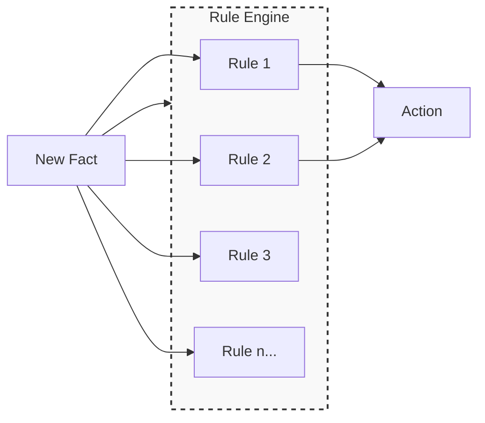
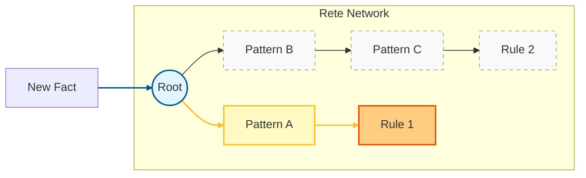
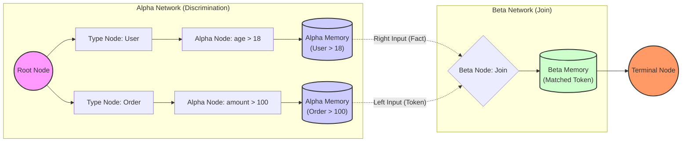
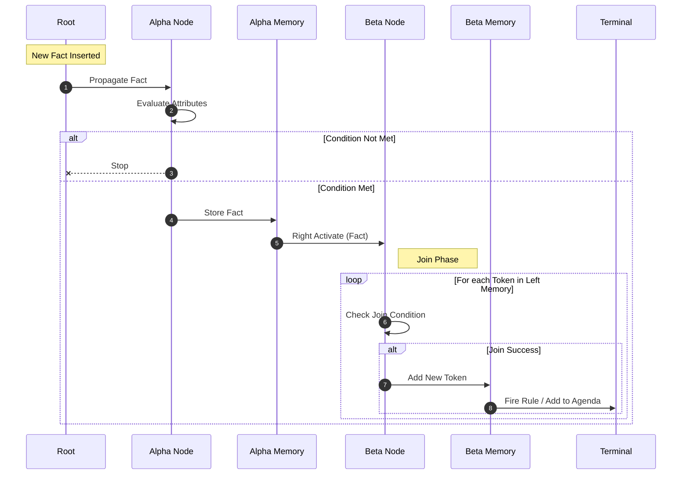

# Rete 算法详解 (Rete Algorithm)

Rete 算法（/ˈriːti/，源自拉丁语“网”）是由 Charles Forgy 在 1979 年提出的一种高效模式匹配算法。它是构建产生式系统（Production System）和规则引擎（Rule Engine）的核心技术，广泛应用于专家系统、业务规则管理系统 (BRMS) 和复杂事件处理 (CEP) 中。

## 1. 为什么需要 Rete：与朴素匹配的对比 (Background & Motivation)

为了更直观地理解 Rete 算法的优势，我们可以将其与**朴素匹配（Naive Match）**进行对比。朴素匹配通常指每次数据发生变化时，轮询遍历所有规则并重新评估条件。

假设我们有 **1000 条规则** 和 **1000 个事实**。当**插入 1 个新事实**时：

| 特性 | 朴素匹配 (Naive Match) | Rete 算法 |
| :--- | :--- | :--- |
| **匹配逻辑** | **全量重算**：遍历所有规则，重新检查每个规则的所有条件是否满足。 | **增量计算**：仅评估与新事实类型相关的 Alpha 节点，以及受影响的 Beta 节点。 |
| **条件重复计算** | **高**：如果多条规则包含相同的条件（如 `age > 18`），该条件会被重复计算多次。 | **无**：通过节点共享，相同的条件在网络中只存在一份，仅计算一次。 |
| **时间复杂度** | 与 **(规则数 × 事实数)** 成正比。随着规则库增大，性能线性下降。 | 主要与 **(受影响的规则数 × 变化的事实数)** 成正比。规则总数对性能影响较小。 |
| **适用场景** | 规则少、数据量小、数据变化不频繁的简单场景。 | 规则多、数据量大、数据频繁变化（数据流）的复杂场景。 |

> **核心差异**：Rete 实际上是用**空间换时间**。它花费内存维护了 Alpha Memory 和 Beta Memory，从而在数据变化时避免了大量的重复计算。

### 1.1 流程对比图

为了更形象地展示差异，我们来看当**新数据**进入时，两者的处理流程：

#### 朴素匹配 (Naive Match)
**每次**数据变化，都要重新跑**所有**规则。



#### Rete 算法
**每次**数据变化，只触发**相关**节点。


*(注：黄色高亮路径表示受新数据影响的路径，灰色虚线表示未受影响的节点，无需重算)*

## 2. 核心设计理念 (Core Design Philosophy)

Rete 算法旨在解决大规模规则集合与大规模事实集合之间的高效匹配问题。它通过以下两个关键策略来实现高性能：

1.  **状态保存（State Saving）**：算法将部分匹配的结果缓存起来（Alpha Memory 和 Beta Memory）。当 Working Memory 发生变化时，仅需更新受影响的部分匹配结果，而无需重新计算整个规则集。这种**增量计算**特性使得 Rete 非常适合处理频繁变化的数据流。
2.  **节点共享（Node Sharing）**：如果在多个规则中存在相同的条件模式，Rete 会在网络中共享这些节点。这显著减少了冗余计算和内存占用。

## 3. 网络架构：Rete 网络 (Network Architecture)

Rete 算法将规则编译成一个有向无环图（DAG），称为 Rete 网络。网络中的节点代表条件检查，边代表令牌（Token）的流动路径。



### 3.1 节点类型

Rete 网络主要由四类节点组成，如下表所示：

<table>
<thead>
<tr>
<th>节点类型</th>
<th>别名</th>
<th>功能描述</th>
<th>输入/输出</th>
</tr>
</thead>
<tbody>
<tr>
<td><strong>根节点 (Root Node)</strong></td>
<td>Entry Point</td>
<td>网络的入口点，所有的事实（Fact）对象都从这里进入网络。</td>
<td>In: Fact<br>Out: Alpha Nodes</td>
</tr>
<tr>
<td><strong>Alpha 节点 (Alpha Node)</strong></td>
<td>1-input Node</td>
<td>负责检查事实对象的内部属性（Intra-element features）。<br>例如：<code>User.age > 18</code></td>
<td>In: Fact<br>Out: Alpha Memory</td>
</tr>
<tr>
<td><strong>Beta 节点 (Beta Node)</strong></td>
<td>2-input Node</td>
<td>负责处理对象之间的关联条件（Inter-element features）。<br>例如：<code>User.id == Order.userId</code></td>
<td>In: Token (Left), Fact (Right)<br>Out: Beta Memory (New Token)</td>
</tr>
<tr>
<td><strong>终端节点 (Terminal Node)</strong></td>
<td>Rule Node</td>
<td>代表一条完整的规则被匹配。触发规则对应的动作或加入议程。</td>
<td>In: Token<br>Out: Agenda / Action</td>
</tr>
</tbody>
</table>

### 3.2 内存结构 (Memories)

Rete 通过内存节点来实现“空间换时间”：

*   **Alpha Memory (AM)**：存储所有通过了特定 Alpha 节点检测的事实对象。
*   **Beta Memory (BM)**：存储 Beta 节点的匹配结果。通常分为：
    *   **Left Memory**：存储来自左侧分支的 Token 列表。
    *   **Right Memory**：存储来自右侧分支的事实对象列表。

## 4. 动态流程：数据流转机制 (Data Flow Mechanism)

当一个事实（Fact）被插入系统时，它在网络中的流转过程如下：



1.  **进入 Root**：Fact 进入根节点。
2.  **Alpha 匹配**：Fact 遍历 Alpha 网络。如果满足条件（如 `type == Order` 且 `amount > 100`），则被存储在对应的 Alpha Memory 中。
3.  **Beta 激活**：
    *   一旦 Alpha Memory 收到新 Fact，它会激活相连的 Beta 节点的右输入端。
    *   Beta 节点会遍历其 Left Memory 中的所有 Token，尝试与新 Fact 进行 Join 操作。
    *   如果 Join 成功，生成新的 Token，并向后传播。
4.  **终端触发**：如果 Token 传播到 Terminal Node，表示一条规则完全匹配，系统将其加入执行队列。

## 5. 核心算法逻辑 (Core Algorithm Logic)

以下伪代码展示了 Rete 算法处理事实插入（Insert）的核心逻辑。

### 5.1 事实插入过程

```text
RETE-INSERT-FACT(fact)
    // 1. 将事实推入 Alpha 网络进行筛选
    for each alpha-node in ROOT.children
        do ALPHA-NODE-ACTIVATION(alpha-node, fact)

ALPHA-NODE-ACTIVATION(node, fact)
    // 检查事实是否满足当前节点的条件
    if EVALUATE-CONDITION(node.condition, fact)
        then // 如果是 Alpha Memory 节点，缓存事实并激活后续 Beta 节点
             if IS-ALPHA-MEMORY(node)
                 then STORE-IN-MEMORY(node.memory, fact)
                      for each child in node.children
                          do RIGHT-ACTIVATION(child, fact)
             // 否则继续向下传播
             else for each child in node.children
                      do ALPHA-NODE-ACTIVATION(child, fact)
```

### 5.2 Beta 节点激活 (Join 过程)

Beta 节点有两个输入：左侧输入（Token 流）和右侧输入（Fact 流）。

```text
// 当右侧 Alpha Memory 有新事实进入时触发
RIGHT-ACTIVATION(beta-node, fact)
    ADD-TO-RIGHT-MEMORY(beta-node, fact)
    for each token in beta-node.left-memory
        do PERFORM-JOIN(beta-node, token, fact)

// 当左侧有新 Token 传来时触发
LEFT-ACTIVATION(beta-node, token)
    ADD-TO-LEFT-MEMORY(beta-node, token)
    for each fact in beta-node.right-memory
        do PERFORM-JOIN(beta-node, token, fact)

PERFORM-JOIN(node, token, fact)
    // 执行 Join 条件检查 (例如: token.user.id == fact.userId)
    if EVALUATE-JOIN-CONDITION(node.condition, token, fact)
        then // 创建新 Token，包含之前的事实链和当前新事实
             new-token = MAKE-TOKEN(token, fact)
             
             // 如果到达终端节点，触发规则
             if IS-TERMINAL(node)
                 then ADD-TO-AGENDA(node.rule, new-token)
             // 否则继续向左传播给下一个 Beta 节点
             else for each child in node.children
                      do LEFT-ACTIVATION(child, new-token)
```

## 6. 算法评估 (Evaluation)

<table>
<thead>
<tr>
<th width="50%">优点 (Pros)</th>
<th width="50%">缺点 (Cons)</th>
</tr>
</thead>
<tbody>
<tr>
<td>
<ul>
<li><strong>高性能</strong>：对于规则多、事实变化频繁的场景，性能远超简单的轮询匹配。</li>
<li><strong>冗余消除</strong>：通过节点共享，相同的条件只计算一次。</li>
<li><strong>增量更新</strong>：插入或删除一个事实，只会影响网络中的一小部分路径，无需全量重算。</li>
</ul>
</td>
<td>
<ul>
<li><strong>内存消耗大</strong>：Alpha Memory 和 Beta Memory 需要缓存大量数据，典型的“空间换时间”。</li>
<li><strong>构建复杂</strong>：Rete 网络的编译过程复杂，动态修改规则（不重启服务）实现难度高。</li>
<li><strong>Beta 节点膨胀</strong>：如果 Join 条件选择不当（如笛卡尔积），Beta Memory 中的 Token 数量可能呈指数级增长。</li>
</ul>
</td>
</tr>
</tbody>
</table>

## 7. 典型应用与实现 (Implementations)

*   **CLIPS**：C 语言实现的专家系统 shell，是许多现代规则引擎的鼻祖。
*   **Drools**：Java 领域的各种标准规则引擎，早期版本基于 Rete，后续演进为 ReteOO 和 Phreak 算法（Rete 的懒加载改进版）。
*   **Jess**：Java 实现的规则引擎，深受 CLIPS 影响。

## 8. 总结 (Summary)

Rete 算法通过构建鉴别网络，将复杂的模式匹配问题转化为了数据流图的遍历问题。虽然它带来了较高的内存开销，但在处理大规模规则和实时决策场景中，它依然是目前最有效的解决方案之一。
