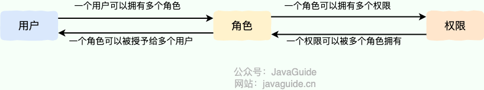
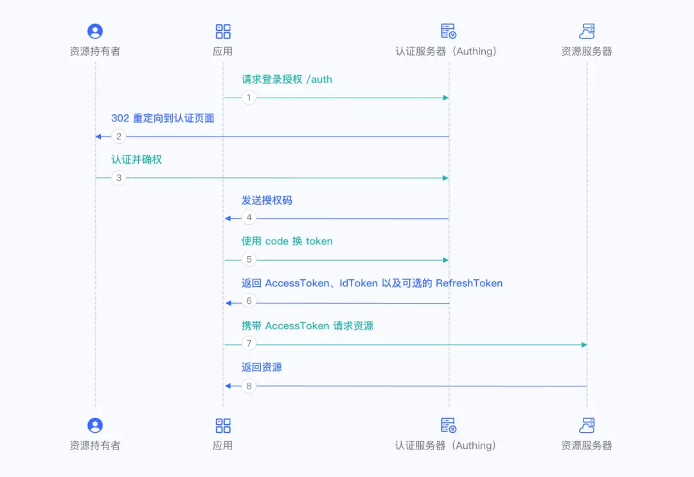

# Authorization

授权（Authorization）是指确定用户是否有权限执行某个操作或访问某个资源，用于在认证（Authentication）成功后，为用户分配权限。

## BRAC

RBAC 是指基于角色的权限访问控制（Role-Based Access Control），用户关联角色，角色关联权限：

对应于实现上，一般会有 5 张表：

- 用户表
- 角色表
- 权限表
- 用户-角色表
- 角色-权限表

**角色继承**

针对于存在继承关系的常见，比如上级角色会继承下级角色所有权限，可以设置角色继承表，绑定继承关系。

**角色约束**

针对于需要对角色分配进行约束的场景，可以增加角色约束表，或是通过业务逻辑进行限制，常见的约束关系有：

- 静态职责分离：用户不能同时拥有互斥角色
  - 如用户在公司的岗位只能有一个
- 动态职责分离：用户在一次会话中不能同时激活互斥角色
  - 如用户在一次比赛中不能同时担任选手和裁判
- 角色数量限制：限制某个角色的数量
  - 如管理员权限有且只能有一个用户

## ABAC

ABAC 是指基于属性的访问控制（Attribute-Based Access Control），通过多种属性来动态判断某一个操作是否被允许，常见的属性如下所示：

- **对象**：触发操作的用户，包括用户的 ID、角色等
  - 可以是真实用户，也可以是服务账号或是服务
- **资源**：用户要访问的对象
  - 如文件、数据、接口等
- **操作**：用户想要资源的进行的操作
  - 如读取、编辑、复制、删除等
- **环境**：触发操作时的上下文
  - 如时间、位置、设备、网络环境等

在 ABAC 模型中，决策引擎会结合所需属性，动态计算出决策结果，例如外网环境不允许访问数据，18:00 至次日 10：00 间不允许线上变更等。

## ACL

ACL 是指访问控制列表（ACL, Access Control List），直接为资源绑定允许访问的用户/角色列表，通过白名单的方式来管理。

例如在 service mesh 的场景下，微服务间的调用权限统一在注册中心配置。

## OAuth

OAuth 是一种开放授权框架，允许第三方应用在用户授权下，安全地访问其存储在另一服务提供者处的资源，而无需共享用户的凭据（如密码）。

### 核心角色

- 资源所有者（Resource Owner）：用户（拥有资源所有权）
- 客户端（Client）：第三方应用（请求访问资源）
- 授权服务器（Authorization Server）：颁发令牌的服务（如 Google 的 OAuth 服务器）
- 资源服务器（Resource Server）：存储用户资源的服务（如 Google Drive）

### 授权模式

**授权码模式（Authorization Code）**

- **适用场景**
  - 具备后端服务器的应用（如传统 Web 应用），需安全存储密钥
- **核心流程**
  - **1~3**：用户通过应用跳转至认证服务器（如 Authing）完成登录
  - **第 4 步**：认证服务器返回授权码（Authorization Code）至应用
  - 应用后端用授权码和密钥换取 Access Token、ID Token（可选 Refresh Token），并请求用户信息
  - 应用后端保存用户信息并处理后续业务逻辑
- **特点**
  - 授权码与 Token 分离传递，避免 Token 暴露给前端，安全性高
  - 支持 Refresh Token

### **2. 授权码 + PKCE 模式（Authorization Code With PKCE）**
- **适用场景**：无后端服务器的前端应用（如 SPA、移动端 App），无法安全存储密钥。
- **核心改进**：引入 **PKCE（Proof Key for Code Exchange）** 防止授权码劫持。
  - **code_verifier**：客户端生成的随机字符串（43-128位）。
  - **code_challenge**：对 `code_verifier` 进行哈希（如 SHA256）后的值。
- **流程**：
  1. 前端生成 `code_verifier` 和 `code_challenge`，跳转登录时携带 `code_challenge`。
  2. 用户认证后，认证服务器返回授权码。
  3. 前端用授权码+`code_verifier` 换取 Token，认证服务器验证哈希是否匹配。
- **安全性**：即使授权码被截获，攻击者无法伪造 `code_verifier`，适合公共客户端。
- **支持 Refresh Token**：✔️

### **3. 客户端凭证模式（Client Credentials）**
- **适用场景**：服务器间（M2M）授权，无需用户参与（如内部服务调用）。
- **流程**：
  1. 调用方使用 AK/SK 直接向认证服务器请求 Token。
  2. 认证服务器验证凭证和权限后返回 Access Token。
- **特点**：直接通过密钥认证，权限范围由预配置的 `scope` 决定。
- **支持 Refresh Token**：❌

---

### **4. 隐式模式（Implicit）（不推荐）**
- **适用场景**：纯前端应用（历史遗留方案），现已被 PKCE 模式取代。
- **流程**：Token 直接从认证端点通过 URL 哈希片段返回，无需授权码中转。
- **风险**：Token 暴露在浏览器历史记录或网络日志中，易被窃取。
- **支持 Refresh Token**：❌
- **现状**：OAuth 2.1 已废弃此模式。

---

### **5. 密码模式（Resource Owner Password Credentials）（不推荐）**
- **适用场景**：老旧系统改造，无其他可行方案时（需极高信任度）。
- **流程**：应用直接收集用户密码，发送至认证服务器换取 Token。
- **风险**：明文传输密码，客户端需完全可信，一旦泄露后果严重。
- **支持 Refresh Token**：✔️（但安全性低）
- **建议**：仅在别无选择时使用，需严格加密和审计。

---

### **6. 设备代码模式（Device Code）**
- **适用场景**：输入受限设备（如智能电视、IoT 设备）。
- **流程**：
  1. 设备从认证服务器获取 `device_code` 和 `user_code`。
  2. 用户通过其他设备（如手机）访问验证页面，输入 `user_code` 完成认证。
  3. 设备轮询认证服务器，验证通过后获取 Token。
- **特点**：分离设备认证与用户操作，提升输入受限设备的体验。
- **使用频率**：极低，仅针对特定硬件场景。

---

### **总结与推荐**
| **模式**               | **推荐度** | **适用场景**                     | **安全性** |
|-------------------------|------------|----------------------------------|------------|
| 授权码模式              | ⭐️⭐️⭐️⭐️⭐️ | 有后端的 Web 应用                | 高         |
| 授权码 + PKCE           | ⭐️⭐️⭐️⭐️⭐️ | 前端/移动端应用                   | 高         |
| 客户端凭证              | ⭐️⭐️⭐️⭐️   | 服务器间通信                     | 中         |
| 隐式模式                | ⭐️         | 不推荐                           | 低         |
| 密码模式                | ⭐️         | 仅遗留系统                       | 极低       |
| 设备代码模式            | ⭐️⭐️       | 输入受限设备                     | 中         |

**最佳实践**：
- 优先使用 **授权码模式**（有后端）或 **PKCE 模式**（无后端）。
- 避免隐式、密码模式，除非无其他选择。
- 服务器间通信使用客户端凭证模式，确保 AK/SK 严格保密。

## Ref

- <https://javaguide.cn/system-design/security/basis-of-authority-certification.html>
- <https://javaguide.cn/system-design/security/design-of-authority-system.html>
- <https://zhuanlan.zhihu.com/p/620860580>
- <https://www.authing.cn/blog/558>
