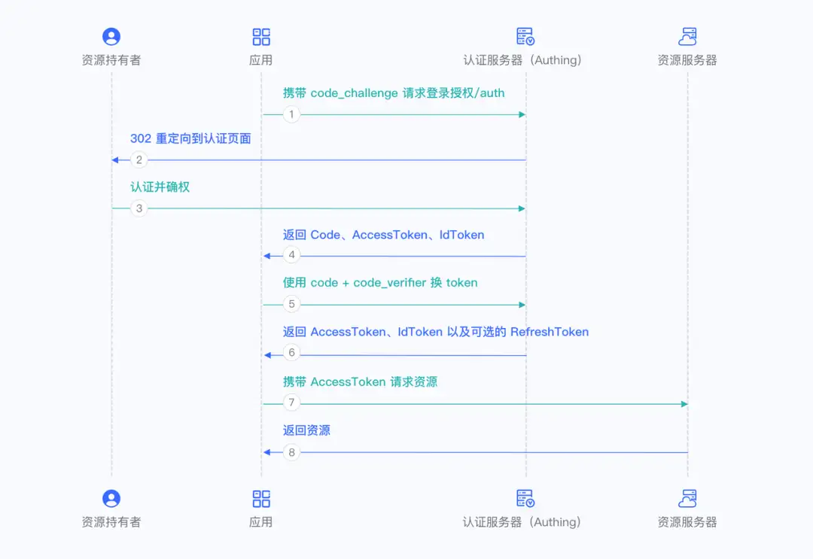
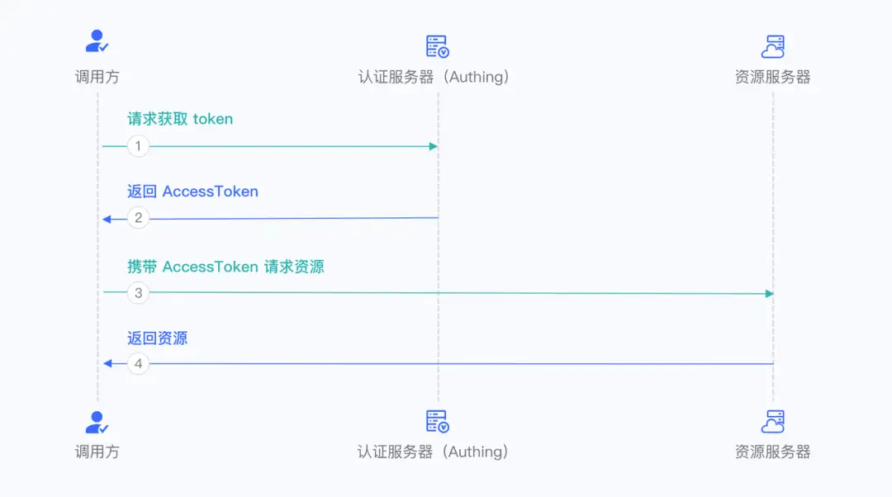
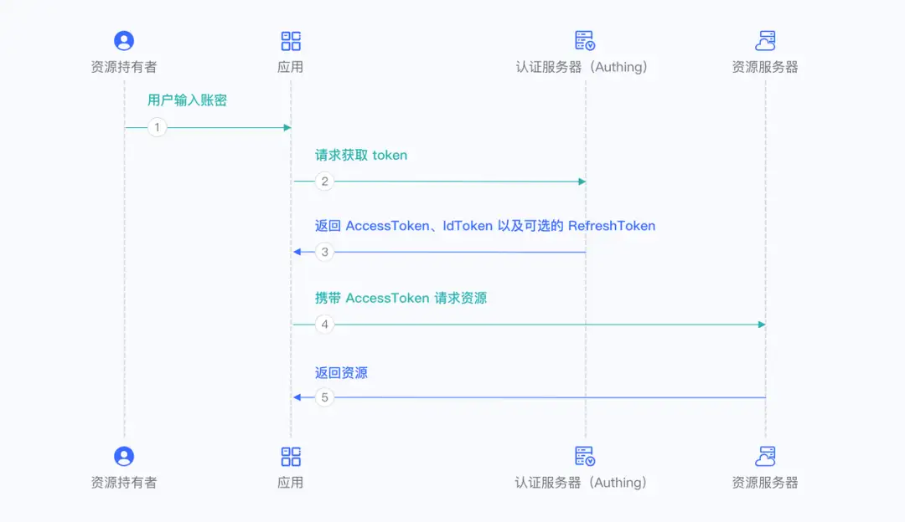
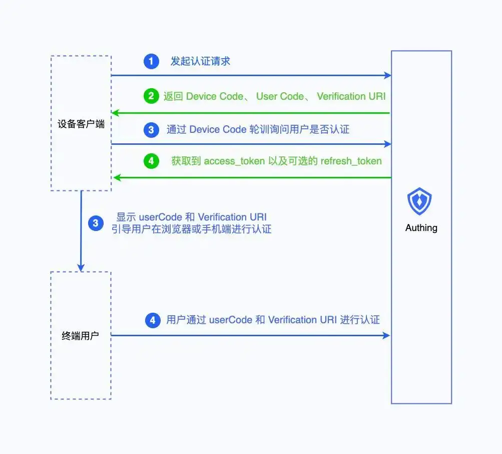

# Authorization

授权（Authorization）是指确定用户是否有权限执行某个操作或访问某个资源，用于在认证（Authentication）成功后，为用户分配权限。

## BRAC

RBAC 是指基于角色的权限访问控制（Role-Based Access Control），用户关联角色，角色关联权限：

对应于实现上，一般会有 5 张表：

- 用户表
- 角色表
- 权限表
- 用户-角色表
- 角色-权限表

**角色继承**

针对于存在继承关系的常见，比如上级角色会继承下级角色所有权限，可以设置角色继承表，绑定继承关系。

**角色约束**

针对于需要对角色分配进行约束的场景，可以增加角色约束表，或是通过业务逻辑进行限制，常见的约束关系有：

- 静态职责分离：用户不能同时拥有互斥角色
  - 如用户在公司的岗位只能有一个
- 动态职责分离：用户在一次会话中不能同时激活互斥角色
  - 如用户在一次比赛中不能同时担任选手和裁判
- 角色数量限制：限制某个角色的数量
  - 如管理员权限有且只能有一个用户

## ABAC

ABAC 是指基于属性的访问控制（Attribute-Based Access Control），通过多种属性来动态判断某一个操作是否被允许，常见的属性如下所示：

- **对象**：触发操作的用户，包括用户的 ID、角色等
  - 可以是真实用户，也可以是服务账号或是服务
- **资源**：用户要访问的对象
  - 如文件、数据、接口等
- **操作**：用户想要资源的进行的操作
  - 如读取、编辑、复制、删除等
- **环境**：触发操作时的上下文
  - 如时间、位置、设备、网络环境等

在 ABAC 模型中，决策引擎会结合所需属性，动态计算出决策结果，例如外网环境不允许访问数据，18:00 至次日 10：00 间不允许线上变更等。

## ACL

ACL 是指访问控制列表（ACL, Access Control List），直接为资源绑定允许访问的用户/角色列表，通过白名单的方式来管理。

例如在 service mesh 的场景下，微服务间的调用权限统一在注册中心配置。

## OAuth

OAuth 是一种开放授权框架，允许第三方应用在用户授权下，安全地访问其存储在另一服务提供者处的资源，而无需共享用户的凭据（如密码）。

### 术语

**角色**

- 资源所有者（Resource Owner）：用户（拥有资源所有权）
- 客户端（Client）：第三方应用（请求访问资源）
- 授权服务器（Authorization Server）：颁发令牌的服务（如 Google 的 OAuth 服务器）
- 资源服务器（Resource Server）：存储用户资源的服务（如 Google Drive）

**组件**

- 授权范围（Scopes）：请求认证时披露给资源所有者
- 凭证（Token）
  - Access Token：有效期较短，结束后需要重新授权
  - Refresh Token：有效期较长，用于免授权申请 Access Token，一般仅存放于服务端，不允许存放于客户端

### 授权模式

**授权码模式（Authorization Code）**

- **适用场景**
  - 具备后端服务器的应用，需安全存储密钥
- **核心流程**
  - **第 1~3 步**：用户通过应用跳转至认证服务器（如 Authing）完成登录
  - **第 4 步**：认证服务器返回授权码（Authorization Code）至应用
  - **第 5~6 步**：应用用授权码和密钥换取 Access Token、ID Token（可选 Refresh Token）
  - **第 7~8 步**：应用请求资源信息，并处理后续业务逻辑
- **特点**
  - 授权码与 Token 分离传递，避免 Token 暴露给前端，安全性高
  - 支持 Refresh Token

**授权码 + PKCE 模式（Authorization Code With PKCE）**

- **适用场景**
  - 无后端服务器的应用，无法安全存储密钥
- **核心改进**
  - 引入 **PKCE（Proof Key for Code Exchange）** 防止授权码劫持
  - **code_verifier**：应用生成的随机字符串（43-128位）
  - **code_challenge**：对 `code_verifier` 进行哈希（如 SHA256）后的值
- **流程**：
  - **第 1~2 步**：应用生成 `code_verifier` 和 `code_challenge`，跳转登录时携带 `code_challenge`
  - **第 3~4 步**：用户认证后，认证服务器返回授权码
  - **第 5~6 步** 应用用授权码和 `code_verifier` 换取 Token，认证服务器验证哈希是否匹配
  - **第 7~8 步**：应用请求资源，并处理后续业务逻辑
- **特点**
  - 即使授权码被截获，攻击者无法伪造 `code_verifier`，安全性高，适合公共客户端
  - 支持 Refresh Token

**客户端凭证模式（Client Credentials）**

- **适用场景**
  - 服务器间（M2M）授权，无需用户参与（如内部服务调用）
- **流程**
  - **第 1 步**：调用方使用 AK/SK 直接向认证服务器请求 Token
  - **第 2 步**：认证服务器验证凭证和权限后返回 Access Token
  - **第 3~4 步**：应用请求资源，并处理后续业务逻辑
- **特点**
  - 直接通过密钥认证，方案简单
  - 权限范围由预配置的 `scope` 决定
  - 不支持 Refresh Token

**隐式模式（Implicit）（不推荐）**

- **适用场景**
  - 纯前端应用（历史遗留方案），现已被 PKCE 模式取代
- **流程**
  - Token 直接从认证端点通过 URL 哈希片段返回，无需授权码中转
- **特点**
  - Token 暴露在浏览器历史记录或网络日志中，易被窃取
  - 不支持 Refresh Token
  - OAuth 2.1 已废弃此模式。

**密码模式（Password）（不推荐）**

- **适用场景**
  - 老旧系统改造，无其他可行方案时（需极高信任度）
- **流程**
  - 应用直接收集用户密码，发送至认证服务器换取 Token
- **特点**
  - 明文传输密码，客户端需完全可信，一旦泄露后果严重
  - 支持 Refresh Token

**设备代码模式（Device Code）**

- **适用场景**
  - 输入受限设备（如智能电视、IoT 设备）
- **流程**：
  - 设备从认证服务器获取 `device_code` 和 `user_code`
  - 用户通过其他设备（如手机）访问验证页面，输入 `user_code` 完成认证
  - 设备轮询认证服务器，验证通过后获取 Token
- **特点**
  - 分离设备认证与用户操作，提升输入受限设备的体验
  - 使用频率极低，仅针对特定硬件场景

## Ref

- <https://javaguide.cn/system-design/security/basis-of-authority-certification.html>
- <https://javaguide.cn/system-design/security/design-of-authority-system.html>
- <https://zhuanlan.zhihu.com/p/620860580>
- <https://www.authing.cn/blog/558>
